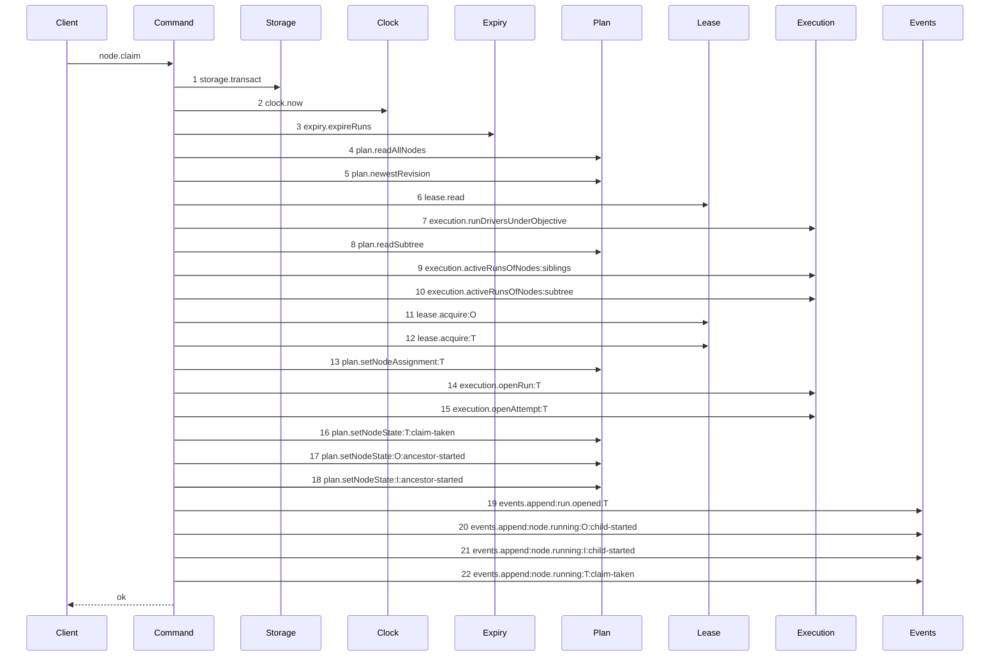
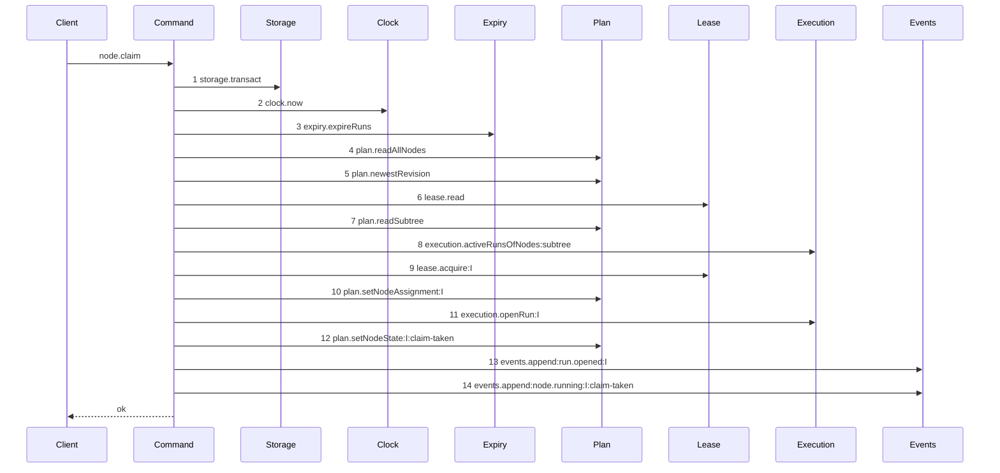
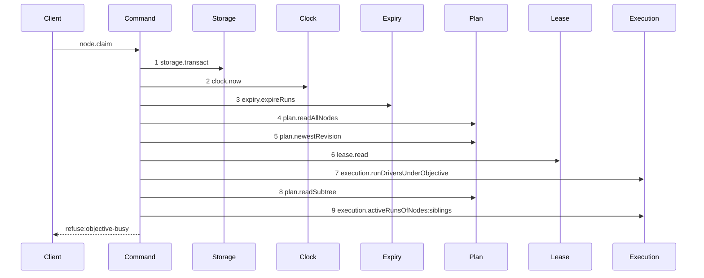
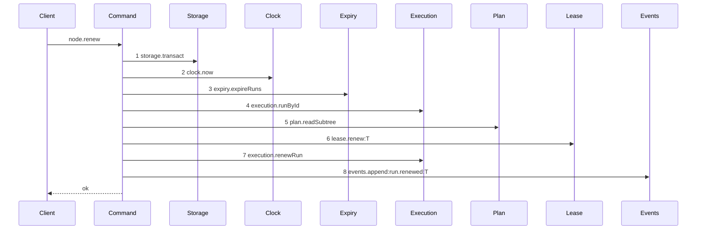
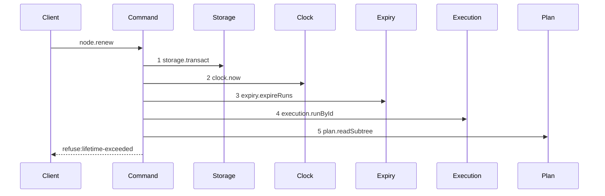
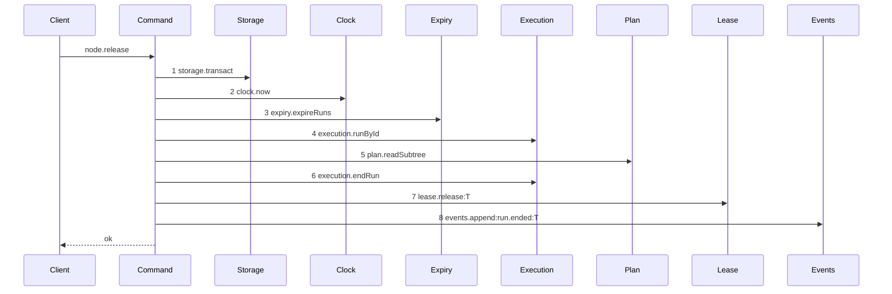
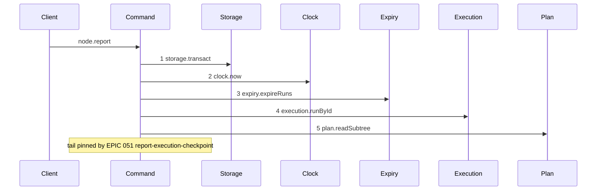
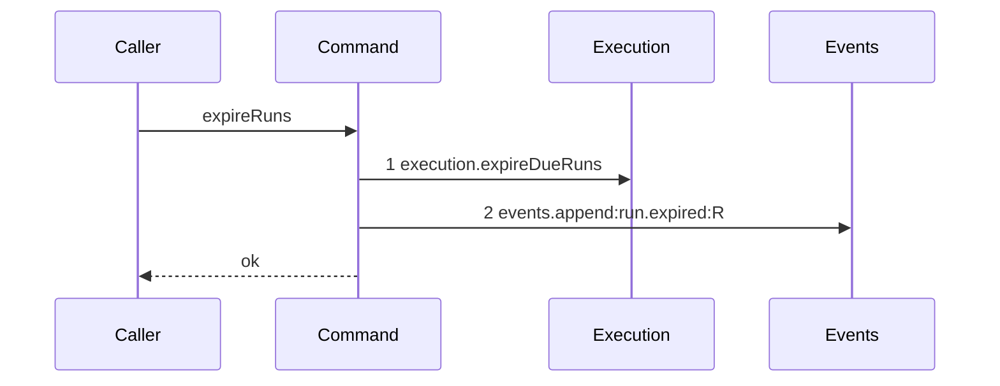
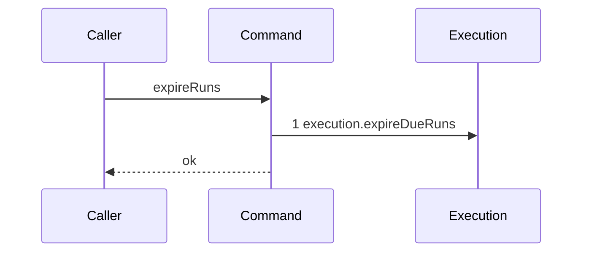

# EPIC 050 — The run, the fence and exclusion

Status: **draft**. It follows EPIC 049 by sequence order. It consumes EPIC 047's pair table and EPIC 048's registry.

## Goal

A claim opens exactly one run, and a fence guards every later write:

- `run.kind` admits `structural`, `execution` and `review`, selected by the node deliverable;
- the daemon writes the `assignment` and opens the run in one operation, at the first claim on an unassigned node;
- a run covers the claimed node and every descendant, and at most one run is active over a node;
- every write asserts the run is active, unexpired, bound to the target, and carrying the current fence;
- a run expires against the daemon clock, and a renew is one operation.

## Non-goals

- **No checkpoint.** A report is accepted in EPIC 051, 052 and 053, one per checkpoint type. This epic opens, renews, expires and ends a run.
- **No attempt classification.** `termination` lands in EPIC 054. An ended run here records `outcome` only.
- **No grant.** The claiming worker and the `authorized` set come from a fixed, server-owned caller record. EPIC 055 replaces that record with a grant lookup, and changes no wire schema when it does.
- **No worker switch, and no operator handoff.** EPIC 056 owns both. A switch is the only operation that changes an assignment, and this epic defines no standalone handoff, because a handoff outside a switch is a state `worker.md` does not describe.
- **No workspace, and no `run_base` row.** The workspace record and the branch cut belong to EPIC 051, and `worker.md` section 8 says the run's `base` is the workspace `head` at claim time. This epic creates the `run_base` table and its cardinality rule. EPIC 051 writes the row inside the same claim.
- **No node-lease removal.** EPIC 050.1 removes the node rows of the `lease` table and replaces the plan-write guard. The two mechanisms run side by side for exactly one epic. This epic keeps the lease **mechanism** untouched, and it does move the lease's observable surface — the events and the claim response — onto the run, so that EPIC 050.1 is wire-invisible.
- **No legacy claim path.** There are no deployments and no legacy nodes. `node.deliverable` is `NOT NULL` from migration `12`, and the claim has one path. Every construct that existed only to carry a legacy node is deleted here, not deferred.

## Decisions

- **The node deliverable selects the run kind, and the worker metadata does not.** `runKindFor(deliverable)` in `src/domain/run-kind.ts` maps `expansion` to `structural`; `test` and `implementation` to `execution`; `review` to `review`. `worker.md` section 5 states this table, and it lists `research` under `execution`; EPIC 047 defers `research` out of the deliverable enum, so the function has no row for it. The function is total over the four deliverables, so no default branch exists. The epic that restores `research` adds its `execution` row.

- **Migration `12` lands the final shape, because there is nothing to be compatible with.** There are no deployments, so there is no run row to preserve, no client to break and no additive window to hold open. The compatibility strategy `worker.md` describes solved a problem this product does not have, and building it would mean writing a guard, five backfill rules and their tests, then deleting all of it in EPIC 057.

  Migration `12` rebuilds `run` empty and applies the final constraints at once:

  | column            | migration `12`                                          |
  | ----------------- | ------------------------------------------------------- |
  | `kind`            | `CHECK (kind IN ('structural', 'execution', 'review'))` |
  | `fence`           | `INTEGER NOT NULL`                                      |
  | `graph_revision`  | `TEXT REFERENCES plan_revision(id)`, nullable           |
  | `agents_json`     | `TEXT NOT NULL`, `json_valid`                           |
  | `expires_at`      | `INTEGER NOT NULL`                                      |
  | `max_lifetime_at` | `INTEGER NOT NULL`                                      |
  | `judged_oid`      | `TEXT`, nullable                                        |
  | `lease_fence`     | **dropped**                                             |
  | `base_oid`        | **dropped**                                             |
  | `run_base`        | table created                                           |

  `objective` and `task` leave the `kind` set entirely. `graph_revision` stays nullable because EPIC 052 is the only reader and a run that never reaches a structural checkpoint needs no value.

- **The migration discards every `run` and `attempt` row rather than backfilling one.** No deployment holds them, and a developer's local database is rebuilt from `kanthord db migrate` at will. `DELETE FROM attempt` then `DELETE FROM run` runs before the rebuild, so the `NOT NULL` columns land with no row to violate them and no backfill rule has to be invented. State this in the migration's name and in `docs/proposal/database/run.md`: migration `12` is destructive to run history and to nothing else. It touches no `node`, `edge`, `blob`, `plan_revision`, `project` or `repository` row.

- **`node.deliverable` and `node.verify_json` become `NOT NULL` here, and `node.worker` is dropped.** The dual-read window of EPIC 049 exists to keep a legacy plan document readable during a conversion. With no deployment there is nothing to convert in place: the `kanthord-apps` tree is converted before this epic lands, by `plan convert`, and the engine then reads one shape. Migration `12` therefore refuses to run while any node holds a null `deliverable`, naming the project id and the count, in the temp-table-and-trigger pattern of `migration-0009-one-branch.ts:7`. That refusal is the whole of what EPIC 057's preflight was going to do.

- **The run owns the fence, and the column is `fence`.** `worker.md` section 7 states the fence is a counter on the run. `lease_fence` is dropped by migration `12`; nothing reads it, because there is no legacy reader. The daemon raises the fence when it ends a run, and nowhere else.

- **`base` is a set qualified by repository, and it lives in its own table.** Migration `12` creates `run_base (run_id, repository_id, oid, PRIMARY KEY (run_id, repository_id))`. The cardinality is fixed per run kind: an `execution` run holds at most one row, and a `structural` or `review` run holds none. A structural run claims an initiative, which owns no repository, so a mandatory base would make the commonest structural claim illegal.

- **The cardinality rule lands here at its upper bound, and EPIC 051 tightens the lower bound.** This epic creates the table and the rule, and EPIC 051 writes the row inside the same claim. An `execution` run therefore holds no row for the whole of this epic, so a rule stating _exactly_ one would refuse every run this epic opens. The refine of `runRow` states _at most_ one for `execution`, and exactly none for `structural` and `review`. EPIC 051 raises `execution` to exactly one in the same epic that writes the row. The refine is a schema statement: `runRow` is parsed only in `src/domain/run.test.ts`, and no production path validates a live `run` row against it.

- **`graph_revision` is recorded on every run, and it is enforced only where it is compared.** `worker.md` section 5 now states it: every run records the graph it read, and the daemon compares the value at the structural compare and swap of EPIC 052 and nowhere else. Migration `12` therefore adds the column with no kind-conditional CHECK.

- **`graph_revision` is a plan revision identity, and it is the project's newest revision, not the node's.** Migration `12` declares `graph_revision TEXT REFERENCES plan_revision(id)`, nullable, and every backfilled row takes null. The integer in the `worker.md` YAML example is illustrative and not normative: this schema has no monotonic counter on `plan_revision`, and adding one would create a second version space for the same graph that every import, node write and structural acceptance would have to allocate atomically. A compare and swap needs an immutable token for the snapshot read, the current token read inside the write transaction, and equality between the two. It needs no ordering, so a ULID identity is sufficient and EPIC 052 compares by equality alone — never by `<`, `>` or lexical adjacency, which do not express ancestry.

  **The claim reads `plan.newestRevision(transaction, node.projectId)`**, at `src/services/plan/index.ts:75`, inside the claim transaction. It does **not** read `node.revision`. `docs/proposal/database/node.md:44` states `node.revision` is the plan revision that last wrote that node, and `src/domain/revision-guard.ts` shows a field-only write takes a node-scoped guard while a topology write takes the project guard. A node last written at revision R1 in a project whose newest revision is R2 therefore reads a graph at R2, and pinning R1 would make EPIC 052 refuse a run that raced nothing.

- **A review run records the commit it will judge at claim time, and this epic cannot supply one, so it refuses the claim.** `worker.md` section 8 states a review checkpoint is bound to the pinned commit it judged. Migration `12` adds `run.judged_oid TEXT`, nullable, because a non-review run and every migrated row have no judged commit. Nullability does not license a command-created review run with a null `judged_oid`: writing null now and filling it in EPIC 051 would record a commit chosen after the claim, which is exactly the retrospective choice the pin exists to prevent.

  This epic creates no workspace record, so no objective workspace head exists to pin, and no checkpoint mechanism exists that would make a review meaningful. A new-model `review` claim therefore refuses `review-head-unavailable`. The refusal is evaluated after `unroutable` and before `lease-held`, and it writes no lease, run, attempt, node state or event. Reading some other branch or repository head instead would silently redefine "the objective workspace head" and would decide the branch naming this epic postpones.

  EPIC 051 lifts the gate in the epic that establishes the workspace head inside the same claim, and passes that exact oid into review-run creation. The refusal survives as the case where workspace preparation cannot supply a head.

- **`provenance` is two columns, not a blob.** `run.worker` keeps the worker id, and `agents_json` holds the agent list from the registry entry. An external run writes `[]`, because a self-managed harness selects its own agents and the daemon observes none. `worker.md` section 5 states the daemon knows both at claim time and asks the worker for neither.

- **The assignment and the run open in one storage transaction.** `claimNode` writes `node.assignment` and inserts the `run` row inside the single `storage.transact` block it already opens at `src/commands/node/claim-node.ts:99`. Two operations would let a crash leave an assignment with no run, and the next claim would then read an assignment nobody holds.

- **This epic publishes `assignment`.** EPIC 047 created the column and left it out of every schema, because the worker id grammar did not exist. `nodeRow`, `StoredNode`, the plan store read path and the `node.show` and `project.graph` projections gain it here, typed as `workerId.nullable()`. The write path is the claim, and the switch of EPIC 056.

- **The caller asserts availability, and the daemon never probes.** `worker.md` section 4 states a worker runs a self health check before it claims and declines to claim when the check fails. The daemon therefore takes `available` from the caller: an internal worker self-checks after the supervisor spawns it and reports the result to the supervisor, and an external client self-checks before it claims. A daemon that probed would have to reach into a worker process it does not own, and for a remote worker it could not. The claim request carries `available: boolean`. A `false` value refuses `unroutable` with `failedSet: "available"`. A caller that asserts `true` when it is not available is trusted, and `worker.md` section 11 lists that.

- **The claiming worker comes from a server-owned caller record, never from `actorId` and never from the request body.** `input.actorId` is an `actor_<ULID>` authentication identity and carries no worker semantics; parsing one out of it would be an undocumented mapping disguised as parsing. Binding a worker column onto the `actor` table would conflate authentication with the execution subject and would be obsolete the moment grants land. Putting a `worker` field on the wire is worse still: it would create two worker authorities once EPIC 055 lands — the grant's and the client's — forcing a mismatch refusal, a position for it in the ordered refusal list, and a rule about which value is recorded. If the request must equal the grant it is redundant; if it may override the grant, the grant constrains nothing. Trusting a caller to report its own transient health is not the same as trusting it to choose its own authorization subject.

  `ClaimNodeDependencies` therefore receives a caller record:

  ```ts
  type ClaimCallerRecord = Readonly<{
    worker: string;
    authorized: readonly string[];
  }>;
  ```

  `main.ts` binds `{ worker: "claude@1", authorized: ["claude@1"] }` for the actor-authenticated path of this epic. `opencode@1` is published in the registry and is not claim-authorized until grants land. `node.claim` keeps the request `{ available: boolean }`.

  The command intersects `authorized` with `capableWorkers(registry, { kind, deliverable })` **before** it calls `routeWorker`, because EPIC 048 throws `authorized-not-capable` on an unintersected input instead of returning the routing refusal this epic wants. `available` is `[caller.worker]` when the request says `true` and that worker survives the intersection, and `[]` otherwise. An existing assignment is compared with `caller.worker`.

  EPIC 055 replaces the fixed record with `{ worker: grant.worker, authorized: [grant.worker] }`. No request schema changes, no actor column is added, and after an EPIC 056 switch a claim succeeds only under a grant naming the new assignment.

- **A claim is legal only when the assignment equals the claiming worker.** An unassigned node routes through `routeWorker` of EPIC 048 and takes the first worker of the intersection. An assigned node compares. A mismatch refuses with `assignment-held`, and the refusal details name the assignment and state that a human may switch it. `worker.md` section 4 states the offer.

- **An ordinary failure never changes the assignment.** Ending a run writes `run.state = 'ended'` and raises the fence. It does not clear `node.assignment`. A test asserts the assignment is unchanged after an expiry and after a rejection. EPIC 056 adds the only writer that changes it, and it does so as one switch.

- **Run authority is four conditions, not one.** `worker.md` section 11 lists an active run and a matching fence as separate guarantees. `assertRunAuthority({ run, runId, fence, targetNodeId, subtreeIds, caller, now })` refuses in this fixed order: `run-not-found`, `run-ended`, `run-expired`, `run-caller-mismatch`, `target-outside-run`, `fence-stale`. An ended run presented with its own last fence must fail, and a fence comparison alone admits it.

- **A refusal never returns the current fence.** `worker.md` section 5 states the run id and the fence hold the authority of that run. Handing the replacement value to a writer that just proved it holds a stale one gives that writer the authority the raise was meant to remove. The refusal names the run id and the reason only.

- **Every run operation evaluates expiry first, inside its own single transaction.** Sweeping only at the next claim leaves an expired run able to renew itself back to life. `claim`, `renew`, `release` and `report` each call the same expiry pass before anything else. `src/commands/node/claim-node.ts:104` already holds that sweep, and it is lifted into `src/commands/run/expire-runs.ts` and called by all four.

- **The expiry pass is transactional maintenance, and a refusal rolls it back with everything else.** `src/services/storage/connection.ts:83` rolls back the whole callback on a throw, and the engine exposes no savepoint and no nested transaction. A command that expires a run and then refuses therefore leaves the run `active` with its fence unchanged and no `run.expired` event. That is correct and is not a leak: an expired-but-unswept run can authorize nothing, because every run operation runs the pass before it evaluates authority, and the next operation sweeps it. The alternatives are worse. Committing the expiry separately would break one command, one transaction, and would open a window for another claim to take the freed node before the first command finished refusing. Returning a sentinel and throwing after commit would commit every write made before the sentinel, which on the claim path includes leases, runs and attempts. Both would also break the rule that a refusal writes nothing, which every refusal test in this epic asserts by comparing database bytes.

  A claim that **succeeds** commits the expiry of the old run and the insertion of its replacement atomically, so `run_one_active` never sees two active rows for one node.

- **An expiry deletes no candidate ref, and EPIC 051 owns the fourth path.** The namespace `refs/kanthord/candidate/<runId>/<attemptNo>` is declared by EPIC 051, nothing in this epic creates such a ref, and `services/git` carries no delete primitive: `RefUpdateInput.nextOid` at `src/services/git/index.ts:51` is a non-null `string`. EPIC 051 deletes the ref on acceptance, on rejection and on contention and owns the startup sweep; it adds the expiry path as a fourth caller of the same deletion. This epic ends the run and raises the fence.

- **Expiry is a conditional update, so a concurrent sweep cannot raise the fence twice.** The statement is `UPDATE run SET state = 'ended', fence = fence + 1 WHERE id = ? AND state = 'active' AND expires_at <= ?`, and the transition is recorded only when the update affected one row. Two racing sweeps would otherwise raise the fence twice and append two `run.expired` events.

- **Exclusion is a subtree rule, and one partial index cannot express it.** `run_one_active` at `migration-0007-external-execution.ts:33` is unique on `node_id` where `state = 'active'`. That refuses a second run on the same node and admits one on a descendant. The subtree rule is `subtreeExclusion` in `src/domain/run-exclusion.ts`, evaluated inside the claim transaction. The index is the last defence for the same-node case only, and the epic does not claim it defends the subtree case.

- **The exclusion sets are read inside the claim transaction, from the plan store, and an expired run is not active.** `claimNode` already reads every node at `src/commands/node/claim-node.ts:105`. The ancestor, descendant and sibling sets derive from that read. A run whose `expires_at` has passed is not counted, because the expiry pass above ended it in the same transaction.

- **The claim transaction is an immediate write transaction, so two sibling claims serialise.** `services/storage` opens `BEGIN IMMEDIATE`. Without it, two concurrent claims each read no active sibling run and each insert one. A pure function cannot fix that, and the epic states the isolation requirement rather than assuming it.

- **One active run per objective branch, and a task claim is refused, not queued.** `worker.md` section 7 now states the refusal directly: the daemon holds no queue, and a blocking wait would hold one request open for a run lifetime. The refusal is `objective-busy`, naming the sibling node id, its run id and that run's `expires_at`, so a client knows what it waits on and until when.

- **The claim has one path, and every legacy construct is deleted.** `node.deliverable` is `NOT NULL`, so there is no legacy node to branch for. `openOrAdoptRun` at `src/commands/node/claim-node.ts:449` is deleted with its call site: a claim opens exactly one run covering the claimed node and every descendant, and never adopts one. A task claim opens no parent objective run, which is what keeps `run_one_active` free.

  Three shipped refusals are deleted rather than skipped:

  - `initiative-not-claimable` contradicts the model. `worker.md` section 7 states a worker that claims an initiative serializes that whole initiative, and a structural run claims an initiative, which is why a structural run holds no `run_base` row.
  - `run-driver-mismatch` exists only inside run adoption, which is gone.
  - the own-lease replay path at `src/commands/node/claim-node.ts:179-199` is gone. A second claim by the same worker on a node with an active run is `subtree-busy` with `relation: "self"`. Retrying a lost response is the transport's job: `node.claim` declares `idempotency: "memory"` and `replayable: [200]`, asserted at `src/http/contract/registry.test.ts:839-850`, so a command-level replay is a second answer to a question the transport already answers.

- **The refusal order is fixed, and it is one total order over both models.** A predicate that does not apply to the selected branch is skipped, never simulated — `run-driver-mismatch` belongs to legacy adoption and the new-model path never emits it.

  1. `node-not-found`
  2. `pair-illegal`
  3. `plan-incomplete`
  4. `assignment-held`
  5. `unroutable`
  6. `review-head-unavailable`
  7. `lease-held`
  8. `drive-mode-pinned`
  9. `objective-busy`
  10. `subtree-busy`
  11. `illegal-transition`
  12. `ancestor-not-startable`

  A claim that fails two conditions reports the earlier one, so a client sees the cause it can act on first. `lease-held` and `drive-mode-pinned` keep their shipped meaning; EPIC 050.1 removes the first when it removes the node lease.

  **Every refusal is evaluated before the first mutation** — before a lease is acquired, a run is opened, an attempt is opened, a node state changes or an event is appended. The shipped command fires `illegal-transition` at `src/commands/node/claim-node.ts:269-275`, after the leases, the run and the attempt are taken. That ordering is a defect and this epic fixes it: a refusal writes nothing, and every refusal test asserts it by comparing database bytes.

- **The completeness check exempts an `expansion` node.** `worker.md` section 7 states it: a node that declares `deliverable: expansion` holds no child yet, because producing its children is the work. The exemption covers that node's own missing children and nothing else, so `plan-incomplete` still fires for every other node and for that node's other findings.

- **`node.claim` returns the run id and the fence; it never receives them.** `worker.md` section 5 states a claim comes before the run and the daemon returns both. `runId` and `fence` are response fields on `node.claim`, and request fields on `node.renew`, `node.release` and `node.report`.

- **This epic settles the whole worker protocol, so the removal epic changes no wire shape.** EPIC 050 already retires a capability and bumps the major version. Letting EPIC 050.1 change the response, the event catalogue and the capability again would publish two capability generations one epic apart, for a product with no deployments, and would record implementation staging as if it were a public contract generation. Every observable change therefore lands here, once.

- **The claim response carries `expiresAt` and `renewAfterMs`, and `heartbeatIntervalMs` is removed.** `heartbeatIntervalMs` is `Math.floor(leaseTtlMs / 3)` at `src/commands/node/claim-node.ts:356` — derived from the lease this block deletes. An absolute `expiresAt` alone is not a sufficient replacement: a worker comparing a server timestamp against its own clock renews late under skew or network delay. The response therefore carries both — `expiresAt`, the run's own `expires_at`, and `renewAfterMs`, a relative hint equal to `Math.floor(runTtlMs / 3)`. A worker renews after `renewAfterMs` and treats `expiresAt` as the deadline. `node.renew` returns the same two fields.

- **The three `lease.*` event types are replaced by four `run.*` types here, not in EPIC 050.1.** An event is an observability contract, not a mechanism contract, and a reader of `event.list` should never learn that the daemon changed its internal exclusion mechanism. `lease.claimed`, `lease.released` and `lease.renewed` are removed from `src/domain/event-type.ts`, and `run.opened`, `run.renewed`, `run.ended` and `run.expired` take their place. There are no deployments, so there is no stored event to keep readable and `retiredEventTypes` stays empty.

  Each payload carries `runId`, `nodeId` and `fence`. `run.opened` adds `kind`, `worker` and `expiresAt`. `run.renewed` adds `expiresAt`. `run.ended` adds `outcome` and `reason`. `run.expired` adds `expiredAt`.

  **Exactly one terminal event per run.** A run that moves from `active` to `ended` appends exactly one of `run.ended` or `run.expired`, never both and never neither, in the same transaction as the transition and the fence raise. `release` and `report` both append `run.ended` with different `outcome` values; the expiry pass appends `run.expired`. A test asserts the count is one per ended run across all three paths.

- **This epic amends the `/v1` policy, because a human ruled there is no `/v2`.** `docs/proposal/api/README.md:100` forbids adding a required request field and closes its list. EPIC 046 records the ruling. This epic writes the amendment into the proposal: a change outside the list is legal when a human records the ruling in the epic that makes it, and the capability name covering the affected operations is retired and replaced. `023-version-compatibility-policy.md` D1 is superseded by that sentence and by nothing else.

- **The capability swap is the announcement, and it is exact.** `capabilityOperations` at `src/http/contract/capability.ts:5` binds `external-drive` to `node.claim`, `node.heartbeat`, `node.release` and `node.report` — precisely the operations this epic changes. `external-drive` is retired, and `worker-model` is declared in its place, naming `node.claim`, `node.renew`, `node.release` and `node.report`. A client reading `system.health.capabilities` sees `external-drive` gone and cannot call the old shape unknowingly, which is the handshake EPIC 023 built.

- **`node.heartbeat` becomes `node.renew`, and the old operation id is removed.** `worker.md` names four verbs: claim, report, close and renew. One vocabulary survives. `release` has no verb in the document, and it is retained with one stated meaning: a worker voluntarily ends its run with no checkpoint. Removing it would make an abandoned claim block a node for a full run lifetime.

- **`runId` and `fence` are required request fields on `node.renew`, `node.release` and `node.report`.** A worker that cannot name its run has no authority to write, so the schema says so rather than a refusal code. `node.claim` returns both and receives neither.

- **`KANTHORD_VERSION` moves to `28.0.0`.** `src/domain/version.ts:1` reads `27.8.1`. The policy states the package version describes a build, so the bump records this block. The capability list is what describes the wire.

- **Both budgets are configuration, and both are validated at startup.** `runTtlMs` defaults to 300000 and `runMaxLifetimeMs` to 14400000, in `src/services/config/`. Startup refuses a `runTtlMs` below 1000, a `runMaxLifetimeMs` below `runTtlMs`, and a non-integer. A renew sets `expires_at = min(now + runTtlMs, max_lifetime_at)` and refuses `lifetime-exceeded` when `now >= max_lifetime_at`. **A renew never touches the fence.** The fence rises when a run ends, and nowhere else. A renew that rotated the fence would invalidate the run id and fence pair the worker already holds, which is the authority of that run. The comparison is `>=`, so the boundary instant is expired.

## Sequence

Every epic from 050 to 057 carries this section, and a machine checks it. A diagram here is not
illustration: it is the exact ordered contract of one path of one operation. A conformance scenario
replays the real command over real SQLite and compares the seam calls it observed with the steps
drawn below, by equality.

**For a path this section draws, the seam calls and their order are authoritative over the prose of
a story.** A story that names a seam call this section does not draw is a defect in the story, and an
implementing agent reports it rather than editing a diagram to match the code it wrote.

The precedence stops there. A diagram carries no value, no predicate, no state change and no error
semantics, so a disagreement about any of those does not resolve to the diagram: it makes this epic
invalid, and a human resolves it before implementation. Picking the diagram silently would only make
a stale mistake executable.

### What a diagram may say

- **A message is a seam call, and nothing else is a message.** The recorder wraps the dependency
  object a command receives, so it observes exactly one thing: a call on an injected capability. A
  pure-domain call such as `runKindFor`, `subtreeExclusion` or `assertRunAuthority` is invisible at
  that seam, so it is never a message. A diagram that draws one cannot be checked, and this section
  forbids it. What those functions decide is proven by their own unit tests and by the refusal
  decision table below, never by a trace.
- **A participant is a dependency key, capitalized.** The recorder reports the keys of the
  dependency object of the scenario, and the parser checks every participant against that set. No
  epic holds a global participant list, so EPIC 051 to 057 add a capability without amending this
  one. `Command` is the operation under test, `Client` is the caller of a wire operation, and
  `Caller` is the caller of a nested command.
- **A step is `<n> <key>.<method>` or `<n> <key>.<method>:<label>`.** `n` is the ordinal, and it is
  dense from 1. The label is the projection of that call, colon-separated, and it makes two calls of
  one method distinct.
- **No two steps of one diagram carry the same token.** The parser refuses a repeat. A method called
  twice therefore needs a projection that separates the calls, so no diagram can pass by counting
  method names. This rule is what makes the comparison a contract rather than a multiplicity check.
- **A projection is declared once, per method, in the harness.** The table is data, not a per-test
  literal: `plan.setNodeState` projects `input.id` and `input.trigger`; `plan.setNodeAssignment` and
  `execution.openRun` project the node id; `lease.acquire`, `lease.renew` and `lease.release`
  project `input.subjectId`; `events.append` projects `input.type`, `input.subjectId` and
  `input.payload.reason` when the payload holds one; `execution.activeRunsOfNodes` projects the
  caller-supplied set name. A node id, run id or attempt id renders through the scenario alias map,
  so a token holds `T` and never a ULID. A method with no projection admits one call per diagram.
- **A nested command is one step.** The scenario binds the nested command to unrecorded
  dependencies, so `expiry.expireRuns` is a single message. That nested command carries its own
  diagrams and its own scenarios.
- **There is no `loop` and no `opt`.** Both admitted the regression the diagram exists to catch: an
  `opt` for a task-only lease admits a task claim that takes no lease, and a `loop` over the
  ancestor cascade admits a cascade of zero and proves nothing about the order inside it. A count is
  unrolled against a fixed fixture, and a branch is a separate diagram with its own id. A scenario
  that cannot be drawn as an exact list is a planning defect, per the determinism rule of
  `AGENTS.md`.
- **A diagram states one terminal, `ok` or `refuse:<code>`, and the harness derives it from the
  real result.** A scenario passes no expected terminal, so the epic holds one copy of that
  expectation. A refusal path is its own diagram.
- **`note over Command: tail pinned by EPIC <nnn> <diagram-id>` ends the pinned prefix.** It exists
  for an operation this epic amends at its prelude while a later epic owns its body. Nothing after
  the note is compared. The parser requires the epic number and the diagram id, and the range gate
  refuses when that epic is inside the range and declares no such diagram. A diagram with no note
  pins its whole trace, and EPIC 057 holds no note, because no epic follows it.
- **The trace is invocation order.** Every command in this range is synchronous inside one
  `storage.transact` callback, so invocation order is completion order. An asynchronous seam would
  need begin and end records, and this range introduces none.

### A diagram is addressed by its heading

A `###` heading holding a kebab-case id in backticks names the diagram in the fenced block below
it. A `###` heading with no backticks is prose and holds no diagram. The id is
unique across every epic in the 050 to 057 range, and it is the file name of its scenario.

### A story names the diagrams it changes, and the seams it moves

A diagram nobody implements and a story that implements something nobody drew are the same defect,
so the two texts are bound by two declared lines. A story that changes a drawn path carries them
directly under its number, one per line:

```text
Diagrams: claim-success-task, claim-success-initiative, claim-refusal-objective-busy
Seams: +plan.setNodeAssignment, ~plan.setNodeState, -execution.adoptRun
```

- **`Diagrams:` names the live diagram ids this story changes.** Exactly one story of the epic names
  each live diagram, so every diagram has one owner and one author. That story adds the diagram's
  scenario file at `test/sequence/scenarios/<id>.ts`, and the gate checks the story text holds that
  exact path.
- **`Seams:` carries one sign per token**, in the unlabelled form `<key>.<method>`, keeping
  `events.append:<event-type>` because an event type is behaviour and an alias is fixture data. `+`
  adds a call this path did not make, `~` moves an existing call, and `-` removes one. An unsigned
  token is refused. A token belongs to exactly one story across the epic, and it is the story that
  writes the call, not the story that declares the interface.
- **A context token is not declared.** A call this path already made, in the position it already
  held, belongs to no story. Every added token of this epic is `+`, because this is the first epic to
  draw these paths and no earlier diagram holds a context token to inherit. From EPIC 051 onward a
  redrawn path carries context tokens, and a story that claimed them would claim a change it does not
  make.
- **The gate compares four things.** A `+` or `~` token appears in a diagram that story names; a `-`
  token appears in no live diagram; a token of a live diagram that no earlier live or superseded
  diagram holds is `+` in exactly one story; and no token carries two signs. A step drawn and
  unimplemented fails, and a seam a story moves without drawing it fails.
- **A story that changes no drawn path carries neither line.** A schema, a migration, a proposal
  document and a pure-domain function move no seam.

### One epic owns a diagram, and a later epic supersedes it

Each epic draws the paths it changes, so a path drawn here and changed later exists twice. The
later epic wins, and it says so: it declares its own diagram id and a `Supersedes: <document-id>
<diagram-id>` line naming both halves, because an id alone does not resolve across epics. The
superseded diagram gains a `Superseded by: <document-id> <diagram-id>` line in its own epic. The range gate then requires the superseded id to hold no scenario file and the new
id to hold exactly one, so exactly one diagram of a path is live at any commit. An earlier epic
keeps its diagram as the record of what it changed, and nothing runs against it.

### What a diagram does not prove

- **It does not prove a refusal code.** Two refusals that stop at the same step are one diagram, and
  the code that separates them is proven by the refusal test.
- **It does not prove branch coverage.** A fixed fixture is one example. That the drawn set is every
  branch of a path is a claim this epic makes in prose, and a reviewer checks it: the claim is the
  sentence under each diagram.
- **It does not prove refusal precedence.** A refusal is decided by pure predicates the recorder
  cannot see, so a command could read in the drawn order, evaluate the predicates in the wrong order
  and still conform. The read order below follows the refusal order because a read no refusal needs
  is not taken, and the precedence itself is proven by a decision table over every pair of refusals
  that can trigger at once, in `src/commands/node/claim-node.test.ts`.
- **It does not prove a transaction property.** `storage.transact` is step 1 of every command
  diagram, which proves one transaction is opened. That the expiry pass receives that same
  transaction, and that a refusal rolls back everything inside it, are separate cases.
- **A refusal diagram proves no write seam is reached after the refusal point.** It does not prove
  the operation wrote nothing: `expiry.expireRuns` is a mutation, it is hidden behind one step by
  design, and the scenario binds it to unrecorded dependencies. What proves nothing was committed is
  the byte-identical database assertion of the Verification gate. Both assertions are required, and
  neither replaces the other.

### Seams the diagrams name, which the Stories above did not

Writing the diagrams forced six seam names the prose left open. They are decisions of this epic, and
story 16 carries their signatures:

- **`plan.setNodeAssignment`.** A node write happens in the plan store — `no-restricted-syntax`
  enforces it — so the claim's assignment write is a plan store method, not an inline update.
- **`execution.activeRunsOfNodes(transaction, nodeIds)`.** One read serves both pure rules.
  `subtreeExclusion` passes the subtree ids from `plan.readSubtree`, and `objectiveBusy` passes the
  sibling ids from the graph read. A method named after the objective hierarchy would put plan
  topology inside the execution capability, which owns runs and not the tree.
- **`execution.runById(transaction, runId)`.** `assertRunAuthority` is pure, so the run row is read
  at the seam. `activeRunOfNode` answers a different question and cannot answer this one.
- **`execution.renewRun`** and **`execution.expireDueRuns`.** The `min(now + runTtlMs,
max_lifetime_at)` write and the conditional update of the Decisions are SQL, and SQL lives in the
  execution implementation.

An initiative claim evaluates neither `drive-mode-pinned` nor `objective-busy`, because both are
scoped to an objective and an initiative is above that scope. `claim-success-initiative` states this
by taking neither read, and the refusal order of the Decisions is unchanged: a predicate that does
not apply to the target is skipped, never simulated.

### `claim-success-task`

Superseded by: EPIC 051 claim-success-task

Fixture: initiative `I` holds objective `O`, which holds tasks `T` and `S`. Every node is `ready`,
no node is assigned, and no run is active. The target is `T`, whose deliverable is `implementation`,
so the run kind is `execution` and the cascade covers `O` and `I`.



Steps 2 to 10 are reads, and step 11 is the first mutation of the claim itself, so every refusal is
evaluated before it. Steps 13 and 14 are the assignment and the run, in the one transaction the
Decisions require. Steps 17 and 18 are the cascade, unrolled, so the cascade order is part of the
contract.

### `claim-success-initiative`

Fixture: initiative `I` is `ready`, unassigned, its deliverable is `expansion`, and it is the root,
so the run kind is `structural`, no cascade exists, and the run holds no `run_base` row and no
attempt.



No `execution.openAttempt` step exists, so a structural run that opened an attempt fails the
comparison. That is the assertion, not a comment.

### `claim-refusal-objective-busy`

Fixture: `claim-success-task`, plus an active run on the sibling task `S`.



`execution.activeRunsOfNodes:subtree` is not reached, because the earlier refusal wins, and no
`Lease`, `Plan` or `Events` write step appears. What the operation committed is a separate
assertion, per "What a diagram does not prove".

### `renew-success`



Steps 4 and 5 supply `assertRunAuthority` with the run and the subtree. No fence write appears, per
the Decisions.

### `renew-refusal-lifetime-exceeded`

Fixture: an active run whose `max_lifetime_at` equals `now`.



### `release-success`



### `report-authority-prelude`



This epic pins the prelude, because the prelude is what it changes. EPIC 051 declares
`report-execution-checkpoint` and pins the tail, and the range gate refuses if it does not.

### `expiry-pass-one-due`

Fixture: one run whose `expires_at` is `now`, called with the caller's transaction, so the pass
opens none.



### `expiry-pass-none-due`

Fixture: the same run, already ended by a first pass.



The second pass appends no event, which the Decisions require. The two diagrams state it as two
exact traces, where one diagram with a repetition block would have stated neither.

## Stories

1. **The run kind.** Add `src/domain/run-kind.ts` with `runKindFor`. Add `src/domain/run-kind.test.ts` asserting the mapping for all four deliverables by value, and asserting the function is total by iterating `deliverables`.

2. **Migration 12.** Add `src/services/storage/migration-0012-run-model.ts` at version `12`, applying the final table of the Decisions: the three-value `kind` CHECK, the `NOT NULL` run columns, the dropped `lease_fence` and `base_oid`, the `run_base` table, `node.deliverable` and `node.verify_json` made `NOT NULL`, `node.worker` dropped, and the null-deliverable refusal guard in the `migration-0009-one-branch.ts:7` pattern. It deletes every `attempt` and `run` row before the rebuild. Register it at `src/services/storage/migrations.ts:13`. Add its test asserting: the guard aborts against a database holding one null-deliverable node, naming the project and the count; the migration succeeds otherwise; `run` and `attempt` are empty afterwards; `lease_fence`, `base_oid` and `node.worker` are absent from `table_info`; each of the four run columns refuses a null; and `kind` refuses `objective` and `task`.

3. **The run row.** Rewrite `runRow` at `src/domain/run.ts:11`: `kind` becomes `z.enum(runKinds)`, `fence`, `agents`, `expiresAt` and `maxLifetimeAt` are non-nullable, `graphRevision` and `judgedOid` are nullable, and `baseOid`, `leaseFence` and the two shipped refines are deleted. Widen `worker` to the worker id grammar and add the `workerId` schema. Add the `run_base` cardinality refine at its upper bound. Add `runBaseRow` and register `run_base` in `src/domain/rows.ts`, `src/domain/rows.test.ts` and `docs/proposal/phase-1/domain.md:39`. Update `src/domain/run.test.ts` with a case per field and per refine.

4. **`assignment` is published.** Add `assignment: workerId.nullable()` to `nodeRow` at `src/domain/node.ts:9` and to `StoredNode` at `src/domain/plan-graph.ts:3`, extend the plan store read path, and add the field to the node projection in `src/http/contract/graph.ts`. Add cases asserting a value outside the worker id grammar is refused by `nodeRow`, and asserting `node.show` returns the assignment.

5. **Subtree exclusion.** Add `src/domain/run-exclusion.ts` with `subtreeExclusion`. Add `src/domain/run-exclusion.test.ts` asserting: a run on an ancestor refuses a claim on a descendant, naming the ancestor; a run on a descendant refuses a claim on an ancestor, naming the descendant; a run on an unrelated node admits the claim; a run on the target itself refuses; an expired run in the input set does not refuse.

6. **The objective-branch rule.** Add `objectiveBusy({ objectiveId, siblingRuns })` to `src/domain/run-exclusion.ts`, returning the sibling node id, the sibling run id and its `expires_at`. Add cases asserting a sibling task with an active run refuses with all three fields, and asserting a sibling task with an ended run admits.

7. **The expiry pass.** Add `src/commands/run/expire-runs.ts` performing the conditional update of the Decisions and appending one `run.expired` event per affected row, in the caller's transaction. It deletes no candidate ref, per the Decisions. Add its test asserting: the fence rises by exactly one; a second call raises nothing and appends nothing; a run whose `expires_at` is exactly `now` is expired; a failure injected at the event append leaves the run active and the fence unchanged. Add `test/sequence/scenarios/expiry-pass-one-due.ts` and `test/sequence/scenarios/expiry-pass-none-due.ts`.

   Diagrams: expiry-pass-one-due, expiry-pass-none-due

   Seams: +execution.expireDueRuns, +events.append:run.expired

8. **The claim writes the assignment and opens the run.** Rewrite `src/commands/node/claim-node.ts` as one path: call the expiry pass, read the pair, compute the run kind, route through `routeWorker` with the caller record and the `available` assertion, write `node.assignment`, and insert exactly one run with its provenance — all inside the transaction opened at line 104. Delete `openOrAdoptRun`, the own-lease replay path, `initiative-not-claimable` and `run-driver-mismatch`. Move every refusal ahead of the first mutation. Add cases to `src/commands/node/claim-node.test.ts` per refusal, asserting the refusal code, the exact details object and that the database is byte-identical, plus a case asserting a claim failing two conditions reports the earlier one. Add the refusal decision table over every pair of refusals that can trigger at once, asserting the winner of each pair. Add `test/sequence/scenarios/claim-success-task.ts`, `test/sequence/scenarios/claim-success-initiative.ts` and `test/sequence/scenarios/claim-refusal-objective-busy.ts`.

   Diagrams: claim-success-task, claim-success-initiative, claim-refusal-objective-busy

   Seams: +storage.transact, +clock.now, +expiry.expireRuns, +plan.readAllNodes, +plan.newestRevision, +lease.read, +execution.runDriversUnderObjective, +plan.readSubtree, +execution.activeRunsOfNodes, +lease.acquire, +plan.setNodeAssignment, +execution.openRun, +execution.openAttempt, +plan.setNodeState, +events.append:run.opened, +events.append:node.running, -execution.adoptRun, -execution.activeRunOfNode, -events.append:lease.claimed

9. **Run authority.** Add `src/domain/run-authority.ts` with `assertRunAuthority` returning `null` or one of the six refusals in the fixed order. Add `src/domain/run-authority.test.ts` asserting each refusal in isolation, asserting the order by an input failing two conditions, asserting an ended run presented with its own last fence refuses `run-ended`, and asserting no refusal carries a fence value.

10. **Renew, release and report carry the authority check.** Rename `src/commands/node/heartbeat-node.ts` to `src/commands/run/renew-run.ts`, implementing `expires_at = min(now + runTtlMs, max_lifetime_at)` and the `lifetime-exceeded` refusal. Wire `assertRunAuthority` into renew, release and report. Add cases asserting each of the three refuses a stale fence, an ended run and an expired run, and asserting a renew at `max_lifetime_at` refuses while `expires_at` stays unchanged. Add `test/sequence/scenarios/renew-success.ts`, `test/sequence/scenarios/renew-refusal-lifetime-exceeded.ts`, `test/sequence/scenarios/release-success.ts` and `test/sequence/scenarios/report-authority-prelude.ts`.

    Diagrams: renew-success, renew-refusal-lifetime-exceeded, release-success, report-authority-prelude

    Seams: +execution.runById, +lease.renew, +execution.renewRun, +events.append:run.renewed, +execution.endRun, +lease.release, +events.append:run.ended, -events.append:lease.renewed, -events.append:lease.released

11. **An ordinary failure never changes the assignment.** Add cases asserting `node.assignment` is unchanged after an expiry, after a release and after an unroutable claim on a different node. No case exercises an operator handoff, which EPIC 056 introduces.

12. **Configuration.** Add `runTtlMs` and `runMaxLifetimeMs` to `src/services/config/` with the defaults and the startup validation of the Decisions. Add cases asserting each refusal by value and asserting the defaults.

13. **The contract carries the run, the fence and the availability assertion.** Add `available` to the `node.claim` request. Add `runId`, `fence`, `expiresAt` and `renewAfterMs` to the `node.claim` and `node.renew` responses, and remove `heartbeatIntervalMs` from both and from its twelve production sites. Add `runId` and `runFence` as required fields to the `node.renew`, `node.release` and `node.report` requests. Replace the `node.heartbeat` operation id with `node.renew`. Add the new refusal codes to `src/http/contract/errors.ts`. Remove `lease.claimed`, `lease.released` and `lease.renewed` from `src/domain/event-type.ts` and add `run.opened`, `run.renewed`, `run.ended` and `run.expired`, with their payloads in `src/http/contract/event-payload.ts` and their producers in the four commands. Update the registry, parity, coverage and example tests.

14. **The policy amendment and the capability swap.** Amend `docs/proposal/api/README.md` with the exception sentence of the Decisions, and record `023-version-compatibility-policy.md` D1 as superseded. Retire `external-drive` from `capabilityOperations` at `src/http/contract/capability.ts:5` and declare `worker-model` naming the four operations. Move `KANTHORD_VERSION` at `src/domain/version.ts:1` to `28.0.0`. Add a compatibility record to `docs/proposal/api/README.md` listing this epic's seven changes: the `node.heartbeat` rename, the required `available`, the required `runId` and `runFence`, the added `runId`, `fence`, `expiresAt` and `renewAfterMs`, the removed `heartbeatIntervalMs`, and the three removed and four added event types. `worker-model` is the last capability name this block declares; EPIC 050.1 changes no wire shape. Update `src/http/contract/capability.test.ts`, `src/http/contract/runtime-matrix.test.ts` and the `system.health` example literal at `src/http/contract/system.ts:84`.

15. **The proposal records the run model.** Add `docs/proposal/phase-2/runs-and-exclusion.md` stating the three run kinds and their selection rule, the fence, the four authority conditions, the assignment rule, the subtree rule, the objective-branch refusal and its retry contract, the expiry and maximum lifetime formulas, the refusal order, the one-path claim, and that migration `12` lands the final shape and discards run history because there is nothing to be compatible with.

16. **The seams the diagrams name.** Add to `src/services/plan/index.ts`: `setNodeAssignment(transaction, input: { id: string; assignment: string | null })`. Add to `src/services/execution/index.ts`: `activeRunsOfNodes(transaction, nodeIds: readonly string[]): readonly RunRecord[]`, `runById(transaction, runId: string): RunRecord | null`, `renewRun(transaction, input: { runId: string; expiresAt: number }): RunRecord`, and `expireDueRuns(transaction, now: number): readonly RunRecord[]` performing the conditional update of the Decisions and returning one record per affected row. Implement each in its capability, and add cases per method: `activeRunsOfNodes` returns no ended and no expired run and holds the input order; `runById` returns an ended run rather than null, because `assertRunAuthority` refuses it by code; `renewRun` writes `expires_at` and leaves `fence` unchanged; `expireDueRuns` returns zero records on a second call.

17. **The conformance harness.** Add `test/helpers/sequence-conformance.ts` exporting `recordSeams(dependencies, aliases)`, which returns the same dependency object behind a recording proxy plus the ordered token list, and `assertConformance({ epic, diagram, recorder, result })`, which parses the named diagram out of the named epic file and compares it with the recorded list by `deepStrictEqual`. The projection table of the Sequence section lives in this file, once. The terminal is derived from `result`, so no scenario states an expected terminal. The parser refuses: an unknown diagram id; a participant outside the recorded dependency keys; a message that is not `<n> <key>.<method>` or `<n> <key>.<method>:<label>`; a non-dense ordinal sequence; two steps carrying one token; two terminals; no terminal and no note; a `note over Command` that is not `tail pinned by EPIC <nnn> <diagram-id>`; and the words `loop` or `opt`. Add `test/helpers/sequence-conformance.test.ts` asserting every parser refusal by value, and asserting that a recorded list with one extra step, one missing step, two adjacent steps swapped, or one differing label each fails.

18. **The conformance runner.** Add `test/sequence/conformance.test.ts`, which reads every diagram of every epic in the 050 to 057 range, lists `test/sequence/scenarios/`, and refuses a live diagram id with no scenario file, a scenario file with no live diagram id, and a superseded id holding a scenario file. It then imports every scenario and runs it through `assertConformance`. A scenario file is owned by the story that owns its diagram, per the Sequence section, so this story adds none. Each scenario default-exports a function that builds the fixture its diagram names, runs the real command over real SQLite with the recording proxy, binds `expiry.expireRuns` to unrecorded dependencies, and returns the recorder and the result. Discovery is by directory listing and the run is by import, so a scenario cannot be satisfied by unreached source text.

19. **The range gate.** Add `scripts/verify-epic-sequence.ts`, and add it to the `verify` script of `package.json`. The epic set is the file-name grammar `^(05[0-7])(\.[0-9]+)?-[a-z0-9-]+\.md$` under `.agents/plan/epics/`, and the eight base numbers 050 to 057 are each required to be present. It refuses when: an epic in the set holds no `## Sequence` section; a diagram fails the parser of story 17; a diagram id repeats across live diagrams; a `Supersedes` line names an id no epic in the set declares; an unpinned tail names an epic inside the set that declares no such diagram id; a live diagram is named by no `Diagrams:` line or by two; a `Diagrams:` line names an unknown or superseded id; a story naming a diagram does not hold the exact path `test/sequence/scenarios/<id>.ts`; a `Seams:` token carries no sign or two signs; a `+` or `~` token appears in no diagram that story names; a `-` token appears in a live diagram; or a token of a live diagram that no earlier live or superseded diagram holds is `+` in no story or in two. Add `scripts/verify-epic-sequence.test.ts` asserting each refusal against a fixture tree in its own `mktemp` directory, and asserting the real tree passes. Add a row to the `AGENTS.md` enforcement table: a sequence diagram per epic in the range, and code conformance to it, enforced by `scripts/verify-epic-sequence.ts` and `test/sequence/conformance.test.ts`.

    **Rollout.** The gate refuses an epic in the range with no `## Sequence` section, so it goes red the moment it lands unless EPIC 051 to 057 already carry theirs. The script and its test land in this epic. The `verify` wiring lands in the change that completes the eighth section, and this epic does not merge a red gate.

## Verification gate

Gates: `pnpm run verify`

Proof:

```bash
node --test \
  src/domain/run-kind.test.ts \
  src/domain/run.test.ts \
  src/domain/node.test.ts \
  src/domain/run-exclusion.test.ts \
  src/domain/run-authority.test.ts \
  src/services/storage/migration-0012-run-model.test.ts \
  src/services/config/convict.test.ts \
  src/services/config/refusals.test.ts \
  src/commands/run/expire-runs.test.ts \
  src/commands/run/renew-run.test.ts \
  src/commands/node/claim-node.test.ts \
  src/commands/node/release-node.test.ts \
  src/commands/outcome/report-outcome.test.ts \
  src/http/contract/graph.test.ts \
  src/http/contract/parity.test.ts \
  test/helpers/sequence-conformance.test.ts \
  test/sequence/conformance.test.ts \
  scripts/verify-epic-sequence.test.ts \
  && node scripts/verify-epic-sequence.ts \
  && echo "PASS EPIC-050"
```

Hermetic coverage required beyond the Proof:

- `runKindFor` is asserted for all four deliverables by iterating the `deliverables` tuple, so a fifth deliverable fails the test.
- Migration `12` aborts against a database holding one node with a null `deliverable`, and the message names the project id and the count.
- After migration `12`, `run.base_oid`, `run.lease_fence` and `node.worker` are absent, asserted by reading the table info. The removal is the assertion, not a comment.
- After migration `12`, `run` and `attempt` hold zero rows, and `node`, `edge`, `blob`, `plan_revision`, `project` and `repository` hold exactly the rows they held before. Both halves are asserted, so the destruction is bounded.
- `run.fence`, `run.agents_json`, `run.expires_at` and `run.max_lifetime_at` each refuse a null insert, asserted one column per case against real SQLite.
- The `kind` CHECK refuses `objective` and `task`, and admits the three new values. Both directions are asserted.
- A `structural` run holding a `run_base` row is refused by the cardinality refine, a `review` run holding one is refused, and an `execution` run holding two is refused. An `execution` run holding none passes, because EPIC 051 writes the row. Every direction is asserted.
- The claim opens exactly one run. A task claim is asserted to leave exactly one active run row, and no parent objective run.
- `initiative-not-claimable` and `run-driver-mismatch` are absent from `ClaimRefusal`, asserted by the type's member list, and a claim on an initiative whose deliverable is `expansion` succeeds.
- A second claim by the same worker on a node with an active run refuses `subtree-busy` with `relation: "self"`, proving the deleted replay path has a defined replacement.
- Every claim refusal leaves the database byte-identical, asserted for all twelve codes. This is what the shipped ordering did not hold.
- A claim on an unassigned node writes `node.assignment` and inserts the run. A test reads both rows after the transaction and asserts the worker id is equal in each.
- `nodeRow` refuses an `assignment` value outside the worker id grammar, asserted by value.
- A claim on an assigned node by a different worker refuses `assignment-held`, and the details name the current assignment.
- A claim failing both `assignment-held` and `objective-busy` reports `assignment-held`, proving the fixed refusal order.
- A second claim on a node with an active run is refused by `subtreeExclusion` as a pure function, and by the `run_one_active` index against real SQLite. Both are proven, and the index case is the same-node case only.
- A claim on a descendant of a node holding an active run refuses, and the refusal names the ancestor node id.
- An expired run in the exclusion input does not refuse a claim.
- A claim on a task refuses `objective-busy` and the refusal names the sibling node id, the sibling run id and its `expires_at`.
- `assertRunAuthority` refuses an ended run presented with that run's own last fence, with code `run-ended`. A fence comparison alone would admit it.
- No refusal object holds a fence value. The assertion scans the refusal details key set.
- A renew at exactly `max_lifetime_at` refuses `lifetime-exceeded`, and `expires_at` is asserted unchanged.
- A successful renew leaves the fence unchanged and moves `expires_at` forward. Both are asserted in one case, so the code cannot drift toward rotating the fence on a renew.
- A claim carrying `available: false` refuses `unroutable` with `failedSet: "available"`, and no run row is written.
- `node.heartbeat` is absent from the registry, and `node.renew` is `routed`. Both are asserted, so the rename is complete rather than additive.
- `declaredCapabilities` omits `external-drive` and includes `worker-model`. The assertion reads the function's real output over the real registry, which is the client-visible announcement of the breaking change.
- A `node.report` omitting `runId` fails schema validation with the issue path `runId`. The field is required on the wire, not enforced by a refusal code.
- The expiry pass raises the fence by exactly one, and a second call raises nothing and appends no second event.
- Exactly one terminal event is appended per ended run. A release, a report and an expiry are each asserted to leave exactly one of `run.ended` or `run.expired` for that run id, never both and never zero.
- `lease.claimed`, `lease.released` and `lease.renewed` are absent from `eventTypes`, and `retiredEventTypes` is empty. Both asserted, so the replacement is complete rather than additive.
- `heartbeatIntervalMs` is absent from `nodeClaimResponse` and `renewAfterMs` equals `Math.floor(runTtlMs / 3)`, asserted by value. A claim's `expiresAt` equals its run row's `expires_at`.
- A failure injected at the `run.expired` event append leaves the run `active` and the fence unchanged, proving the transition and the event are one transaction.
- Every diagram of the Sequence section is replayed against the real command over real SQLite, and the recorded token list equals the drawn list by `deepStrictEqual`. The diagram is the only copy of the expected order, so a diagram nobody updated fails with the implementation.
- The parser refuses every malformed diagram of story 17 by value, including two steps carrying one token and the words `loop` and `opt`. Each refusal is asserted, so the gate cannot pass by parsing nothing and cannot regain the permissive notation.
- A recorded list with one extra step, one missing step, two adjacent steps swapped, and one differing label each fail. Without all four the comparison could be a subset check.
- `claim-success-task` and `claim-success-initiative` are separate diagrams, and the initiative trace holds no `execution.openAttempt` and no objective-scoped read. A structural run that opened an attempt therefore fails, which an optional block would have admitted.
- The ancestor cascade is unrolled and each step carries its node alias, so the cascade order is asserted. A cascade of zero fails.
- `expiry-pass-one-due` and `expiry-pass-none-due` are separate diagrams, so the second pass appending no event is an exact trace rather than a block that matched zero times.
- `claim-refusal-objective-busy` and `renew-refusal-lifetime-exceeded` each record no write seam after the refusal point. That the operation committed nothing is asserted separately by the byte-identical database comparison, because the expiry pass mutates inside the same transaction and is hidden behind one step by design.
- The claim's refusal precedence is asserted by a decision table over every pair of refusals that can trigger at once, and the table asserts the winner for each pair. A trace proves the read order and never the precedence.
- The expiry pass receives the same transaction the command opened, asserted by identity, so `storage.transact` appearing once in the diagram is backed by a case.
- `test/sequence/conformance.test.ts` refuses a live diagram id with no scenario file, a scenario file with no live diagram id, and a superseded id holding a scenario file. Discovery is by directory listing, so unreached source text satisfies nothing.
- Every live diagram is named by exactly one story `Diagrams:` line, and every token of every live diagram that no earlier diagram holds is `+` in exactly one story `Seams:` line. A diagram nobody implements and a seam no diagram draws each fail the gate, so the stories and the diagrams are one statement.
- A `-` token appearing in a live diagram fails, and an unsigned token fails. A removal this epic claims is therefore checked against the drawn set rather than trusted.
- A story naming a diagram holds the exact path `test/sequence/scenarios/<id>.ts`, so the diagram, the story and the scenario file have one owner.
- `scripts/verify-epic-sequence.ts` refuses an epic in the 050 to 057 range with no `## Sequence` section, a missing base number, a repeated live diagram id, a `Supersedes` line naming an unknown id, and an unpinned tail naming an in-range epic that declares no such diagram. Each refusal is asserted against a fixture tree.
