# EPIC 051 — The execution checkpoint

Status: **draft**. It follows EPIC 050.5 by sequence order.

## Known defect — this epic predates `.agents/plan/authoring.md`, and its conversion fixes four things

This epic was authored against the original EPIC 050, before the decimal epics 050.1 to 050.5 were
inserted between the two and before `.agents/plan/authoring.md` set the epic-and-story form. Nothing
here is redundant work, and no diagram of it should be deleted: EPIC 050.4 **removes** the lease
calls from the claim, and this epic **adds** `plan.readWorkspace`, so the two are different changes to
one path. What is stale is the chain and the shape. Fix all four in the conversion, not before, since
the conversion moves every diagram out of this file anyway:

1. **The epic holds 22 mermaid blocks, and it owns no story tree.** An epic draws nothing, and there
   is no `.agents/plan/stories/051-*/`. The conversion creates the story directory and moves each
   diagram into the story that owns its path. `scripts/verify-epic-sequence.ts` of EPIC 050.1 Story 8
   covers EPIC 050 to 057 and refuses an epic holding a mermaid block, so this epic fails the gate on
   its first rule until then. `.agents/plan/pending/051-the-story-tree-conversion.md` tracks the
   conversion as an obligation, with its owner and the trigger that forces it.

2. **`claim-success-task` at line 154 supersedes the wrong diagram.** It reads
   `Supersedes: EPIC 050.1 claim-success-task`. EPIC 050.4 Story 1 already supersedes that diagram and
   ships first, so one live diagram has two successors. The prior set of this path is
   `EPIC 050.4 claim-lease-free-task`.

3. **That diagram reuses a live id.** `claim-success-task` is the id EPIC 050.1 Story 3 owns. The gate
   refuses a diagram id that repeats across live diagrams, so the converted story gives this path its
   own id.

4. **That diagram draws seam calls this range deletes.** Its steps 6, 11 and 12 are `lease.read` and
   two `lease.acquire` calls. EPIC 050.4 deletes them from the claim and EPIC 050.5 deletes the lease
   service, so redraw the path without them, renumber, and state the `Seams:` line against
   `claim-lease-free-task`.

The verification-gate bullet near the end of this file that asserts the `claim-success-task`
supersession triple names the same diagram, and it moves with the rest.

## Goal

An accepted commit is the checkpoint of an execution run:

- the objective owns a workspace record with an immutable `origin` and a moving `head`;
- a worker delivers its candidate to a pinned ref in the bare home, and the daemon ingests and verifies it;
- the daemon verifies ancestry from the recorded base, verifies the diff touches declared paths only, and runs each declared command against an immutable checkout of the pinned commit;
- the daemon lands the candidate on the objective branch by compare and swap, advances the workspace head, and writes the checkpoint, the transition and the event in one transaction;
- a failed swap is `contended`: it consumes no attempt, ends the run, and the node repeats from the new head.

## Non-goals

- **No worker loop.** Nothing produces a commit here. A test pushes a candidate into the hermetic loopback repository of EPIC 005 and reports its oid.
- **No structural or review checkpoint.** EPIC 052 and EPIC 053 own them. This epic creates the whole `checkpoint` table, and only the `execution` kind has a writer.
- **No parent-objective state, and no aggregation.** An accepted checkpoint on a task gives its own terminal state, and on an atomic objective it gives `awaiting_approval` through the shipped `objectiveOutcome` at `src/domain/outcome.ts:26`. EPIC 053 adds the pair-driven dispatch, the aggregation and the precedence.
- **No cross-repository landing.** A run records a `base` set. This epic lands one repository per objective, and a report naming a second repository refuses `multi-repository-unsupported`.
- **No publish.** The landing is on the objective branch inside the bare home. Remote origin is EPIC 113.
- **No candidate removal.** The shipped `candidate` table stays unused. EPIC 057 drops it.

## Decisions

- **A worker delivers its candidate to a pinned ref, and the daemon never fetches from a worker.** `worker.md` section 8 step 2 says the daemon ingests and pins the reported head, and it does not say how the object arrives. The daemon owns the bare home, so the worker writes into it: an internal worker's attempt workspace has the bare home as its origin, and an external client is given the same path at claim. Before it reports, the worker pushes its candidate to `refs/kanthord/candidate/<runId>/<attemptNo>`. That ref **is** the pin. A `node.report` naming an oid that ref does not reach refuses `candidate-unreachable`.

- **The pin is created by the worker and owned by the daemon.** The daemon deletes the candidate ref on acceptance, on rejection and on contention. A ref left behind would keep a rejected object alive and let a later report name it.

- **The candidate ref is a convention, and the epic does not pretend it is a boundary.** `refs/kanthord/candidate/<runId>/<attemptNo>` is where a worker writes, with the run id and the attempt number taken from its own active run. Nothing enforces it. The fetch-confinement rule of EPIC 006 is the refspec `+refs/heads/*:refs/remotes/origin/*` on the daemon's **own fetch**, and it restricts no worker, so this epic makes no claim on it.

- **A worker that writes another ref is not detected, and `worker.md` section 11 records that.** A worker holds file system access to the bare home, so it could write `refs/heads/<objectiveId>` and skip every check of section 8. No hook stops that: a hook binds a push, and a worker with a local path can write a ref directly. The daemon's defence is that it reads no such ref. It accepts the candidate the report names, it verifies ancestry from the recorded base, and it moves the objective branch itself by compare and swap. An internal worker is engine code, and an external worker is trusted-client execution. A test asserts the daemon ignores a ref outside the candidate namespace rather than asserting the worker cannot write one.

- **The `checkpoint` table is enumerated here, and every column is stated.** Migration `13` creates it. `kind` in `('execution', 'structural', 'review')`. Binding columns, all `NOT NULL`: `id`, `node_id`, `run_id`, `attempt_id`, `caller`, `subject`, `fence`, `created_at`. Execution columns: `repository_id`, `base_oid`, `accepted_oid`, `landed_oid`. Structural columns: `graph_revision`, `patch_blob`. Review columns: `verdict`, `judged_oid`, `reason_blob`, which EPIC 053 adds. The CHECK clauses are one per group: `(kind = 'execution') = (accepted_oid IS NOT NULL)`, `(kind = 'execution') = (repository_id IS NOT NULL)`, `(kind = 'structural') = (patch_blob IS NOT NULL)`, and the same shape for the review group. `FOREIGN KEY (attempt_id, run_id) REFERENCES attempt(id, run_id)` ties the attempt to the run, mirroring the composite key style of `migration-0007-external-execution.ts:52`.

- **A checkpoint binds five facts as columns, not as a blob.** `worker.md` section 8 step 4 names the run, the attempt, the caller, the subject and the fence. The audit trail is exactly this tuple, and a blob makes it unqueryable.

- **Cutting the objective branch is a durable write to the bare home, so it carries a journal row.** `AGENTS.md` and `100-phase-2-overview.md` require the journal for every durable git write, and a branch cut is one. Migration `13` adds `cut` to the `git_operation.intent` CHECK at `migration-0003-execution-and-journal.ts:130`. The order is: insert the `open` row and commit it; create the ref; then insert the `workspace` row and complete the journal row in one transaction. A crash between the ref creation and the workspace insert leaves an `open` `cut` row that startup recovery reconciles by reading the ref.

- **Two first claims are serialised by the claim transaction, not by a unique constraint alone.** `workspace.node_id` is `UNIQUE` at `migration-0003-execution-and-journal.ts:9`, and the claim runs inside the `BEGIN IMMEDIATE` transaction of EPIC 050. The loser therefore never reaches the ref creation. The epic asserts the concurrent case, not only the sequential one.

- **The branch is cut from `repository.branch`, resolved in the bare home.** EPIC 029 left one branch field on the repository. The cut point is the oid that ref names at claim time, and it is recorded as `workspace.origin_oid`.

- **`workspace.origin_oid` is immutable, and the workspace row is not deletable while a checkpoint names it.** A trigger refuses an `UPDATE` that changes `origin_oid`, because a CHECK cannot compare against the old row. A second trigger refuses a `DELETE` of a workspace row referenced by a `checkpoint` row, because delete-and-reinsert would defeat the first trigger.

- **A successful land advances `workspace.head_oid` in the same transaction as the checkpoint.** `worker.md` section 7 states `head` records the current branch head, and section 8 step 7 states the next task starts from the accepted head. The workspace update, the checkpoint insert, the node transition and the event are one storage transaction. A separate update would let the next claim take a stale base.

- **Acceptance is an ordered gate, and the first failure names itself.** `acceptExecution` runs the steps of `worker.md` section 8 in order: reachability, repository cardinality, ancestry, declared paths, commands, land. The refusal codes are `candidate-unreachable`, `multi-repository-unsupported`, `ancestry-broken`, `path-undeclared`, `command-failed` and `contended`. An earlier failure short-circuits, because running a command against a commit that is not a descendant of the base proves nothing.

- **Ancestry is verified against the recorded base, not against the branch head.** The base is what the worker started from. A head that moved is the contention case, detected at the swap. Verifying ancestry against a moved head would report `ancestry-broken` for work that is merely late.

- **The declared-path check compares exact file paths, and it names every violation.** A `verify.paths` entry matches a changed file path bytewise; it is not a directory prefix. A rename counts as two changed paths, the old and the new, and both must be declared. The refusal lists every undeclared path, sorted with `comparePaths`, so a worker sees the whole gap in one report rather than one path per attempt.

- **An empty `paths` list refuses every change.** A node that declares no path declares no write set. `worker.md` section 2 states an empty `commands` list asserts nothing, and it states nothing of the kind about `paths`. The two lists are not symmetric, and the epic says so: an execution node whose `verify.paths` is empty and whose diff is non-empty refuses `path-undeclared`.

- **Immutable means one fresh checkout per command.** A single checkout is writable, so command one can change what command two reads. The daemon checks the pinned commit out to a new `mktemp` directory for each command, runs it, and removes the directory. `worker.md` section 8 step 5 says the commands run against an immutable checkout, and a shared writable tree is not one.

- **A command carries its own expectation, and the daemon asserts a zero exit.** `worker.md` section 2 states it. A `test` node's command begins with `! `, so the shell inverts it and a failing test exits zero. The daemon applies one rule to every node, and it never inspects the command text.

- **The land is a compare and swap on the objective branch, with three named fields.** `ref` is the objective branch, `expected` is the run's recorded base for that repository, and `next` is the pinned and verified head. The `refUpdate` primitive of EPIC 006 performs it, bracketed by a `merge` journal row.

- **A crash between the ref move and the transaction is reconciled at startup, not ignored.** The journal row is `open` with its `proposed_head_oid`. `src/commands/startup/` reads every `open` `merge` and `cut` row, compares the ref to `proposed_head_oid`, and either completes the row and applies the pending transition, or marks it `discarded`. EPIC 007.5 already owns startup recovery, and this epic extends it rather than inventing a second recovery path.

- **Contention ends the run, and the node repeats under a new claim.** `worker.md` section 8 states a failed swap discards the candidate, repeats the node from the new head, and consumes no attempt. A run's `base` is immutable, so the same run cannot retry against a moved head. The daemon therefore: deletes the candidate ref, records `outcome = 'cancelled'` on the attempt, ends the run, raises the fence, and returns the node to `ready`. The next claim opens a new run whose `run_base` is the new `workspace.head_oid`. Contention consumes no attempt, and the attempt counter is asserted unchanged.

- **`node.report` is wired to `acceptExecution` through the authority gate of EPIC 050.** The handler calls `assertRunAuthority` first, then `acceptExecution`, and maps each refusal to its contract error. `worker.md` section 11 lists the active run, the fence, the claimed subtree and the verified diff as daemon-enforced, and a command-level test does not prove the route enforces them. An integration case drives the route.

- **A failed attempt's workspace directory is removed, and the daemon never rewrites an accepted ref.** `worker.md` section 8 steps 7 and 8 state both. The discard removes the attempt directory from disk and leaves `workspace.head_oid` at its last accepted value.

- **Migration `13` is additive.** `workspace.ref`, `origin_oid` and `head_oid` are added nullable and backfilled: `ref` from `refs/heads/<node_id>`, `origin_oid` and `head_oid` from the existing `clone_base_oid` at `migration-0003-execution-and-journal.ts:12`. EPIC 057 makes them `NOT NULL`. `worker.md` section 13 puts enforcement at step 8.

## Sequence

For every path this section draws, the seam calls and their order are authoritative over the prose
of a work item. A work item that names a seam call this section does not draw is a defect in the
work item. Precedence stops at values, predicates, state changes and error semantics.

### What a diagram may say

One diagram covers one path of one operation and states one terminal. A branch is a separate diagram.
A count is unrolled against a fixed fixture whose length is stated; a list whose items produce
identical tokens is not drawable and the document says so in one sentence. The notation `loop` and
`opt` is forbidden. A pure function carries no message. A method called twice with no natural
projection is a decomposition signal: each call becomes a nested unit with its own diagram.

### Addressing and uniqueness

Every id is globally unique across every document the range gate reads. The scenario path is derived:
the binding names the root and the file is `test/sequence/scenarios/<id>.ts`. A declared path
restates a derivable fact and then drifts from it.

### Signs are path-relative

A sign is relative to the path, not to the range. A diagram that supersedes nothing is wholly new,
so every one of its tokens is `+` in exactly one work item. A diagram that supersedes an earlier one
holds only the delta: tokens the superseded diagram held at the same position are context and carry
no sign.

### Seam keys the diagrams name that the stories did not

New method signatures, for cross-reference only; the stories carry the interface decisions.

- `workspace.begin` / `workspace.settle` — nested unit functions injected into the readiness command;
  their composed outer is `workspace-cut`.
- `plan.readWorkspace(transaction, nodeId): WorkspaceRow` — new method on `PlanStore`.
- `plan.writeWorkspace(transaction, input): WorkspaceRow` — new method on `PlanStore`.
- `plan.setWorkspaceHead(transaction, input: { nodeId, headOid }): void` — new method on `PlanStore`.
- `ingest.candidate` — nested unit injected into `AcceptExecutionDependencies`; encapsulates the
  ref-resolve and reachability check, and exposes the candidate ref for later deletion.
- `git.resolveRef` — present since EPIC 006; `:candidate` labels the call that reads the candidate
  ref; `:ancestry` is unused here, the ancestry check uses `isDescendant`.
- `git.isDescendant:candidate` — reachability check: `ancestorOid` is the reportedOid and
  `descendantOid` is the ref tip. Equality is reachable. This is `isDescendant` re-used with a label
  projection that separates the two call sites; no new method is added. The argument order
  (ancestor=reported, descendant=refTip) is unintuitive but correct: a report that exactly matches
  the ref tip passes, and the label makes the intent explicit. `git.isAncestor` would express the
  same predicate with natural argument names, but is a new method name and adds surface area. The
  label is the chosen safeguard.
- `git.isDescendant:ancestry` — ancestry check in `acceptExecution`: `ancestorOid` is the run base
  and `descendantOid` is the candidate head. A distinct label from `:candidate` so the two call
  sites are distinguishable in a trace.
- `git.changedPaths(input: { gitDir, baseOid, headOid }): Promise<string[]>` — new method on `Git`.
- `git.checkout(input: { gitDir, oid, targetDir }): Promise<void>` — new method on `Git`.
- `git.refUpdate` — present since EPIC 006; `:cut` labels the branch-cut and `:land` labels the
  compare-and-swap.
- `git.deleteRef(input: { gitDir, ref }): Promise<void>` — new method on `Git`.
- `candidate.discard` — nested unit injected into `AcceptExecutionDependencies`; calls
  `git.deleteRef:candidate` on the candidate ref that `ingest.candidate` resolved. Drawn as a nested
  unit so `git.deleteRef:candidate` appears in one diagram only. Every refusal that has an existing
  candidate ref draws `candidate.discard`; the missing-ref path does not, because the ref never
  existed.
- `execution.runBases(transaction, runId): Promise<RunBaseRow[]>` — new method on `Execution`.
- `execution.writeCheckpoint(transaction, input): CheckpointRow` — new method on `Execution`.
- `execution.closeAttempt` — present in `Execution`; `:cancelled` is the outcome label.
- `commands.run` — nested unit injected into `AcceptExecutionDependencies`; encapsulates the
  per-command checkout-and-verify loop. Its drawn paths are `run-commands-success-one`,
  `run-commands-success-none` and `run-commands-refusal-command-failed`.
- `land.begin` / `land.settle:accepted` / `land.settle:contended` — nested unit functions injected
  into `AcceptExecutionDependencies`; their composed outer is `land-execution-success` or
  `land-execution-contended`.
- `journal.open:cut`, `journal.open:merge`, `journal.complete:cut`, `journal.complete:merge`,
  `journal.discard:merge` — present in `GitJournal`; labels project the `intent` field.
- `storage.transact` — present since EPIC 050; unlabeled, appears once per diagram because each
  nested unit opens exactly one transaction.

### Invariant

A ready node whose run kind will be `execution` always has a workspace row and a live branch ref.
Startup reconciles a row left `open` before the node is marked ready, so the invariant holds before
any claim runs. A ready node with no workspace is an invariant violation, not a drawn path.

### `claim-success-task`

Supersedes: EPIC 050.1 claim-success-task

Fixture: initiative `I` holds objective `O`, which holds tasks `T` and `S`. Every node is `ready`,
no node is assigned, no run is active, and a workspace row exists for `O` with `head_oid` = `A`.
The target is `T`, whose deliverable is `implementation`, so the run kind is `execution` and the
cascade covers `O` and `I`.

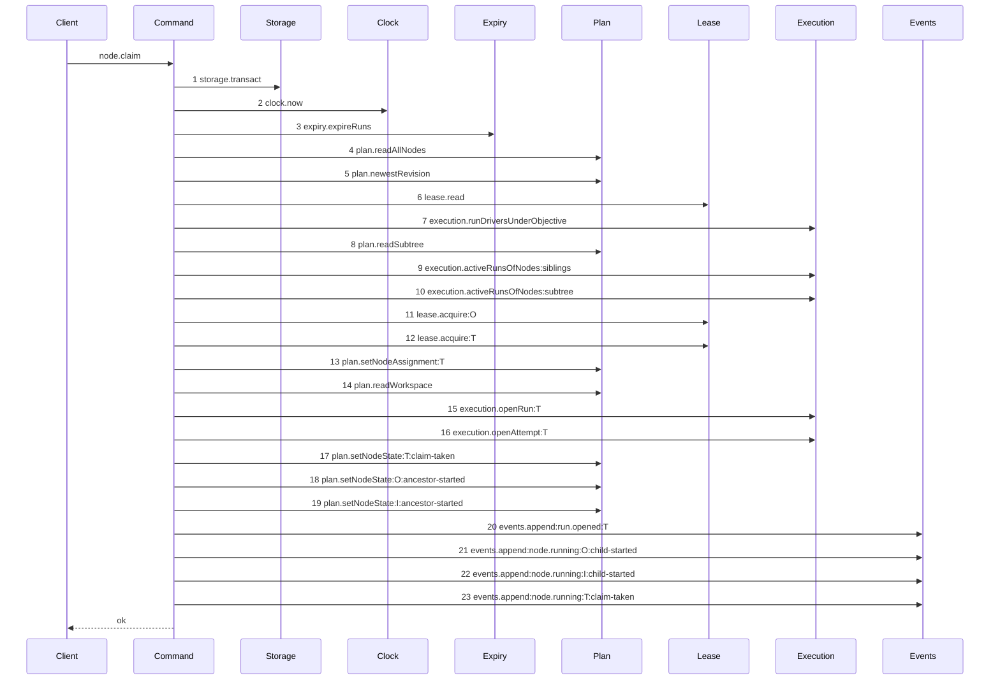

Steps 1 to 13 and 15 to 23 are context from EPIC 050.1 `claim-success-task`. Step 14 is the only
change: `plan.readWorkspace` reads the workspace head and the result is passed as the run's base
oid, so `run_base` is inserted atomically with the run at step 15. EPIC 050.1's diagram held no step
14; the original step 14 (`execution.openRun:T`) shifts to 15 and all later ordinals shift by one.
The same read supplies `judged_oid` for a review claim, lifting EPIC 050.1's `review-head-unavailable`
guard. `workspace.openWorkspace` is removed: the workspace exists before the claim runs.

### `workspace-cut-begin`

Fixture: objective `O` is linked to repository `R`. `R.branch` = `refs/heads/main`. No workspace
row exists for `O`, and `O` is transitioning to `ready` with run kind `execution`.

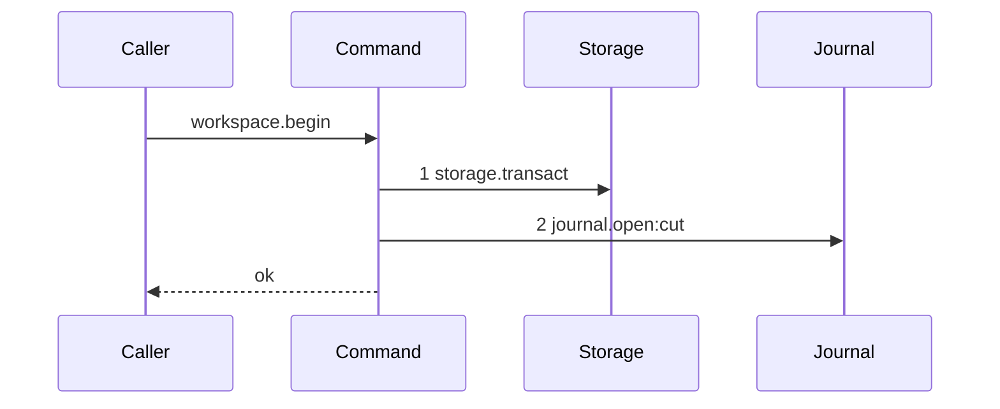

The begin transaction reads the current branch head from `git.resolveRef:branch` and inserts the
`open` journal row. No git write happens here. The transaction commits before control returns to the
caller.

### `workspace-cut-settle`

Fixture: `workspace-cut-begin` completed. The ref `refs/heads/main` was created at oid `A` by the
caller between begin and settle.

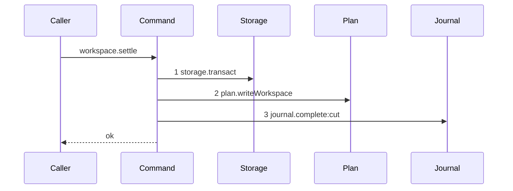

One transaction inserts the workspace row and completes the journal row. A crash after the begin
transaction and before this settle leaves an `open` `cut` row; startup recovery compares the ref to
`proposed_head_oid` and completes or discards it. The drawn set for the workspace cut settle is this
success path only; startup recovery owns the discard path.

### `workspace-cut`

Fixture: `workspace-cut-begin` fixture.

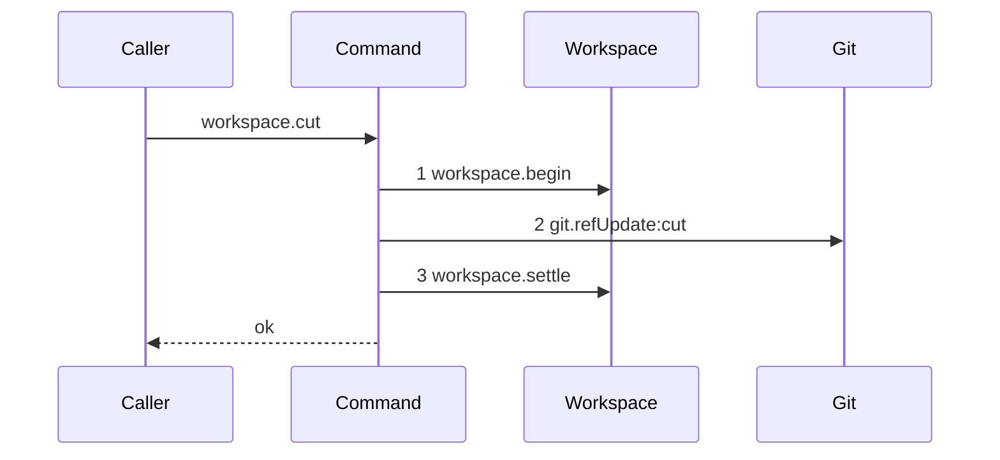

The composed workspace-cut: begin opens the journal row, the git write creates the branch ref, and
settle inserts the workspace row and closes the row. The two transactions are in `workspace.begin`
and `workspace.settle`; no transaction wraps step 2. This is the one drawn path for `workspace.cut`;
the readiness command that calls it has no separate diagram because `workspace.cut` is its only seam
call.

### `ingest-candidate-missing-ref`

Fixture: task `T` has an active run `R`, attempt 1. `refs/kanthord/candidate/<R.id>/1` does not
exist in the bare home.

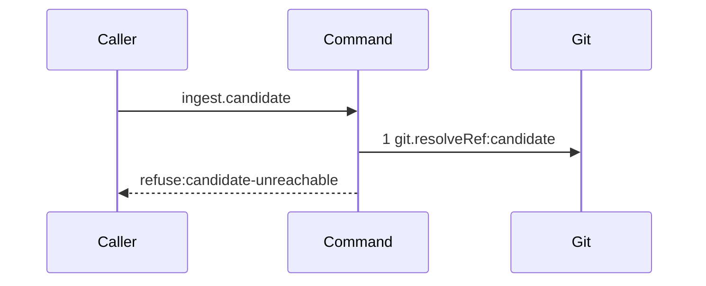

The ref does not exist; `resolveRef` returns null and the command refuses immediately. No reachability
call happens. The drawn set for the missing-ref path stops here; the existing-but-unreachable path
is `ingest-candidate-unreachable`.

### `ingest-candidate-unreachable`

Fixture: `ingest-candidate-missing-ref`, but the ref exists and resolves to oid `B`. The reported
oid is `C`, which is not reachable from `B`.

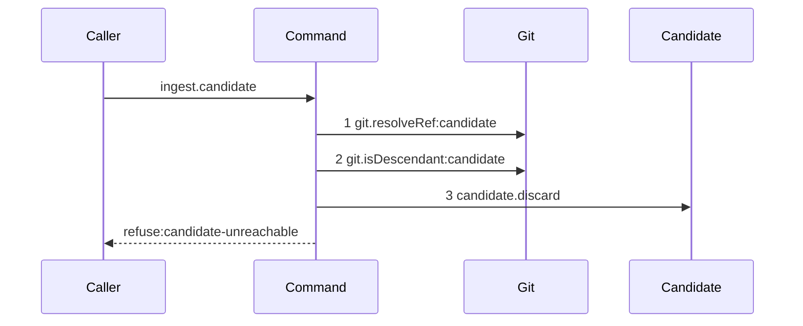

Step 1 resolves the ref; step 2 checks reachability (`ancestorOid` = reportedOid, `descendantOid` =
refTip); step 3 deletes the candidate ref because it exists. The drawn set for the unreachable path
is this diagram; a reachable oid passes and the caller receives ok from `ingest.candidate`.

### `discard-candidate`

Fixture: candidate ref `refs/kanthord/candidate/<R.id>/1` exists.

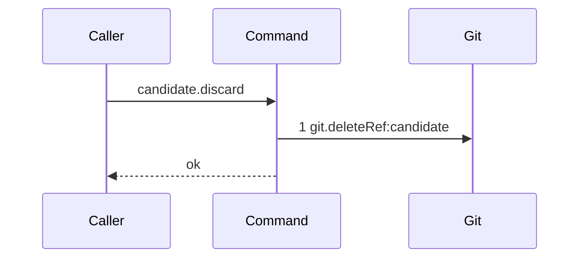

One git call removes the candidate ref. This nested unit appears as one step in every outer diagram
that has an existing candidate ref, so `git.deleteRef:candidate` is drawn once.

### `report-refusal-candidate-unreachable`

Fixture: `ingest-candidate-missing-ref` fixture or `ingest-candidate-unreachable` fixture.

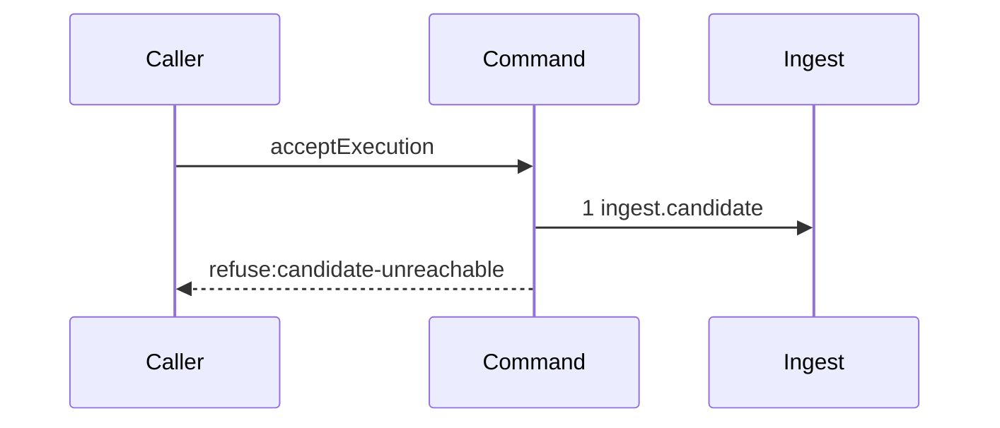

Both inner paths of `ingest.candidate` produce the same outer token at the same position. The outer
diagram is one; the inner distinction is inside the nested unit and is proven by the refusal tests
of story 5.

### `report-refusal-multi-repository`

Fixture: `ingest-candidate-missing-ref` fixture, but the ref exists and reaches the reported oid.
Run `R` records two `run_base` rows: repository `Repo1` at oid `A1`, repository `Repo2` at oid
`A2`.

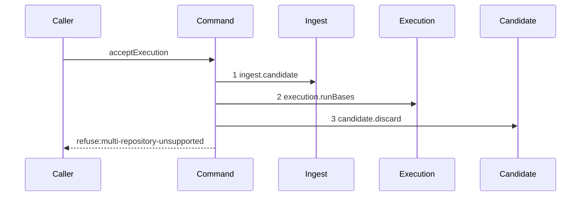

Step 1 is context from `report-refusal-candidate-unreachable`. Step 2 reads the base set and
refuses when it holds more than one repository. Step 3 deletes the candidate ref because it exists.

### `report-refusal-ancestry-broken`

Fixture: one `run_base` row for `Repo` at oid `A`. Candidate ref resolves to oid `B`. `B` is not a
descendant of `A`.

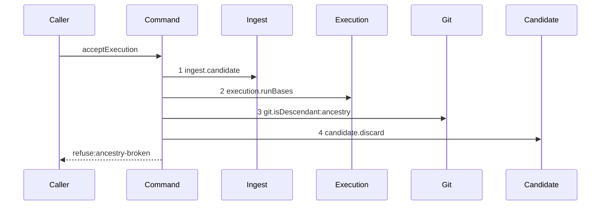

Steps 1 and 2 are context. Step 3 checks whether `B` is a descendant of `A`; it is not.
Step 4 deletes the candidate ref.

### `report-refusal-path-undeclared`

Fixture: `report-refusal-ancestry-broken`, but `B` is a descendant of `A`. Diff `A..B` =
`["undeclared.ts"]`. Declared paths for `T` = `["src/main.ts"]`.

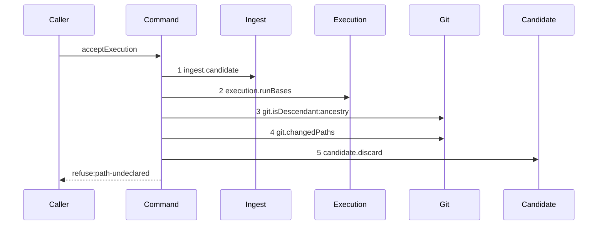

Steps 1 to 3 are context. Step 4 reads the changed path set; `declaredPathVerdict` is a pure
function that receives it and refuses. Step 5 deletes the candidate ref.

### `run-commands-success-one`

Fixture: one declared command `npm test`. The command exits zero.

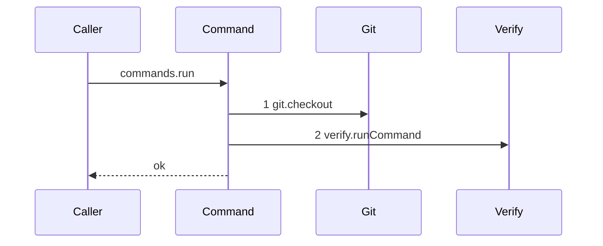

Fixture length is one. A list of two or more commands produces identical tokens in iteration order;
that ordering and per-command isolation are asserted by story 7's own test, not drawn here.

### `run-commands-success-none`

Fixture: no declared commands.

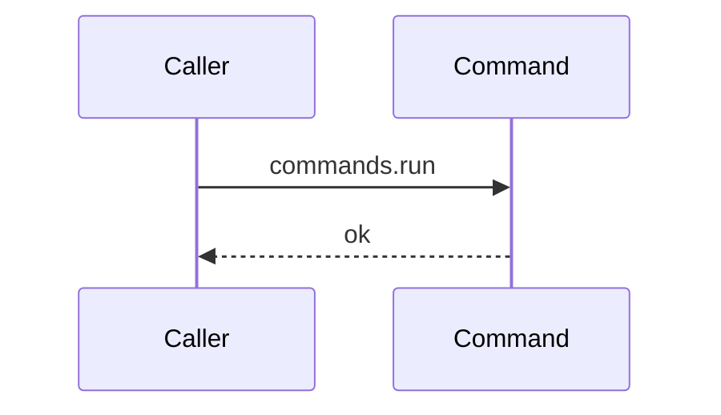

No seam calls happen. The zero-command path has a different seam set from `run-commands-success-one`
and is drawn separately. This is not a shorter list; it is a different path.

### `run-commands-refusal-command-failed`

Fixture: `run-commands-success-one`, but `npm test` exits non-zero.

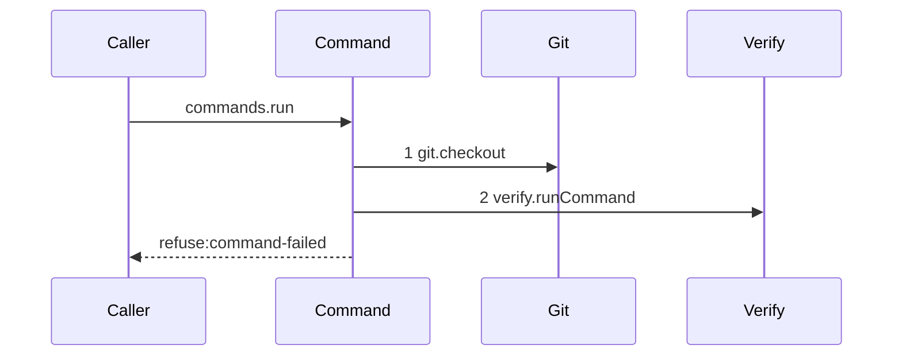

Steps 1 and 2 are context from `run-commands-success-one`. A non-zero exit refuses and names the
command index and the command string. Verify can project the command string as a label if the harness
supports it; story 7 decides whether to add that projection. The drawn set for a single failing
command is this path; the second-command failure case has the same tokens and is not drawn.

### `report-refusal-command-failed`

Fixture: `report-refusal-path-undeclared`, but all changed paths are declared. One declared command.
The command exits non-zero.


Steps 1 to 4 are context. Step 5 calls the command runner nested unit, which takes the
`run-commands-refusal-command-failed` path. Step 6 deletes the candidate ref.

### `land-begin`

Fixture: an active run `R` for task `T` with `run_base` oid `A` in repository `Repo`. Candidate
ref resolves to oid `B`.

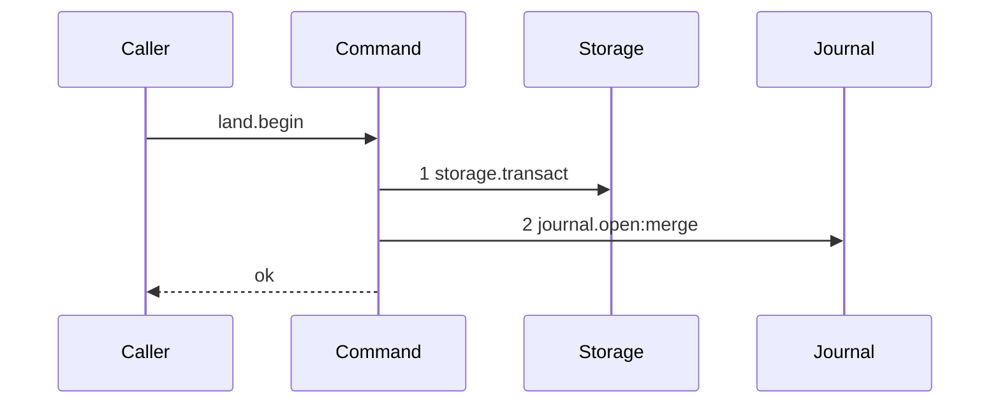

One transaction inserts the `open` `merge` journal row and commits. The caller then performs the git
compare-and-swap, which is not in a transaction.

### `land-settle-accepted`

Fixture: `land-begin` completed. The compare-and-swap at `refs/heads/main` succeeded: `expected` =
`A`, `next` = `B`.

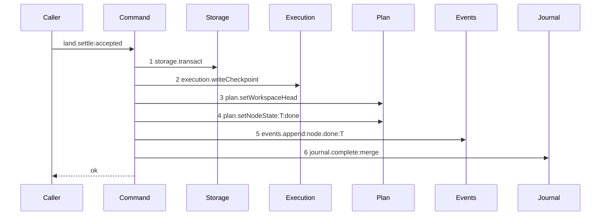

One transaction writes the checkpoint, advances `workspace.head_oid`, records the node transition
and the event, and completes the journal row. A failure injected after step 2 leaves the head, the
node state and the event count unchanged, assertable by reading the row at both points.

### `land-execution-success`

Fixture: `land-begin` fixture.

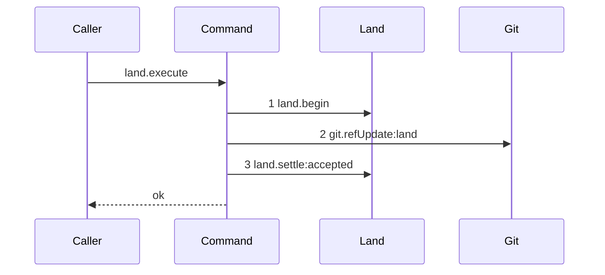

The composed success land: step 1 opens the journal row, step 2 is the compare-and-swap (the swap
succeeds: `updated = true`), step 3 writes the database effects. The git write sits between the two
transactions, in no transaction.

### `land-settle-contended`

Fixture: `land-begin` completed. The compare-and-swap failed: `updated = false`.

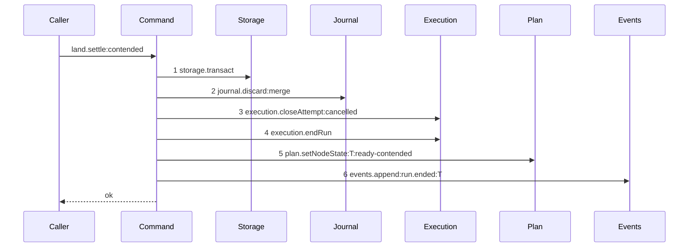

One transaction discards the journal row, cancels the attempt, ends the run, returns the node to
`ready` and appends the event. The attempt counter is unchanged, the accepted ref is unchanged, and
the fence rises by exactly one. The settle always completes; the contended outcome is expressed in
the outer diagram's terminal.

### `land-execution-contended`

Fixture: `land-begin` fixture, but the compare-and-swap will fail.

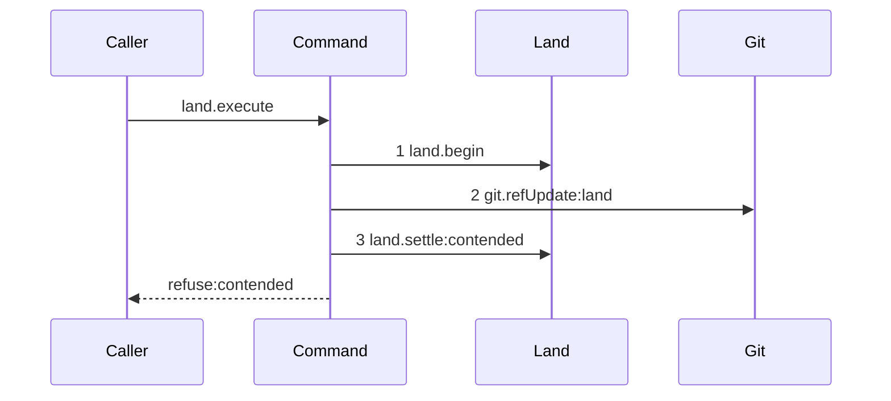

Steps 1 and 2 are context from `land-execution-success`. Step 3 calls the contended settle nested
unit. The outer terminal is `refuse:contended`.

### `report-refusal-contended`

Fixture: `report-refusal-command-failed`, but the command exits zero. The compare-and-swap fails.

```mermaid
sequenceDiagram
    participant Caller
    participant Command
    participant Ingest
    participant Execution
    participant Git
    participant Commands
    participant Land
    participant Candidate
    Caller->>Command: acceptExecution
    Command->>Ingest: 1 ingest.candidate
    Command->>Execution: 2 execution.runBases
    Command->>Git: 3 git.isDescendant:ancestry
    Command->>Git: 4 git.changedPaths
    Command->>Commands: 5 commands.run
    Command->>Land: 6 land.begin
    Command->>Git: 7 git.refUpdate:land
    Command->>Land: 8 land.settle:contended
    Command->>Candidate: 9 candidate.discard
    Command-->>Caller: refuse:contended
```

Steps 1 to 5 are context from prior refusal diagrams. Steps 6 to 8 are the land: story 8 introduced
these tokens in `land-execution-success` and `land-execution-contended`; story 9 declares no journal
or swap tokens. Step 9 deletes the candidate ref.

### `report-execution-checkpoint`

Fixture: `report-refusal-command-failed`, but the command exits zero and the compare-and-swap
succeeds.

```mermaid
sequenceDiagram
    participant Caller
    participant Command
    participant Ingest
    participant Execution
    participant Git
    participant Commands
    participant Land
    participant Candidate
    Caller->>Command: acceptExecution
    Command->>Ingest: 1 ingest.candidate
    Command->>Execution: 2 execution.runBases
    Command->>Git: 3 git.isDescendant:ancestry
    Command->>Git: 4 git.changedPaths
    Command->>Commands: 5 commands.run
    Command->>Land: 6 land.begin
    Command->>Git: 7 git.refUpdate:land
    Command->>Land: 8 land.settle:accepted
    Command->>Candidate: 9 candidate.discard
    Command-->>Caller: ok
```

Steps 1 to 7 are context from prior diagrams. Step 8 calls `land.settle:accepted`; step 9 deletes
the candidate ref. The scenario for this diagram drives `acceptExecution` directly, not the
`node.report` route. All tokens were introduced in earlier stories; story 11 declares no new seam.

## Stories

1. **Migration 13.** Add `src/services/storage/migration-0013-checkpoint.ts` at version `13`: create `checkpoint` with the enumerated columns and CHECK clauses; add `ref`, `origin_oid` and `head_oid` to `workspace`, nullable, with the stated backfill; add the two workspace triggers; add `cut` to the `git_operation.intent` CHECK. Register it at `src/services/storage/migrations.ts:13`. Add its test asserting an insert per kind, asserting each cross-kind column combination is refused, asserting the composite attempt foreign key refuses an attempt of another run, asserting the backfill values row by row, asserting the `origin_oid` update trigger, and asserting the workspace delete trigger refuses while a checkpoint names it.

2. **The checkpoint row.** Add `src/domain/checkpoint.ts` with `checkpointRow` and one refine per CHECK. Add `src/domain/checkpoint.test.ts` with a case per refine.

3. **The workspace record.** Extend `workspaceRow` at `src/domain/workspace.ts:7` with `ref`, `originOid` and `headOid`, each nullable. Add cases to `src/domain/workspace.test.ts`. Extend the workspace read and write paths of the plan store and assert a round trip.

4. **The workspace cut at readiness and the claim reads the base.**

   Diagrams: claim-success-task, workspace-cut-begin, workspace-cut-settle, workspace-cut
   Seams: +plan.readWorkspace, +workspace.begin, +git.refUpdate:cut, +workspace.settle, +storage.transact, +journal.open:cut, +plan.writeWorkspace, +journal.complete:cut

   When a node transitions to `ready` and its run kind will be `execution`, the readiness command performs a journaled cut of `refs/heads/<objectiveId>` from `repository.branch`. The journaled cut is `workspace-cut`: the begin nested unit opens the journal row in one transaction, the git write creates the branch ref, and the settle nested unit inserts the workspace row and completes the journal row in a second transaction. Startup reconciles an `open` `cut` row left by a crash between the two transactions.

   Extend `src/commands/node/claim-node.ts` to call `plan.readWorkspace` inside the claim transaction and pass its `head_oid` as the run's base oid, so `run_base` is inserted atomically with the run. An execution claim on a node with no workspace row is an invariant violation; the claim does not guard it. The same workspace head read supplies `judged_oid` for a review claim, lifting EPIC 050.1's `review-head-unavailable` guard.

   Add cases to `src/commands/node/claim-node.test.ts` asserting the run's base oid equals the workspace's `head_oid`. Add `src/commands/node/mark-node-ready.ts` (or the equivalent readiness command) performing the workspace cut, with cases asserting the ref exists in the loopback repository, asserting `origin_oid` equals the resolved branch oid, asserting `head_oid` equals `origin_oid` at creation, asserting the journal row is `complete`, asserting a second readiness transition finds the workspace and cuts no ref, and asserting two concurrent first transitions produce one workspace and one ref.

5. **Candidate delivery and ingestion.**

   Diagrams: report-refusal-candidate-unreachable, ingest-candidate-missing-ref, ingest-candidate-unreachable, discard-candidate
   Seams: +ingest.candidate, +git.resolveRef:candidate, +git.isDescendant:candidate, +candidate.discard, +git.deleteRef:candidate

   Add `src/commands/checkpoint/ingest-candidate.ts` resolving `refs/kanthord/candidate/<runId>/<attemptNo>` and asserting the reported oid is reachable from the ref tip. A missing ref refuses `candidate-unreachable` immediately. An existing ref that does not reach the reported oid deletes the ref and refuses `candidate-unreachable`. Reachability is `git.isDescendant({ ancestorOid: reportedOid, descendantOid: refTip })`; equality is reachable. Expose `candidate.discard` as a separate injected function that calls `git.deleteRef:candidate`, so every outer diagram draws the deletion as one step. Add `src/commands/checkpoint/ingest-candidate.test.ts` against the loopback fixture asserting a reachable oid passes, an unreachable oid refuses and deletes the ref, and a missing ref refuses without deleting anything.

6. **Ancestry, repository cardinality and the declared-path check.**

   Diagrams: report-refusal-multi-repository, report-refusal-ancestry-broken, report-refusal-path-undeclared
   Seams: +execution.runBases, +git.isDescendant:ancestry, +git.changedPaths

   Add `src/domain/execution-acceptance.ts` with `ancestryVerdict`, `repositoryVerdict` and `declaredPathVerdict`, each pure. Add the two git reads that feed them to `src/commands/checkpoint/accept-execution.ts`: an ancestry query of the candidate from the recorded base (`git.isDescendant:ancestry`), and a name-only diff of the recorded base against the candidate that produces `changedPaths`. The pure functions read no git. Add `src/domain/execution-acceptance.test.ts` asserting: a descendant head passes and a non-descendant refuses `ancestry-broken`; a second repository refuses `multi-repository-unsupported`; a diff inside the declared set passes; two undeclared paths refuse and the refusal lists both, sorted; a directory prefix does not match a file beneath it; a rename with only the new path declared refuses; an empty declared set with a non-empty diff refuses; an empty declared set with an empty diff passes.

7. **The command gate.**

   Diagrams: run-commands-success-one, run-commands-success-none, run-commands-refusal-command-failed, report-refusal-command-failed
   Seams: +git.checkout, +verify.runCommand, +commands.run

   Add `src/commands/checkpoint/run-declared-commands.ts` as the `commands.run` nested unit, injected into `AcceptExecutionDependencies`. It checks the pinned commit out to a fresh `mktemp` directory per command, runs it through `services/verify`, and removes the directory. An empty command list returns immediately with no seam call (`run-commands-success-none`). A non-zero exit refuses `command-failed`. Add its test asserting the run order matches the declared list, asserting each command receives a different directory, asserting a command that writes a file cannot affect the next command, asserting a non-zero exit refuses `command-failed` naming the index and the command string, asserting an empty list makes no verify call, and asserting every directory is removed on both paths. A list of two or more commands produces identical tokens; ordering and per-command isolation are asserted by the test, not drawn.

8. **The land.**

   Diagrams: land-begin, land-settle-accepted, land-execution-success
   Seams: +land.begin, +journal.open:merge, +land.settle:accepted, +git.refUpdate:land, +execution.writeCheckpoint, +plan.setWorkspaceHead, +plan.setNodeState:T:done, +events.append:node.done:T, +journal.complete:merge

   Add `src/commands/checkpoint/land-execution.ts` as the `land.execute` outer command with its two injected nested units `land.begin` and `land.settle`. `land.begin` opens a `merge` journal row in one transaction. `land.settle:accepted` writes the checkpoint, advances `workspace.head_oid`, records the node transition and the event, and completes the journal row in one transaction. The compare-and-swap (`git.refUpdate:land`) sits between the two nested units, in no transaction. Add tests for each nested unit and for the composed path asserting the three swap fields, asserting the journal row is `open` before the git write and `complete` after, asserting `workspace.head_oid` equals the landed oid, asserting the checkpoint carries the five binding facts, and asserting a failure injected after `execution.writeCheckpoint` leaves the head, the node state and the event count unchanged.

9. **Contention.**

   Diagrams: land-settle-contended, land-execution-contended, report-refusal-contended
   Seams: +land.settle:contended, +journal.discard:merge, +execution.closeAttempt:cancelled, +execution.endRun, +plan.setNodeState:T:ready-contended, +events.append:run.ended:T

   Add `land.settle:contended` as the second settle nested unit of `land-execution.ts`. It discards the journal row, cancels the attempt, ends the run, returns the node to `ready` and appends the event, in one transaction. The candidate ref is deleted by `candidate.discard` in the outer `acceptExecution` command after the contended settle returns (step 9 of `report-refusal-contended`). `land-execution-contended` is the composed contended land at the land level; `report-refusal-contended` is the composed contended path at the `acceptExecution` level. Story 9 declares no journal-open or compare-and-swap tokens; those belong to `land.begin` and `git.refUpdate:land`, introduced by story 8. Add cases asserting the attempt counter is unchanged, asserting the accepted ref is unchanged, asserting the candidate ref is gone, asserting the fence rose by one, and asserting a new claim then opens a run whose `run_base` equals the new `workspace.head_oid`.

10. **Startup reconciles an open journal row.** Extend `src/commands/startup/` to read every `open` `merge` and `cut` row, compare the ref to `proposed_head_oid`, and complete or discard it with its transition. Add cases asserting a moved ref completes the row and applies the transition, and asserting an unmoved ref discards the row and leaves the node state unchanged.

11. **Accept execution end to end.** Add `src/commands/checkpoint/accept-execution.ts` composing stories 5 to 9 in the fixed order. Add its test asserting the ordered short-circuit across all six refusal codes, asserting a successful acceptance moves a task to `done`, and asserting a successful acceptance on an atomic objective moves it to `awaiting_approval` through `objectiveOutcome`.

    Diagrams: report-execution-checkpoint

12. **The report route enforces the gate.** Wire `node.report` to `assertRunAuthority` and then `acceptExecution` in `src/http/server/`, mapping each refusal to its contract error. Extend the `node.report` schemas in `src/http/contract/outcome.ts` with the reported head and its repository, and add the six refusal codes to `src/http/contract/errors.ts`. Add an integration case per refusal driving the real route, and a case asserting a report with a stale fence is refused before any git read.

13. **The attempt workspace is discarded.** Add the disposal to the failure path and assert the directory is absent on disk after a rejected attempt, and that `workspace.head_oid` is unchanged.

14. **The proposal records the execution checkpoint.** Add `docs/proposal/phase-2/checkpoints.md` stating the candidate ref contract, the checkpoint schema, the ordered acceptance gate, the three compare-and-swap fields, the contention lifecycle, the per-command immutable checkout, the exact-path rule, the empty-`paths` rule, the workspace head advance, and the journal recovery rule.

## Verification Gate

Gates: `pnpm run verify`

Proof:

```bash
node --test \
  src/domain/checkpoint.test.ts \
  src/domain/workspace.test.ts \
  src/domain/execution-acceptance.test.ts \
  src/services/storage/migration-0013-checkpoint.test.ts \
  src/commands/node/claim-node.test.ts \
  src/commands/checkpoint/ingest-candidate.test.ts \
  src/commands/checkpoint/run-declared-commands.test.ts \
  src/commands/checkpoint/land-execution.test.ts \
  src/commands/checkpoint/accept-execution.test.ts \
  src/commands/startup/recover-journal.test.ts \
  src/http/server/outcome/report-outcome.test.ts \
  test/sequence/conformance.test.ts \
  && echo "PASS EPIC-051"
```

Hermetic coverage required beyond the Proof:

- A reported oid that the candidate ref does not reach refuses `candidate-unreachable`, and no git read of the objective branch happens.
- The candidate ref is deleted on acceptance, on rejection and on contention. Three cases, each asserting the ref is absent. EPIC 050.1 covers the expiry path and EPIC 054 covers the operator handoff.
- A ref the worker wrote outside `refs/kanthord/candidate/` changes no outcome. The case writes `refs/heads/<objectiveId>` directly, then reports, and asserts the daemon still lands by compare and swap from the recorded base. The assertion is that the daemon ignores the ref, not that the worker cannot write it.
- The changed-path set comes from a name-only diff of the recorded base against the candidate. The assertion drives the real git service against the loopback fixture, so `declaredPathVerdict` is never fed a hand-built list in the end-to-end case.
- The `origin_oid` trigger refuses an `UPDATE` that changes it, and the delete trigger refuses a `DELETE` while a checkpoint names the workspace. Both against real SQLite, by refusal message.
- Two concurrent first readiness transitions on one objective produce exactly one workspace row and one ref. The sequential case is asserted separately and does not stand in for it.
- The `cut` journal row is `open` before the ref creation and `complete` after, asserted by reading the row at both points.
- Two undeclared paths refuse `path-undeclared` and the refusal lists both, sorted with `comparePaths`.
- A `verify.paths` entry naming a directory does not match a file beneath it, asserted by value.
- A rename with only the new path declared refuses. Both sides of a rename must be declared.
- An execution node whose `verify.paths` is empty refuses a non-empty diff and passes an empty one. Both are asserted.
- Each declared command runs in its own directory. The assertion records the working directory per call and asserts the set has no duplicate.
- A command that writes a file into its checkout cannot affect the next command. The second command asserts the file is absent.
- Every checkout directory is removed after the run, on the passing and the failing path.
- A non-zero exit refuses `command-failed` and names the command index and the command string verbatim.
- A command beginning with `! ` that exits zero is accepted, alongside a plain command in the same case, proving one rule applied to both.
- The compare and swap is asserted by its three fields: `ref` equals the objective branch, `expected` equals the run's `run_base` oid, `next` equals the pinned head.
- A successful land advances `workspace.head_oid` to the landed oid, in the same transaction as the checkpoint. A failure injected after the checkpoint insert leaves the head, the node state and the event count unchanged.
- A contended land leaves the accepted ref unchanged, leaves the attempt counter unchanged, deletes the candidate ref, ends the run and raises the fence by exactly one. All five in one case.
- After a contention, a new claim opens a run whose `run_base` equals the new `workspace.head_oid`.
- Startup completes an `open` `merge` row whose ref moved, and discards one whose ref did not. Two cases.
- The `node.report` route refuses a stale fence before any git read, asserted by a git service double whose call count is zero.
- Every one of the six refusal codes is reachable over the real route, one integration case each.
- The sequence conformance harness replays each of the twenty-two diagrams of this EPIC by equality, asserting the recorded trace equals the diagram token list, and the comparison fails when any step is removed from or reordered in the implementation. The harness test asserts this in `test/helpers/sequence-conformance.test.ts`.
- The conformance runner in `test/sequence/conformance.test.ts` runs every scenario file under `test/sequence/scenarios/` against its diagram, passing with the real dependency implementations over the loopback fixture, and failing with a mutation applied to each step in turn. All twenty-two diagrams are covered.
- The parser in `scripts/verify-epic-sequence.ts` (owned by EPIC 050) refuses this document if the `## Sequence` section is absent, if any diagram id repeats a live id from EPIC 050, if a `Supersedes` line names an id the target document does not declare, or if any `Seams:` token carries no sign. These refusals are asserted against fixture trees in `scripts/verify-epic-sequence.test.ts`.
- The `claim-success-task` supersession is complete: EPIC 050.1's diagram carries `Superseded by: EPIC 051 claim-success-task`, this document's diagram carries `Supersedes: EPIC 050.1 claim-success-task`, and no scenario file exists for the EPIC 050.1 diagram. The gate asserts this triple.
- `report-execution-checkpoint` draws the nested command `acceptExecution` at `:700`, so it supersedes no `node.report` diagram. EPIC 050.2's `report-authority-prelude` pins its tail to EPIC 050.4 `report-lease-free`. EPIC 050.4 Story 6 declares that id, so the note resolves outside this document. The successor of `report-lease-free` is the `node.report` diagram of story 12. The conversion declares that id and its `Supersedes` line, so this document declares neither yet.
- The two paths of `workspace-cut-settle` (success) and the startup-recovery discard path are separated: startup reconciles an `open` `cut` row by comparing the ref to `proposed_head_oid`. The workspace settle path and the discard path are tested by `src/commands/startup/recover-journal.test.ts`.
- The ordered short-circuit of `acceptExecution` is asserted across all six refusals by a decision table in `src/domain/execution-acceptance.test.ts`: each pair of conditions that can trigger simultaneously is asserted to report the earlier one.
