# EPIC 051 — The execution checkpoint

Status: **draft**. It follows EPIC 050.5 by sequence order, and it runs after EPIC 050.6 and a re-authored EPIC 107. Those two give it a working `Verify`; the Decisions state why they move.

## Known defect — this epic predates `.agents/plan/authoring.md`, and its conversion fixes four things

This epic was authored against the original EPIC 050, before the decimal epics 050.1 to 050.5 were
inserted between the two and before `.agents/plan/authoring.md` set the epic-and-story form. Nothing
here is redundant work, and no diagram of it should be deleted: EPIC 050.4 **removes** the lease
calls from the claim, and this epic **adds** `plan.readWorkspaceBranch`, so the two are different changes to
one path. What is stale is the chain and the shape. Fix all four in the conversion, not before, since
the conversion moves every diagram out of this file anyway:

1. **The epic holds 22 mermaid blocks, and it owns no story tree.** An epic draws nothing, and there
   is no `.agents/plan/stories/051-*/`. The conversion creates the story directory and moves each
   diagram into the story that owns its path. `scripts/verify-epic-sequence.ts` of EPIC 050.1 Story 8
   covers EPIC 050 to 057 and refuses an epic holding a mermaid block, so this epic fails the gate on
   its first rule until then. `.agents/plan/pending/051-the-story-tree-conversion.md` tracks the
   conversion as an obligation, with its owner and the trigger that forces it.

2. **`claim-success-task` at line 154 supersedes the wrong diagram.** It reads
   `Supersedes: EPIC 050.1 claim-success-task`. EPIC 050.4 Story 1 already supersedes that diagram and
   ships first, so one live diagram has two successors. The prior set of this path is
   `EPIC 050.4 claim-lease-free-task`.

3. **That diagram reuses a live id.** `claim-success-task` is the id EPIC 050.1 Story 3 owns. The gate
   refuses a diagram id that repeats across live diagrams, so the converted story gives this path its
   own id.

4. **That diagram draws seam calls this range deletes.** Its steps 6, 11 and 12 are `lease.read` and
   two `lease.acquire` calls. EPIC 050.4 deletes them from the claim and EPIC 050.5 deletes the lease
   service, so redraw the path without them, renumber, and state the `Seams:` line against
   `claim-lease-free-task`.

The verification-gate bullet near the end of this file that asserts the `claim-success-task`
supersession triple names the same diagram, and it moves with the rest.

## Goal

An accepted commit is the checkpoint of an execution run:

- the objective owns a workspace record with an immutable `origin` and a moving `head`;
- a worker delivers its candidate to a pinned ref in the bare home, and the daemon ingests and verifies it;
- the daemon verifies ancestry from the recorded base, verifies the diff touches declared paths only, and runs each declared command against an immutable checkout of the pinned commit;
- the daemon lands the candidate on the objective branch by compare and swap, advances the workspace head, and writes the checkpoint, the transition and the event in one transaction;
- a failed swap is `contended`: it consumes no attempt, ends the run, and the node repeats from the new head.

## Non-goals

- **No worker loop.** Nothing produces a commit here. A test pushes a candidate into the hermetic loopback repository of EPIC 005 and reports its oid.
- **No structural or review checkpoint.** EPIC 052 and EPIC 053 own them. This epic creates the whole `checkpoint` table, and only the `execution` kind has a writer.
- **No parent-objective state, and no aggregation.** An accepted checkpoint on a task gives its own terminal state, and on an atomic objective it gives `awaiting_approval` through the shipped `objectiveOutcome` at `src/domain/outcome.ts:26`. EPIC 053 adds the pair-driven dispatch, the aggregation and the precedence.
- **No cross-repository landing.** An execution run records exactly one base row. This epic lands one repository per objective, and a report naming a different repository refuses `multi-repository-unsupported`.
- **No publish.** The landing is on the objective branch inside the bare home. Remote origin is EPIC 113.
- **No candidate removal.** The shipped `candidate` table stays unused. EPIC 057 drops it.

## Decisions

- **A worker delivers its candidate to a pinned ref, and the daemon never fetches from a worker.** `worker.md` section 8 step 2 says the daemon ingests and pins the reported head, and it does not say how the object arrives. The daemon owns the bare home, so the worker writes into it: an internal worker's attempt workspace has the bare home as its origin, and an external client is given the same path at claim. Before it reports, the worker pushes its candidate to `refs/kanthord/candidate/<runId>/<attemptNo>`. That ref **is** the pin. A `node.report` naming an oid that ref does not reach refuses `candidate-unreachable`.

- **The pin is created by the worker and owned by the daemon.** The daemon deletes the candidate ref on acceptance, on rejection and on contention. A ref left behind would keep a rejected object alive and let a later report name it.

- **A run that ends without a report leaves its ref behind, so the daemon sweeps the namespace.** The three deletions above each sit on a path a report reached. An expiry reaches none of them, and so does an operator handoff. `.agents/plan/stories/050.1-the-claim/02-the-expiry-pass.md:98-100` states the gap and delegates the fourth deletion to this epic. The daemon therefore holds one reaper: it lists `refs/kanthord/candidate/`, and it deletes every ref whose run is not `active`. The sweep runs at startup, and it runs after each expiry pass. One mechanism discharges both, because both leave the same orphan and neither knows the attempt number.

- **The sweep is not a call inside `expireRuns`, and the signature is why.** `ExpireRunsDependencies` is `{ events, instanceId }` at `.agents/plan/stories/050.1-the-claim/02-the-expiry-pass.md:47-50`. It names no `Git`, it takes the caller's transaction, and it is synchronous. A ref delete is git I/O, and `AGENTS.md` forbids git I/O inside a storage transaction. `expireRuns` also returns `{ runId, nodeId, fence }` and no attempt number, so a caller holding its result still cannot name `refs/kanthord/candidate/<runId>/<attemptNo>`. The seam trace of `expiry-pass-one-due` therefore does not move, and this epic supersedes no EPIC 050.1 diagram. The sweep is its own command, and it runs after the pass commits.

- **The sweep reads the ref namespace, so `Git` gains a listing method.** No shipped method lists refs under a prefix: `src/services/git/index.ts` declares `resolveRef` and `refUpdate` and nothing that enumerates. The sweep is the only caller that cannot name its refs in advance, and a reaper that cannot enumerate is not a reaper.

- **The candidate ref is a convention, and the epic does not pretend it is a boundary.** `refs/kanthord/candidate/<runId>/<attemptNo>` is where a worker writes, with the run id and the attempt number taken from its own active run. Nothing enforces it. The fetch-confinement rule of EPIC 006 is the refspec `+refs/heads/*:refs/remotes/origin/*` on the daemon's **own fetch**, and it restricts no worker, so this epic makes no claim on it.

- **A worker that writes another ref is not detected, and `worker.md` section 11 records that.** A worker holds file system access to the bare home, so it could write `refs/heads/<objectiveId>` and skip every check of section 8. No hook stops that: a hook binds a push, and a worker with a local path can write a ref directly. The daemon's defence is that it reads no such ref. It accepts the candidate the report names, it verifies ancestry from the recorded base, and it moves the objective branch itself by compare and swap. An internal worker is engine code, and an external worker is trusted-client execution. A test asserts the daemon ignores a ref outside the candidate namespace rather than asserting the worker cannot write one.

- **The `checkpoint` table is enumerated here, and every column is stated.** Migration `13` creates it. `kind` in `('execution', 'structural', 'review')`. Binding columns `NOT NULL`: `id`, `node_id`, `run_id`, `attempt_id`, `fence`, `created_at`. **`caller` and `subject` are nullable here, and EPIC 054 fills them.** `worker.md` section 8 step 4 names all five bindings, but neither concept has a source yet: `.agents/plan/epics/054-attempt-classification-and-the-supervisor.md:26` adds `attempt.caller` and `attempt.subject` nullable in migration `15`, and `:13` owns the rule that derives both from authenticated state. A `NOT NULL` column three epics before its derivation exists is not implementable, and inventing a value would manufacture audit evidence. This epic therefore follows EPIC 054's own treatment of the identical two fields: added nullable, filled once the derivation lands, enforced by EPIC 057. A checkpoint written by this epic keeps a null caller and a null subject. Execution columns: `repository_id`, `base_oid`, `accepted_oid`, `landed_oid`. Structural columns: `graph_revision`, `patch_blob`. Review columns: `verdict`, `judged_oid`, `reason_blob`, which EPIC 053 adds. The CHECK clauses are one per group: `(kind = 'execution') = (accepted_oid IS NOT NULL)`, `(kind = 'execution') = (repository_id IS NOT NULL)`, `(kind = 'structural') = (patch_blob IS NOT NULL)`, and the same shape for the review group. `FOREIGN KEY (attempt_id, run_id) REFERENCES attempt(id, run_id)` ties the attempt to the run.

- **That composite reference needs a unique index, and migration `13` creates it first.** SQLite accepts a composite foreign key only against a PRIMARY KEY or a UNIQUE index on the parent columns. `attempt` at `migration-0007-external-execution.ts:34-53` holds `id TEXT PRIMARY KEY` and `UNIQUE (run_id, attempt_no)`, and no key on `(id, run_id)`. The epic cited `:52` as the pattern to mirror, but that line references `run(id, driver)`, and `run` carries `UNIQUE (id, driver)` — the target had the key and `attempt` does not. **The defect does not surface at DDL.** `CREATE TABLE checkpoint` succeeds, and the first `INSERT` fails with `foreign key mismatch - "checkpoint" referencing "attempt"`, because `src/services/storage/connection.ts:8` sets `PRAGMA foreign_keys = ON` at every open and migration `13` is additive so `sqlite.ts:77` never turns it off. Migration `13` therefore runs `CREATE UNIQUE INDEX attempt_id_run_id ON attempt (id, run_id)` before it creates `checkpoint`. `id` is the primary key, so the pair is unique for every row and the index constrains nothing new; it exists to satisfy the reference. **EPIC 057 must re-create it.** Migration `17` makes `attempt.caller` and `attempt.subject` `NOT NULL` at `.agents/plan/epics/057-non-null-enforcement-and-legacy-removal.md:63`, SQLite cannot alter a column to `NOT NULL`, and a table rebuild drops a standalone index. `src/services/storage/migration-0007-external-execution.test.ts:1104` is the precedent for asserting an index survives a rebuild.

- **A checkpoint binds five facts as columns, not as a blob.** `worker.md` section 8 step 4 names the run, the attempt, the caller, the subject and the fence. The audit trail is exactly this tuple, and a blob makes it unqueryable.

- **Cutting the objective branch is a durable write to the bare home, so it carries a journal row.** `AGENTS.md` and `100-phase-2-overview.md` require the journal for every durable git write, and a branch cut is one. Migration `13` adds `cut` to the `git_operation.intent` CHECK at `migration-0003-execution-and-journal.ts:130`. The order is: insert the `open` row and commit it; create the ref; then insert the `workspace` row and complete the journal row in one transaction. A crash between the ref creation and the workspace insert leaves an `open` `cut` row that startup recovery reconciles by reading the ref.

- **Two first claims are serialised by the claim transaction, not by a unique constraint alone.** `workspace.node_id` is `UNIQUE` at `migration-0003-execution-and-journal.ts:9`, and the claim runs inside the `BEGIN IMMEDIATE` transaction of EPIC 050. The loser therefore never reaches the ref creation. The epic asserts the concurrent case, not only the sequential one.

- **The branch is cut inside the claim, on the first claim that needs it.** `worker.md` section 7 states it: "The daemon initializes the workspace on the first claim that needs the branch. The daemon initializes it inside the claim, so two first claims never race." No readiness command cuts a branch, and a node reaching `ready` creates nothing. The cut point is the oid `repository.branch` names in the bare home at claim time, recorded as `workspace_branch.origin_oid`.

- **The claim therefore becomes the journaled write, and its nested units are `claim.begin` and `claim.settle`.** `AGENTS.md:105` gives a journaled write exactly two transactions and gives no other command two. A claim that called a self-contained two-transaction `workspace.cut` and then opened its own transaction would open three, so the cut cannot be a nested command with its own journal pair. The claim's reads join the begin, the ref creation sits between, and the claim's writes join the settle beside `plan.writeWorkspaceBranch`.

- **`git.resolveRef:branch` runs before the begin transaction, not inside it.** `AGENTS.md` forbids git I/O inside a storage transaction because the transaction holds the write lock across it. The branch tip is read first, and the value is carried into the begin.

- **A claim that finds a branch record is one transaction, so the operation has two paths.** The first execution claim is the journaled write above. Every later claim reads the record and opens one transaction, exactly as EPIC 050.4 drew it. The two differ in seam set and in transaction count, so each is its own diagram, and the branch read is what selects between them.

- **Two concurrent first claims both reach the ref creation, and the result is still correct.** The git write sits between the two transactions, so the begin transaction cannot serialise it, and `worker.md`'s claim that two first claims never race does not survive the journaled shape. It does not need to: both claims resolve the same `repository.branch` tip and create the same ref at the same oid, so the ref is correct whichever wins. The loser fails in its settle on the `workspace_branch` primary key, discards its journal row, and writes nothing. **The default if no ruling arrives: the loser refuses the claim and the caller retries**, which costs one wasted claim on the first claim of an objective only. A ruling that the loser instead re-reads the record and continues would make the claim retry inside itself, and no other command in this range does that.

- **The branch record is its own table, `workspace_branch`, and the shipped `workspace` table is not touched.** `docs/proposal/database/workspace.md:3` answers "which clone do the tasks of this objective work in", and `:21` states a row exists for an internal run only, because an external harness owns its own working tree. This epic lands external candidates too, and an external run has no clone, so the branch facts cannot live on a row an external run never owns. `path`, `clone_base_oid`, `upstream_oid_at_clone`, `profile_blob`, `convention_version` and `state` are all `NOT NULL` at `migration-0003-execution-and-journal.ts:7-19`, and relaxing them would make `src/commands/startup/sweep-remnants.ts:45-47` assert `path: string` over a nullable column. Migration `13` therefore creates:

  ```sql
  CREATE TABLE workspace_branch (
    node_id    TEXT PRIMARY KEY REFERENCES node(id),
    origin_oid TEXT NOT NULL,
    head_oid   TEXT NOT NULL
  ) STRICT
  ```

- **Three columns, and the other two are derived.** `ref` is `refs/heads/<node_id>`, a pure function of the key, so storing it invites drift with nothing to detect it. `repository_id` joins from `node`, and `migration-0002-graph-and-plan.ts:33` carries `CHECK ((kind = 'objective') = (repository_id IS NOT NULL))`, so an objective always has one and the join is constraint-backed. `state` is not carried: neither this epic nor `worker.md` defines a transition for the branch record, and a column with no transitions is a column nobody can write correctly.

- **Both columns are `NOT NULL` from migration `13`, so no later epic tightens them.** The row is written inside the claim, where the branch tip is already resolved, so neither value is ever unknown. An earlier draft of this epic added three nullable columns to `workspace` and said EPIC 057 would make them `NOT NULL`. That was false: `.agents/plan/epics/057-non-null-enforcement-and-legacy-removal.md:63` enumerates every column migration `17` tightens, and it names no workspace column at all.

- **`workspace_branch.origin_oid` is immutable, and the row is not deletable while a checkpoint names it.** A trigger refuses an `UPDATE` that changes `origin_oid`, because a CHECK cannot compare against the old row. A second trigger refuses a `DELETE` of a `workspace_branch` row referenced by a `checkpoint` row, because delete-and-reinsert would defeat the first trigger.

- **For an internal run the branch record duplicates two facts, and one command owns the agreement.** `origin_oid` repeats `workspace.clone_base_oid`, and `head_oid` is derivable from the objective ref in the bare home. SQLite cannot constrain agreement across two tables, so `acceptExecution` is where the invariant lives and the gate asserts it. Deriving both instead would make every read of a moving head a git call inside a transaction, which `AGENTS.md` forbids.

- **A successful land advances `workspace_branch.head_oid` in the same transaction as the checkpoint.** `worker.md` section 7 states `head` records the current branch head, and section 8 step 7 states the next task starts from the accepted head. The workspace update, the checkpoint insert, the node transition and the event are one storage transaction. A separate update would let the next claim take a stale base.

- **Acceptance is an ordered gate, and the first failure names itself.** `acceptExecution` runs the steps of `worker.md` section 8 in order: reachability, repository cardinality, ancestry, declared paths, commands, land. The refusal codes are `candidate-unreachable`, `multi-repository-unsupported`, `ancestry-broken`, `path-undeclared`, `command-failed` and `contended`. An earlier failure short-circuits, because running a command against a commit that is not a descendant of the base proves nothing.

- **An execution run holds exactly one base row, and `multi-repository-unsupported` refuses a report that names a different repository.** EPIC 050 sets the upper bound at "at most one" and states that this epic raises the lower bound, so `runRow`'s refine at `src/domain/run.ts:34-45` tightens to exactly one for `execution`. **That does not make the refusal unreachable, because the refusal never compared two stored rows.** `repositoryVerdict` compares the repository the report names against the single stored `run_base` row, and refuses when they differ. The reported repository is already on the wire: story 12 puts it in the `node.report` schema. A two-row base set was never producible in the first place — `migration-0002-graph-and-plan.ts:33` gives an objective exactly one `repository_id`, the `run_base` primary key `(run_id, repository_id)` forbids a duplicate, and the claim writes one row — so a fixture built on two rows would have proved a refusal over a state no code path reaches, against an epic gate that requires every refusal to be reachable over the real route.

- **The refine states the invariant and enforces nothing, and the epic says so.** `runRow` is imported only into the `rows` registry at `src/domain/rows.ts:43`, and no production file calls `parse` or `safeParse` on it. Tightening it is a documentation change. What enforces the cardinality is the claim, which writes exactly one row inside its own transaction.

- **A zero-row execution run is an invariant violation, never a refusal.** The claim inserts the base row atomically with the run, so no execution run reaches acceptance without one. Before this epic every run has no base row, and startup blocks such a node with `recovery-inputs-missing`; that path is EPIC 050.5's and it is unchanged.

- **Ancestry is verified against the recorded base, not against the branch head.** The base is what the worker started from. A head that moved is the contention case, detected at the swap. Verifying ancestry against a moved head would report `ancestry-broken` for work that is merely late.

- **The declared-path check compares exact file paths, and it names every violation.** A `verify.paths` entry matches a changed file path bytewise; it is not a directory prefix. A rename counts as two changed paths, the old and the new, and both must be declared. The refusal lists every undeclared path, sorted with `comparePaths`, so a worker sees the whole gap in one report rather than one path per attempt.

- **An empty `paths` list refuses every change.** A node that declares no path declares no write set. `worker.md` section 2 states an empty `commands` list asserts nothing, and it states nothing of the kind about `paths`. The two lists are not symmetric, and the epic says so: an execution node whose `verify.paths` is empty and whose diff is non-empty refuses `path-undeclared`.

- **Immutable means one fresh checkout per command.** A single checkout is writable, so command one can change what command two reads. The daemon checks the pinned commit out to a new `mktemp` directory for each command, runs it, and removes the directory. `worker.md` section 8 step 5 says the commands run against an immutable checkout, and a shared writable tree is not one.

- **A command carries its own expectation, and the daemon asserts a zero exit.** `worker.md` section 2 states it. The daemon applies one rule to every node, and it never inspects the command text. A harness that needs an inverted expectation writes the inversion into the command it declares, and the shell of the argv form above carries it. This epic states no rule about a `!` prefix, because a rule about the command text is the rule this decision refuses.

- **The land is a compare and swap on the objective branch, with three named fields.** `ref` is the objective branch, `expected` is the run's recorded base for that repository, and `next` is the pinned and verified head. The `refUpdate` primitive of EPIC 006 performs it, bracketed by a `merge` journal row.

- **A crash between the ref move and the transaction is reconciled at startup, not ignored.** The journal row is `open` with its `proposed_head_oid`. `src/commands/startup/reconcile-journal.ts` reads every `open` `merge` and `cut` row, compares the ref to `proposed_head_oid`, and either completes the row and applies the pending transition, or marks it `discarded`. **The shipped command applies no transition at all** — it completes and discards rows and writes nothing else — so this is new work rather than a parameter change.

- **The journal row carries no checkpoint bindings, and startup derives them rather than storing them.** `git_operation` at `migration-0003-execution-and-journal.ts:127-144` holds no `attempt_id` and no `fence`, and this epic adds no column to it: the table is polymorphic, and a `cut`, `sync` or `publish` row has no run, no attempt and no caller to put in one. `node_id` and `run_id` are already columns, but `listOpen` does not project them, so `src/services/git/journal.ts:58-60` and `OpenJournalRow` gain both. `attempt_id` is the open attempt of the run. **`fence` is `run.fence` read at reconcile time, and that is equal to its value at `land.begin`**: the fence rises only when a run ends, `land-settle-accepted` never ends the run, and `src/commands/startup/recover-home.ts:19-22` orders the passes reap, sweep, reconcile, leases — so the only pass that ends a run runs after reconcile. `lease_fence` on the same row is not this fence; it is the external-drive precondition mode.

- **The `attempt_id` derivation rests on one open attempt per run, and the schema does not enforce it.** `attempt` carries `UNIQUE (run_id, attempt_no)` and no constraint on open attempts, so the guarantee is protocol, not schema. The epic states it rather than assuming it, and the recovery test asserts the derivation picks the attempt the crashed land opened.

- **Contention ends the run, and the node repeats under a new claim.** `worker.md` section 8 states a failed swap discards the candidate, repeats the node from the new head, and consumes no attempt. A run's `base` is immutable, so the same run cannot retry against a moved head. The daemon therefore: deletes the candidate ref, records `outcome = 'cancelled'` on the attempt, ends the run, raises the fence, and returns the node to `ready`. The next claim opens a new run whose `run_base` is the new `workspace_branch.head_oid`. Contention consumes no attempt, and the attempt counter is asserted unchanged.

- **`acceptExecution` is a nested callable inside `reportOutcome`, and the handler keeps its one command.** `AGENTS.md` requires a handler to parse, call exactly one command, and format, and `src/http/server/node/report-node.ts:11-12` injects exactly one callable today. `assertRunAuthority` is a **pure** function and it already runs inside the command: EPIC 050.2 Story 6 (`06-the-report-prelude`) omits it from its `Seams:` line for that reason and draws every step as `Command` to a service, and EPIC 050.4 Story 6 (`06-the-report-drops-the-lease`) reproduces that prefix. An earlier draft of this epic put both calls in the handler; no epic ever chose that design. `reportOutcome` therefore runs the authority prelude in its own transaction, and then calls `acceptExecution`, which opens its own journaled begin and settle. `reportObjective` and `closeObjective` at `src/commands/outcome/report-outcome.ts:59-66` are the shape precedent, with one difference this epic states: both take the caller's transaction, and `acceptExecution` cannot, because it writes git. The handler maps each refusal to its contract error. `worker.md` section 11 lists the active run, the fence, the claimed subtree and the verified diff as daemon-enforced, and a command-level test does not prove the route enforces them. An integration case drives the route.

- **A failed attempt's workspace directory is removed, and the daemon never rewrites an accepted ref.** `worker.md` section 8 steps 7 and 8 state both. The discard removes the attempt directory from disk and leaves `workspace_branch.head_oid` at its last accepted value.

- **Migration `13` is additive, and it alters no shipped table.** It creates `checkpoint` and `workspace_branch`, creates the unique index on `attempt`, and adds `cut` to the `git_operation.intent` CHECK. No column changes nullability and no table is rebuilt, so no shipped statement becomes invalid and no backfill is needed. `workspace_branch` starts empty: a row appears at the first claim that needs the branch.

- **The command gate needs a working `Verify`, so two epics land before this one.** `src/services/verify/not-implemented.ts:8-13` throws, and `.agents/plan/epics/107-verify-service.md:29` builds the real implementation on the `SupervisedRunner` of `src/services/process/`. That capability is EPIC 106's story at `.agents/plan/epics/106-agents-on-pi-coding-agent.md:24`, and it is an extraction of shipped EPIC 006 code rather than new phase-2 work. **The extraction cannot ship alone.** `src/services/git/run.ts:11`, `child.ts:17`, `probe.ts:12` and `host-key.ts:12` all import `./launcher.ts`, so moving it breaks four files, and a change lands with the repairs it forces. **EPIC 050.6 therefore holds EPIC 106's process-capability story together with every git repair it forces**, EPIC 107 is re-authored against the post-EPIC-050.5 tree, and both land before this epic. Nothing of EPIC 101 to 105 moves. A separate defect surfaces in that re-authoring: `.agents/plan/epics/107-verify-service.md:67` asserts `src/domain/layout.test.ts` requires a `not-implemented.ts` for `lease` only, which EPIC 050.5 makes false in every landing slot.

- **A declared command is one string, and the daemon runs it through a shell it does not parse.** `src/domain/verify-block.ts:29` declares `commands: z.array(z.string())`, and each item is one complete command. `Verify.run` takes argv at `src/services/verify/index.ts`, so the gate builds exactly `["/bin/sh", "-c", <the declared string>]` and parses nothing. `&&` chains inside one item, and the commands of the list run in declared order, one at a time. `.agents/plan/epics/107-verify-service.md:28` already names that argv form as legal and uses it at `:64`, and `src/services/git/launcher.ts:47` already builds one. The daemon asserts a zero exit and never inspects the command text: a `!` prefix is the plan author's shell and not a rule of this epic.

## Sequence

For every path this section draws, the seam calls and their order are authoritative over the prose
of a work item. A work item that names a seam call this section does not draw is a defect in the
work item. Precedence stops at values, predicates, state changes and error semantics.

### What a diagram may say

One diagram covers one path of one operation and states one terminal. A branch is a separate diagram.
A count is unrolled against a fixed fixture whose length is stated; a list whose items produce
identical tokens is not drawable and the document says so in one sentence. The notation `loop` and
`opt` is forbidden. A pure function carries no message. A method called twice with no natural
projection is a decomposition signal: each call becomes a nested unit with its own diagram.

### Addressing and uniqueness

Every id is globally unique across every document the range gate reads. The scenario path is derived:
the binding names the root and the file is `test/sequence/scenarios/<id>.ts`. A declared path
restates a derivable fact and then drifts from it.

### Signs are path-relative

A sign is relative to the path, not to the range. A diagram that supersedes nothing is wholly new,
so every one of its tokens is `+` in exactly one work item. A diagram that supersedes an earlier one
holds only the delta: tokens the superseded diagram held at the same position are context and carry
no sign.

### Seam keys the diagrams name that the stories did not

New method signatures, for cross-reference only; the stories carry the interface decisions.

- `claim.begin` / `claim.settle` — nested unit functions injected into the claim; their composed
  outer is `claim-first-execution`. They exist because the claim is a journaled write, not because a
  workspace command does; there is no `workspace.cut` command.
- `git.resolveRef` — `:branch` labels the read of `repository.branch` that gives the cut point.
- `plan.readWorkspaceBranch(transaction, nodeId): WorkspaceBranchRow` — new method on `PlanStore`.
- `plan.writeWorkspaceBranch(transaction, input): WorkspaceBranchRow` — new method on `PlanStore`.
- `plan.setWorkspaceBranchHead(transaction, input: { nodeId, headOid }): void` — new method on `PlanStore`.
- `ingest.candidate` — nested unit injected into `AcceptExecutionDependencies`; encapsulates the
  ref-resolve and reachability check, and exposes the candidate ref for later deletion.
- `git.resolveRef` — present since EPIC 006; `:candidate` labels the call that reads the candidate
  ref.
- `git.isAncestor(input: { gitDir, ancestorOid, descendantOid }): Promise<boolean>` — new method on
  `Git`, over `git merge-base --is-ancestor`. Exit `0` is `true`, exit `1` is `false`, and any other
  exit throws. Equality is an ancestor, so a report that exactly matches the ref tip passes. **It
  carries no label, and it is `isAncestor` and not `isDescendant`.** The reachability call sits
  inside `ingest.candidate`, which is a nested unit, and the ancestry call sits in
  `acceptExecution`. The two are therefore in different diagrams, and `.agents/plan/authoring.md`
  forbids a repeated token only inside one diagram, so nothing needs separating. A `:candidate` or
  `:ancestry` label would also name the call site rather than an argument, which
  `.agents/plan/authoring.md:188` refuses: a projection names a value the call actually receives.
  The predicate reads naturally in both places — the reported oid is an ancestor of the ref tip, and
  the run base is an ancestor of the candidate head.
- `git.changedPaths(input: { gitDir, baseOid, headOid }): Promise<string[]>` — new method on `Git`,
  over `git diff --name-status`. A status beginning `R` or `C` emits both the old and the new path,
  because `docs/proposal` makes both sides of a rename load-bearing here. Every other status emits
  one path. The result is deduplicated.
- `git.checkout(input: { gitDir, oid, targetDir }): Promise<void>` — new method on `Git`, over
  `git worktree add --detach <targetDir> <oid>`. A bare repository holds no index, so a
  `--work-tree` checkout would need an injected `GIT_INDEX_FILE` per command; `worktree add` needs
  none. A crash leaves an entry in the bare home's `worktrees/` directory, and startup clears it
  with `git worktree prune --expire=now` on the existing `sweepHome` path.
- `git.refUpdate` — present since EPIC 006; `:cut` labels the branch-cut and `:land` labels the
  compare-and-swap.
- `git.deleteRef(input: { gitDir, ref }): Promise<void>` — new method on `Git`.
- `git.listRefs(input: { gitDir, prefix }): Promise<string[]>` — new method on `Git`, sorted
  bytewise. The candidate sweep is its only caller, and it is the one caller that cannot name its
  refs in advance.
- `candidate.sweep` — the reaper command. It lists `refs/kanthord/candidate/`, reads the run state of
  each ref it finds, and calls `git.deleteRef:candidate` for every ref whose run is not `active`. It
  opens one transaction for the read and holds none across the deletes.
- `candidate.discard` — nested unit injected into `AcceptExecutionDependencies`; calls
  `git.deleteRef:candidate` on the candidate ref that `ingest.candidate` resolved. Drawn as a nested
  unit so `git.deleteRef:candidate` appears in one diagram only. Every refusal that has an existing
  candidate ref draws `candidate.discard`; the missing-ref path does not, because the ref never
  existed.
- `execution.runBases(transaction, runId): Promise<RunBaseRow[]>` — new method on `Execution`.
- `execution.writeCheckpoint(transaction, input): CheckpointRow` — new method on `Execution`.
- `execution.closeAttempt` — present in `Execution`; `:cancelled` is the outcome label.
- `commands.run` — nested unit injected into `AcceptExecutionDependencies`; encapsulates the
  per-command checkout-and-verify loop. Its drawn paths are `run-commands-success-one`,
  `run-commands-success-none` and `run-commands-refusal-command-failed`.
- `land.begin` / `land.settle:accepted` / `land.settle:contended` — nested unit functions injected
  into `AcceptExecutionDependencies`; their composed outer is `land-execution-success` or
  `land-execution-contended`.
- `journal.open:cut`, `journal.open:merge`, `journal.complete:cut`, `journal.complete:merge`,
  `journal.discard:merge` — present in `GitJournal`; labels project the `intent` field.
- `storage.transact` — present since EPIC 050; unlabeled, appears once per diagram because each
  nested unit opens exactly one transaction.

### Invariant

A `ready` node guarantees nothing about a branch. The record and the ref are created by the first
execution claim, so a node can be `ready` for any length of time with neither. What is invariant is
that an execution run always has a base row: the claim writes the branch record and the base row in
one settle, so no execution run reaches acceptance without both. Startup reconciles a `cut` row left
`open` by a crash between the claim's two transactions.

### `claim-success-task`

Supersedes: EPIC 050.1 claim-success-task

Fixture: initiative `I` holds objective `O`, which holds tasks `T` and `S`. Every node is `ready`,
no node is assigned, no run is active, and a `workspace_branch` row already exists for `O` with
`head_oid` = `A`. This is the path of every claim after the first; the first takes
`claim-first-execution`.
The target is `T`, whose deliverable is `implementation`, so the run kind is `execution` and the
cascade covers `O` and `I`.


Steps 1 to 13 and 15 to 23 are context from EPIC 050.1 `claim-success-task`. Step 14 is the only
change: `plan.readWorkspaceBranch` reads the workspace head and the result is passed as the run's base
oid, so `run_base` is inserted atomically with the run at step 15. EPIC 050.1's diagram held no step
14; the original step 14 (`execution.openRun:T`) shifts to 15 and all later ordinals shift by one.
The read runs only when `runKindFor(node.deliverable)` is `execution`, and it takes the objective id
from `objectiveScopeId(node)` at `src/commands/node/claim-node.ts:201`, because the branch record is
keyed on the objective and the claimed node may be a task under it. A structural or review claim
makes no such read: EPIC 050 gives neither kind a base row. EPIC 050.1's
`review-head-unavailable` guard is **not** lifted here. `workspace.openWorkspace` is removed: the workspace exists before the claim runs.

### `claim-cut-begin`

Fixture: initiative `I` holds objective `O`, which holds tasks `T` and `S`. `O` is linked to
repository `R` with `R.branch` = `refs/heads/main`, which names oid `A`. No `workspace_branch` row
exists for `O`. The target is `T`, whose deliverable is `implementation`, so the run kind is
`execution`.

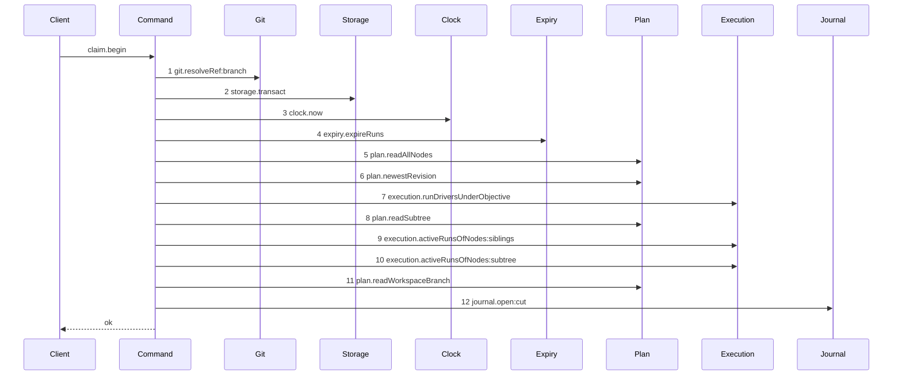

Step 1 is outside every transaction, because a git read inside one holds the write lock across it.
Step 11 returns null, and that is what selects this path over `claim-success-task`. Step 12 records
the proposed head so startup can reconcile a crash before the settle. The transaction commits before
control returns. No lease call appears: EPIC 050.4 removed them from the claim and EPIC 050.5
deleted the service.

### `claim-cut-settle`

Fixture: `claim-cut-begin` completed, and `refs/heads/<O>` was created at oid `A` between the two
transactions.

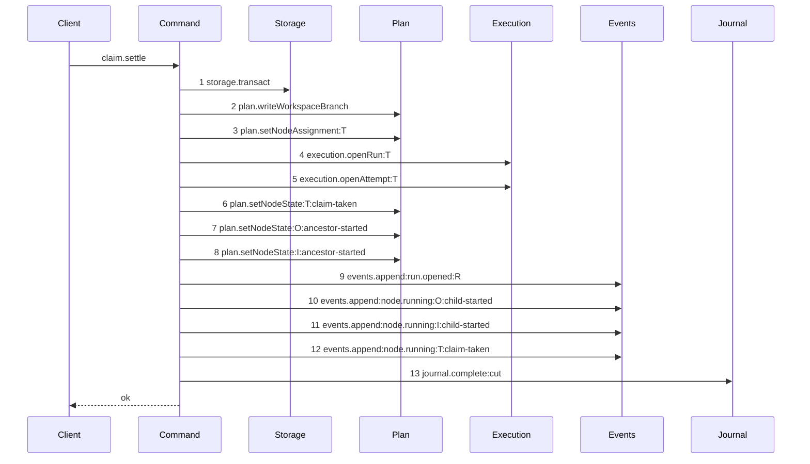

One transaction writes the branch record, the run and its base row, the three node transitions, the
four events, and completes the journal row. `origin_oid` and `head_oid` are both `A` at step 2, and
the run's base oid is the same value, so `run_base` is written atomically with the run at step 4.
The drawn set for this settle is the success path; the loser of two concurrent first claims fails at
step 2 on the primary key, and the Decisions state what it does.

### `claim-first-execution`

Fixture: `claim-cut-begin` fixture.

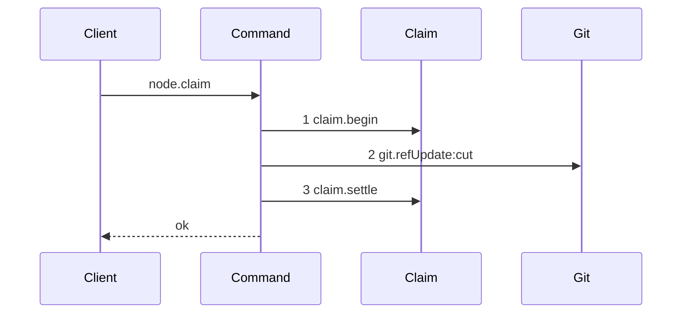

The composed first execution claim: the begin reads the state and opens the journal row, the git
write creates `refs/heads/<O>` at the resolved tip, and the settle writes every database effect and
closes the row. The two transactions are inside the nested units, and no transaction wraps step 2.
This is the one drawn path for a first claim; a claim that finds a branch record takes
`claim-success-task`, which opens one transaction and draws no journal call.

### `ingest-candidate-missing-ref`

Fixture: task `T` has an active run `R`, attempt 1. `refs/kanthord/candidate/<R.id>/1` does not
exist in the bare home.

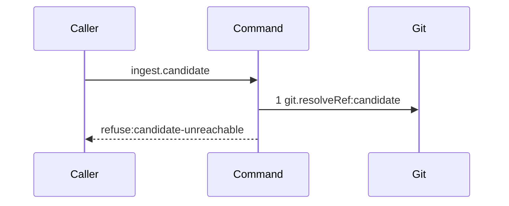

The ref does not exist; `resolveRef` returns null and the command refuses immediately. No reachability
call happens. The drawn set for the missing-ref path stops here; the existing-but-unreachable path
is `ingest-candidate-unreachable`.

### `ingest-candidate-unreachable`

Fixture: `ingest-candidate-missing-ref`, but the ref exists and resolves to oid `B`. The reported
oid is `C`, which is not reachable from `B`.

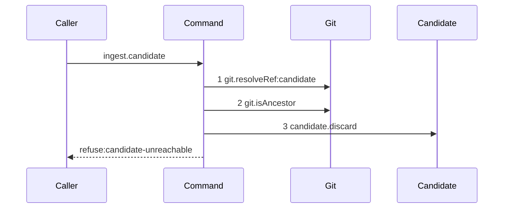

Step 1 resolves the ref; step 2 checks reachability (`ancestorOid` = reportedOid, `descendantOid` =
refTip); step 3 deletes the candidate ref because it exists. The drawn set for the unreachable path
is this diagram; a reachable oid passes and the caller receives ok from `ingest.candidate`.

### `discard-candidate`

Fixture: candidate ref `refs/kanthord/candidate/<R.id>/1` exists.

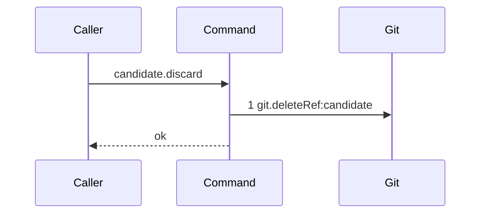

One git call removes the candidate ref. This nested unit appears as one step in every outer diagram
that has an existing candidate ref, so `git.deleteRef:candidate` is drawn once.

### `report-refusal-candidate-unreachable`

Fixture: `ingest-candidate-missing-ref` fixture or `ingest-candidate-unreachable` fixture.

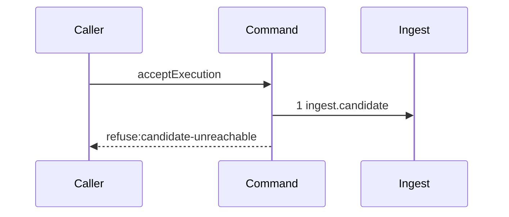

Both inner paths of `ingest.candidate` produce the same outer token at the same position. The outer
diagram is one; the inner distinction is inside the nested unit and is proven by the refusal tests
of story 5.

### `report-refusal-multi-repository`

Fixture: `ingest-candidate-missing-ref` fixture, but the ref exists and reaches the reported oid.
Run `R` records exactly one `run_base` row, repository `Repo1` at oid `A1`. The report names
repository `Repo2`. A two-row fixture is not used, because no code path produces one.

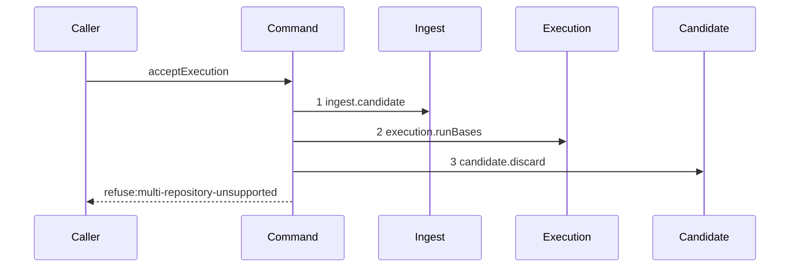

Step 1 is context from `report-refusal-candidate-unreachable`. Step 2 reads the one base row, and
`repositoryVerdict` refuses because the reported repository is not the one that row names. Step 3
deletes the candidate ref because it exists.

### `report-refusal-ancestry-broken`

Fixture: one `run_base` row for `Repo` at oid `A`. Candidate ref resolves to oid `B`. `B` is not a
descendant of `A`.


Steps 1 and 2 are context. Step 3 checks whether `B` is a descendant of `A`; it is not.
Step 4 deletes the candidate ref.

### `report-refusal-path-undeclared`

Fixture: `report-refusal-ancestry-broken`, but `B` is a descendant of `A`. Diff `A..B` =
`["undeclared.ts"]`. Declared paths for `T` = `["src/main.ts"]`.

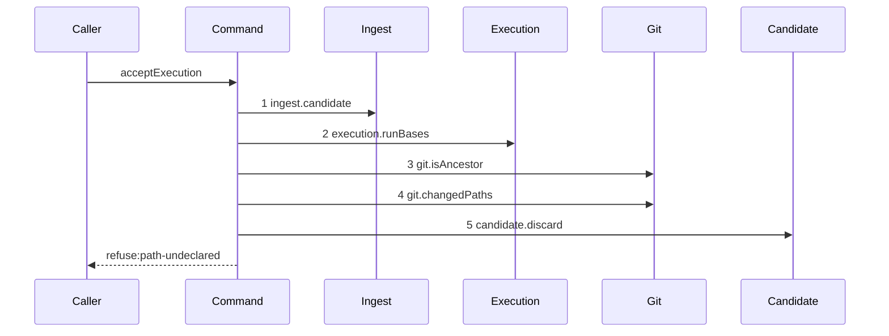

Steps 1 to 3 are context. Step 4 reads the changed path set; `declaredPathVerdict` is a pure
function that receives it and refuses. Step 5 deletes the candidate ref.

### `run-commands-success-one`

Fixture: one declared command `npm test`. The command exits zero.

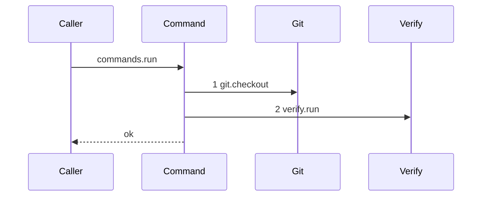

Fixture length is one. A list of two or more commands produces identical tokens in iteration order;
that ordering and per-command isolation are asserted by story 7's own test, not drawn here.

### `run-commands-success-none`

Fixture: no declared commands.

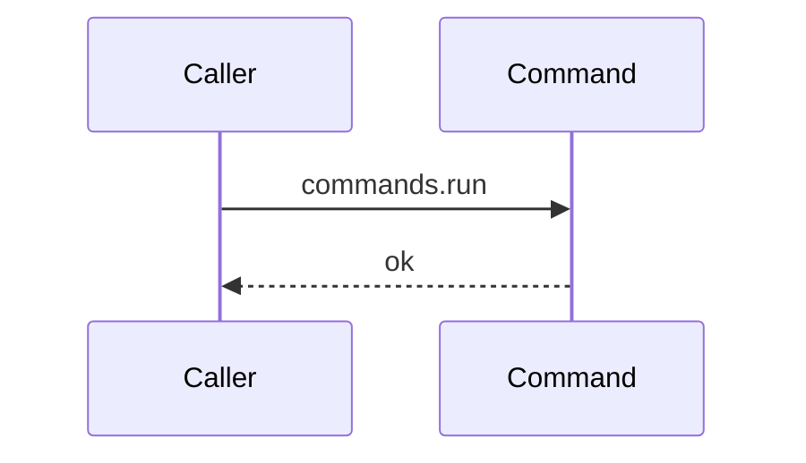

No seam calls happen. The zero-command path has a different seam set from `run-commands-success-one`
and is drawn separately. This is not a shorter list; it is a different path.

### `run-commands-refusal-command-failed`

Fixture: `run-commands-success-one`, but `npm test` exits non-zero.

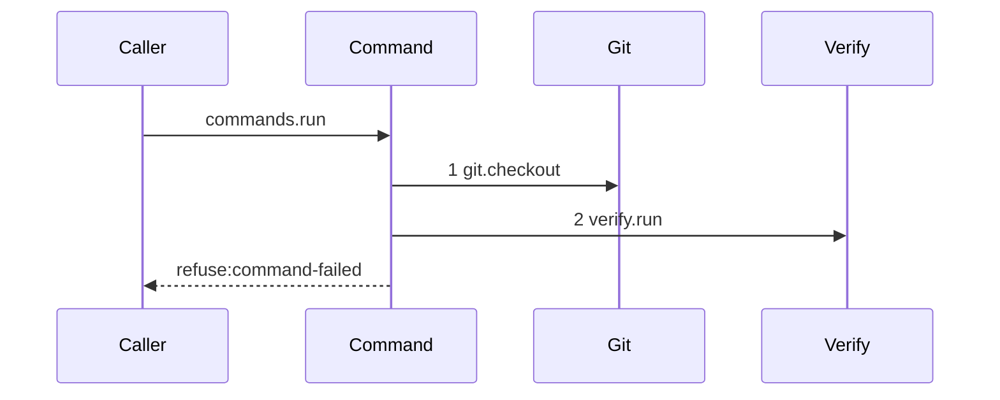

Steps 1 and 2 are context from `run-commands-success-one`. A non-zero exit refuses and names the
command index and the command string. Verify can project the command string as a label if the harness
supports it; story 7 decides whether to add that projection. The drawn set for a single failing
command is this path; the second-command failure case has the same tokens and is not drawn.

### `report-refusal-command-failed`

Fixture: `report-refusal-path-undeclared`, but all changed paths are declared. One declared command.
The command exits non-zero.

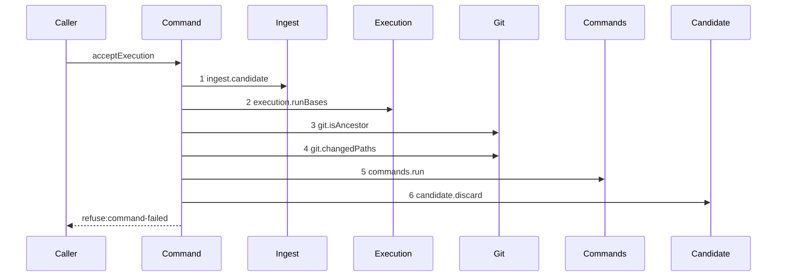

Steps 1 to 4 are context. Step 5 calls the command runner nested unit, which takes the
`run-commands-refusal-command-failed` path. Step 6 deletes the candidate ref.

### `land-begin`

Fixture: an active run `R` for task `T` with `run_base` oid `A` in repository `Repo`. Candidate
ref resolves to oid `B`.

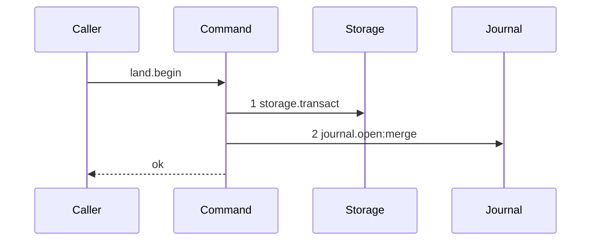

One transaction inserts the `open` `merge` journal row and commits. The caller then performs the git
compare-and-swap, which is not in a transaction.

### `land-settle-accepted`

Fixture: `land-begin` completed. The compare-and-swap at `refs/heads/main` succeeded: `expected` =
`A`, `next` = `B`.


One transaction writes the checkpoint, advances `workspace_branch.head_oid`, records the node transition
and the event, and completes the journal row. A failure injected after step 2 leaves the head, the
node state and the event count unchanged, assertable by reading the row at both points.

### `land-execution-success`

Fixture: `land-begin` fixture.

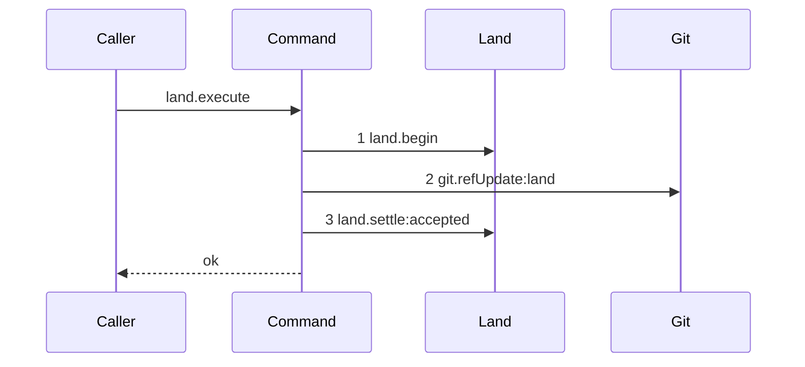

The composed success land: step 1 opens the journal row, step 2 is the compare-and-swap (the swap
succeeds: `updated = true`), step 3 writes the database effects. The git write sits between the two
transactions, in no transaction.

### `land-settle-contended`

Fixture: `land-begin` completed. The compare-and-swap failed: `updated = false`.

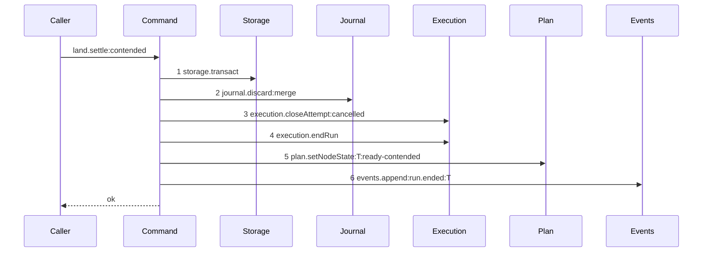

One transaction discards the journal row, cancels the attempt, ends the run, returns the node to
`ready` and appends the event. The attempt counter is unchanged, the accepted ref is unchanged, and
the fence rises by exactly one. The settle always completes; the contended outcome is expressed in
the outer diagram's terminal.

### `land-execution-contended`

Fixture: `land-begin` fixture, but the compare-and-swap will fail.

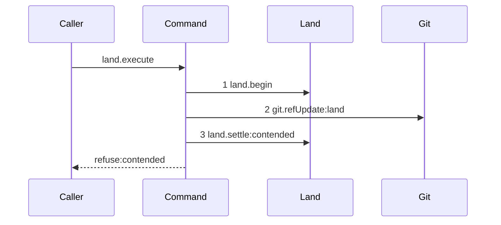

Steps 1 and 2 are context from `land-execution-success`. Step 3 calls the contended settle nested
unit. The outer terminal is `refuse:contended`.

### `report-refusal-contended`

Fixture: `report-refusal-command-failed`, but the command exits zero. The compare-and-swap fails.

```mermaid
sequenceDiagram
    participant Caller
    participant Command
    participant Ingest
    participant Execution
    participant Git
    participant Commands
    participant Land
    participant Candidate
    Caller->>Command: acceptExecution
    Command->>Ingest: 1 ingest.candidate
    Command->>Execution: 2 execution.runBases
    Command->>Git: 3 git.isAncestor
    Command->>Git: 4 git.changedPaths
    Command->>Commands: 5 commands.run
    Command->>Land: 6 land.begin
    Command->>Git: 7 git.refUpdate:land
    Command->>Land: 8 land.settle:contended
    Command->>Candidate: 9 candidate.discard
    Command-->>Caller: refuse:contended
```

Steps 1 to 5 are context from prior refusal diagrams. Steps 6 to 8 are the land: story 8 introduced
these tokens in `land-execution-success` and `land-execution-contended`; story 9 declares no journal
or swap tokens. Step 9 deletes the candidate ref.

### `report-execution-checkpoint`

Fixture: `report-refusal-command-failed`, but the command exits zero and the compare-and-swap
succeeds.

```mermaid
sequenceDiagram
    participant Caller
    participant Command
    participant Ingest
    participant Execution
    participant Git
    participant Commands
    participant Land
    participant Candidate
    Caller->>Command: acceptExecution
    Command->>Ingest: 1 ingest.candidate
    Command->>Execution: 2 execution.runBases
    Command->>Git: 3 git.isAncestor
    Command->>Git: 4 git.changedPaths
    Command->>Commands: 5 commands.run
    Command->>Land: 6 land.begin
    Command->>Git: 7 git.refUpdate:land
    Command->>Land: 8 land.settle:accepted
    Command->>Candidate: 9 candidate.discard
    Command-->>Caller: ok
```

Steps 1 to 7 are context from prior diagrams. Step 8 calls `land.settle:accepted`; step 9 deletes
the candidate ref. The scenario for this diagram drives `acceptExecution` directly, not the
`node.report` route. All tokens were introduced in earlier stories; story 11 declares no new seam.

## Stories

1. **Migration 13.** Add `src/services/storage/migration-0013-checkpoint.ts` at version `13`, with its statements in this order: `CREATE UNIQUE INDEX attempt_id_run_id ON attempt (id, run_id)`; create `workspace_branch` with its three columns, both oids `NOT NULL`; create `checkpoint` with the enumerated columns, CHECK clauses and the composite attempt foreign key, with `caller` and `subject` nullable; add the two `workspace_branch` triggers; add `cut` to the `git_operation.intent` CHECK. Register it at `src/services/storage/migrations.ts:13`. Add its test asserting an insert per kind, asserting each cross-kind column combination is refused, asserting the composite attempt foreign key refuses an attempt of another run, asserting a checkpoint insert **succeeds** at all — the control that catches a missing index, because the failure is `foreign key mismatch` at the first insert and never at `CREATE TABLE` — asserting the `origin_oid` update trigger, asserting the `workspace_branch` delete trigger refuses while a checkpoint names it, and asserting the shipped `workspace` table is byte-identical before and after.

2. **The checkpoint row.** Add `src/domain/checkpoint.ts` with `checkpointRow` and one refine per CHECK. Add `src/domain/checkpoint.test.ts` with a case per refine.

3. **The workspace branch record.** Add `workspaceBranchRow` to `src/domain/workspace.ts` with `nodeId`, `originOid` and `headOid`, none nullable. Register `workspace_branch: workspaceBranchRow` in `src/domain/rows.ts`, which is what `src/services/storage/schema-parity.test.ts:90` then covers. Add `plan.readWorkspaceBranch`, `plan.writeWorkspaceBranch` and `plan.setWorkspaceBranchHead` to the plan store and assert a round trip. **`workspaceRow` at `src/domain/workspace.ts:7` is not changed**, and neither is the shipped `workspace` table. Add cases asserting the derived `ref` equals `refs/heads/<nodeId>` and that the repository id joins from `node`.

4. **The claim cuts the branch on the first execution claim.**

   Diagrams: claim-success-task, claim-cut-begin, claim-cut-settle, claim-first-execution
   Seams: +plan.readWorkspaceBranch, +claim.begin, +git.resolveRef:branch, +git.refUpdate:cut, +claim.settle, +journal.open:cut, +plan.writeWorkspaceBranch, +journal.complete:cut

   The first execution claim on an objective cuts `refs/heads/<objectiveId>` from `repository.branch` as a journaled write. `claim.begin` resolves the branch tip before it opens its transaction, reads the state the claim needs, finds no branch record, and opens the `cut` journal row. The git write creates the ref. `claim.settle` writes the branch record and every claim effect, and completes the row. **There is no readiness command and no `workspace.cut` command**: `AGENTS.md:105` gives a journaled write two transactions and no other command two, so a nested cut with its own pair plus the claim's own transaction would be three. Startup reconciles an `open` `cut` row left by a crash between the two.

   Extend `src/commands/node/claim-node.ts` to call `plan.readWorkspaceBranch` inside the claim transaction and pass its `head_oid` as the run's base oid, so `run_base` is inserted atomically with the run. An execution claim on a node with no branch record is an invariant violation; the claim does not guard it. The read is conditional on `runKindFor(node.deliverable) === "execution"` and takes `objectiveScopeId(node)` from `src/commands/node/claim-node.ts:201`. **This story does not touch `review-head-unavailable` and writes no `judged_oid`.** EPIC 053 owns the review claim: `.agents/plan/epics/053-the-review-checkpoint-and-state-ownership.md:25-27` selects the judged artifact from a caller-named checkpoint through `depends_on`, and copies `judged_oid` from that row at report time. A workspace head read at claim time is a bare oid that moves, so it cannot serve. Add a case asserting a review claim still refuses `review-head-unavailable`, and a case asserting a structural claim makes no branch read.

   Add cases to `src/commands/node/claim-node.test.ts` asserting the run's base oid equals the branch record's `head_oid`; asserting a first claim creates the ref in the loopback repository; asserting `origin_oid` equals the resolved branch oid and `head_oid` equals `origin_oid` at creation; asserting the journal row is `open` before the git write and `complete` after; asserting a second claim on the same objective finds the record, cuts no ref, opens one transaction and writes no journal row; and asserting two concurrent first claims produce one branch record and one ref at the resolved tip, with the loser writing nothing.

5. **Candidate delivery and ingestion.**

   Diagrams: report-refusal-candidate-unreachable, ingest-candidate-missing-ref, ingest-candidate-unreachable, discard-candidate
   Seams: +ingest.candidate, +git.resolveRef:candidate, +git.isAncestor, +candidate.discard, +git.deleteRef:candidate

   Add `src/commands/checkpoint/ingest-candidate.ts` resolving `refs/kanthord/candidate/<runId>/<attemptNo>` and asserting the reported oid is reachable from the ref tip. A missing ref refuses `candidate-unreachable` immediately. An existing ref that does not reach the reported oid deletes the ref and refuses `candidate-unreachable`. Reachability is `git.isAncestor({ ancestorOid: reportedOid, descendantOid: refTip })`; equality is reachable. Expose `candidate.discard` as a separate injected function that calls `git.deleteRef:candidate`, so every outer diagram draws the deletion as one step. Add `src/commands/checkpoint/ingest-candidate.test.ts` against the loopback fixture asserting a reachable oid passes, an unreachable oid refuses and deletes the ref, and a missing ref refuses without deleting anything.

6. **Ancestry, repository cardinality and the declared-path check.**

   Diagrams: report-refusal-multi-repository, report-refusal-ancestry-broken, report-refusal-path-undeclared
   Seams: +execution.runBases, +git.isAncestor, +git.changedPaths

   Add `src/domain/execution-acceptance.ts` with `ancestryVerdict`, `repositoryVerdict` and `declaredPathVerdict`, each pure. `repositoryVerdict(runBases, reportedRepositoryId)` refuses when the reported repository is not the sole base entry. Tighten the `runRow` refine at `src/domain/run.ts:34-45` to exactly one base row for `execution`, and add its case to `src/domain/run.test.ts`. Add the two git reads that feed them to `src/commands/checkpoint/accept-execution.ts`: an ancestry query of the candidate from the recorded base (`git.isAncestor`), and a name-only diff of the recorded base against the candidate that produces `changedPaths`. The pure functions read no git. Add `src/domain/execution-acceptance.test.ts` asserting: a descendant head passes and a non-descendant refuses `ancestry-broken`; a reported repository that is not the sole base entry refuses `multi-repository-unsupported`, and one that matches it passes; a diff inside the declared set passes; two undeclared paths refuse and the refusal lists both, sorted; a directory prefix does not match a file beneath it; a rename with only the new path declared refuses; an empty declared set with a non-empty diff refuses; an empty declared set with an empty diff passes.

7. **The command gate.**

   Diagrams: run-commands-success-one, run-commands-success-none, run-commands-refusal-command-failed, report-refusal-command-failed
   Seams: +git.checkout, +verify.run, +commands.run

   Add `src/commands/checkpoint/run-declared-commands.ts` as the `commands.run` nested unit, injected into `AcceptExecutionDependencies`. It checks the pinned commit out to a fresh `mktemp` directory per command through `git.checkout`, calls `verify.run` with `command: ["/bin/sh", "-c", declared]`, `cwd` of that directory and `timeoutMs` of `DEFAULT_TIMEOUT_MS`, and removes the directory. An empty command list returns immediately with no seam call (`run-commands-success-none`). A non-zero exit refuses `command-failed`. Add its test asserting the run order matches the declared list, asserting each command receives a different directory, asserting a command that writes a file cannot affect the next command, asserting a non-zero exit refuses `command-failed` naming the index and the command string, asserting an empty list makes no verify call, and asserting every directory is removed on both paths. A list of two or more commands produces identical tokens; ordering and per-command isolation are asserted by the test, not drawn.

8. **The land.**

   Diagrams: land-begin, land-settle-accepted, land-execution-success
   Seams: +land.begin, +journal.open:merge, +land.settle:accepted, +git.refUpdate:land, +execution.writeCheckpoint, +plan.setWorkspaceBranchHead, +plan.setNodeState:T:done, +events.append:node.done:T, +journal.complete:merge

   Add `src/commands/checkpoint/land-execution.ts` as the `land.execute` outer command with its two injected nested units `land.begin` and `land.settle`. `land.begin` opens a `merge` journal row in one transaction. `land.settle:accepted` writes the checkpoint, advances `workspace_branch.head_oid`, records the node transition and the event, and completes the journal row in one transaction. The compare-and-swap (`git.refUpdate:land`) sits between the two nested units, in no transaction. Add tests for each nested unit and for the composed path asserting the three swap fields, asserting the journal row is `open` before the git write and `complete` after, asserting `workspace_branch.head_oid` equals the landed oid, asserting the checkpoint carries the five binding facts, and asserting a failure injected after `execution.writeCheckpoint` leaves the head, the node state and the event count unchanged.

9. **Contention.**

   Diagrams: land-settle-contended, land-execution-contended, report-refusal-contended
   Seams: +land.settle:contended, +journal.discard:merge, +execution.closeAttempt:cancelled, +execution.endRun, +plan.setNodeState:T:ready-contended, +events.append:run.ended:T

   Add `land.settle:contended` as the second settle nested unit of `land-execution.ts`. It discards the journal row, cancels the attempt, ends the run, returns the node to `ready` and appends the event, in one transaction. The candidate ref is deleted by `candidate.discard` in the outer `acceptExecution` command after the contended settle returns (step 9 of `report-refusal-contended`). `land-execution-contended` is the composed contended land at the land level; `report-refusal-contended` is the composed contended path at the `acceptExecution` level. Story 9 declares no journal-open or compare-and-swap tokens; those belong to `land.begin` and `git.refUpdate:land`, introduced by story 8. Add cases asserting the attempt counter is unchanged, asserting the accepted ref is unchanged, asserting the candidate ref is gone, asserting the fence rose by one, and asserting a new claim then opens a run whose `run_base` equals the new `workspace_branch.head_oid`.

10. **Startup reconciles an open journal row.** Extend `listOpen` at `src/services/git/journal.ts:58-60` and `OpenJournalRow` to project `run_id` and `node_id`, which the DDL already stores. Extend `ReconcileJournalDependencies` with `execution` and `plan`. For a `merge` row whose ref reached `proposed_head_oid`, derive `attempt_id` from the open attempt of the run and `fence` from `run.fence`, then apply the settle: write the checkpoint, advance `workspace_branch.head_oid`, record the node transition and the event, and complete the row. The shipped command applies no transition today, so this is the whole of it. Add cases asserting a moved ref completes the row and applies the transition, asserting an unmoved ref discards the row and leaves the node state unchanged, asserting the derived `attempt_id` is the attempt the crashed land opened, and asserting the derived `fence` equals the value the land recorded — the control being a run whose fence would have moved if the leases pass ran first.

11. **Accept execution end to end.** Add `src/commands/checkpoint/accept-execution.ts` composing stories 5 to 9 in the fixed order. Add its test asserting the ordered short-circuit across all six refusal codes, asserting a successful acceptance moves a task to `done`, and asserting a successful acceptance on an atomic objective moves it to `awaiting_approval` through `objectiveOutcome`.

    Diagrams: report-execution-checkpoint

12. **The report route enforces the gate.** Wire `acceptExecution` into `reportOutcome` as a nested callable running after the authority prelude, and leave the handler with its one injected command. Draw the `node.report` path with `Supersedes: EPIC 050.4 report-lease-free` and `+acceptExecution` on its `Seams:` line. Map each refusal to its contract error in `src/http/server/`. Extend the `node.report` schemas in `src/http/contract/outcome.ts` with the reported head and its repository, and add the six refusal codes to `src/http/contract/errors.ts`. Add an integration case per refusal driving the real route, and a case asserting a report with a stale fence is refused before any git read.

13. **The attempt workspace is discarded.** Add the disposal to the failure path and assert the directory is absent on disk after a rejected attempt, and that `workspace_branch.head_oid` is unchanged.

14. **The five git primitives.** `story-foundation`. Extend the `Git` interface at `src/services/git/index.ts` and add one implementation file each, matching the conventions of `ref-read.ts`, `ref-update.ts` and `worktree.ts`: `isAncestor` in `is-ancestor.ts` over `git merge-base --is-ancestor`, exit `0` true, exit `1` false, any other exit throws; `changedPaths` in `changed-paths.ts` over `git diff --name-status`, emitting both paths of an `R` or `C` status and one path otherwise, deduplicated; `checkout` in `checkout.ts` over `git worktree add --detach`; `deleteRef` in `delete-ref.ts` over `git update-ref -d`, unconditional and with no compare-and-swap; `listRefs` in `list-refs.ts` over `git for-each-ref --format=%(refname) --sort=refname`, returning full ref names and an empty array for a prefix with no ref. `deleteRef` is a separate method and not a widening of `RefUpdateInput.nextOid` to `string | null`: `update-ref -d` is a different invocation, and a null would force conditional argv construction inside `ref-update.ts`. Extend startup's `sweepHome` path with `git worktree prune --expire=now`, which is what clears a `worktrees/` entry a crash leaves in the bare home. Add one test per method against the loopback fixture. This is one story because five methods extend one interface, and five stories would spend half the epic's budget on primitives.

15. **The candidate namespace has a reaper.** Add `src/commands/checkpoint/sweep-candidates.ts` as the `candidate.sweep` command: it lists `refs/kanthord/candidate/`, reads the run state behind each ref in one transaction, and deletes every ref whose run is not `active`. Call it from `src/commands/startup/` and after each expiry pass. Add its test asserting a ref of an ended run is deleted, asserting a ref of an active run survives, asserting a ref naming no run at all is deleted, and asserting the sweep opens no transaction across a delete. This discharges the obligation `.agents/plan/stories/050.1-the-claim/02-the-expiry-pass.md:98-100` delegates here. It supersedes no EPIC 050.1 diagram, because `expireRuns` gains no seam call.

16. **The proposal records the execution checkpoint.** Add `docs/proposal/phase-2/checkpoints.md` stating the candidate ref contract, the checkpoint schema, the ordered acceptance gate, the three compare-and-swap fields, the contention lifecycle, the per-command immutable checkout, the exact-path rule, the empty-`paths` rule, the workspace head advance, the journal recovery rule, and the candidate sweep.

## Amendments this epic asks of other epics

None is applied here, and a human applies each before dispatch.

- **EPIC 053** — it gains a story that lifts EPIC 050.1's `review-head-unavailable` guard and pins the judged checkpoint at claim. This epic drops the lift, and EPIC 053 has no story touching `claim-node.ts`, `ClaimRefusal` or the refusal ordering today, so without that story a review claim stays refused forever. EPIC 053 must also rule whether the checkpoint is pinned at claim or named at report: naming it at report lets a reviewer choose among the accepted checkpoints of its `depends_on` set, which is the retrospective selection EPIC 050.1 pinned at claim to prevent. **The default if no ruling arrives: review claims stay refused**, which costs the product no shipped behaviour, because none exists.

- **EPIC 054** — its migration `15` fills `checkpoint.caller` and `checkpoint.subject` beside `attempt.caller` and `attempt.subject`, using the derivation from authenticated state that `:13` already owns. This epic writes both as null. **The default if no ruling arrives: the two columns stay null**, and the audit trail of a phase-2 checkpoint names the run, the attempt and the fence but not the principal.

- **EPIC 057** — migration `17` tightens `checkpoint.caller` and `checkpoint.subject` to `NOT NULL` beside the attempt pair it already tightens at `:63`, and it re-creates `CREATE UNIQUE INDEX attempt_id_run_id ON attempt (id, run_id)` after its `attempt` rebuild. A rebuild drops a standalone index, and `src/services/storage/migration-0007-external-execution.test.ts:1104` is the precedent for asserting one survives.

- **EPIC 050.5** — its gate rows 5b and 10b seed two `run_base` rows for one run. Those rows are query-isolation tests and not a claim that two bases are a valid product state; this epic tightens the refine to exactly one, so both rows need restating before the refine lands.

## Verification Gate

Gates: `pnpm run verify`

Proof:

```bash
node --test \
  src/domain/checkpoint.test.ts \
  src/domain/workspace.test.ts \
  src/domain/execution-acceptance.test.ts \
  src/services/storage/migration-0013-checkpoint.test.ts \
  src/commands/node/claim-node.test.ts \
  src/commands/checkpoint/ingest-candidate.test.ts \
  src/commands/checkpoint/run-declared-commands.test.ts \
  src/commands/checkpoint/land-execution.test.ts \
  src/commands/checkpoint/accept-execution.test.ts \
  src/commands/checkpoint/sweep-candidates.test.ts \
  src/services/git/is-ancestor.test.ts \
  src/services/git/changed-paths.test.ts \
  src/services/git/checkout.test.ts \
  src/services/git/delete-ref.test.ts \
  src/services/git/list-refs.test.ts \
  src/commands/startup/recover-journal.test.ts \
  src/http/server/outcome/report-outcome.test.ts \
  test/sequence/conformance.test.ts \
  && echo "PASS EPIC-051"
```

Hermetic coverage required beyond the Proof:

- A reported oid that the candidate ref does not reach refuses `candidate-unreachable`, and no git read of the objective branch happens.
- The candidate ref is deleted on acceptance, on rejection and on contention. Three cases, each asserting the ref is absent. EPIC 054 covers the operator handoff.
- The candidate sweep deletes the ref of an ended run, and leaves the ref of an active run. Two cases against the loopback fixture. The second is the control: without it the assertion passes for a sweep that deletes everything.
- The candidate sweep deletes a ref whose run id matches no `run` row. An orphan from a worker that pushed and never reported is the case the expiry path cannot see.
- An expired run leaves no candidate ref behind. The case opens a run, pushes a candidate ref, expires the run, runs the sweep, and asserts the ref is absent. This is the fourth deletion `.agents/plan/stories/050.1-the-claim/02-the-expiry-pass.md:98-100` delegates here, and no prior epic asserts it.
- `expireRuns` calls no git method. Asserted by a git service double whose call count is zero across an expiry pass. The sweep runs after the pass commits, never inside it.
- `git.listRefs` returns full ref names under a prefix in bytewise order, and it returns an empty array for a prefix with no ref. Both asserted by value. The order comes from `--sort=refname` and not from the filesystem.
- A `checkpoint` row inserts successfully against a real migrated database. This is the control for the `attempt (id, run_id)` unique index: without the index `CREATE TABLE` still succeeds and this insert fails with `foreign key mismatch`, so a schema-only assertion would pass over the defect.
- The shipped `workspace` table is unchanged by migration `13`: its column set, its null constraints and its row contents are asserted identical before and after. `docs/proposal/database/workspace.md` needs no amendment and this asserts it.
- `workspace_branch.origin_oid` and `head_oid` refuse a null insert. Both `NOT NULL` from migration `13`, so EPIC 057 tightens nothing and no later epic is named.
- For an internal run, `workspace_branch.origin_oid` equals `workspace.clone_base_oid` after the claim, and `head_oid` equals the oid the objective ref names after a land. Two cases. SQLite cannot constrain this across tables, so the assertion is the whole enforcement.
- `git.changedPaths` returns both sides of a rename, asserted against a real rename commit in the loopback fixture. The control is a plain modification, which returns one path.
- `git.isAncestor` returns true for an oid equal to its descendant, true for a real ancestor, and false for a sibling branch tip. Three cases, because equality is the case the reachability check depends on.
- Every checkout directory is a fresh worktree of the pinned commit, and the bare home holds no `worktrees/` entry after the run. The crash control asserts `git worktree prune --expire=now` clears an entry left behind.
- A ref the worker wrote outside `refs/kanthord/candidate/` changes no outcome. The case writes `refs/heads/<objectiveId>` directly, then reports, and asserts the daemon still lands by compare and swap from the recorded base. The assertion is that the daemon ignores the ref, not that the worker cannot write it.
- The changed-path set comes from a name-only diff of the recorded base against the candidate. The assertion drives the real git service against the loopback fixture, so `declaredPathVerdict` is never fed a hand-built list in the end-to-end case.
- The `origin_oid` trigger refuses an `UPDATE` that changes it, and the delete trigger refuses a `DELETE` while a checkpoint names the workspace. Both against real SQLite, by refusal message.
- Two concurrent first claims on one objective produce exactly one branch record and one ref, at the resolved branch tip, and the loser writes nothing. The sequential case is asserted separately and does not stand in for it. The ref is correct either way because both claims resolve the same tip; what the assertion pins is that only one record exists.
- A second claim on an objective that already holds a branch record opens one transaction and writes no journal row. The control is the first claim on the same fixture, which opens two and writes one.
- The `cut` journal row is `open` before the ref creation and `complete` after, asserted by reading the row at both points.
- Two undeclared paths refuse `path-undeclared` and the refusal lists both, sorted with `comparePaths`.
- A `verify.paths` entry naming a directory does not match a file beneath it, asserted by value.
- A rename with only the new path declared refuses. Both sides of a rename must be declared.
- An execution node whose `verify.paths` is empty refuses a non-empty diff and passes an empty one. Both are asserted.
- Each declared command runs in its own directory. The assertion records the working directory per call and asserts the set has no duplicate.
- A command that writes a file into its checkout cannot affect the next command. The second command asserts the file is absent.
- Every checkout directory is removed after the run, on the passing and the failing path.
- A non-zero exit refuses `command-failed` and names the command index and the command string verbatim.
- A command beginning with `! ` that exits zero is accepted, alongside a plain command in the same case, proving one rule applied to both.
- The compare and swap is asserted by its three fields: `ref` equals the objective branch, `expected` equals the run's `run_base` oid, `next` equals the pinned head.
- A report naming a repository that is not the run's sole base row refuses `multi-repository-unsupported`, and one naming the base repository passes. Two cases, over the real route. The control matters: without it the refusal passes for a report that names nothing.
- `runRow` refuses an execution run carrying two base rows and accepts exactly one. The refine is documentation, so this is a schema test and not a claim that production validates a live row.
- A `checkpoint` row inserts with `caller` and `subject` null. EPIC 054 fills them and EPIC 057 tightens them, so a `NOT NULL` assertion here would pin a state this epic cannot reach.
- `reportOutcome` receives `acceptExecution` as an injected callable, asserted by substituting a recording double. The handler's dependency record holds exactly one key, asserted by value: a second command on the handler is the defect this row exists to catch.
- A review claim still refuses `review-head-unavailable`, and a structural claim makes no branch read. Two cases, the second asserted by a plan store double whose branch-read count is zero.
- The claim's branch read takes the objective id for a task claim. Asserted by claiming a task under an objective and reading the row the objective owns.
- Startup completes a crashed `merge` row and writes the checkpoint it owed, with `attempt_id` equal to the attempt the land opened and `fence` equal to the value the land recorded. The control runs the leases pass first and asserts the derived fence would then differ, which is what pins the startup order.
- A successful land advances `workspace_branch.head_oid` to the landed oid, in the same transaction as the checkpoint. A failure injected after the checkpoint insert leaves the head, the node state and the event count unchanged.
- A contended land leaves the accepted ref unchanged, leaves the attempt counter unchanged, deletes the candidate ref, ends the run and raises the fence by exactly one. All five in one case.
- After a contention, a new claim opens a run whose `run_base` equals the new `workspace_branch.head_oid`.
- Startup completes an `open` `merge` row whose ref moved, and discards one whose ref did not. Two cases.
- The `node.report` route refuses a stale fence before any git read, asserted by a git service double whose call count is zero.
- Every one of the six refusal codes is reachable over the real route, one integration case each.
- The sequence conformance harness replays each of the twenty-two diagrams of this EPIC by equality, asserting the recorded trace equals the diagram token list, and the comparison fails when any step is removed from or reordered in the implementation. The harness test asserts this in `test/helpers/sequence-conformance.test.ts`.
- The conformance runner in `test/sequence/conformance.test.ts` runs every scenario file under `test/sequence/scenarios/` against its diagram, passing with the real dependency implementations over the loopback fixture, and failing with a mutation applied to each step in turn. All twenty-two diagrams are covered.
- The parser in `scripts/verify-epic-sequence.ts` (owned by EPIC 050) refuses this document if the `## Sequence` section is absent, if any diagram id repeats a live id from EPIC 050, if a `Supersedes` line names an id the target document does not declare, or if any `Seams:` token carries no sign. These refusals are asserted against fixture trees in `scripts/verify-epic-sequence.test.ts`.
- The `claim-success-task` supersession is complete: EPIC 050.1's diagram carries `Superseded by: EPIC 051 claim-success-task`, this document's diagram carries `Supersedes: EPIC 050.1 claim-success-task`, and no scenario file exists for the EPIC 050.1 diagram. The gate asserts this triple.
- `report-execution-checkpoint` draws the nested command `acceptExecution` at `:700`, so it supersedes no `node.report` diagram. EPIC 050.2's `report-authority-prelude` pins its tail to EPIC 050.4 `report-lease-free`. EPIC 050.4 Story 6 declares that id, so the note resolves outside this document. The successor of `report-lease-free` is the `node.report` diagram of story 12. The conversion declares that id and its `Supersedes` line, so this document declares neither yet.
- The two paths of `claim-cut-settle` (success) and the startup-recovery discard path are separated: startup reconciles an `open` `cut` row by comparing the ref to `proposed_head_oid`. The settle path and the discard path are tested by `src/commands/startup/recover-journal.test.ts`.
- The ordered short-circuit of `acceptExecution` is asserted across all six refusals by a decision table in `src/domain/execution-acceptance.test.ts`: each pair of conditions that can trigger simultaneously is asserted to report the earlier one.
