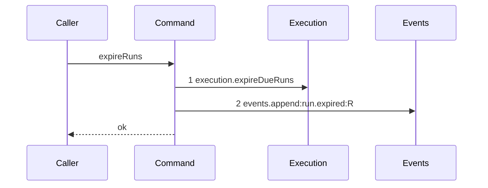

# Story 2 — The expiry pass

Epic: `.agents/plan/epics/050.1-the-claim.md`
Depends on: EPIC 050 Story 2 (`run.fence` and `run.expires_at` exist), EPIC 050 Story 8 (`execution.expireDueRuns`), Story 1 (the `run.expired` event type and its payload), Story 6 (the harness its scenario runs on). Implement Story 1's `src/domain/event-type.ts` and `src/http/contract/event-payload.ts` edits before this story, or the event append fails its schema.
Kind: story-implement

Diagrams: expiry-pass-one-due

Seams: expiry-pass-one-due: +execution.expireDueRuns, +events.append:run.expired

This story writes new code, so it draws one diagram and no baseline.

## The ship path

### `expiry-pass-one-due`

Fixture: one run whose `expires_at` is `now`, called with the caller's transaction, so the pass opens
none.



A second pass over the same run appends no event, which the conditional update guarantees. That is
asserted by case 2 of the Verify section rather than by a second diagram, because a diagram of a
trace with one step proves nothing the first diagram does not already pin.

Add `test/sequence/scenarios/expiry-pass-one-due.ts`.

## Change

**Create `src/commands/run/expire-runs.ts`** (greenfield). `src/commands/run/` does not exist; create the directory.

```ts
export type ExpireRunsDependencies = Readonly<{
  events: EventLog;
  instanceId: string;
}>;

export type ExpireRunsInput = Readonly<{ now: number }>;

export type ExpiredRun = Readonly<{
  runId: string;
  nodeId: string;
  fence: number;
}>;

export function expireRuns(
  dependencies: ExpireRunsDependencies,
  transaction: Transaction,
  input: ExpireRunsInput,
): readonly ExpiredRun[];
```

The signature takes the caller's `transaction` as its second parameter, matching `sweepExpiredExternalLeases` at `src/commands/startup/recover-expired-leases.ts`, which `claim-node.ts:107-110` already calls the same way. `expireRuns` opens no transaction of its own; the claim of Story 3 and the three commands of EPIC 050.2 each open one.

**Body, in this order:**

1. One conditional update, returning the affected rows:

```sql
UPDATE run SET state = 'ended', fence = fence + 1, ended_at = ?, outcome = 'expired'
 WHERE state = 'active' AND expires_at <= ?
RETURNING id, node_id, fence
```

Bind `input.now` twice. The `state = 'active'` predicate in the `WHERE` is what makes the raise idempotent: two racing sweeps cannot both affect the same row, because the second sees `state = 'ended'`. `<=` makes the boundary instant expired, matching EPIC 050 Story 5.

`RETURNING fence` yields the **raised** value, because SQLite's `RETURNING` on an `UPDATE` reports the new row.

2. Sort the returned rows by `id`, bytewise via `Buffer.compare`, so the event order is reproducible.

3. For each row in that order, append one event through `dependencies.events.append(transaction, ...)`:

```ts
{
  subjectKind: "run",
  subjectId: row.id,
  type: "run.expired",
  actorKind: "daemon",
  actorId: dependencies.instanceId,
  payload: { runId: row.id, nodeId: row.node_id, fence: row.fence, expiredAt: input.now },
}
```

The update and every append sit in the caller's one transaction, so a failure at any append rolls the whole pass back and the run stays `active` with its original fence.

4. Return the rows as `ExpiredRun[]` in the same sorted order.

**Do not delete a candidate ref here.** The ref namespace `refs/kanthord/candidate/<runId>/<attemptNo>` is introduced by EPIC 051.1, nothing in EPIC 050 or EPIC 050.1 creates one, and `services/git` carries no ref-delete primitive — `RefUpdateInput.nextOid` at `src/services/git/index.ts:51` is a non-null `string`. EPIC 051.1 Story 4 owns the deletion and Story 5 owns the startup sweep; that sweep is the fourth caller, and it runs after this pass commits. This story ends runs and raises the fence.

**Do not change `node.assignment`, `node.state`, the `lease` table, or any `attempt` row.** An ordinary failure never changes the assignment, attempt classification is EPIC 054, and the node-lease mechanism runs beside this one until EPIC 050.4.

## Constraints

- `expireRuns` runs inside the caller's transaction. It never calls `storage.transact`.
- `outcome = 'expired'` is the only outcome this story writes. `run.outcome` carries no CHECK (`src/services/storage/migration-0007-external-execution.ts:25`), so the value is free; pin it to `'expired'`.
- The fence rises by exactly one per run, once. Do not write a second `UPDATE`.
- Do not read the clock. `now` is an input, and the caller reads `dependencies.clock.now()` once as the first statement inside its transaction, per `src/commands/node/claim-node.ts:105`.
- `actorKind: "daemon"` and `actorId: dependencies.instanceId`, matching the ancestor `node.running` appends at `src/commands/node/claim-node.ts:319-333`.

## Verify

```
node --test src/commands/run/expire-runs.test.ts test/sequence/conformance.test.ts
```

Create `src/commands/run/expire-runs.test.ts`. Suite name `"src/commands/run/expire-runs.test"`. Mirror `src/commands/node/claim-node.test.ts` for the fixture: `createMigratedStorage()` and `databaseBytes` from `test/helpers/database.ts`, `SqliteEventLog` with `createMockIdGenerator`, `seedRegistry` and `seedGraph` from `test/helpers/rows.ts`, `seedRunRow` at `test/helpers/rows.ts:658` for run rows, and `t.after(() => fixture.dispose())`. `const NOW = 1700000000000;` and `const INSTANCE = "daemon_instance_a";`.

Seed run rows through `seedRunRow` extended with the new columns, or by direct `t.run("INSERT INTO run ...")` inside `storage.transact`.

Assert, each as a separate `it`:

1. `"the fence rises by exactly one"` — seed one active run with `fence: 3` and `expires_at: NOW - 1`. Call `expireRuns` inside a `storage.transact`. Read the row and assert `fence === 4`, `state === "ended"`, `outcome === "expired"`, `ended_at === NOW`.

2. `"a second call raises nothing and appends nothing"` — after case 1, call `expireRuns` again in a second transaction with the same `now`. Assert the returned array is empty, assert `fence` is still `4`, and assert the count of `run.expired` events is still `1`. Both halves are asserted, per the EPIC's gate.

3. `"a run whose expires_at is exactly now is expired"` — `expires_at: NOW`. Assert the run ends and the fence rises.

4. `"a run whose expires_at is one millisecond after now is untouched"` — `expires_at: NOW + 1`. Assert the returned array is empty, `state === "active"` and `fence` is unchanged. Cases 3 and 4 pin the boundary from both sides.

5. `"an already ended run is untouched"` — seed `state: "ended"`, `fence: 5`, `expires_at: NOW - 1000`. Assert the returned array is empty and `fence` is still `5`.

6. `"one run.expired event is appended per expired run, carrying the raised fence"` — seed one run with `fence: 3`. After the pass, read the event log and assert exactly one `run.expired` event whose payload deep-equals `{ runId: "<id>", nodeId: "<node id>", fence: 4, expiredAt: NOW }`. The fence in the payload is the raised value, not the stale one.

7. `"two expired runs produce events in bytewise run id order"` — seed active runs `run_b` and `run_a`, both expired. Assert the returned array's `runId` values deep-equal `["run_a", "run_b"]` and the two `run.expired` events appear in that order.

8. `"a failure injected at the event append leaves the run active and the fence unchanged"` — build an `EventLog` whose `append` throws on the first call. Wrap the `storage.transact` in `assert.throws`. Then read the run row in a fresh transaction and assert `state === "active"` and `fence === 3`. Also assert `databaseBytes(storage)` deep-equals the snapshot taken before the call. This proves the transition and the event are one transaction.

9. `"expireRuns writes no node row"` — snapshot `SELECT id, state, assignment FROM node ORDER BY id` before and after a successful pass and assert deep equality. The assignment is unchanged after an expiry, which Story 3 asserts again at the command level.

10. `"expireRuns writes no lease row"` — snapshot `SELECT * FROM lease ORDER BY subject_kind, subject_id` before and after and assert deep equality.

`pnpm run verify` exits 0.

Proof: PASS line delivered — `src/commands/run/expire-runs.test.ts` in `PASS EPIC-050.1`.
