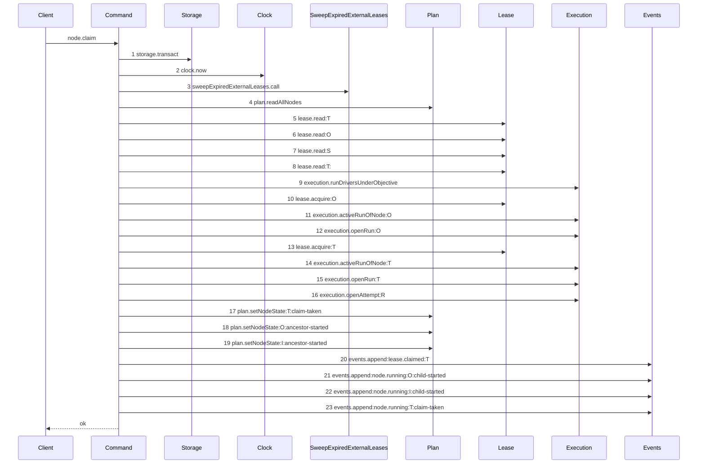
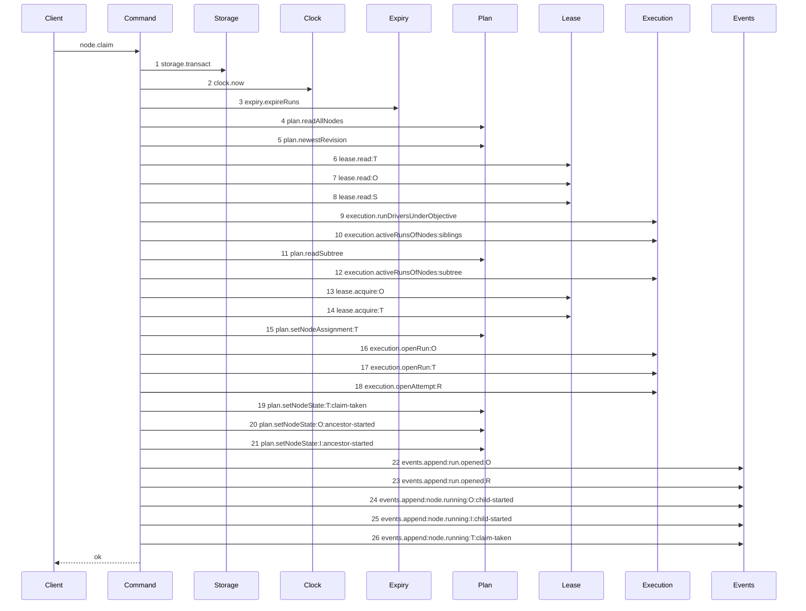

# Story 3 — The claim of a task

Epic: `.agents/plan/epics/050.1-the-claim.md`
Depends on: EPIC 050 Story 1 (`runKindFor`), EPIC 050 Story 2 (the run columns and `run_base`), EPIC 050 Story 3 (`runRow`), EPIC 050 Story 4 (`StoredNode.assignment`), EPIC 050 Story 5 (`subtreeExclusion`), EPIC 050 Story 7 (the budgets), EPIC 050 Story 8 (`plan.setNodeAssignment`, `execution.activeRunsOfNodes`), Story 2 (`expireRuns`), Story 1 (`available` on the request), Story 6 (the harness its scenario runs on), EPIC 047 (`StoredNode.deliverable`, `nodePairLegality`), EPIC 048 (`routeWorker`, `workerRegistry`).
Kind: story-implement

Diagrams: claim-success-task

Baselines: claim-success-task <- baseline-claim-task

Seams: claim-success-task: +expiry.expireRuns, +plan.newestRevision, +plan.readSubtree, +execution.activeRunsOfNodes, +plan.setNodeAssignment, +events.append:run.opened, ~lease.read, ~execution.openRun, -sweepExpiredExternalLeases.call, -execution.activeRunOfNode, -events.append:lease.claimed, -execution.adoptRun @src/commands/node/claim-node.ts:479

This story owns the command rewrite. Story 4 owns the initiative path and Story 5 owns the
`objective-busy` refusal; both extend the command this story leaves.

## The shipped path

### `baseline-claim-task`

Superseded by: EPIC 050.1 claim-success-task

Shipped path: `src/commands/node/claim-node.ts:100-359`. Fixture: initiative `I` holds objective `O`,
which holds tasks `T` and `S`. Every node is `ready`, no node is assigned, and no run is active. The
target is `T`.



Citations, one per step: `:104`, `:105`, `:107`, `:112`, `:157` through `:604` for steps 5 to 7 in
the order `relativesOf` returns, `:179`, `:204`, `:218`, `:459`, `:464`, `:243`, `:459`, `:464`,
`:262`, `:279`, `:289` twice, `:300`, `:319` twice, `:334`.

Steps 10 to 16 are mutations, and the `illegal-transition` check sits at `:269`, after all seven.
That is the ordering defect this story fixes, drawn rather than described. Step 8 repeats the token
of step 5, and step 3 names a function-valued dependency, so this path cannot be drawn as a live
diagram. Deleting the replay path and taking the `expiry` capability key removes both causes.

### `claim-success-task`

Supersedes: EPIC 050.1 baseline-claim-task
Superseded by: EPIC 050.4 claim-lease-free-task

Fixture: the fixture of `baseline-claim-task`. `T` declares `deliverable: implementation`, so the run
kind is `execution` and the cascade covers `O` and `I`.



Steps 2 to 12 are reads, and step 13 is the first mutation, so every refusal is evaluated before it.
Steps 6 to 8 are the relative lease reads of `liveLeaseRefusal`, one per relative, in the order
`relativesOf` returns. Step 11 follows step 10 because the subtree read serves `subtree-busy`, which
the refusal order places after `objective-busy`, and a read no refusal needs is not taken. Steps 15
to 18 are the assignment, the objective run, the task run and the attempt, in the one transaction
the epic requires. Steps 20 and 21 are the cascade, unrolled, so the cascade order is part of the
contract.

Add `test/sequence/scenarios/claim-success-task.ts`.

## Change

**`src/commands/node/claim-node.ts` — rewrite the command as one path.** The whole change sits inside
the one `storage.transact` block opened at `src/commands/node/claim-node.ts:104`. Two operations
would let a crash leave an assignment with no run, and the next claim would then read an assignment
nobody holds.

### One path, and three deletions

`node.deliverable` is `NOT NULL` after migration `12`, so there is no legacy node and no branch.

**Delete `openOrAdoptRun` at `src/commands/node/claim-node.ts:449` and its call site at `:459-483`.**
A task claim opens a structural objective run when none is active, then opens its execution task run.
Later task claims under the same objective reuse that active objective run and open their own task run.
The objective run carries the authority for objective attestation and closure.

**Delete the own-lease replay path at `src/commands/node/claim-node.ts:179-199` and `replayResult` at
`:362-418`.** That block holds the second `lease.read` of the target, which no diagram can draw. A
second claim by the same worker on a node with an active run is `subtree-busy` with
`relation: "self"`. Retrying a lost response is the transport's job: `node.claim` declares
`idempotency: "memory"` and `replayable: [200]`, asserted at
`src/http/contract/registry.test.ts:839-850`.

**Delete `run-driver-mismatch` at `:472-478`** from the code and from `ClaimRefusal`. It lives only
inside run adoption. Story 4 deletes `initiative-not-claimable`.

**Replace the `sweepExpiredExternalLeases` function dependency with the `expiry` capability key.**
`ClaimNodeDependencies` at `:58-61` takes a bare function, which holds no `<key>.<method>` token and
cannot be drawn. Take `expiry: Expiry` instead, with `expireRuns(transaction, { now })`, and bind the
real `expireRuns` of Story 2 in `main.ts`.

**Move every refusal ahead of the first mutation.** The shipped command fires `illegal-transition` at
`:269-275`, after the leases, the run and the attempt are taken. Reorder so that no lease is
acquired, no run is opened, no attempt is opened, no node state changes and no event is appended
until every refusal has been evaluated.

### The refusal union and its total order

Replace `ClaimRefusal` at `src/commands/node/claim-node.ts:27-35`. Keep every shipped code except the
two deleted ones, and add `pair-illegal`, `assignment-held`, `unroutable`,
`review-head-unavailable`, `objective-busy` and `subtree-busy`.

The evaluation order is:

1. `node-not-found`
2. `pair-illegal`
3. `plan-incomplete`
4. `assignment-held`
5. `unroutable`
6. `review-head-unavailable`
7. `lease-held`
8. `drive-mode-pinned`
9. `objective-busy`
10. `subtree-busy`
11. `illegal-transition`
12. `ancestor-not-startable`

`lease-held` and `drive-mode-pinned` keep their shipped meaning. EPIC 050.4 removes the first when it
removes the node lease. **Every one of the twelve is evaluated before the first mutation.**

The completeness check at step 3 exempts a node whose `deliverable` is `expansion`, per `worker.md`
section 7: that node holds no child yet, because producing its children is the work. The exemption
covers that node's own missing children and nothing else.

Details per new refusal, asserted exactly by the tests:

| code                      | details                                                                                                              |
| ------------------------- | -------------------------------------------------------------------------------------------------------------------- |
| `pair-illegal`            | `{ kind, deliverable }`                                                                                              |
| `assignment-held`         | `{ assignment, claimant, maySwitch: true }`                                                                          |
| `unroutable`              | `{ failedSet }` where `failedSet` is `"capable" \| "authorized" \| "available"`                                      |
| `review-head-unavailable` | `{ nodeId, runKind: "review" }`                                                                                      |
| `subtree-busy`            | the `SubtreeExclusionRefusal` of EPIC 050 Story 5, minus its `refusal` key: `{ relation, nodeId, runId, expiresAt }` |

`objective-busy` and its details belong to Story 5. `maySwitch: true` is the offer the epic states —
a human may switch the assignment — and it is a constant, not a computed permission.

### The input and the caller record

Extend `ClaimNodeInput` at `src/commands/node/claim-node.ts:67-71` with one field:

```ts
available: boolean;
```

The daemon never probes a worker. A worker self-checks before it claims and the caller asserts the
result. A caller that asserts `true` when it is not available is trusted.

Extend `ClaimNodeDependencies` at `src/commands/node/claim-node.ts:50-65` with the server-owned
caller record:

```ts
caller: Readonly<{ worker: string; authorized: readonly string[] }>;
```

`main.ts` binds `{ worker: "claude@1", authorized: ["claude@1"] }`. **The claiming worker is
`dependencies.caller.worker`.** It is never derived from `input.actorId`, which is an `actor_<ULID>`
authentication identity carrying no worker semantics, and it is never read from the request body.
EPIC 055 replaces the fixed record with `{ worker: grant.worker, authorized: [grant.worker] }` and
changes no schema.

### The ordered body

Insert into the transaction at `src/commands/node/claim-node.ts:104`, in this order:

**1 — the expiry pass.** Immediately after `const now = dependencies.clock.now();` at line 105, call
`dependencies.expiry.expireRuns(transaction, { now })`. The pass runs first so an expired run cannot
block a claim, and so an expired run cannot renew itself back to life through a later operation.

**2 — the node read and `node-not-found`.** Unchanged, at `src/commands/node/claim-node.ts:112-116`.

**3 — `pair-illegal`.** New. After the node read, call `nodePairLegality(node.kind, node.deliverable)`.
On `{ legal: false }`, throw `ClaimNodeError("pair-illegal", ..., { kind: node.kind, deliverable: node.deliverable })`.
`node.deliverable` is `NOT NULL`, so there is no null branch.

**4 — `plan-incomplete`.** Unchanged, at `:125-137`.

**5 — `assignment-held`.** New. If `node.assignment !== null` and
`node.assignment !== dependencies.caller.worker`, throw
`ClaimNodeError("assignment-held", ..., { assignment: node.assignment, claimant: dependencies.caller.worker, maySwitch: true })`.

**6 — `unroutable`.** New. Only when `node.assignment === null`.

First intersect, then route. EPIC 048's `routeWorker` **throws** `authorized-not-capable` when
`authorized` holds a worker outside the capable set, and `available-not-authorized` likewise, and it
checks those before it returns any refusal. Passing the caller record's `authorized` unintersected
would therefore raise a `WorkerRoutingError` instead of producing the `unroutable` refusal this epic
wants:

```ts
const capable = capableWorkers(workerRegistry, {
  kind: node.kind,
  deliverable: node.deliverable,
});
const authorized = dependencies.caller.authorized.filter((id) =>
  capable.includes(id),
);
const available =
  input.available && authorized.includes(dependencies.caller.worker)
    ? [dependencies.caller.worker]
    : [];

routeWorker({
  registry: workerRegistry,
  kind: node.kind,
  deliverable: node.deliverable,
  authorized,
  available,
});
```

`capableWorkers` returns ids in registry declaration order, and `filter` preserves it, so the
intersection is deterministic. `input.available === false` yields `available: []` and therefore
`{ routed: false, failedSet: "available" }`, and this command throws
`ClaimNodeError("unroutable", ..., { failedSet })`. Take the routed worker, which `routeWorker`
returns as `result.worker`. When `node.assignment !== null`, skip `routeWorker` and take the assigned
worker: the assignment is the routing decision, already made.

**7 — `review-head-unavailable`.** New. When `runKindFor(node.deliverable) === "review"`, throw
`ClaimNodeError("review-head-unavailable", ..., { nodeId: node.id, runKind: "review" })`. This epic
creates no workspace record, so no objective workspace head exists to pin into `judged_oid`, and no
checkpoint mechanism exists that would make a review meaningful. Writing `judged_oid = NULL` and
filling it in EPIC 051 would record a commit chosen after the claim, which is the retrospective
choice the pin exists to prevent. Do not read some other branch or repository head instead.

**8 — `lease-held` and `drive-mode-pinned`.** Unchanged, at `:139-177` and `:203-216`. The relative
lease reads of `liveLeasesOf` stay, one per relative, and each now carries a distinct subject.

**9 — `objective-busy`.** Story 5 inserts it here.

**10 — `subtree-busy`.** New. Derive `subtreeIds` from `plan.readSubtree` for the target, and the
ancestors from the `nodes` array read at `:112` — the existing `ancestorChain` helper at
`src/commands/node/claim-node.ts:518` gives them. Read every active run over
`{target} ∪ ancestors ∪ descendants` through `execution.activeRunsOfNodes` of EPIC 050 Story 8. Call
`subtreeExclusion({ targetId, ancestorIds, descendantIds, runs, now })`. On a refusal, throw
`ClaimNodeError("subtree-busy", ..., <the refusal minus its refusal key>)`.

The exclusion sets are read inside the claim transaction. `services/storage` opens `BEGIN IMMEDIATE`
at `src/services/storage/connection.ts:35`, so two concurrent sibling claims serialise and the loser
sees the winner's run. Without that isolation each would read no active sibling run and each would
insert one.

**11 — the write.** After the shipped `illegal-transition` and cascade checks, and inside the same
transaction:

- `plan.setNodeAssignment(transaction, { id: node.id, assignment: <the routed worker id> })`. A node
  write happens in the plan store, which `no-restricted-syntax` enforces. Write it whether or not the
  node was already assigned; for an assigned node the value is unchanged, which keeps one write path.
- Compute `runKind = runKindFor(node.deliverable)`.
- Read `graphRevision = dependencies.plan.newestRevision(transaction, node.projectId)`
  (`src/services/plan/index.ts:75`) inside this transaction. **Do not use `node.revision`.**
  `docs/proposal/database/node.md:44` states `node.revision` is the plan revision that last wrote
  that node, so a node last written at R1 in a project whose newest revision is R2 would pin R1 and
  make EPIC 052 refuse a run that raced nothing.
- Insert the run with `kind = runKind`, `fence = 1`, `worker = <routed worker id>`,
  `agents_json = JSON.stringify(<the registry entry's agents>)`, `graph_revision = graphRevision`,
  `expires_at = now + runTtlMs`, `max_lifetime_at = now + runMaxLifetimeMs`, `state = 'active'`.
  There is no `lease_fence` and no `base_oid`; migration `12` dropped both.
- `agents_json` is `"[]"` for an external run. A self-managed harness selects its own agents and the
  daemon observes none.
- `judged_oid` is always `NULL` here, because step 7 refuses every `review` claim.
- Write **no `run_base` row**. The epic's Non-goals state the row belongs to EPIC 051.
- Append `run.opened` where the command appended `lease.claimed`.

Return `runId` and `fence` on `ClaimNodeResult` at `src/commands/node/claim-node.ts:73-82`. `runId`
is already there; add `fence: number`. `node.claim` returns both and receives neither.

## Constraints

- Every check and every write is inside the transaction opened at `src/commands/node/claim-node.ts:104`. Open no second transaction.
- Do not remove the node-lease acquire or the `run_one_active` reliance. The node-lease mechanism and the run mechanism run side by side until EPIC 050.4.
- Do not clear `node.assignment` anywhere. EPIC 056 owns the only writer that changes it.
- Do not write a `run_base` row and do not create a `workspace` row.
- Do not branch on a domain rule in a handler. `src/http/server/node/claim-node.ts` parses, calls and formats only.
- Every node holds a non-null `deliverable` after migration `12`. Write no null branch.

## Verify

```
node --test src/commands/node/claim-node.test.ts test/sequence/conformance.test.ts
```

Extend `src/commands/node/claim-node.test.ts`. Keep its conventions: `createClaimFixture()` at
`:94-117`, `seedReadyFixture` at `:119-127`, the `claim` driver at `:216-255`, the `refused` helper
at `:257-273`, and the `databaseBytes` before/after snapshot that every refusal case takes at
`:550-562`. Add `available: true` to the `claim` driver's default input, and the `expiry` key to the
dependencies it builds.

Add, each as a separate `it`:

1. `"a claim on an unassigned node writes node.assignment and inserts the run with the same worker id"` — after a successful claim, read the `node` row and the `run` row in one transaction and assert `node.assignment === run.worker`, and that both equal the routed worker id.

2. `"a claim returns the run id and the fence"` — assert `result.runId` matches the inserted run's `id` and `result.fence === 1`.

3. `"a claim opens the run with its provenance"` — assert the run row's `worker` equals the routed worker id and `agents_json` equals `JSON.stringify(<registry agents>)`. Assert an external claim writes `agents_json === "[]"`.

4. `"a claim writes expires_at and max_lifetime_at"` — assert `expires_at === NOW + runTtlMs` and `max_lifetime_at === NOW + runMaxLifetimeMs`, by value.

5. `"a claim records the project's newest plan revision, not the node's row revision"` — seed a node whose `revision` is `R1` in a project whose newest `plan_revision` row is `R2`, with `R1 !== R2`. Assert `run.graph_revision === R2` and `run.graph_revision !== node.revision`.

6. `"a claim carrying no worker field still routes"` — assert `nodeClaimRequest` holds exactly the key `available`, and that the routed worker equals `dependencies.caller.worker`.

7. `"the run kind comes from the node deliverable"` — a node with `deliverable: "test"` opens `kind: "execution"`. Assert the column value.

8. `"a review claim refuses review-head-unavailable and writes nothing"` — assert `error.refusal === "review-head-unavailable"`, `assert.deepEqual(error.details, { nodeId: "<the node id>", runKind: "review" })`, and `databaseBytes` deep-equals the snapshot.

9. `"no command-created run carries a null judged_oid"` — after a successful `execution` claim, assert `SELECT COUNT(*) AS c FROM run WHERE kind = 'review'` equals `0`.

10. `"a claim writes no run_base row"` — assert `SELECT COUNT(*) AS c FROM run_base` equals `0`.

11. `"a claim on an assigned node by a different worker refuses assignment-held, naming the current assignment"` — assert `assert.deepEqual(error.details, { assignment: "tdd@1", claimant: "general@1", maySwitch: true })` and `databaseBytes` unchanged.

12. `"a claim on a node assigned to the claiming worker succeeds"`.

13. `"a caller authorized for a worker outside the capable set refuses unroutable rather than throwing"` — assert `refusal === "unroutable"`, `failedSet === "authorized"`, and that no `WorkerRoutingError` escapes. This proves the intersection happens before `routeWorker`: the filter empties the authorized set, and `routeWorker` classifies the empty set rather than throwing. `failedSet === "capable"` is reserved for an empty capable set, per `src/domain/worker-routing.ts:82-90`.

14. `"a claim carrying available false refuses unroutable with failedSet available and writes no run row"` — both halves asserted.

15. `"an illegal pair refuses pair-illegal"` — a task node with `deliverable: "expansion"`. Assert the details deep-equal `{ kind: "task", deliverable: "expansion" }`.

16. `"a claim on a descendant of a node holding an active run refuses subtree-busy, naming the ancestor"`.

17. `"a second claim by the same worker refuses subtree-busy with relation self"` — the defined replacement for the deleted replay path.

18. `"the run_one_active index refuses a second active run on the same node against real SQLite"` — the same-node case only; this story claims no index defence for the subtree case.

19. `"an expired run in the exclusion input does not refuse a claim"` — seed an active run on an ancestor with `expires_at: NOW - 1`. Assert the claim succeeds and the ancestor's run is `ended` with its fence raised by one, proving the expiry pass ran first inside the same transaction.

20. `"a claim failing both pair-illegal and assignment-held reports pair-illegal"`.

21. `"a claim failing both node-not-found and every later condition reports node-not-found"`.

22. `"every refusal leaves the database byte-identical"` — for each of the **eleven** codes this story raises, snapshot `databaseBytes`, provoke the refusal, and assert the bytes are unchanged. `objective-busy` is excluded: Story 5 inserts it, so it cannot be provoked here, and Story 5 owns its byte comparison. `illegal-transition` and `ancestor-not-startable` are the two the shipped command failed this for.

23. `"the refusal decision table names one winner per pair"` — a table over every pair of the **eleven** refusals this story raises that can trigger at once, asserting the winner of each pair. Story 5 extends the table with the `objective-busy` rows when it inserts that refusal, so no pair is asserted twice. A trace proves the read order and never the precedence.

24. `"a task claim opens one structural objective run and one execution task run"` — assert the active run rows hold one structural run on the objective and one execution run on the task, with distinct ids, and assert the returned objective authority names the structural run.

25. `"run-driver-mismatch is not a member of ClaimRefusal"` — assert against the exported refusal list.

26. `"node.assignment is unchanged after an expiry and after an unroutable claim on a different node"`.

27. `"an expired run and a refused claim leave the database unchanged"` — seed an active run on an ancestor with `expires_at: NOW - 1`, and make the claim refuse `assignment-held`. Assert the refusal and assert `databaseBytes` is unchanged: the expiry pass rolled back with the refusal. Case 19 is the successful counterpart.

Add `test/sequence/scenarios/claim-success-task.ts`, building the fixture the diagram names, running
the real command over real SQLite behind `recordSeams`, binding `expiry.expireRuns` to unrecorded
dependencies, and returning the recorder and the result.

`pnpm run verify` exits 0.

Proof: PASS line delivered — `src/commands/node/claim-node.test.ts` and `test/sequence/conformance.test.ts` in `PASS EPIC-050.1`.
