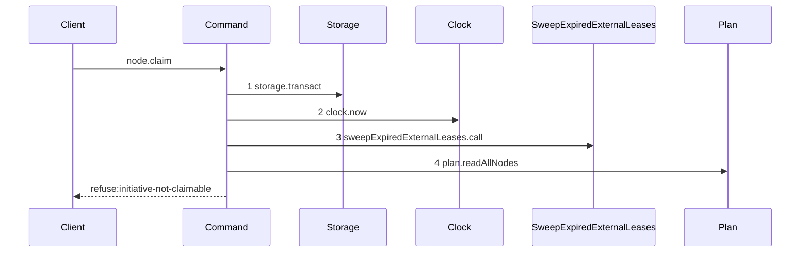
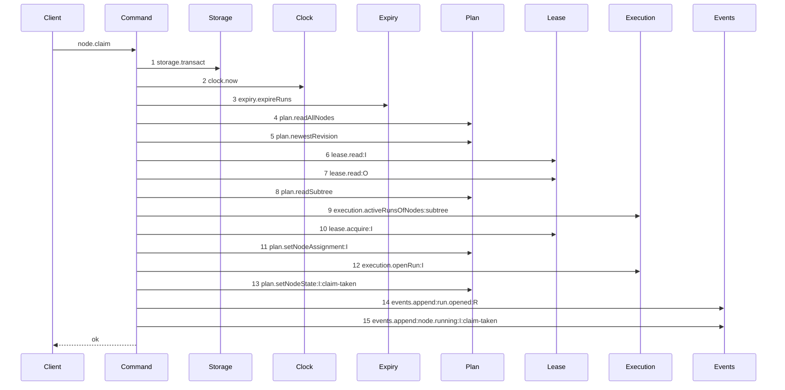

# Story 4 — The claim of an initiative

Epic: `.agents/plan/epics/050.1-the-claim.md`
Depends on: Story 3 (the rewritten command), Story 6 (the harness its scenario runs on).
Kind: story-implement

Diagrams: claim-success-initiative

Baselines: claim-success-initiative <- baseline-claim-initiative

Seams: claim-success-initiative: +expiry.expireRuns, +plan.newestRevision, +plan.readSubtree, +execution.activeRunsOfNodes, +lease.read, +lease.acquire, +plan.setNodeAssignment, +execution.openRun, +plan.setNodeState, +events.append:run.opened, +events.append:node.running, -sweepExpiredExternalLeases.call

## The shipped path

### `baseline-claim-initiative`

Superseded by: EPIC 050.1 claim-success-initiative

Shipped path: `src/commands/node/claim-node.ts:117-123`. Fixture: initiative `I` is `ready`,
unassigned, and it is the root.



Citations: `:104`, `:105`, `:107`, `:112`, `:118`. The shipped daemon refuses every initiative claim
before it reads a lease, so the target of this path is a success where the baseline is a refusal. The
deletion of `initiative-not-claimable` is the whole change.

### `claim-success-initiative`

Supersedes: EPIC 050.1 baseline-claim-initiative
Superseded by: EPIC 050.4 claim-lease-free-initiative

Fixture: the fixture of `baseline-claim-initiative`. `I` declares `deliverable: expansion`, so the run
kind is `structural`, no cascade exists, and the run holds no `run_base` row and no attempt.



No `execution.openAttempt` step exists, so a structural run that opened an attempt fails the
comparison. That is the assertion, not a comment. The initiative fixture holds two relatives — itself
and the child objective — so steps 6 and 7 are two lease reads where the task path takes three. An
initiative has no parent and no sibling. Neither `execution.runDriversUnderObjective` nor
`execution.activeRunsOfNodes:siblings` appears: both are scoped to an objective, and an initiative is
above that scope. A predicate that does not apply to the target is skipped, never simulated.

Add `test/sequence/scenarios/claim-success-initiative.ts`.

## Change

**Delete `initiative-not-claimable` at `src/commands/node/claim-node.ts:117-123`**, from the code and
from `ClaimRefusal`. An initiative is claimable: `worker.md` section 7 states a worker that claims an
initiative serializes that whole initiative, and a structural run claims one, which is why a
structural run holds no `run_base` row.

**Open no attempt for a non-`execution` run.** The shipped command opens an attempt only for
`node.kind === "task"` at `:242-267`. Rebind that condition to the run kind:
`runKindFor(node.deliverable) === "execution"`. An `expansion` node is the only claimable initiative
in this epic, and it opens a `structural` run with no attempt.

**Skip the objective-scoped reads for a node above an objective.** `execution.runDriversUnderObjective`
at `:204` and the sibling read of Story 5 both take an objective id. An initiative has none, so
neither call is made. `objectiveScopeId` at `:485` throws for a task with no parent; keep it, and give
the initiative path no call site rather than a synthetic objective id.

**Route an initiative through the one routing path, and inject the registry.** `claimNode` takes
`registry: readonly WorkerEntry[]` and passes it to `capableWorkers` and `routeWorker`. It applies no
per-kind routing branch. The production registry claims no `initiative` and declares no `expansion`,
so a production initiative claim answers `unroutable` with `failedSet: "capable"`, which EPIC 048
decided is correct. This story proves the structural mechanism against
`test/helpers/worker-registry.ts`, whose single entry claims `initiative` and declares `expansion`.
EPIC 048 already names that mechanism for EPIC 052.

**Take no cascade.** `cascadeVerdicts` at `:495` walks the ancestor chain, which is empty for the
root, so it already returns an empty list and appends no `node.running` event for an ancestor. Assert
the emptiness rather than special-casing it.

## Constraints

- Change no refusal order. Deleting `initiative-not-claimable` removes a code; it moves none.
- Do not open a `run_base` row for a structural run. The cardinality rule of EPIC 050 Story 3 refuses one.
- Do not write `judged_oid`. A `structural` run has no judged commit.
- The lease acquire on the initiative stays. The node-lease mechanism lives until EPIC 050.4.
- Add no worker capability to `src/domain/worker-registry.ts`. Both production entries are external, and `worker.md` section 10 makes expansion internal-only work. A capability edit belongs to the epic that designs an expansion-capable worker.

## Verify

```
node --test src/commands/node/claim-node.test.ts test/sequence/conformance.test.ts
```

Add to `src/commands/node/claim-node.test.ts`, each as a separate `it`:

1. `"a claim on an initiative whose deliverable is expansion succeeds"` — against `expansionCapableRegistry`, assert the claim returns a run id and the run's `kind` is `"structural"`.

   Add two cases for the production posture: `"a claim on an initiative refuses unroutable with failedSet capable against the production registry"` and `"a claim on an objective carrying expansion refuses unroutable with failedSet capable, like an initiative"`. Each asserts `databaseBytes` unchanged. The second pins that one deliverable takes one answer whatever the node kind.

2. `"initiative-not-claimable is not a member of ClaimRefusal"` — assert against the exported refusal list, so the deletion is proven by the type and not by the absence of a test.

3. `"a structural run opens no attempt"` — after the claim, assert `SELECT COUNT(*) AS c FROM attempt` equals `0`.

4. `"a structural run writes no run_base row"` — assert `SELECT COUNT(*) AS c FROM run_base` equals `0`.

5. `"an initiative claim appends exactly two events"` — assert the appended types deep-equal `["run.opened", "node.running"]`, so no ancestor cascade event is written for a root.

6. `"an initiative claim writes the assignment"` — assert `node.assignment` equals the run's `worker`.

Add `test/sequence/scenarios/claim-success-initiative.ts`.

`pnpm run verify` exits 0.

Proof: PASS line delivered — `src/commands/node/claim-node.test.ts` and `test/sequence/conformance.test.ts` in `PASS EPIC-050.1`.
