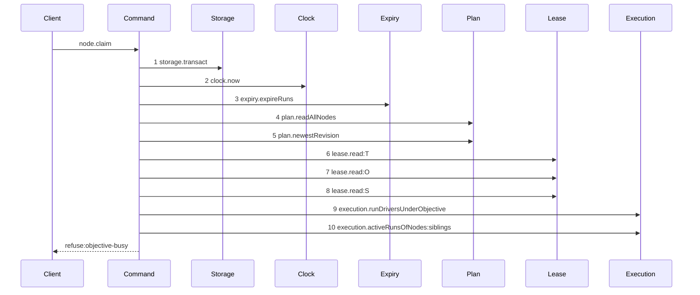

# Story 5 — The objective-busy refusal

Epic: `.agents/plan/epics/050.1-the-claim.md`
Depends on: EPIC 050 Story 6 (`objectiveBusy`), EPIC 050 Story 8 (`execution.activeRunsOfNodes`), Story 3 (the rewritten command), Story 6 (the harness its scenario runs on).
Kind: story-implement

Diagrams: claim-refusal-objective-busy

Baselines: claim-refusal-objective-busy <- baseline-claim-task

Seams: claim-refusal-objective-busy: +expiry.expireRuns, +plan.newestRevision, +execution.activeRunsOfNodes, ~lease.read, -sweepExpiredExternalLeases.call

The baseline of this path is `baseline-claim-task`, drawn in Story 3. A refusal diagram names the
baseline of its path, and its signs are measured only over the tokens it holds: a baseline token the
refusal never reaches is not a removal.

## The ship path

### `claim-refusal-objective-busy`

Superseded by: EPIC 050.4 claim-lease-free-objective-busy

Fixture: the fixture of `claim-success-task`, plus an active run on the sibling task `S`.



`plan.readSubtree` and `execution.activeRunsOfNodes:subtree` are not reached, because the earlier
refusal wins and the subtree read serves only the later one. No `Lease`, `Plan` or `Events` write step
appears. What the operation committed is a separate assertion: the expiry pass mutates inside the same
transaction and is hidden behind one step by design, so the byte-identical database comparison of
case 4 below is required beside this diagram and neither replaces the other.

Add `test/sequence/scenarios/claim-refusal-objective-busy.ts`.

## Change

**Insert `objective-busy` at position 9 of the refusal order**, between `drive-mode-pinned` and
`subtree-busy`, in `src/commands/node/claim-node.ts`. It is evaluated only for a node whose run kind
is `execution` and whose kind is `task`. An initiative claim evaluates neither `drive-mode-pinned` nor
`objective-busy`, because both are scoped to an objective and an initiative is above that scope.

Resolve the objective ancestor from the `nodes` array already read at `:112`. Build the sibling set as
the objective's other task children — every child of that objective except the target — and read their
active runs through `execution.activeRunsOfNodes(transaction, siblingIds)` of EPIC 050 Story 8. Call
`objectiveBusy({ objectiveId, siblingRuns, now })`. On a refusal, throw
`ClaimNodeError("objective-busy", ..., <the refusal minus its refusal key>)`.

The refusal details are `{ objectiveId, siblingNodeId, siblingRunId, expiresAt }`, so a client knows
what it waits on and until when. The daemon holds no queue: a blocking wait would hold one request
open for a run lifetime, so the claim is refused and never queued.

`execution.activeRunsOfNodes` is one method serving both pure rules. `subtreeExclusion` passes the
subtree ids from `plan.readSubtree`, and `objectiveBusy` passes the sibling ids from the graph read. A
method named after the objective hierarchy would put plan topology inside the execution capability,
which owns runs and not the tree.

## Constraints

- The sibling read takes the sibling ids only. Do not widen it to the subtree, and do not reuse the subtree read: the two answer different questions at different points of the refusal order.
- Evaluate `objective-busy` before the first mutation, like every other refusal.
- Do not call `plan.readSubtree` before this refusal is decided. A read no refusal needs is not taken.
- An expired sibling run does not refuse. The expiry pass of step 1 has already ended it in this transaction.

## Verify

```
node --test src/commands/node/claim-node.test.ts test/sequence/conformance.test.ts
```

Add to `src/commands/node/claim-node.test.ts`, each as a separate `it`:

1. `"a claim on a task whose sibling task holds an active run refuses objective-busy, naming the sibling, its run and its expires_at"` — assert `assert.deepEqual(error.details, { objectiveId, siblingNodeId, siblingRunId, expiresAt })` with all four values pinned literally.

2. `"a sibling task with an ended run admits the claim"` — assert the claim succeeds.

3. `"a sibling task with an expired run admits the claim"` — seed `expires_at: NOW - 1`. Assert the claim succeeds and the sibling's run is `ended` with its fence raised by one.

4. `"an objective-busy refusal leaves the database byte-identical"` — snapshot `databaseBytes` before and assert deep equality after. This story owns this one code; Story 3 owns the other eleven, and the two sets do not overlap.

5. `"the decision table gains one row per refusal that can trigger beside objective-busy"` — extend the table Story 3 built, adding the pairs that hold `objective-busy` and asserting the winner of each. The `assignment-held` pair is one row: seed `node.assignment = 'tdd@1'` and a sibling task with an active run, claim as `general@1`, and assert `error.refusal === "assignment-held"`. Assert the extended table covers every pair exactly once, so no row this story adds repeats one Story 3 already holds.

6. `"an initiative claim evaluates no objective-busy"` — claim an initiative while a task elsewhere holds an active run. Assert the claim succeeds.

Add `test/sequence/scenarios/claim-refusal-objective-busy.ts`.

`pnpm run verify` exits 0.

Proof: PASS line delivered — `src/commands/node/claim-node.test.ts` and `test/sequence/conformance.test.ts` in `PASS EPIC-050.1`.
