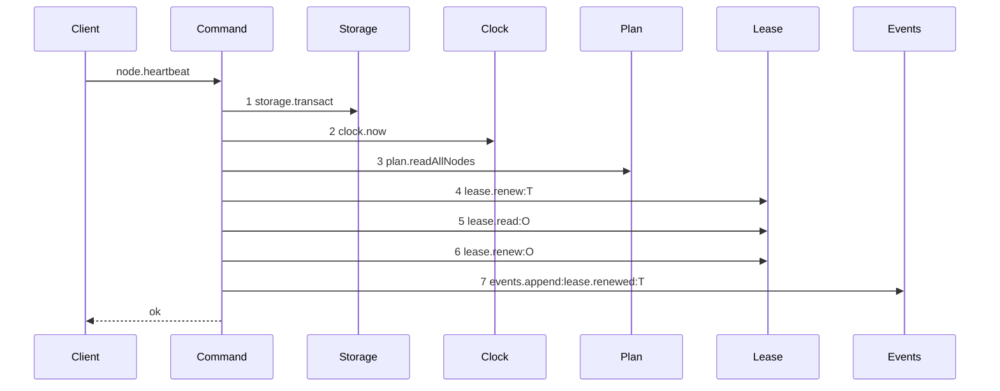
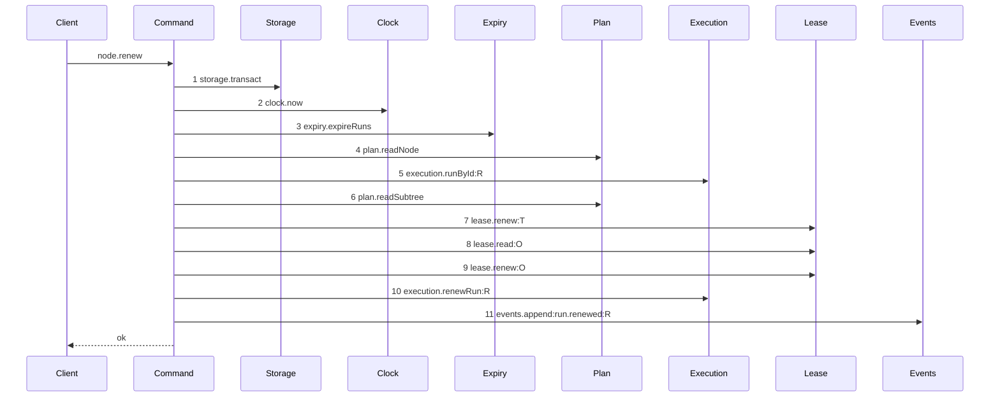

# Story 3 — The renew

Epic: `.agents/plan/epics/050.2-the-run-renew-release-and-report.md`
Depends on: Story 1 (`01-run-authority`), for `assertRunAuthority`; Story 2 (`02-the-authority-seams`), for `execution.runById` and `execution.renewRun`; Story 7 (`07-the-worker-contract`), for `runId` and `runFence` on the request; EPIC 050 Story 6 (`06-configuration`), for `runTtlMs` and `runMaxLifetimeMs`; EPIC 050.1 Story 2 (`02-the-expiry-pass`), for `expiry.expireRuns`.
Kind: story-implement

Diagrams: renew-success

Baselines: renew-success <- baseline-renew-task

Seams: renew-success: +expiry.expireRuns, +plan.readNode, +execution.runById:R, +plan.readSubtree, +execution.renewRun:R, +events.append:run.renewed:R, -plan.readAllNodes, -events.append:lease.renewed:T

This story leaves the lifetime refusal to Story 4 (`04-the-lifetime-refusal`) and the three lease
steps to EPIC 050.4 Story 4 (`04-the-renew-drops-the-lease`).

**The drawn set is every branch of the task renew whose seam set differs.** The objective renew is not
drawn: `src/commands/run/renew-run.ts:83` — `node.kind` selects it, and it makes one
`lease.renew` with no `lease.read`, so it is a strict subset of the task trace and its own case in
`## Verify` asserts it. The refusal branches of this path stop where Story 4's diagram stops, and a
refusal that stops at a step no drawn refusal stops at does not exist here.

## The shipped path

### `baseline-renew-task`

Superseded by: EPIC 050.2 renew-success

Shipped path: `src/commands/run/renew-run.ts:60` — `renewRun`, through
`src/commands/run/renew-run.ts:115`. Fixture: `seedRegistry` then `seedGraph` from
`test/helpers/rows.ts:21` — `seedRegistry` and `test/helpers/rows.ts:102` — `seedGraph`, giving
initiative, objective `O` and task `T`; `T` driven to `running` by the real `claimNode`, so `T` holds
a node lease at fence 1 and `O` holds an objective lease at fence 1, both owned by the caller.



Each step, with its caller anchor, its callee anchor and the fixture state that reaches it:

1. `src/commands/run/renew-run.ts:64` — `transact` → `src/services/storage/index.ts:33` —
   `transact`. Reached unconditionally.
2. `src/commands/run/renew-run.ts:65` — `now` → `src/services/clock/index.ts:2` — `now`.
   Reached unconditionally.
3. `src/commands/run/renew-run.ts:67` (formerly `readAllNodes`) →
   `src/services/plan/index.ts:74` — `readAllNodes`. Reached unconditionally; the command then filters
   in memory at `src/commands/run/renew-run.ts:68` (formerly `find`).
4. `src/commands/run/renew-run.ts:125` — `renew` → `src/services/lease/index.ts:93` — `renew`,
   through the helper invoked at `src/commands/run/renew-run.ts:81` — `renewLease`. Reached
   because `T` is not the initiative, so the guard at
   `src/commands/run/renew-run.ts:74` — `initiative-not-claimable` does not fire. It passes the
   caller-presented `src/commands/run/renew-run.ts:130` — `input.fence`.
5. `src/commands/run/renew-run.ts:152` — `read` → `src/services/lease/index.ts:100` — `read`,
   through the helper invoked at `src/commands/run/renew-run.ts:84` —
   `renewObjectiveLease`. Reached **only** because the fixture's `T` is a task:
   `src/commands/run/renew-run.ts:83` — `node.kind` selects the branch.
6. `src/commands/run/renew-run.ts:175` — `renew` → `src/services/lease/index.ts:93` — `renew`.
   Reached on the same task branch, and it passes the **stored**
   `src/commands/run/renew-run.ts:180` — `record.fence`, not the presented one.
7. `src/commands/run/renew-run.ts:93` — `append` → `src/services/event/index.ts:50` — `append`,
   with `src/commands/run/renew-run.ts:96` (formerly `lease.renewed`). Reached after both renewals
   return.

Steps 4 to 6 sit textually **below** step 7, because `renewLease` at
`src/commands/run/renew-run.ts:117` — `renewLease` and `renewObjectiveLease` at
`src/commands/run/renew-run.ts:145` — `renewObjectiveLease` are declared after the command.
The trace is invocation order, so the ordinals above are the runtime order and not the file order.

Steps 5 and 6 survive the change: a run on `runTtlMs` that outlived an objective lease on
`leaseTtlMs` would free a node that another claim then takes, under a run that still holds authority.

This baseline records that the shipped command proves the caller by **attempting** the renew and
catching `src/commands/run/renew-run.ts:135` — `lease-fenced`, never by
`src/services/lease/index.ts:101` — `assertHeld`. That proof is what this story replaces.

### `renew-success`

Supersedes: EPIC 050.2 baseline-renew-task
Superseded by: EPIC 050.4 renew-lease-free

Fixture: the fixture of `baseline-renew-task`, plus an active `execution` run `R` over `T` at fence 3
with `expires_at` ahead of `now` and `max_lifetime_at` well ahead of it, so no refusal fires.



Step 3 is first among the reads because every run operation evaluates expiry before it evaluates
authority; sweeping only at the next claim would leave an expired run able to renew itself back to
life.

**Step 4 precedes step 5, and that order is the ruling.** `plan.readNode` replaces the whole-graph
read of the baseline and keeps the two shipped refusals in front of the authority check:
`src/commands/run/renew-run.ts:70` — `node-not-found` and
`src/commands/run/renew-run.ts:74` — `initiative-not-claimable`. Drawn the other way round, an
absent node and an initiative would both satisfy condition 5 of `assertRunAuthority` and refuse
`target-outside-run`, so both shipped refusals would become unreachable and two wire-visible codes
would change meaning. The node row is also the only source of `node.kind` for the objective branch at
`src/commands/run/renew-run.ts:83` — `node.kind` and of `node.parentId` for
`src/commands/run/renew-run.ts:186` — `objectiveScopeOf`; `plan.readSubtree` returns ids alone
and supplies neither.

Steps 5 and 6 supply `assertRunAuthority` with the run and the subtree. Steps 7 to 9 are the shipped
lease renewal, kept until EPIC 050.4 Story 4 (`04-the-renew-drops-the-lease`). Step 11 projects the
run id, because `run.renewed` is a run event. **No fence write appears, and that absence is the
assertion.**

Add `test/sequence/scenarios/renew-success.ts`.

## Change

### 1 — the rename

Move `src/commands/run/renew-run.ts` to `src/commands/run/renew-run.ts` with `git mv`, and its
test to `src/commands/run/renew-run.test.ts`. `src/commands/run/` does not exist today; the
directories under `src/commands/` are `actor`, `node`, `outcome`, `plan`, `project`, `provider`,
`repository` and `startup`. `eslint.config.js` classifies the layer by the glob `src/commands/**`, so
a new subdirectory needs no configuration edit.

Rename every exported symbol:

| old                    | new                    |
| ---------------------- | ---------------------- |
| `renewRun`             | `renewRun`             |
| `RenewRunDependencies` | `RenewRunDependencies` |
| `RenewRunInput`        | `RenewRunInput`        |
| `RenewRunResult`       | `RenewRunResult`       |
| `RenewRunError`        | `RenewRunError`        |
| `RenewRefusal`         | `RenewRefusal`         |

The importers, each resolved against the current tree:

- `src/http/server/node/renew-node.ts:5` — `RenewRunInput`. Move the file to
  `src/http/server/node/renew-node.ts`, with its test.
- `src/http/server/node/refusals.ts:4` — `RenewRunError`, the dispatch arm at
  `src/http/server/node/refusals.ts:36` — `RenewRunError`, the mapper at
  `src/http/server/node/refusals.ts:181` — `renewRefusal`, and the two type unions at
  `src/http/server/node/refusals.ts:234` — `RenewRunError` and
  `src/http/server/node/refusals.ts:266` — `RenewRunError`.
- `src/main.ts:85` — `renewRun` (the command import),
  `src/main.ts:161` — `renewNodeHandler` (the handler import), and the handler map entry at
  `src/main.ts:570` (formerly `node.heartbeat`) through `src/main.ts:583`.
- `src/main.test.ts:176` — `node.heartbeat`, the key of the `fixtures` map.
- `src/commands/node/release-node.test.ts:17` (formerly `renewRun`), now an **unused import**: commit
  `04376fb` removed the call that built mid-lifecycle state, and left the import. Delete the import.
  That file is the test-engineer lane and this one is not, so the two halves land in separate turns
  of this story.
- `src/cli/node/renew.ts:20` — `registerNodeRenew`. Move it to `src/cli/node/renew.ts` and
  change the Commander registration from `heartbeat` to `renew`. Its wording already fits:
  `src/cli/node/renew.ts:27` — `renew` carries the description "renew the lease of a node", and
  `src/cli/node/renew.ts:60` — `renewed` prints `kanthord: renewed …`. Update
  `src/cli/program.ts:44` — `registerNodeRenew` and `src/cli/program.ts:378` —
  `registerNodeRenew`.

One vocabulary survives: `worker.md` names claim, report, close and renew.

`release` keeps its name and its file. It has no verb in `worker.md`, and it is retained with one
stated meaning: a worker voluntarily ends its run with no checkpoint.

### 2 — the renew body

`renewRun` keeps the shipped lease renewal at `src/commands/run/renew-run.ts:81` — `renewLease`
through `src/commands/run/renew-run.ts:107`, and adds the run renewal beside it. `expiry` joins
the dependency object at `src/commands/run/renew-run.ts:22` —
`RenewRunDependencies`, beside `execution`. Inside the one `storage.transact`:

1. `const now = dependencies.clock.now();` — unchanged, at
   `src/commands/run/renew-run.ts:65` — `now`.
2. `dependencies.expiry.expireRuns(transaction, { now });` — new, immediately after the clock read.
3. `plan.readNode(transaction, input.nodeId)`, replacing the whole-graph read at
   `src/commands/run/renew-run.ts:67` (formerly `readAllNodes`) and the in-memory filter at
   `src/commands/run/renew-run.ts:68` (formerly `find`). It keeps
   `src/commands/run/renew-run.ts:70` — `node-not-found` and
   `src/commands/run/renew-run.ts:74` — `initiative-not-claimable` **in front of the authority
   check**, and it supplies `node.kind` for
   `src/commands/run/renew-run.ts:83` — `node.kind` and `node.parentId` for
   `src/commands/run/renew-run.ts:186` — `objectiveScopeOf`. `plan.readSubtree` returns ids
   alone and supplies neither.
4. `execution.runById(transaction, input.runId)`. It returns an ended run rather than null, so the
   authority function can refuse it by code.
5. `plan.readSubtree(transaction, run.nodeId)` for the subtree ids, from
   `src/services/plan/index.ts:101` — `readSubtree`.
6. `assertRunAuthority({ run, runId: input.runId, fence: input.runFence, targetNodeId: input.nodeId, subtreeIds, caller, now })`.
   On a refusal, throw `RenewRunError(refusal.refusal, …, { runId: refusal.runId })`. Step 2 is what
   makes an expired run reach this step already `ended`, so it refuses `run-ended` rather than
   `run-expired`; both are refusals and the order in Story 1 (`01-run-authority`) governs whichever
   state the row is in.
7. The shipped lease renewal, unchanged: `lease.renew` on the target at
   `src/commands/run/renew-run.ts:125` — `renew`, the objective lease read at
   `src/commands/run/renew-run.ts:152` — `read`, and the objective `lease.renew` at
   `src/commands/run/renew-run.ts:175` — `renew`.
8. `execution.renewRun(transaction, { runId, expiresAt })` with
   `Math.min(now + dependencies.runTtlMs, run.maxLifetimeAt)`.
9. Append `run.renewed` where the command appended `lease.renewed` at
   `src/commands/run/renew-run.ts:96` (formerly `lease.renewed`), with the payload of section 3.

**A renew never touches the fence.** The fence rises when a run ends, and nowhere else. A renew that
rotated the fence would invalidate the run id and fence pair the worker already holds, which is the
authority of that run.

Add the six `RunAuthorityRefusalCode` values to `RenewRefusal` at
`src/commands/run/renew-run.ts:11` — `RenewRefusal`. Story 4 (`04-the-lifetime-refusal`)
adds `lifetime-exceeded`.

`heartbeatIntervalMs` leaves `RenewRunResult`: delete the field at
`src/commands/run/renew-run.ts:41` (formerly `heartbeatIntervalMs`) and its producer at
`src/commands/run/renew-run.ts:112` (formerly `heartbeatIntervalMs`), and return `expiresAt` and
`renewAfterMs` instead. Story 7 (`07-the-worker-contract`) owns both schema halves and the remaining
sites.

### 3 — the event type, registered with its producer

This story registers `run.renewed` and retires `lease.renewed`, because
`src/http/contract/event-payload.test.ts:344` — `it` asserts every produced type is declared and
`src/http/contract/event-payload.test.ts:365` — `it` asserts every declared non-retired type has a
producer, both by literal string scan over `src/commands` and `src/services`. Declaring the type in a
contract-only story would fail the second scan, and retiring `lease.renewed` there would fail the
first while this command still writes it. The two edits and the producer move land together.

- `src/domain/event-type.ts:7` (formerly `lease.renewed`): remove the member. Add `"run.renewed"` in its
  bytewise position among the 38 members of `src/domain/event-type.ts:1` — `eventTypes`.
- `src/domain/event-type.ts:44` — `retiredEventTypes` stays empty. It is typed
  `readonly EventType[]`, so a removed member cannot be listed there at all; there are no
  deployments, so there is no stored event to keep readable.
- `src/http/contract/event-payload.ts:109` (formerly `lease.renewed`): remove the schema. Add `run.renewed` in
  the same bytewise position in `src/http/contract/event-payload.ts:71` — `eventPayloads`, which is
  typed `Readonly<Record<EventType, ZodType>>`, so omitting a member fails type checking:

```ts
"run.renewed": z.strictObject({
  runId: z.string(),
  nodeId: z.string(),
  fence,
  expiresAt: z.number().int(),
}),
```

`fence` is the shared alias at `src/http/contract/event-payload.ts:29` — `fence`. The shape is
exactly what step 2.9 appends.

- `src/http/contract/event-payload.test.ts:50` — `recordedPayloads`: replace the `lease.renewed`
  fixture at `src/http/contract/event-payload.test.ts:94` (formerly `lease.renewed`) with a `run.renewed`
  one in the same position. `src/http/contract/event-payload.test.ts:434` — `deepEqual` asserts the
  fixture key list equals `eventTypes` in order, so the position is not free.
- `src/http/contract/event-payload.test.ts:459` — `it` reads all three `lease.*` schemas by name.
  Drop its `lease.renewed` arm and keep the other two; Story 5 (`05-the-release`) drops the rest.
- `src/http/contract/openapi.test.ts:270` (formerly `lease.renewed`): rename the component entry to
  `run.renewed` in its bytewise position. The count assertion at
  `src/http/contract/openapi.test.ts:416` — `equal` stays at 38, because this is a replacement.

## Constraints

- The fence rises only when a run ends. No renew path writes `fence`.
- `expireRuns` runs before the node read and before the authority check, in the command's one
  transaction.
- The node read precedes the authority check. `node-not-found` and `initiative-not-claimable` keep
  their shipped precedence and their shipped status codes.
- Do not delete the shipped lease renewal. EPIC 050.4 Story 4 (`04-the-renew-drops-the-lease`)
  removes it, and it changes no wire shape when it does.
- `input.fence` is the **node lease** fence and keeps its meaning. `input.runFence` is the run fence.
  Do not overload one field with both. The task renewal passes the presented fence and the objective
  renewal passes the stored `record.fence`; do not swap them.
- Keep the objective branch. `src/commands/run/renew-run.ts:83` — `node.kind` makes an
  objective renew a five-seam path, and it stays a five-seam path.
- Register `run.renewed` and retire `lease.renewed` in this story, never in a contract-only story.

## Verify

```
node --test src/commands/run/renew-run.test.ts src/http/server/node/renew-node.test.ts src/cli/node/renew.test.ts src/main.test.ts src/domain/event-type.test.ts src/http/contract/event-payload.test.ts src/http/contract/openapi.test.ts test/sequence/conformance.test.ts
```

Carry all twelve shipped cases of `src/commands/run/renew-run.test.ts` across to
`src/commands/run/renew-run.test.ts` unchanged apart from the renamed symbols and the added request
fields, and change the suite name at `src/commands/run/renew-run.test.ts:223` — `describe` to
`"src/commands/run/renew-run.test"`. The file uses real SQLite through
`test/helpers/database.ts:32` — `createMigratedStorage`, a real `SqliteEventLog`, a SQL-backed lease
fake at `test/helpers/lease.ts:114` — `createBackedLeaseFake`, and it snapshots rows through
`test/helpers/database.ts:117` — `databaseBytes`. Its local drivers are
`src/commands/run/renew-run.test.ts:71` — `createFixture`,
`src/commands/run/renew-run.test.ts:106` — `claim` and
`src/commands/run/renew-run.test.ts:147` — `beat`.

Add, each as a separate `it`:

1. `"a successful renew leaves the fence unchanged and moves expires_at forward"` — seed an active
   run with `fence: 3` and `expires_at: NOW + 1000`. Renew at `NOW`. In one case assert **both**
   `fence === 3` and `expires_at === NOW + runTtlMs`. One case, two assertions, so the code cannot
   drift toward rotating the fence on a renew.

2. `"a renew clamps expires_at to max_lifetime_at"` — `runTtlMs` of `300000` with
   `max_lifetime_at: NOW + 1000`. Assert `expires_at === NOW + 1000`.

3. `"a renew one millisecond before max_lifetime_at succeeds"` — `max_lifetime_at: NOW + 1`. Assert
   `expires_at === NOW + 1`.

4. `"a renew renews the objective lease with the node lease"` — read both `lease.expires_at` values
   before and after and assert both moved forward to `NOW + TTL`. A run that outlived its objective
   lease would free a node under a live run.

5. `"an objective renew renews the objective lease only"` — the shipped case at
   `src/commands/run/renew-run.test.ts:318` — `it`, carried across, plus an assertion that the
   recorder saw one `lease.renew` and no `lease.read`. This is the branch the diagram does not draw.

6. `"a renew refuses a stale fence"` — run `fence: 4`, presented `runFence: 3`. Assert
   `error.refusal === "fence-stale"` and `expires_at` unchanged.

7. `"a renew refuses an ended run"` — seed `state: 'ended'`. Assert `error.refusal === "run-ended"`.

8. `"a renew on an expired run refuses and writes nothing"` — seed an active run with
   `expires_at: NOW - 1` and `fence: 3`. Snapshot `databaseBytes`. Assert the refusal is `run-ended`,
   then assert the run is still `active` with `fence: 3` and that no `run.expired` event exists, and
   assert `databaseBytes` deep-equals the snapshot.

   The expiry pass runs first and ends the run, and the refusal then throws, so
   `src/services/storage/connection.ts:83` — `ROLLBACK` rolls the whole callback back — the expiry
   included. That is the specified behaviour, not a leak: an expired-but-unswept run authorizes
   nothing, because every run operation runs the pass before it evaluates authority. Do not split the
   expiry into its own transaction, and do not return a sentinel and throw after commit; either would
   break the rule that a refusal writes nothing.

9. `"a renew on an unknown node refuses node-not-found, not target-outside-run"` — present a valid
   `runId` and `runFence` with `nodeId: "task_zzz"`. Assert `error.refusal === "node-not-found"`. The
   control is case 10, which proves the assertion distinguishes the two codes.

10. `"a renew on an initiative refuses initiative-not-claimable, not target-outside-run"` — the
    shipped case at `src/commands/run/renew-run.test.ts:386` — `it`, carried across with a
    valid `runId` and `runFence`, plus the added assertion that the code is not
    `"target-outside-run"`. Cases 9 and 10 are the pair that proves the node read precedes the
    authority check.

11. `"a renew refuses a target outside the run"` — an existing sibling task, seeded by
    `test/helpers/rows.ts:184` — `seedSiblingTask`, presented with the run of `T`. Assert
    `error.refusal === "target-outside-run"`.

12. `"a renew refusal carries only the run id"` — for each of the six authority refusals reachable
    through the command, assert `assert.deepEqual(Object.keys(error.details!), ["runId"])`.

13. `"the renew response carries expiresAt and renewAfterMs and no heartbeatIntervalMs"` — assert
    both values, `renewAfterMs === Math.floor(runTtlMs / 3)`, and that the result key set holds no
    `heartbeatIntervalMs`. It replaces the shipped case at
    `src/commands/run/renew-run.test.ts:450` — `it`.

14. `"a renew appends exactly one run.renewed event and no lease.renewed"` — assert the appended
    type, that its payload holds `runId`, `nodeId`, `fence` and `expiresAt`, and that no event of
    type `lease.renewed` exists for the subject. It replaces the shipped case at
    `src/commands/run/renew-run.test.ts:345` — `it`.

15. `"lease.renewed is absent from eventTypes and run.renewed is present"` — in
    `src/domain/event-type.test.ts`, assert both, assert the list length is still 38, and assert the
    list equals its own `Buffer.compare` sort. Both halves are asserted, so the replacement is
    complete rather than additive.

16. `"node.heartbeat is not wired and node.renew is"` — in `src/main.test.ts`, the shipped case
    `"no routed operation is left unbound"` at `src/main.test.ts:322` — `it` already walks the
    production handler map of `src/main.ts:570` (formerly `node.heartbeat`) against the registry. Rename the
    `node.heartbeat` key of the `fixtures` map at `src/main.test.ts:176` — `node.heartbeat` to
    `node.renew` and add `runId` and `runFence` to its body, so the walk covers the renamed operation
    and fails on the old name.

Add `test/sequence/scenarios/renew-success.ts`, building the fixture the diagram names, running the
real `renewRun` over real SQLite behind the recorder, and returning the recorder and the result.

`pnpm run verify` exits 0.

Proof: PASS line delivered — `src/commands/run/renew-run.test.ts` in `PASS EPIC-050.2`.
