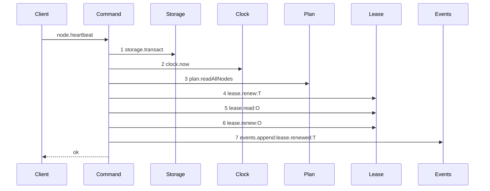
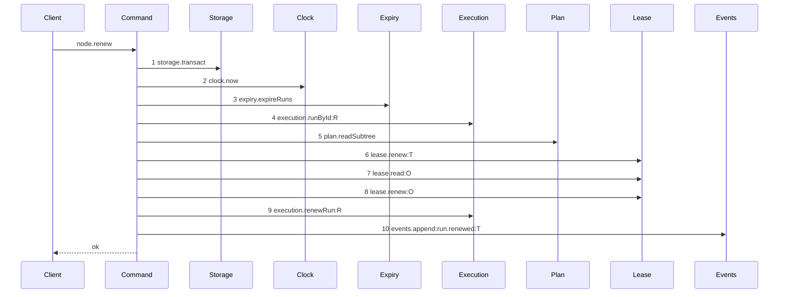

# Story 3 — The renew

Epic: `.agents/plan/epics/050.2-the-run-renew-release-and-report.md`
Depends on: Story 1 (`assertRunAuthority`), Story 2 (`execution.runById`, `execution.renewRun`), Story 7 (`runId` and `runFence` on the request), EPIC 050 Story 7 (`runTtlMs` and `runMaxLifetimeMs`), EPIC 050.1 Story 2 (`expireRuns`).
Kind: story-implement

Diagrams: renew-success

Baselines: renew-success <- baseline-renew-task

Seams: renew-success: +expiry.expireRuns, +execution.runById, +plan.readSubtree, +execution.renewRun, +events.append:run.renewed, -plan.readAllNodes, -events.append:lease.renewed

## The shipped path

### `baseline-renew-task`

Superseded by: EPIC 050.2 renew-success

Shipped path: `src/commands/node/heartbeat-node.ts:60-114`. Fixture: task `T` under objective `O`,
running, both leases held by the caller.



Citations: `:64`, `:65`, `:67`, `:125`, `:152`, `:175`, `:93`. Steps 5 and 6 are the objective lease
renewal. They survive the change: a run on `runTtlMs` that outlived an objective lease on
`leaseTtlMs` would free a node that another claim then takes, under a run that still holds authority.

### `renew-success`

Supersedes: EPIC 050.2 baseline-renew-task
Superseded by: EPIC 050.4 renew-lease-free

Fixture: the fixture of `baseline-renew-task`, plus an active `execution` run `R` over `T`.



Steps 4 and 5 supply `assertRunAuthority` with the run and the subtree, replacing the whole-graph read
of the baseline. Steps 6 to 8 are the shipped lease renewal, kept until EPIC 050.4. No fence write
appears, and that absence is the assertion.

Add `test/sequence/scenarios/renew-success.ts`.

## Change

### 1 — the rename

Move `src/commands/node/heartbeat-node.ts` to `src/commands/run/renew-run.ts` with `git mv`, and its
test to `src/commands/run/renew-run.test.ts`. Rename every exported symbol:

| old                         | new                    |
| --------------------------- | ---------------------- |
| `heartbeatNode`             | `renewRun`             |
| `HeartbeatNodeDependencies` | `RenewRunDependencies` |
| `HeartbeatNodeInput`        | `RenewRunInput`        |
| `HeartbeatNodeResult`       | `RenewRunResult`       |
| `HeartbeatNodeError`        | `RenewRunError`        |
| `HeartbeatRefusal`          | `RenewRefusal`         |

Update the importers: `src/http/server/node/heartbeat-node.ts` (move it to
`src/http/server/node/renew-node.ts`), its test, `src/main.ts:560-573`, `src/main.test.ts:169-184`,
and `src/cli/node/heartbeat.ts` (move to `src/cli/node/renew.ts`, and change its Commander
registration from `heartbeat` to `renew`; `src/cli/node/heartbeat.ts:27` carries the description
"renew the lease of a node", and `:60` prints `kanthord: renewed …`, so the wording already fits).
One vocabulary survives: `worker.md` names claim, report, close and renew.

`release` keeps its name and its file. It has no verb in `worker.md`, and it is retained with one
stated meaning: a worker voluntarily ends its run with no checkpoint.

### 2 — the renew body

`renewRun` keeps the shipped lease renewal at `heartbeat-node.ts:81-107` and adds the run renewal
beside it. Inside the one `storage.transact`:

1. `const now = dependencies.clock.now();` — first statement, per `src/commands/node/claim-node.ts:105`.
2. `dependencies.expiry.expireRuns(transaction, { now });` — every run operation evaluates expiry first. Sweeping only at the next claim would leave an expired run able to renew itself back to life.
3. `execution.runById(transaction, input.runId)`. It returns an ended run rather than null, so the authority function can refuse it by code.
4. `plan.readSubtree(transaction, run.nodeId)` for the subtree ids.
5. `assertRunAuthority({ run, runId: input.runId, fence: input.runFence, targetNodeId: input.nodeId, subtreeIds, caller, now })`. On a refusal, throw `RenewRunError(refusal.refusal, ..., { runId: refusal.runId })`. Step 2 is what makes an expired run reach step 5 already `ended`, so it refuses `run-ended` rather than `run-expired`; both are refusals and the order in Story 1 governs whichever state the row is in.
6. The shipped lease renewal, unchanged: `lease.renew` on the target, the objective lease read and the objective `lease.renew`.
7. `execution.renewRun(transaction, { runId, expiresAt })` with `Math.min(now + dependencies.runTtlMs, run.max_lifetime_at)`.
8. Append `run.renewed` where the command appended `lease.renewed`.

**A renew never touches the fence.** The fence rises when a run ends, and nowhere else. A renew that
rotated the fence would invalidate the run id and fence pair the worker already holds, which is the
authority of that run.

Add the six `RunAuthorityRefusalCode` values to `RenewRefusal`. Story 4 adds `lifetime-exceeded`.

The response carries `expiresAt` and `renewAfterMs`, and no `heartbeatIntervalMs`. Story 7 owns both
schema halves.

## Constraints

- The fence rises only when a run ends. No renew path writes `fence`.
- `expireRuns` runs before the authority check, in the command's one transaction.
- Do not delete the shipped lease renewal. EPIC 050.4 removes it, and it changes no wire shape when it does.
- `input.fence` is the **node lease** fence and keeps its meaning. `input.runFence` is the run fence. Do not overload one field with both.
- Preserve the shipped refusal order. The authority check is inserted after the run read and before every shipped refusal.

## Verify

```
node --test src/commands/run/renew-run.test.ts src/http/server/node/renew-node.test.ts src/cli/node/renew.test.ts src/main.test.ts test/sequence/conformance.test.ts
```

Carry every shipped case in `heartbeat-node.test.ts` across to `renew-run.test.ts` unchanged apart
from the renamed symbols. Change the suite name to `"src/commands/run/renew-run.test"`.

Add, each as a separate `it`:

1. `"a successful renew leaves the fence unchanged and moves expires_at forward"` — seed an active run with `fence: 3` and `expires_at: NOW + 1000`. Renew at `NOW`. In one case assert **both** `fence === 3` and `expires_at === NOW + runTtlMs`. One case, two assertions, so the code cannot drift toward rotating the fence on a renew.

2. `"a renew clamps expires_at to max_lifetime_at"` — `runTtlMs` of `300000` with `max_lifetime_at: NOW + 1000`. Assert `expires_at === NOW + 1000`.

3. `"a renew one millisecond before max_lifetime_at succeeds"` — assert `expires_at === NOW + 1`.

4. `"a renew renews the objective lease with the node lease"` — assert both `expires_at` values moved forward. A run that outlived its objective lease would free a node under a live run.

5. `"a renew refuses a stale fence"` — run `fence: 4`, presented `runFence: 3`. Assert `error.refusal === "fence-stale"` and `expires_at` unchanged.

6. `"a renew refuses an ended run"` — assert `error.refusal === "run-ended"`.

7. `"a renew on an expired run refuses and writes nothing"` — seed an active run with `expires_at: NOW - 1` and `fence: 3`. Snapshot `databaseBytes`. Assert the refusal is `run-ended`, then assert the run is still `active` with `fence: 3` and no `run.expired` event, and assert `databaseBytes` deep-equals the snapshot.

   The expiry pass runs first and ends the run, and the refusal then throws, so `src/services/storage/connection.ts:83` rolls the whole callback back — the expiry included. That is the specified behaviour, not a leak: an expired-but-unswept run authorizes nothing, because every run operation runs the pass before it evaluates authority. Do not split the expiry into its own transaction, and do not return a sentinel and throw after commit; either would break the rule that a refusal writes nothing.

8. `"a renew refusal carries only the run id"` — assert `assert.deepEqual(Object.keys(error.details!), ["runId"])`.

9. `"node.heartbeat is not wired and node.renew is"` — in `src/main.test.ts`, assert the production handler map at `:169-184` names `node.renew` and does not name `node.heartbeat`.

Add `test/sequence/scenarios/renew-success.ts`.

`pnpm run verify` exits 0.

Proof: PASS line delivered — `src/commands/run/renew-run.test.ts` in `PASS EPIC-050.2`.
