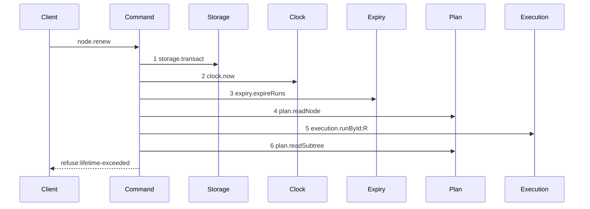

# Story 4 — The lifetime refusal

Epic: `.agents/plan/epics/050.2-the-run-renew-release-and-report.md`
Depends on: Story 3 (`03-the-renew`), for the renew command and its dependency object.
Kind: story-implement

Diagrams: renew-refusal-lifetime-exceeded

Baselines: renew-refusal-lifetime-exceeded <- baseline-renew-task

Seams: renew-refusal-lifetime-exceeded: +expiry.expireRuns, +plan.readNode, +execution.runById:R, +plan.readSubtree, -plan.readAllNodes

The baseline of this path is `baseline-renew-task`, drawn in Story 3 (`03-the-renew`). A refusal
diagram names the baseline of its path, and its signs are measured only over the tokens it holds: a
baseline token the refusal never reaches is not a removal, so the three lease steps and the event
append of that baseline carry no sign here.

**The drawn set is every branch of this refusal.** One diagram covers it, because the refusal has one
reachable stopping point. The five authority refusals stop one step earlier, inside step 6, and Story
3 (`03-the-renew`) asserts each by code rather than by trace; a diagram per code would repeat one
token list six times and prove nothing a refusal test does not.

## The ship path

### `renew-refusal-lifetime-exceeded`

Fixture: the fixture of `baseline-renew-task`, plus an active `execution` run `R` over `T` whose
`max_lifetime_at` equals `now` and whose `expires_at` is `NOW + 1000`, so every authority condition
holds and only the lifetime check fires.



No lease step and no write step appears, so a renew that touched a lease or wrote the run row before
deciding the refusal fails the comparison. Step 4 is present because the node read precedes the
authority check, per Story 3 (`03-the-renew`); a refusal that skipped it would let an absent node
reach the lifetime check.

**This diagram proves no write seam is reached after the refusal point. It does not prove the
operation committed nothing.** That is asserted separately, by case 3 below.

Add `test/sequence/scenarios/renew-refusal-lifetime-exceeded.ts`.

## Change

**Add `lifetime-exceeded` to `RenewRefusal`**, beside the six authority codes Story 3
(`03-the-renew`) added at `src/commands/run/renew-run.ts:11` — `RenewRefusal`.

Evaluate it in `src/commands/run/renew-run.ts` immediately after `assertRunAuthority` — step 6 of
Story 3's change — and before the first lease write:

```ts
if (now >= run.maxLifetimeAt) {
  throw new RenewRunError("lifetime-exceeded", ..., { runId: input.runId });
}
```

The comparison is `>=`, so the boundary instant is exceeded. The refusal writes nothing: no lease is
renewed, no run row is written and no event is appended. A worker that reaches its maximum lifetime
has no path back to an active run, and it releases or reports.

`lifetime-exceeded` carries `{ runId }` and no fence value, like every authority refusal.

`run.maxLifetimeAt` reaches the command through `execution.runById`, so it exists only once EPIC
050.1 Story 3 (`03-the-claim-of-a-task`) has extended `RunRecord` and migration `12` has added the
column. The shipped table has no such column:
`src/services/storage/migration-0007-external-execution.ts:12` — `CREATE TABLE run` names fourteen,
and `max_lifetime_at` is not among them.

## Constraints

- Evaluate the refusal after the authority check. A caller holding a stale fence learns
  `fence-stale`, not the lifetime of a run it does not hold.
- Evaluate it after the node read and before the first lease write. The node read carries
  `node-not-found` and `initiative-not-claimable`, which keep their shipped precedence.
- Do not clamp and succeed at the boundary. `now === max_lifetime_at` refuses.
- Do not add a second transaction, and do not sample the clock twice. `now` is the value step 2 read.

## Verify

```
node --test src/commands/run/renew-run.test.ts test/sequence/conformance.test.ts
```

Extend `src/commands/run/renew-run.test.ts`, the file Story 3 (`03-the-renew`) renames, using its
`createFixture` and `beat` drivers and its `databaseBytes` import from
`test/helpers/database.ts:117` — `databaseBytes`.

Add, each as a separate `it`:

1. `"a renew at exactly max_lifetime_at refuses lifetime-exceeded and leaves expires_at unchanged"` —
   `max_lifetime_at: NOW`, `expires_at: NOW + 1000`. Assert `error.refusal === "lifetime-exceeded"`
   and, in the same case, that `expires_at` is still `NOW + 1000`.

2. `"a renew past max_lifetime_at refuses"` — `max_lifetime_at: NOW - 1`. Assert the same code.

3. `"a lifetime-exceeded refusal leaves the database byte-identical"` — snapshot `databaseBytes`
   before and assert `assert.deepEqual` after. Assert in the same case that both `lease.expires_at`
   values are unchanged, so the byte comparison is not the only oracle for the lease.

4. `"a stale fence at the lifetime boundary reports fence-stale"` — `max_lifetime_at: NOW` and a
   stale `runFence`. Assert `error.refusal === "fence-stale"`, proving the authority check precedes
   the lifetime check. This is the control for case 1.

5. `"an initiative at the lifetime boundary reports initiative-not-claimable"` —
   `max_lifetime_at: NOW` with an initiative `nodeId`. Assert
   `error.refusal === "initiative-not-claimable"`, proving the node read precedes both checks.

6. `"a lifetime-exceeded refusal carries only the run id"` — assert
   `assert.deepEqual(Object.keys(error.details!), ["runId"])`.

7. `"a renew one millisecond before max_lifetime_at does not refuse"` — `max_lifetime_at: NOW + 1`.
   Assert the call returns and `expires_at === NOW + 1`. This is the control that proves case 1's
   `>=` boundary is the boundary and not an off-by-one.

Add `test/sequence/scenarios/renew-refusal-lifetime-exceeded.ts`, building the fixture the diagram
names, running the real `renewRun` over real SQLite behind the recorder, and returning the recorder
and the caught refusal.

`pnpm run verify` exits 0.

Proof: PASS line delivered — `src/commands/run/renew-run.test.ts` in `PASS EPIC-050.2`.
