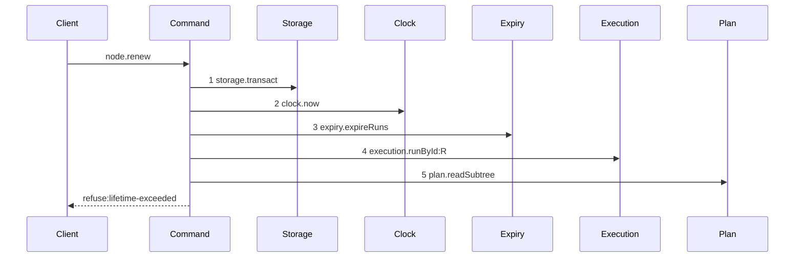

# Story 4 — The lifetime refusal

Epic: `.agents/plan/epics/050.2-the-run-renew-release-and-report.md`
Depends on: Story 3 (the renew command).
Kind: story-implement

Diagrams: renew-refusal-lifetime-exceeded

Baselines: renew-refusal-lifetime-exceeded <- baseline-renew-task

Seams: renew-refusal-lifetime-exceeded: +expiry.expireRuns, +execution.runById, +plan.readSubtree, -plan.readAllNodes

The baseline of this path is `baseline-renew-task`, drawn in Story 3. A refusal diagram names the
baseline of its path, and its signs are measured only over the tokens it holds: a baseline token the
refusal never reaches is not a removal.

## The ship path

### `renew-refusal-lifetime-exceeded`

Fixture: an active run whose `max_lifetime_at` equals `now`.



No lease step and no write step appears, so a renew that touched a lease before deciding the refusal
fails the comparison. What the operation committed is a separate assertion, by the byte-identical
database comparison.

Add `test/sequence/scenarios/renew-refusal-lifetime-exceeded.ts`.

## Change

**Add `lifetime-exceeded` to `RenewRefusal`**, and evaluate it in `src/commands/run/renew-run.ts`
immediately after `assertRunAuthority` and before the lease renewal:

```ts
if (now >= run.maxLifetimeAt) {
  throw new RenewRunError("lifetime-exceeded", ..., { runId: input.runId });
}
```

The comparison is `>=`, so the boundary instant is exceeded. The refusal writes nothing: no lease is
renewed, no run row is written and no event is appended. A worker that reaches its maximum lifetime
has no path back to an active run, and it releases or reports.

`lifetime-exceeded` carries `{ runId }` and no fence value, like every authority refusal.

## Constraints

- Evaluate the refusal after the authority check. A caller holding a stale fence learns `fence-stale`, not the lifetime of a run it does not hold.
- Evaluate it before the first lease write. A refusal writes nothing.
- Do not clamp and succeed at the boundary. `now === max_lifetime_at` refuses.

## Verify

```
node --test src/commands/run/renew-run.test.ts test/sequence/conformance.test.ts
```

Add, each as a separate `it`:

1. `"a renew at exactly max_lifetime_at refuses lifetime-exceeded and leaves expires_at unchanged"` — `max_lifetime_at: NOW`, `expires_at: NOW + 1000`. Assert the refusal and, in the same case, that `expires_at` is still `NOW + 1000`.

2. `"a renew past max_lifetime_at refuses"` — `max_lifetime_at: NOW - 1`.

3. `"a lifetime-exceeded refusal leaves the database byte-identical"` — snapshot `databaseBytes` before and assert deep equality after. No lease is renewed.

4. `"a stale fence at the lifetime boundary reports fence-stale"` — `max_lifetime_at: NOW` and a stale `runFence`. Assert `error.refusal === "fence-stale"`, proving the authority check precedes the lifetime check.

5. `"a lifetime-exceeded refusal carries only the run id"` — assert the details key set is exactly `["runId"]`.

Add `test/sequence/scenarios/renew-refusal-lifetime-exceeded.ts`.

`pnpm run verify` exits 0.

Proof: PASS line delivered — `src/commands/run/renew-run.test.ts` in `PASS EPIC-050.2`.
