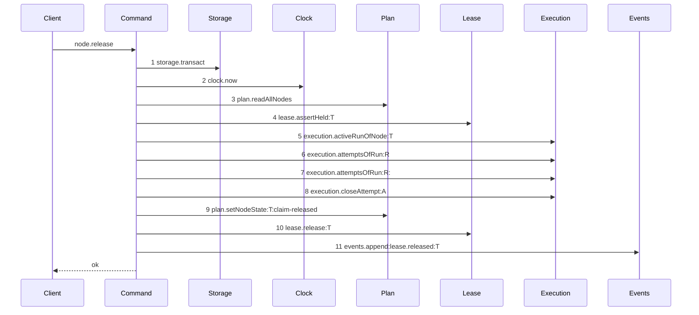
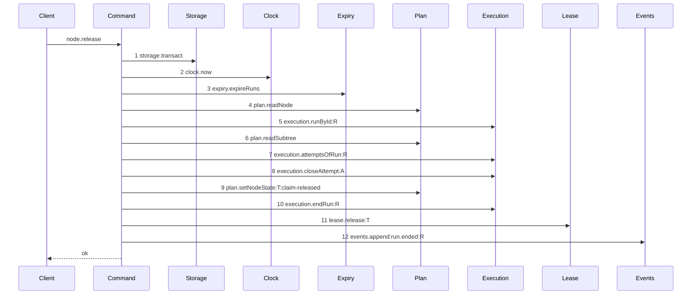

# Story 5 — The release

Epic: `.agents/plan/epics/050.2-the-run-renew-release-and-report.md`
Depends on: Story 1 (`01-run-authority`), for `assertRunAuthority`; Story 2 (`02-the-authority-seams`), for `execution.runById`; Story 7 (`07-the-worker-contract`), for `runId` and `runFence` on the request; EPIC 050.1 Story 2 (`02-the-expiry-pass`), for `expiry.expireRuns`.
Kind: story-implement

Diagrams: release-success

Baselines: release-success <- baseline-release-task

Seams: release-success: +expiry.expireRuns, +plan.readNode, +execution.runById:R, +plan.readSubtree, +execution.endRun:R, +events.append:run.ended:R, -plan.readAllNodes, -lease.assertHeld:T, -execution.activeRunOfNode:T, -execution.attemptsOfRun:R:#2, -events.append:lease.released:T

This story leaves the node lease release to EPIC 050.4 Story 5 (`05-the-release-drops-the-lease`).

**The drawn set is every branch of the task release whose seam set differs.** The exhausted branch at
`src/commands/node/release-node.ts:123` — `projected.exhausted` already calls `endRun`, so after this
story its token set equals the drawn one and only its `outcome` value differs — a branch that changes
a value and not the call set is not a diagram. The objective release at
`src/commands/node/release-node.ts:203` — `releaseObjective` is a different path with a different
seam set, and this story changes exactly one token of it: the event type. It is not drawn, because
its `lease.read` and `activeRunOfNode` calls repeat per child and no projection separates them
against a fixture the product needs; EPIC 050.4 Story 5 (`05-the-release-drops-the-lease`) owns it.

## The shipped path

### `baseline-release-task`

Superseded by: EPIC 050.2 release-success

Shipped path: `src/commands/node/release-node.ts:58` — `releaseNode`, through
`src/commands/node/release-node.ts:201`. Fixture: `seedRegistry` and `seedGraph` from
`test/helpers/rows.ts:21` — `seedRegistry` and `test/helpers/rows.ts:102` — `seedGraph`; task `T`
under objective `O` driven to `running` by the real `claimNode`, so `T` holds a node lease at fence 1,
run `R` is active over `T` with `attemptLimit` 3, and exactly one attempt `A` is open with
`outcome` null.



Each step, with its caller anchor, its callee anchor and the fixture state that reaches it:

1. `src/commands/node/release-node.ts:62` — `transact` → `src/services/storage/index.ts:33` —
   `transact`. Reached unconditionally.
2. `src/commands/node/release-node.ts:63` — `now` → `src/services/clock/index.ts:2` — `now`.
   Reached unconditionally.
3. `src/commands/node/release-node.ts:65` — `readAllNodes` → `src/services/plan/index.ts:74` —
   `readAllNodes`. Reached unconditionally; the command filters in memory at
   `src/commands/node/release-node.ts:66` — `find`.
4. `src/commands/node/release-node.ts:310` — `assertHeld` → `src/services/lease/index.ts:101` —
   `assertHeld`, through the wrapper invoked at
   `src/commands/node/release-node.ts:77` — `assertHeld`. Reached because the fixture's `T` is not the
   initiative, so `src/commands/node/release-node.ts:72` — `initiative-not-claimable` does not fire.
5. `src/commands/node/release-node.ts:93` — `activeRunOfNode` →
   `src/services/execution/index.ts:76` — `activeRunOfNode`. Reached because
   `src/commands/node/release-node.ts:79` — `node.kind` selects the task branch.
6. `src/commands/node/release-node.ts:101` — `attemptsOfRun` →
   `src/services/execution/index.ts:86` — `attemptsOfRun`. Reached because the fixture's run is
   active, so `src/commands/node/release-node.ts:96` — `no-active-run` does not fire.
7. `src/commands/node/release-node.ts:115` — `attemptsOfRun` → the same declaration. Reached because
   the fixture holds exactly one open attempt, so
   `src/commands/node/release-node.ts:109` — `no-open-attempt` does not fire. It feeds
   `src/commands/node/release-node.ts:113` — `accountAttempts`.
8. `src/commands/node/release-node.ts:166` — `closeAttempt` →
   `src/services/execution/index.ts:82` — `closeAttempt`. Reached because the projection at
   `src/commands/node/release-node.ts:123` — `projected.exhausted` is false, the fixture's limit being
   3 with one attempt.
9. `src/commands/node/release-node.ts:171` — `setNodeState` →
   `src/services/plan/index.ts:114` — `setNodeState`, with the trigger at
   `src/commands/node/release-node.ts:175` — `claim-released`.
10. `src/commands/node/release-node.ts:180` — `release` → `src/services/lease/index.ts:94` —
    `release`.
11. `src/commands/node/release-node.ts:188` — `append` → `src/services/event/index.ts:50` — `append`,
    with `src/commands/node/release-node.ts:191` — `lease.released`.

Step 7 repeats the token of step 6, so this path cannot be drawn as a live diagram until the two
reads collapse into one; that is why the pair carries the `:#2` discriminator here and appears in no
live diagram. **The shipped task path ends no run on this branch** — the only `endRun` of the file on
a task is the exhausted branch's at `src/commands/node/release-node.ts:138` — `endRun` — so
`execution.endRun` is an addition and not a move.

`src/commands/node/release-node.ts:215` — `read` belongs to `releaseObjective` and this fixture never
reaches it.

### `release-success`

Supersedes: EPIC 050.2 baseline-release-task
Superseded by: EPIC 050.4 release-lease-free

Fixture: the fixture of `baseline-release-task`, plus an active `execution` run `R` over `T` at
fence 1 with `expires_at` ahead of `now`.



**Step 4 precedes step 5, and that order is the ruling.** `plan.readNode` replaces the whole-graph
read and keeps `src/commands/node/release-node.ts:68` — `node-not-found` and
`src/commands/node/release-node.ts:72` — `initiative-not-claimable` in front of the authority check.
Drawn the other way round, an absent node and an initiative would both satisfy condition 5 of
`assertRunAuthority` and refuse `target-outside-run`, so both shipped refusals would become
unreachable and two wire-visible codes would change meaning. The node row is also the only source of
`node.kind` for the branch at `src/commands/node/release-node.ts:79` — `node.kind` and of
`node.revision` for `cause` at `src/commands/node/release-node.ts:178` — `node.revision`;
`plan.readSubtree` returns ids alone and supplies neither.

Steps 5 and 6 replace the lease proof and the node-scoped run lookup with the run proof. Step 7 is
one read where the shipped path read twice. Steps 7 to 9 are the shipped attempt close and state
write, kept because a release that only ended the run would leave `T` running under no run, which no
claim can take and no report can close. Step 12 projects the run id, because `run.ended` is a run
event.

Add `test/sequence/scenarios/release-success.ts`.

## Change

**`src/commands/node/release-node.ts` — insert the authority prelude and end the run.** `expiry`
joins the dependency object at `src/commands/node/release-node.ts:24` — `ReleaseNodeDependencies`,
which holds six keys today and no `expiry`. Inside the existing `storage.transact` at
`src/commands/node/release-node.ts:62` — `transact`:

1. `const now = dependencies.clock.now();` — unchanged, at
   `src/commands/node/release-node.ts:63` — `now`.
2. `dependencies.expiry.expireRuns(transaction, { now });` — new, immediately after the clock read.
3. `plan.readNode(transaction, input.nodeId)` — new, replacing the whole-graph read at
   `src/commands/node/release-node.ts:65` — `readAllNodes` and the in-memory filter at
   `src/commands/node/release-node.ts:66` — `find`. It keeps `node-not-found` and
   `initiative-not-claimable` **in front of the authority check**, and it supplies `node.kind` for
   `src/commands/node/release-node.ts:79` — `node.kind` and `node.revision` for
   `src/commands/node/release-node.ts:178` — `node.revision`.
4. `execution.runById(transaction, input.runId)` — new, replacing
   `src/commands/node/release-node.ts:93` — `activeRunOfNode` on the task path.
5. `plan.readSubtree(transaction, run.nodeId)` — new, from
   `src/services/plan/index.ts:101` — `readSubtree`.
6. `assertRunAuthority(...)`, throwing `ReleaseNodeError(refusal.refusal, …, { runId })`. This
   replaces the wrapper at `src/commands/node/release-node.ts:77` — `assertHeld` and its
   `src/commands/node/release-node.ts:310` — `assertHeld`: the run proves the caller now. Delete the
   wrapper, its `LeaseError` catch at `src/commands/node/release-node.ts:318` — `lease-fenced`, and
   the now-unused `LeaseError` value import at `src/commands/node/release-node.ts:7` — `LeaseError`.

**`no-active-run` loses its only task-path producer.** `src/commands/node/release-node.ts:96` —
`no-active-run` fires when `activeRunOfNode` returns null, and step 4 deletes that call. Keep the
member on `ReleaseRefusal` and keep its HTTP mapping at
`src/http/server/node/refusals.ts:210` — `no-active-run`, because
`src/commands/node/release-node.ts:243` — `no-active-run` on the objective path still throws it. Do
not add a run-absence refusal to the task path: `runById` returning null is `run-not-found`, which
Story 1 (`01-run-authority`) owns.

**The objective path keeps its reads.** `releaseObjective` at
`src/commands/node/release-node.ts:203` — `releaseObjective` keeps the `plan.readAllNodes` at
`src/commands/node/release-node.ts:211` — `readAllNodes`, the child `lease.read` at
`src/commands/node/release-node.ts:215` — `read`, the objective `activeRunOfNode` at
`src/commands/node/release-node.ts:240` — `activeRunOfNode` and the per-child one at
`src/commands/node/release-node.ts:248` — `activeRunOfNode`. This story deletes no read of that path;
EPIC 050.4 Story 5 (`05-the-release-drops-the-lease`) removes the child `lease.read`, citing `:215`.
It changes exactly one token of it — the event type, in section "the event type" below.

**Collapse the two attempt reads.** `src/commands/node/release-node.ts:101` — `attemptsOfRun` and
`src/commands/node/release-node.ts:115` — `attemptsOfRun` call the method with one argument. Read
once, and pass that list to both the open-attempt filter at
`src/commands/node/release-node.ts:102` — `filter` and the projection at
`src/commands/node/release-node.ts:113` — `accountAttempts`. `accountAttempts` is a direct import at
`src/commands/node/release-node.ts:2` — `accountAttempts` and not a seam, so it is invisible to the
trace; the projection it receives keeps its shipped shape, rewriting the open attempt's outcome to
`"cancelled"` in memory at `src/commands/node/release-node.ts:118` — `cancelled`.

**Keep the attempt close at `src/commands/node/release-node.ts:166` — `closeAttempt` and the state
write at `src/commands/node/release-node.ts:171` — `setNodeState`.** A release returns the node to
`ready` and cancels the open attempt. The exhausted branch at
`src/commands/node/release-node.ts:123` — `projected.exhausted` keeps its own shape: `blocked` with
`src/commands/node/release-node.ts:134` — `attempt-limit`, which this story does not change.

**Add `execution.endRun`** on the non-exhausted branch, which ended no run. Write
`outcome: "released"`, the value `releaseObjective` already writes at
`src/commands/node/release-node.ts:270` — `released`; the exhausted branch keeps
`src/commands/node/release-node.ts:140` — `blocked`. The run ends, the fence rises, and exactly one
`run.ended` event is appended with that `outcome`.

Add `runId: string` and `runFence: number` to `ReleaseNodeInput` at
`src/commands/node/release-node.ts:33` — `ReleaseNodeInput`. The shipped `fence` field at
`src/commands/node/release-node.ts:35` — `fence` is the **node lease** fence and it stays. The two
mechanisms run side by side inside one transaction until EPIC 050.4.

Add the six authority codes to `ReleaseRefusal` at
`src/commands/node/release-node.ts:11` — `ReleaseRefusal`.

**A release never changes `node.assignment`.** Ending a run writes `run.state = 'ended'` and raises
the fence, and nothing more. No `PlanStore` method reads or writes that column —
`setNodeAssignment` exists nowhere in `src/`, and the column is declared at
`src/services/storage/migration-0011-deliverable.ts:26` — `assignment` — so case 6 asserts it by raw
SQL.

### the event type, registered with its producer

This story registers `run.ended` and retires `lease.released`, for the reason Story 3
(`03-the-renew`) states: `src/http/contract/event-payload.test.ts:344` — `it` asserts every produced
type is declared and `src/http/contract/event-payload.test.ts:365` — `it` asserts every declared
non-retired type has a producer, both by literal string scan over `src/commands`.

**`lease.released` has three producers, and all three move.** They are
`src/commands/node/release-node.ts:154` — `lease.released` (exhausted task),
`src/commands/node/release-node.ts:191` — `lease.released` (ordinary task) and
`src/commands/node/release-node.ts:290` — `lease.released` (objective). The third is on the path this
story otherwise leaves alone, and it moves anyway: leaving it would keep `lease.released` produced,
so it could not leave `eventTypes`, and the epic's decision that no `lease.*` type remains would be
false. The objective append keeps its `subjectId` and its
`src/commands/node/release-node.ts:295` — `objectiveId`, which is the objective's own id there; only
the type and the run-scoped payload change.

- `src/domain/event-type.ts:6` — `lease.released`: remove the member. Add `"run.ended"` in its
  bytewise position in `src/domain/event-type.ts:1` — `eventTypes`.
- `src/domain/event-type.ts:44` — `retiredEventTypes` stays empty, for the typing reason Story 3
  (`03-the-renew`) states.
- `src/http/contract/event-payload.ts:104` — `lease.released`: remove the schema. Add `run.ended` in
  the same bytewise position in `src/http/contract/event-payload.ts:71` — `eventPayloads`:

```ts
"run.ended": z.strictObject({
  runId: z.string(),
  nodeId: z.string(),
  fence,
  outcome: z.string(),
  reason: z.string().nullable(),
}),
```

`fence` is the shared alias at `src/http/contract/event-payload.ts:29` — `fence`. `reason` is `null`
on every release path, because no release input carries one and the `run` table has no `reason`
column; EPIC 051 supplies a value on the report path.

- `src/http/contract/event-payload.test.ts:50` — `recordedPayloads`: replace the `lease.released`
  fixture at `src/http/contract/event-payload.test.ts:91` — `lease.released` with a `run.ended` one
  in the same position, because
  `src/http/contract/event-payload.test.ts:434` — `deepEqual` pins the key order.
- `src/http/contract/event-payload.test.ts:459` — `it` reads the `lease.*` schemas by name. After
  Story 3 (`03-the-renew`) and this story, `lease.claimed` is its only remaining subject; rename the
  case accordingly.
- `src/http/contract/openapi.test.ts:269` — `lease.released`: rename the component entry to
  `run.ended` in its bytewise position. The count at
  `src/http/contract/openapi.test.ts:416` — `equal` stays at 38.

## Constraints

- Read the attempts once. Two reads of one run are two steps of one token, and the parser refuses
  that.
- The node read precedes the authority check. `node-not-found` and `initiative-not-claimable` keep
  their shipped precedence and their shipped status codes.
- Do not delete the attempt close or the state write. Ending the run alone leaves the node `running`
  under no run.
- Do not change the exhausted branch's outcome. `blocked` with `attempt-limit` is shipped behaviour.
- Do not change the existing `fence` field's meaning. Add `runFence` beside it.
- Do not clear `node.assignment`.
- Keep `no-active-run` on `ReleaseRefusal` and in the HTTP mapping. The objective path still throws
  it.
- Change the objective path's event type and nothing else of that path. Its reads are EPIC 050.4's.

## Verify

```
node --test src/commands/node/release-node.test.ts src/domain/event-type.test.ts src/http/contract/event-payload.test.ts src/http/contract/openapi.test.ts test/sequence/conformance.test.ts
```

Extend `src/commands/node/release-node.test.ts`, suite name at
`src/commands/node/release-node.test.ts:313` — `describe`, carrying its eighteen shipped cases across
with `runId` and `runFence` added to their inputs. Its drivers are
`src/commands/node/release-node.test.ts:78` — `createFixture`,
`src/commands/node/release-node.test.ts:113` — `claim`,
`src/commands/node/release-node.test.ts:155` — `release` and
`src/commands/node/release-node.test.ts:178` — `refused`; its row readers are
`src/commands/node/release-node.test.ts:229` — `runRows`,
`src/commands/node/release-node.test.ts:253` — `attemptRows` and
`src/commands/node/release-node.test.ts:267` — `leaseRows`; and it snapshots through
`test/helpers/database.ts:117` — `databaseBytes`.

Add, each as a separate `it`:

1. `"a release ends the run and raises the fence"` — for a run opened at `fence: 1`, assert
   `state === "ended"` and `fence === 2`.

2. `"a release returns the node to ready and closes the open attempt"` — assert the node row is
   `ready`, the attempt's `outcome` is `cancelled`, and the run is `ended`. Three assertions, one
   case, so the code cannot drift toward ending the run alone.

3. `"a release reads the attempts once"` — count the recorder's `attemptsOfRun` calls and assert
   exactly `1`. The control is the baseline count of 2, which the shipped code produces, so the
   assertion detects a reverted collapse.

4. `"a release appends exactly one run.ended event with outcome released and no lease.released"` —
   assert the appended type, that its payload `outcome` is `"released"` and its `reason` is `null`,
   and that no `lease.released` event exists for the subject.

5. `"exactly one terminal event is appended per ended run"` — after a release, assert the count of
   events whose type is `run.ended` or `run.expired` for that run id is exactly `1`, never both and
   never zero.

6. `"node.assignment is unchanged after a release"` — read the raw `assignment` column of the node row
   by SQL before and after, and assert equality. No `PlanStore` method exposes the column.

7. `"a release refuses a stale fence"` — run `fence: 2`, presented `runFence: 1`. Assert
   `refusal === "fence-stale"` and `databaseBytes` unchanged.

8. `"a release refuses an ended run"` — seed `state: 'ended'`. Assert `refusal === "run-ended"` and
   `databaseBytes` unchanged.

9. `"a release on an expired run refuses and writes nothing"` — seed `expires_at: NOW - 1`. Assert the
   refusal is `run-ended`, and assert `databaseBytes` deep-equals the snapshot: the expiry rolls back
   with the refusal.

10. `"a release on an unknown node refuses node-not-found, not target-outside-run"` — present a valid
    `runId` and `runFence` with `nodeId: "task_zzz"`. Assert `refusal === "node-not-found"`.

11. `"a release on an initiative refuses initiative-not-claimable, not target-outside-run"` — the
    shipped case at `src/commands/node/release-node.test.ts:667` — `it`, carried across with a valid
    `runId` and `runFence`, plus the added assertion that the code is not `"target-outside-run"`.
    Cases 10 and 11 are the pair that proves the node read precedes the authority check.

12. `"a release refuses a target outside the run"` — an existing sibling task from
    `test/helpers/rows.ts:184` — `seedSiblingTask`, presented with the run of `T`. Assert
    `refusal === "target-outside-run"`. This is the control for cases 10 and 11.

13. `"a release refusal carries only the run id"` — for each of the six authority refusals reachable
    through the command, assert the details key set is exactly `["runId"]`.

14. `"the exhausted branch still blocks with attempt-limit and ends the run blocked"` — the shipped
    case at `src/commands/node/release-node.test.ts:417` — `it`, carried across, plus assertions that
    the run `outcome` is `"blocked"` and exactly one `run.ended` event carries it.

15. `"an objective release appends run.ended and no lease.released"` — the shipped case at
    `src/commands/node/release-node.test.ts:609` — `it`, carried across, plus an assertion on the
    event type. It proves the third producer moved.

16. `"an objective release still refuses lease-held while a child lease is live"` — the shipped case
    at `src/commands/node/release-node.test.ts:590` — `it`, carried across unchanged. It is the
    control proving this story left the objective path's reads alone.

17. `"a release whose run has no open attempt is refused no-open-attempt"` — the shipped case at
    `src/commands/node/release-node.test.ts:702` — `it`, carried across, and extended with a
    `databaseBytes` snapshot the shipped case does not take.

18. `"lease.released is absent from eventTypes and run.ended is present"` — in
    `src/domain/event-type.test.ts`, assert both, assert the list length is still 38, assert
    `retiredEventTypes` is empty, and assert the list equals its own `Buffer.compare` sort.

Add `test/sequence/scenarios/release-success.ts`, building the fixture the diagram names, running the
real `releaseNode` over real SQLite behind the recorder, and returning the recorder and the result.

`pnpm run verify` exits 0.

Proof: PASS line delivered — `src/commands/node/release-node.test.ts` in `PASS EPIC-050.2`.
