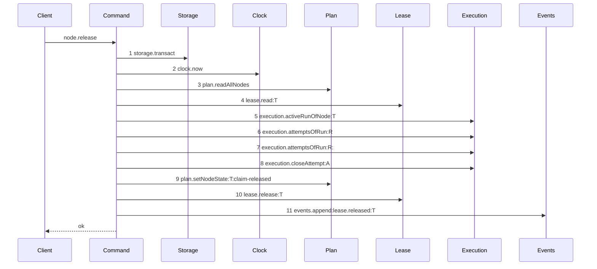
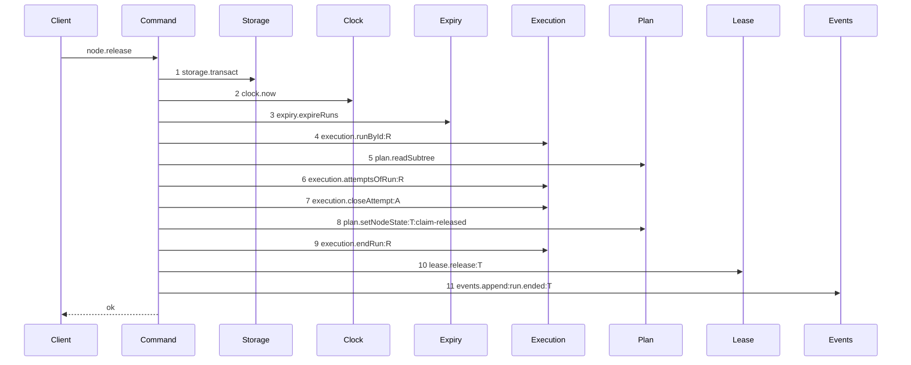

# Story 5 — The release

Epic: `.agents/plan/epics/050.2-the-run-renew-release-and-report.md`
Depends on: Story 1 (`assertRunAuthority`), Story 2 (`execution.runById`), Story 7 (`runId` and `runFence` on the request), EPIC 050.1 Story 2 (`expireRuns`).
Kind: story-implement

Diagrams: release-success

Baselines: release-success <- baseline-release-task

Seams: release-success: +expiry.expireRuns, +execution.runById, +plan.readSubtree, +execution.endRun, +events.append:run.ended, ~execution.attemptsOfRun, -plan.readAllNodes, -lease.read, -execution.activeRunOfNode, -events.append:lease.released

## The shipped path

### `baseline-release-task`

Superseded by: EPIC 050.2 release-success

Shipped path: `src/commands/node/release-node.ts:58-201`. Fixture: task `T` running under run `R`,
one open attempt `A`, the attempt limit not reached.



Citations: `:62`, `:63`, `:65`, `:215`, `:93`, `:101`, `:114`, `:166`, `:171`, `:180`, `:188`. Step 7
repeats the token of step 6, so this path cannot be drawn as a live diagram until the two reads
collapse into one. The shipped path ends no run on this branch, so `execution.endRun` is an addition
and not a move.

### `release-success`

Supersedes: EPIC 050.2 baseline-release-task
Superseded by: EPIC 050.4 release-lease-free

Fixture: the fixture of `baseline-release-task`, plus an active `execution` run `R` over `T`.



Steps 6 to 8 are the shipped attempt close and state write, kept because a release that only ended
the run would leave `T` running under no run, which no claim can take and no report can close. Step 6
is one read where the shipped path read twice. Steps 4 and 5 replace the lease proof and the
node-scoped run lookup with the run proof.

Add `test/sequence/scenarios/release-success.ts`.

## Change

**`src/commands/node/release-node.ts` — insert the authority prelude and end the run.** Inside the
existing `storage.transact` at `:62`:

1. `const now = dependencies.clock.now();` — unchanged, at `:63`.
2. `dependencies.expiry.expireRuns(transaction, { now });` — new.
3. `execution.runById(transaction, input.runId)` — new, replacing `execution.activeRunOfNode` at `:93` and the whole-graph read at `:65`.
4. `plan.readSubtree(transaction, run.nodeId)` — new.
5. `assertRunAuthority(...)`, throwing `ReleaseNodeError(refusal.refusal, ..., { runId })`. This replaces `assertHeld` at `:77` and its `lease.read` at `:215`: the run proves the caller now.

**Collapse the two attempt reads.** `:101` and `:114` call `attemptsOfRun` with one argument. Read
once, and pass that list to both the open-attempt search and `accountAttempts`.

**Keep the attempt close at `:166` and the state write at `:171`.** A release returns the node to
`ready` and cancels the open attempt. The exhausted branch at `:123-165` keeps its own shape:
`blocked` with `attempt-limit`, which this story does not change.

**Add `execution.endRun`** on the non-exhausted branch, which ended no run. The run ends, the fence
rises, and exactly one `run.ended` event is appended with the release's `outcome`.

**Replace `lease.released` with `run.ended`** in both branches.

Add `runId: string` and `runFence: number` to `ReleaseNodeInput` at `:33-38`. The shipped `fence`
field is the **node lease** fence and it stays. The two mechanisms run side by side inside one
transaction until EPIC 050.4.

Add the six authority codes to `ReleaseRefusal` at `:11-17`.

**A release never changes `node.assignment`.** Ending a run writes `run.state = 'ended'` and raises
the fence, and nothing more.

## Constraints

- Read the attempts once. Two reads of one run are two steps of one token, and the parser refuses that.
- Do not delete the attempt close or the state write. Ending the run alone leaves the node `running` under no run.
- Do not change the exhausted branch's outcome. `blocked` with `attempt-limit` is shipped behaviour.
- Do not change the existing `fence` field's meaning. Add `runFence` beside it.
- Do not clear `node.assignment`.

## Verify

```
node --test src/commands/node/release-node.test.ts test/sequence/conformance.test.ts
```

Add, each as a separate `it`:

1. `"a release ends the run and raises the fence"` — assert `state === "ended"` and `fence === 2` for a run opened at `fence: 1`.

2. `"a release returns the node to ready and closes the open attempt"` — assert the node row is `ready` and the attempt's `outcome` is `cancelled`, beside the ended run. Three assertions, one case, so the code cannot drift toward ending the run alone.

3. `"a release reads the attempts once"` — count the `attemptsOfRun` calls of the recorder and assert `1`.

4. `"a release appends exactly one run.ended event and no lease.released"`.

5. `"node.assignment is unchanged after a release"`.

6. `"a release refuses a stale fence"` — assert `refusal === "fence-stale"` and `databaseBytes` unchanged.

7. `"a release refuses an ended run"` — assert `refusal === "run-ended"` and `databaseBytes` unchanged.

8. `"a release on an expired run refuses and writes nothing"` — seed `expires_at: NOW - 1`. Assert the refusal is `run-ended`, and assert `databaseBytes` deep-equals the snapshot: the expiry rolls back with the refusal.

9. `"a release refusal carries only the run id"` — assert the details key set is exactly `["runId"]` for each of the six authority refusals reachable through the command.

10. `"the exhausted branch still blocks with attempt-limit"` — the shipped case, carried across and asserted to end the run and append one `run.ended`.

Add `test/sequence/scenarios/release-success.ts`.

`pnpm run verify` exits 0.

Proof: PASS line delivered — `src/commands/node/release-node.test.ts` in `PASS EPIC-050.2`.
