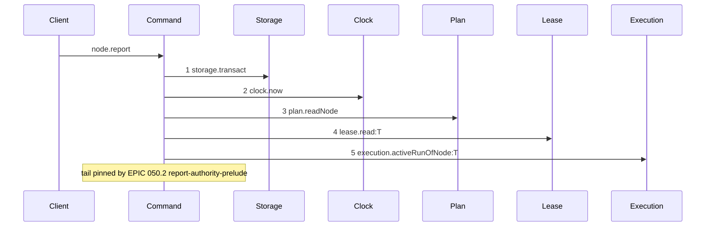
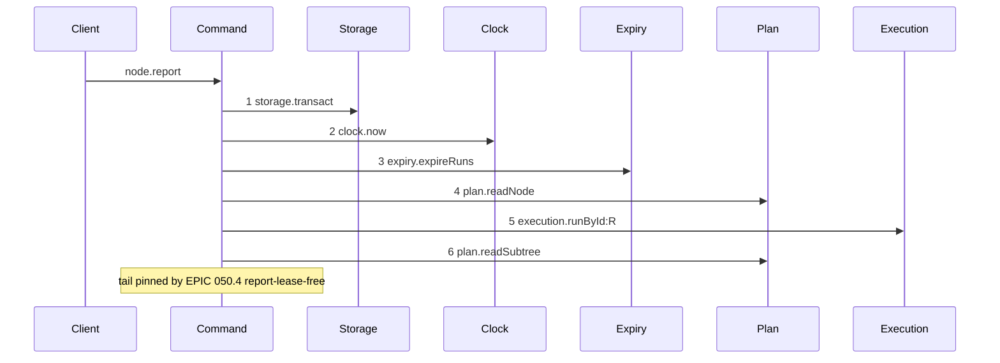

# Story 6 — The report prelude

Epic: `.agents/plan/epics/050.2-the-run-renew-release-and-report.md`
Depends on: Story 1 (`01-run-authority`), for `assertRunAuthority`; Story 2 (`02-the-authority-seams`), for `execution.runById`; Story 7 (`07-the-worker-contract`), for `runId` and `runFence` on the request; EPIC 050.1 Story 2 (`02-the-expiry-pass`), for `expiry.expireRuns`.
Kind: story-implement

Diagrams: report-authority-prelude

Baselines: report-authority-prelude <- baseline-report-prelude

Seams: report-authority-prelude: +expiry.expireRuns, +execution.runById:R, +plan.readSubtree, -lease.read:T, -execution.activeRunOfNode:T

This story changes the prelude of `node.report` and nothing after it. EPIC 050.4 Story 6
(`06-the-report-drops-the-lease`) declares `report-lease-free` and owns the tail. EPIC 051 draws
`acceptExecution` as a nested command on another path — `acceptExecution` exists nowhere in `src/`
today, and EPIC 051.4 draws it with
`Caller->>Command` — so `report-execution-checkpoint` never owned this tail.

**The drawn set is every branch of this prelude.** One diagram covers it, because every one of the six
report members runs the same prelude: the branch on `src/commands/outcome/report-outcome.ts:122` —
`node.kind` sits after the last drawn step, and the note pins everything from there. The five
authority refusals stop inside step 7 and are asserted by code, not by trace.

## The shipped path

### `baseline-report-prelude`

Superseded by: EPIC 050.2 report-authority-prelude

Shipped path: `src/commands/outcome/report-outcome.ts:107` — `transact`, through
`src/commands/outcome/report-outcome.ts:206`. Fixture: task `T` under objective `O` driven to
`running` by the real `claimNode`, so `T` holds a node lease at fence 1 owned by the caller, run `R`
is active over `T`, and one attempt is open; the report body is `rejected` with a `harness` actor, so
`src/commands/outcome/report-outcome.ts:159` — `actorKind` and
`src/commands/outcome/report-outcome.ts:165` — `node.state` both pass.



Each step, with its caller anchor, its callee anchor and the fixture state that reaches it:

1. `src/commands/outcome/report-outcome.ts:107` — `transact` →
   `src/services/storage/index.ts:33` — `transact`. Reached unconditionally.
2. `src/commands/outcome/report-outcome.ts:108` — `now` → `src/services/clock/index.ts:2` — `now`.
   Reached unconditionally.
3. `src/commands/outcome/report-outcome.ts:110` — `readNode` →
   `src/services/plan/index.ts:73` — `readNode`. Reached unconditionally. It carries
   `src/commands/outcome/report-outcome.ts:112` — `node-not-found` and
   `src/commands/outcome/report-outcome.ts:116` — `initiative-not-reportable`.
4. `src/commands/outcome/report-outcome.ts:173` — `read` → `src/services/lease/index.ts:100` — `read`.
   Reached because the fixture's body is a task report by a `harness` actor on a `running` task, so
   the three refusals between step 3 and step 4 — the body-kind default at
   `src/commands/outcome/report-outcome.ts:155` — `body-kind-mismatch`,
   `src/commands/outcome/report-outcome.ts:161` — `actor-forbidden` and
   `src/commands/outcome/report-outcome.ts:167` — `illegal-transition` — do not fire.
5. `src/commands/outcome/report-outcome.ts:206` — `activeRunOfNode` →
   `src/services/execution/index.ts:76` — `activeRunOfNode`. Reached because the fixture's lease is
   held by the caller at the presented fence, so neither
   `src/commands/outcome/report-outcome.ts:187` — `lease-held` nor
   `src/commands/outcome/report-outcome.ts:203` — `lease-held` fires.

The shipped prelude proves the caller by the lease and finds the run by the node. Nothing after step 5
is compared, because this story changes nothing after step 5.

**Two refusals sit between step 3 and step 4 that the note does not cover**, because they precede the
pin: the actor check and the state check. Neither is a seam call, so neither is a message, and case 8
asserts each still fires.

### `report-authority-prelude`

Supersedes: EPIC 050.2 baseline-report-prelude
Superseded by: EPIC 050.4 report-lease-free

Fixture: the fixture of `baseline-report-prelude`, plus the run `R` presented by id and fence.



Step 4 is the shipped node read, unmoved relative to the authority check: this command already read
the node first, so `node-not-found` and `initiative-not-reportable` keep their shipped precedence
with no reordering. It stays because the tail reads
`src/commands/outcome/report-outcome.ts:122` — `node.kind` and
`src/commands/outcome/report-outcome.ts:165` — `node.state`, and `plan.readSubtree` returns ids alone
and supplies neither. **It is a context token**: the baseline holds it and this diagram holds it, at
one count and one label, so no story declares it.

Steps 5 and 6 replace the lease proof and the node-scoped run lookup. Only step 3 is new to the path.

This story pins the prelude, because the prelude is what it changes. EPIC 050.4 Story 6
(`06-the-report-drops-the-lease`) declares `report-lease-free`, draws the whole path and owns the
tail, and the range gate refuses if it does not. **The note claims one thing: no seam call after it
moves.** This story deletes no seam call inside the tail, so the note stands beside no `~` token.

Add `test/sequence/scenarios/report-authority-prelude.ts`.

## Change

**`src/commands/outcome/report-outcome.ts` — replace the lease proof with the run proof.** `expiry`
joins the dependency object at
`src/commands/outcome/report-outcome.ts:52` — `ReportOutcomeDependencies`, which holds nine keys
today and no `expiry`. Inside the existing `storage.transact` at
`src/commands/outcome/report-outcome.ts:107` — `transact`:

1. `const now = dependencies.clock.now();` — unchanged, at
   `src/commands/outcome/report-outcome.ts:108` — `now`.
2. `dependencies.expiry.expireRuns(transaction, { now });` — new, immediately after the clock read
   and before the node read.
3. `plan.readNode(transaction, input.nodeId)` at
   `src/commands/outcome/report-outcome.ts:110` — `readNode` — unchanged, with its two refusals
   unchanged.
4. `execution.runById(transaction, input.runId)` — new, replacing
   `src/commands/outcome/report-outcome.ts:206` — `activeRunOfNode`. The
   `src/commands/outcome/report-outcome.ts:209` — `illegal-transition` that guarded a null run is
   replaced by `run-not-found`, which Story 1 (`01-run-authority`) owns; delete the
   `{ guard: "no-active-run" }` details at
   `src/commands/outcome/report-outcome.ts:211` — `no-active-run`.
5. `plan.readSubtree(transaction, run.nodeId)` — new. The node the report targets is inside the
   subtree the run covers, and `assertRunAuthority` needs the whole set.
6. `assertRunAuthority(...)`, throwing `ReportOutcomeError(refusal.refusal, …, { runId })`. This
   replaces the lease read at `src/commands/outcome/report-outcome.ts:173` — `read` and both of its
   refusals: the held-by-other branch at
   `src/commands/outcome/report-outcome.ts:187` — `lease-held`, whose details carry
   `src/commands/outcome/report-outcome.ts:193` — `relation`, and the bare branch at
   `src/commands/outcome/report-outcome.ts:203` — `lease-held`, which carries no details at all.

Everything after step 6 keeps its shipped shape, including the `lease.release` at
`src/commands/outcome/report-outcome.ts:282` — `release` and the `plan.readAllNodes` at
`src/commands/outcome/report-outcome.ts:310` — `readAllNodes`. EPIC 051 rewrites the body and EPIC
050.4 Story 6 (`06-the-report-drops-the-lease`) removes the release.

Add `runId: string` and `runFence: number` to `ReportOutcomeInput` at
`src/commands/outcome/report-outcome.ts:70` — `ReportOutcomeInput`. They sit on the **input**, not on
the body union, because `src/commands/outcome/report-outcome.ts:31` — `closed` carries no `fence` and
a run is presented on every member. The shipped body `fence` is the **node lease** fence and it stays.

Add the six authority codes to `ReportOutcomeRefusal` at
`src/commands/outcome/report-outcome.ts:79` — `ReportOutcomeRefusal`.

**`lease-held` becomes unreachable on this command and it is not removed.** Step 6 deletes both
throw sites, and no other site in the file throws it. Keep the member at
`src/commands/outcome/report-outcome.ts:85` — `lease-held` and keep its mapping at
`src/http/server/node/refusals.ts:83` — `lease-held`; EPIC 050.4 Story 8
(`08-lease-held-is-retired`) retires the code across the product, and removing it here would take
that story's work.

**A report never changes `node.assignment`**, for the reason Story 5 (`05-the-release`) states: no
`PlanStore` method touches the column.

## Constraints

- Change nothing after the authority check. The note pins the boundary, and EPIC 050.4 Story 6
  (`06-the-report-drops-the-lease`) owns the tail.
- Leave the node read where it is. It already precedes the authority check, and moving it would make
  `node-not-found` and `initiative-not-reportable` unreachable.
- `plan.readSubtree` is added beside `plan.readNode`; it does not replace it. The subtree serves the
  authority check and the node row serves the tail, and neither answers the other's question.
- Do not change the existing body `fence` field's meaning. `runId` and `runFence` go on the input.
- The prelude runs for all six members of the report union, including `closed`.
- Keep `lease-held` on `ReportOutcomeRefusal`. It is unreachable, not removed.
- Keep the actor check and the state check. They sit before the pin and they still fire.

## Verify

```
node --test src/commands/outcome/report-outcome.test.ts test/sequence/conformance.test.ts
```

Extend `src/commands/outcome/report-outcome.test.ts`, suite name at
`src/commands/outcome/report-outcome.test.ts:554` — `describe`. Its driver is
`src/commands/outcome/report-outcome.test.ts:184` — `createReportFixture`, its no-write helper is
`src/commands/outcome/report-outcome.test.ts:490` — `assertNoWrite` over the baseline at
`src/commands/outcome/report-outcome.test.ts:475` — `WriteBaseline`, and it snapshots through
`test/helpers/database.ts:117` — `databaseBytes`. The two objective commands are hand-written
recorders at `src/commands/outcome/report-outcome.test.ts:196` — `reportObjective` and
`src/commands/outcome/report-outcome.test.ts:204` — `closeObjective`.

Add, each as a separate `it`:

1. `"a report refuses a stale fence"` — run `fence: 2`, presented `runFence: 1`. Assert
   `refusal === "fence-stale"` and `databaseBytes` unchanged.

2. `"a report refuses an ended run"` — seed `state: 'ended'`. Assert `refusal === "run-ended"` and
   `databaseBytes` unchanged.

3. `"a report on an expired run refuses and writes nothing"` — seed `expires_at: NOW - 1`. Assert the
   refusal is `run-ended` and `databaseBytes` deep-equals the snapshot.

4. `"a report refuses a target outside the run"` — an existing sibling task from
   `test/helpers/rows.ts:184` — `seedSiblingTask`, presented with the run of `T`. Assert
   `refusal === "target-outside-run"`.

5. `"a report on an unknown node refuses node-not-found, not target-outside-run"` — present a valid
   `runId` and `runFence` with `nodeId: "task_zzz"`. Assert `refusal === "node-not-found"`. Case 4 is
   its control.

6. `"a report on an initiative refuses initiative-not-reportable, not target-outside-run"` — the
   shipped case at `src/commands/outcome/report-outcome.test.ts:992` — `it`, carried across with a
   valid `runId` and `runFence`, plus the added assertion that the code is not
   `"target-outside-run"`. Cases 5 and 6 prove the node read still precedes the authority check.

7. `"a report refusal carries only the run id"` — for each of the six authority refusals reachable
   through the command, assert the details key set is exactly `["runId"]`.

8. `"the actor check and the state check still fire ahead of the authority check"` — a `human` actor
   with a valid run refuses `actor-forbidden`, and a non-running task with a valid run refuses
   `illegal-transition`. Both are asserted in one case, carrying across
   `src/commands/outcome/report-outcome.test.ts:967` — `it` and
   `src/commands/outcome/report-outcome.test.ts:883` — `it`.

9. `"the prelude runs for the closed member"` — a `closed` report with a stale `runFence` refuses
   `fence-stale`, proving the check is not bound to the members that carry a body fence.

10. `"node.assignment is unchanged after a rejection"` — read the raw `assignment` column of the node
    row by SQL before and after, and assert equality.

11. `"no report path throws lease-held"` — drive every reachable refusal of the command and assert
    none carries `refusal === "lease-held"`. The control is case 1, which proves a stale run fence
    reports `fence-stale` and not the retired code.

12. `"every shipped report case still passes"` — carry all thirty shipped cases of the file across
    with `runId` and `runFence` added to their inputs, and with the two `lease-held` cases at
    `src/commands/outcome/report-outcome.test.ts:902` — `it` rewritten to the authority codes.

Add `test/sequence/scenarios/report-authority-prelude.ts`, building the fixture the diagram names,
running the real `reportOutcome` over real SQLite behind the recorder, binding
`reportObjective` and `closeObjective` to unrecorded dependencies, and returning the recorder and the
result.

`pnpm run verify` exits 0.

Proof: PASS line delivered — `src/commands/outcome/report-outcome.test.ts` in `PASS EPIC-050.2`.
