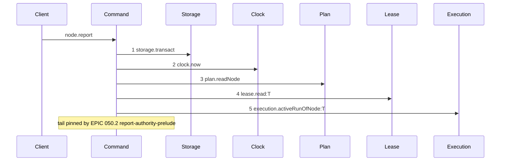
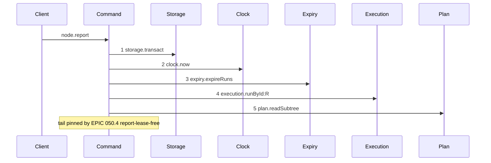

# Story 6 — The report prelude

Epic: `.agents/plan/epics/050.2-the-run-renew-release-and-report.md`
Depends on: Story 1 (`assertRunAuthority`), Story 2 (`execution.runById`), Story 7 (`runId` and `runFence` on the request), EPIC 050.1 Story 2 (`expireRuns`).
Kind: story-implement

Diagrams: report-authority-prelude

Baselines: report-authority-prelude <- baseline-report-prelude

Seams: report-authority-prelude: +expiry.expireRuns, +execution.runById, +plan.readSubtree, -plan.readNode, -lease.read, -execution.activeRunOfNode

This story changes the prelude of `node.report` and nothing after it. EPIC 051 declares
`report-execution-checkpoint` and owns the tail.

## The shipped path

### `baseline-report-prelude`

Superseded by: EPIC 050.2 report-authority-prelude

Shipped path: `src/commands/outcome/report-outcome.ts:107-206`. Fixture: task `T` running under run
`R`, the lease held by the caller.



Citations: `:107`, `:108`, `:110`, `:173`, `:206`. The shipped prelude proves the caller by the lease
and finds the run by the node. Nothing after step 5 is compared, because this story changes nothing
after step 5.

### `report-authority-prelude`

Supersedes: EPIC 050.2 baseline-report-prelude
Superseded by: EPIC 050.4 report-lease-free



This story pins the prelude, because the prelude is what it changes. EPIC 050.4 Story 8 declares
`report-lease-free`, draws the whole path and owns the tail, and the range gate refuses if it does
not. EPIC 051 then supersedes `report-lease-free`.

Add `test/sequence/scenarios/report-authority-prelude.ts`.

## Change

**`src/commands/outcome/report-outcome.ts` — replace the lease proof with the run proof.** Inside the
existing `storage.transact` at `:107`:

1. `const now = dependencies.clock.now();` — unchanged, at `:108`.
2. `dependencies.expiry.expireRuns(transaction, { now });` — new.
3. `execution.runById(transaction, input.runId)` — new, replacing `execution.activeRunOfNode` at `:206`.
4. `plan.readSubtree(transaction, run.nodeId)` — new, replacing `plan.readNode` at `:110`. The node the report targets is inside the subtree the run covers, and `assertRunAuthority` needs the whole set.
5. `assertRunAuthority(...)`, throwing `ReportOutcomeError(refusal.refusal, ..., { runId })`. This replaces the lease read at `:173`.

Everything after step 5 keeps its shipped shape. EPIC 051 rewrites it.

Add `runId: string` and `runFence: number` to `ReportOutcomeInput` at `:70-75`. The shipped `fence`
field is the **node lease** fence and it stays.

Add the six authority codes to `ReportOutcomeRefusal` at `:79-85`.

**A report never changes `node.assignment`.**

## Constraints

- Change nothing after the authority check. The note pins the boundary, and EPIC 051 owns the tail.
- `plan.readSubtree` replaces `plan.readNode`. Do not keep both: a read no refusal needs is not taken.
- Do not change the existing `fence` field's meaning. Add `runFence` beside it.
- The prelude runs for all six members of the report union, including `closed`.

## Verify

```
node --test src/commands/outcome/report-outcome.test.ts test/sequence/conformance.test.ts
```

Add, each as a separate `it`:

1. `"a report refuses a stale fence"` — assert `refusal === "fence-stale"` and `databaseBytes` unchanged.

2. `"a report refuses an ended run"` — assert `refusal === "run-ended"` and `databaseBytes` unchanged.

3. `"a report on an expired run refuses and writes nothing"` — seed `expires_at: NOW - 1`. Assert the refusal is `run-ended` and `databaseBytes` deep-equals the snapshot.

4. `"a report refuses a target outside the run"` — assert `refusal === "target-outside-run"`.

5. `"a report refusal carries only the run id"` — assert the details key set is exactly `["runId"]` for each of the six.

6. `"the prelude runs for the closed member"` — a `closed` report with a stale fence refuses `fence-stale`, proving the check is not bound to the members that carry a lease fence.

7. `"node.assignment is unchanged after a rejection"`.

8. `"every shipped report case still passes"` — carry the file's existing cases across with `runId` and `runFence` added to their inputs.

Add `test/sequence/scenarios/report-authority-prelude.ts`.

`pnpm run verify` exits 0.

Proof: PASS line delivered — `src/commands/outcome/report-outcome.test.ts` in `PASS EPIC-050.2`.
