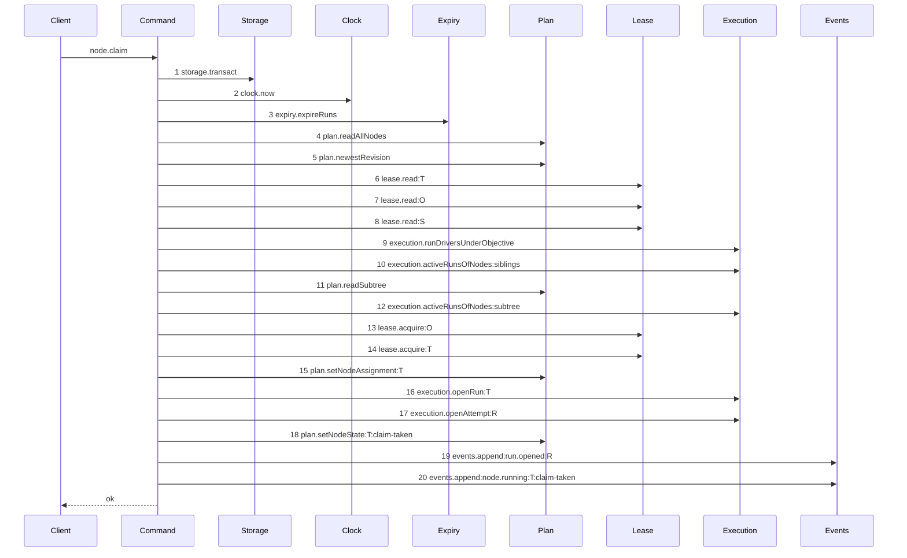
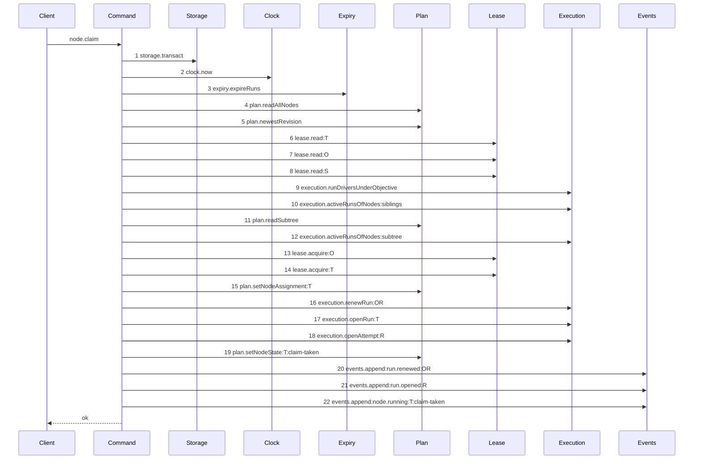

# Story 10 — The reused objective run

Epic: `.agents/plan/epics/050.2-the-run-renew-release-and-report.md`
Depends on: Story 2 (`02-the-authority-seams`), for `execution.renewRun`; Story 3 (`03-the-renew`), for the `run.renewed` event type and its payload; EPIC 050.1 Story 3 (`03-the-claim-of-a-task`), for the reuse branch this story changes.
Kind: story-implement

Diagrams: claim-reuse-objective-run

Baselines: claim-reuse-objective-run <- baseline-claim-reuse

Seams: claim-reuse-objective-run: +execution.renewRun:OR, +events.append:run.renewed:OR

A task claim opens **or reuses** one structural run over the objective. EPIC 050.1 drew the branch
that opens one; it drew no diagram of the branch that reuses one. This story draws that branch and
changes it: a reused run keeps the expiry its last writer left, and the claim now moves it forward.

## The shipped path

### `baseline-claim-reuse`

Superseded by: EPIC 050.2 claim-reuse-objective-run

Fixture: `O` is `running` and holds an active `structural` run `OR` and a live objective lease owned
by the caller. `T` is `ready` and declares `deliverable: implementation`, so its run kind is
`execution`. `S` is a `ready` sibling task under `O` with no run.



Step 1 is `src/commands/node/claim-node.ts:146` — `transact`. Step 2 is
`src/commands/node/claim-node.ts:147` — `now`. Step 3 is
`src/commands/node/claim-node.ts:148` — `expireRuns`. Step 4 is
`src/commands/node/claim-node.ts:150` — `readAllNodes`. Step 5 is
`src/commands/node/claim-node.ts:217` — `newestRevision`. Steps 6 to 8 are the loop at
`src/commands/node/claim-node.ts:747` — `read`, over the target, the objective and the siblings.
Step 9 is `src/commands/node/claim-node.ts:266` — `runDriversUnderObjective`. Step 10 is
`src/commands/node/claim-node.ts:292` — `activeRunsOfNodes`. Step 11 is
`src/commands/node/claim-node.ts:318` — `readSubtree`. Step 12 is
`src/commands/node/claim-node.ts:322` — `activeRunsOfNodes`. Steps 13 and 14 are
`src/commands/node/claim-node.ts:377` — `acquireWithHierarchyRefusal` and
`src/commands/node/claim-node.ts:391` — `acquireWithHierarchyRefusal`, both reaching
`src/commands/node/claim-node.ts:592` — `acquire`. Step 15 is
`src/commands/node/claim-node.ts:400` — `setNodeAssignment`. Step 16 is
`src/commands/node/claim-node.ts:428` — `openRun`, the **task** run; the objective run is the row
already in the table, and the shipped branch writes nothing to it. Step 17 is
`src/commands/node/claim-node.ts:443` — `openAttempt`. Step 18 is
`src/commands/node/claim-node.ts:445` — `setNodeState`. Step 19 is
`src/commands/node/claim-node.ts:466` — `append`, which appends `run.opened` for the newly opened
runs only: the guard at `src/commands/node/claim-node.ts:459` — `reusableObjectiveRun` keeps the
reused run out of that list, so this branch appends one `run.opened`, not two. Step 20 is
`src/commands/node/claim-node.ts:517` — `append`.

**No cascade appears.** `O` and `I` are already `running`, so the `ancestor-started` transitions and
their `node.running` events are not reached. That is what makes this a different path from
`claim-success-task`, which finds them `ready`.

## The path this story ships

### `claim-reuse-objective-run`

Supersedes: EPIC 050.2 baseline-claim-reuse

Fixture: the fixture of `baseline-claim-reuse`.



Two steps are new, and every other step is context.

**Step 16 is where the shipped branch wrote nothing.** It sits in the position the fresh branch fills
with `execution.openRun:O`, because both branches answer one question: which structural run covers
this objective, and until when. A reused run keeps the expiry its last writer left, so a claim that
took it as it stands hands the worker a run that can be minutes from expiry while the worker is told
to renew after `runTtlMs / 3`. The expiry pass then ends the objective run under a live task run, it
raises that run's fence, and the later attest or close refuses `run-ended`.

**Step 20 is one event for one moved row.** The reused run is not opened, so `run.opened` is wrong
for it, and Story 3 (`03-the-renew`) already registered `run.renewed` with its producer. It precedes
step 21 for the same reason the fresh branch appends the objective run's `run.opened` before the task
run's: the objective is the outer authority and it is written first.

Add `test/sequence/scenarios/claim-reuse-objective-run.ts`.

## Change

`src/commands/node/claim-node.ts:404-427` reads:

```ts
const objectiveRun =
  node.kind === "task"
    ? (reusableObjectiveRun ?? dependencies.execution.openRun(transaction, { ... }))
    : undefined;
```

Split the two branches, because they now do different work:

```ts
const objectiveRun =
  node.kind === "task"
    ? reusableObjectiveRun === undefined
      ? dependencies.execution.openRun(transaction, { ... })
      : dependencies.execution.renewRun(transaction, {
          runId: reusableObjectiveRun.id,
          expiresAt: Math.min(
            now + dependencies.runTtlMs,
            reusableObjectiveRun.maxLifetimeAt,
          ),
        })
    : undefined;
```

The clamp is the reused run's **own** `max_lifetime_at`, never `now + runMaxLifetimeMs`. A budget a
claim could extend is not a budget, and `runMaxLifetimeMs` bounds the whole objective attempt.

Append `run.renewed` for the reused run immediately before the `run.opened` loop at
`src/commands/node/claim-node.ts:459` — `reusableObjectiveRun`, under the mirror of that guard. The
payload is Story 3's: `runId`, `nodeId`, `fence` and `expiresAt`. The `fence` is unchanged by a
renewal, which is the same rule the renew states.

## Constraints

- Do not touch the fresh branch. `execution.openRun` on the objective, its `run.opened` event and
  `claim-success-task` are all unchanged, and the `Seams:` line of this story holds no sign for them.
- Do not renew a run this claim did not reuse. The guard is `reusableObjectiveRun !== undefined`,
  which is the same condition the event guard already tests.
- The fence does not move. A renewal writes `expires_at` only, per Story 2
  (`02-the-authority-seams`).
- Clamp to the reused run's `max_lifetime_at`, not to a fresh budget.
- Register no event type. Story 3 (`03-the-renew`) owns `run.renewed` with its producer, and this is
  a second producer of a type that already exists.

## Verify

```
node --test src/commands/node/claim-node.test.ts test/sequence/conformance.test.ts
```

Add, each as a separate `it` in `src/commands/node/claim-node.test.ts`:

1. `"a second claim reuses the objective run and moves its expires_at forward"` — claim `T`, end its
   run, release its lease, return it to `ready`, and claim again at a later `now`. Assert the second
   claim names the first objective run id, that its `expires_at` equals `later + runTtlMs`, that it
   is greater than the value before the second claim, and that its `max_lifetime_at` is unchanged.
   The last assertion is the one that catches a fresh budget written over the old one.

2. `"a new acquisition over a freed row is not mistaken for a replay"` — the shipped case at
   `src/commands/node/claim-node.test.ts:2159` — `it`, with its event tally raised by one and the
   last three types asserted as `run.renewed`, `run.opened`, `node.running`. The reuse branch appends
   the renewal event and the fresh branch does not, so the tally is the discriminator.

3. `"the objective run fence and the objective lease fence are separate counters"` — claim `T`, end
   its run, expire the owner's leases, return `T` to `ready`, and claim again. Assert the objective
   run id is unchanged, `objectiveLease.fence` is 2, `objectiveRunFence` is 1, and `objectiveRunFence`
   equals the run row's `fence`. This case belongs to Story 7 (`07-the-worker-contract`) by subject
   and to this story by fixture: it is the only place where a reused run and a retaken lease meet.

Add `test/sequence/scenarios/claim-reuse-objective-run.ts`, seeding the fixture the two diagrams
name, running the real `claimNode` over real SQLite behind the recorder, and returning the recorder
and the result. Alias the reused run to `OR` and the opened task run to `R`.

`pnpm run verify` exits 0.

Proof: PASS line delivered — `test/sequence/conformance.test.ts` in `PASS EPIC-050.2`.
