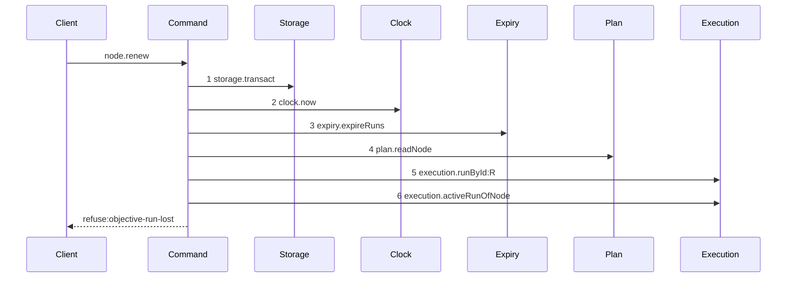

# Story 1 — The lost objective run is announced

Epic: `.agents/plan/epics/050.2.1-the-promised-expiry-and-the-explicit-recovery.md`
Depends on: EPIC 050.2 Story 3 (`03-the-renew`), for the renew path and the objective run read; EPIC 050.2 Story 7 (`07-the-worker-contract`), for the error code table and the response schema.
Kind: story-implement

Diagrams: renew-refusal-objective-run-lost

Baselines: renew-refusal-objective-run-lost <- baseline-renew-task

Seams: renew-refusal-objective-run-lost: +expiry.expireRuns, +plan.readNode, +execution.runById:R, +execution.activeRunOfNode, -plan.readAllNodes

A human ruled the rule this story carries: **the daemon promises an expiry and keeps it, and no
recovery is silent.** `max_lifetime_at` is absolute on every path, and when a client outlives the
authority it was given, the client is told and chooses. Story 2 (`02-the-explicit-recovery`) carries
the choosing.

## The refusal path

### `renew-refusal-objective-run-lost`

Supersedes: EPIC 050.2 baseline-renew-task

Fixture: the fixture of `baseline-renew-task`, with the structural run over the objective absent —
either never opened, or ended by the expiry pass at step 3 of this same transaction.



**No lease step and no write step appears, and that absence is the assertion.** `Lease` and `Events`
leave the participant list. A renew that renewed a lease or wrote a run row before deciding this
refusal fails the comparison.

**Step 6 is why Story 3 moved the read.** `renew-success` reads the objective run at step 6, ahead of
`lease.renew:T`, for this refusal alone: read after the lease renewal, the refusal would roll back
writes it had already made, and a refusal writes nothing.

**Step 3 is inside the refusal.** The expiry pass at step 3 is what usually removes the objective
run: it reaches its `max_lifetime_at`, the pass ends it and appends `run.expired`, and step 6 then
finds nothing. That expiry rolls back with the refusal, exactly as EPIC 050.1 states — the run is due
and the next operation sweeps it again. The row the client is told about is therefore still `active`
when it reads the database, and it is still due. That is not a contradiction: the refusal reports the
authority the client may use, not the row's current state.

This diagram proves no write seam is reached after the refusal point. It does not prove the operation
committed nothing; case 2 below asserts that separately.

Add `test/sequence/scenarios/renew-refusal-objective-run-lost.ts`.

## Change

### 1 — the read moves ahead of the writes

`src/commands/run/renew-run.ts` calls `execution.activeRunOfNode(transaction, objectiveId)` on the
task branch after the authority check and the lifetime check, and **before the first lease write**.
Story 3 (`03-the-renew`) consumed that read at the end of the command; it is one read, taken once, in
the position the refusal needs.

### 2 — the absence is a refusal, not a silence

When the read returns null, throw
`RenewRunError("objective-run-lost", …, { objectiveId })`. Add the code to `RenewRefusal`. The
details key is `objectiveId`, matching `objective-busy` at
`src/commands/node/claim-node.ts:299` — `objectiveBusy`, so a client parses one name for one thing.

The shipped command continued past a null objective run and renewed the task run alone. A worker then
learned that its objective authority was gone at its attest or its close, which is the last write it
makes and the one it cannot retry. The refusal moves that discovery to the renew, which is the
operation whose job is to tell a worker whether it may keep working.

### 3 — the deadline is announced while the authority still holds

`nodeRenewResponse` gains `objectiveExpiresAt: z.int()`, and `RenewRunResult` carries it. For a task
target it is the objective run's `expires_at` after the renewal. For an objective target it equals
the response's own `expiresAt`, because the run it named is the objective's run.

A refusal tells a client that the authority is already gone. This field tells it when the authority
will go, at every renew, while it still holds that authority and can act. Add the field's line to
`src/http/contract/field-decisions.fixture.ts` in bytewise order, and update the
`nodeRenewExamples` success literal.

### 4 — the code is 409 and the proposal names it

Add `objective-run-lost` to `src/http/contract/errors.ts`, appended after `lifetime-exceeded` in the
409 group, and map it in the renew handler's refusal mapping.
`docs/proposal/api/README.md` carries its table row, and
`src/http/contract/errors.test.ts` compares the table with `errorStatuses` by key set and by status,
so the two cannot drift.

## Constraints

- A refusal writes nothing. Every read that can refuse precedes the first write.
- Do not renew any run past its own `max_lifetime_at`, on any path.
- Do not mint, rotate or adopt a run here. Story 2 (`02-the-explicit-recovery`) is the only way a
  client gets a new objective authority, and the client asks for it.
- Do not add a run outcome value. The objective run ends by expiry, and `run.expired` is its event.
- The objective branch of the renew reaches the read and neither the refusal nor the second renewal.

## Verify

```
node --test src/commands/run/renew-run.test.ts src/http/contract/errors.test.ts src/http/contract/example.test.ts test/helpers/proposal.test.ts test/sequence/conformance.test.ts
```

Add, each as a separate `it`:

1. `"a renew announces the objective run's expiry as objectiveExpiresAt"` — assert the value equals
   the objective run row's `expires_at` after the call, not the task run's.

2. `"a task renew whose objective holds no active run is refused objective-run-lost and writes
nothing"` — assert the code, that the database is byte-identical across the call through
   `test/helpers/database.ts` — `databaseBytes`, that the task run's `expires_at` did not move, and
   that no event was appended. The control is the same fixture with a live objective run, which
   renews both runs.

3. `"a task renew whose objective run the expiry pass just ended is refused objective-run-lost and
rolls the expiry back"` — the run reaches its `max_lifetime_at`, step 3 ends it, step 6 finds
   nothing, and the whole transaction rolls back. Assert the code and the byte comparison.

4. `"an ended objective run is refused objective-run-lost, not run-ended"` — `run-ended` belongs to
   the run the request names, and the objective run is not that run.

5. `"an objective renew reports its own expiry as objectiveExpiresAt"` — the objective branch, which
   reaches neither the refusal nor the second renewal.

6. `"a task renew leaves an objective run at its own max_lifetime_at and still renews the task run"` —
   the promise kept: the clamp holds and the task run still moves.

7. `"the expiry pass after a lifetime-bound renew ends the objective run once and mints no
replacement"` — exactly one `run.expired`, and no new run row for that objective node. This is the
   assertion that no path recovers silently.

8. `"objective-run-lost maps to 409"` and the shipped table comparison, both in
   `src/http/contract/errors.test.ts`. Its pinned arrays are positional `deepEqual`, so appending is
   not enough.

Add `test/sequence/scenarios/renew-refusal-objective-run-lost.ts`.

`pnpm run verify` exits 0.

Proof: PASS line delivered — `src/commands/run/renew-run.test.ts` in `PASS EPIC-050.2.1`.
