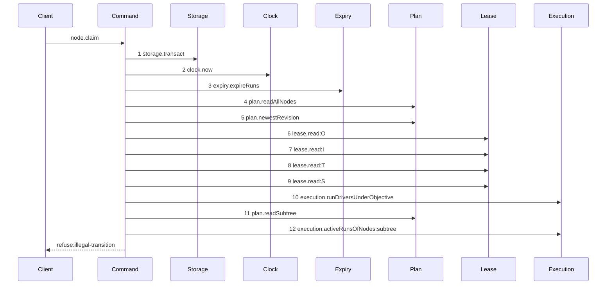
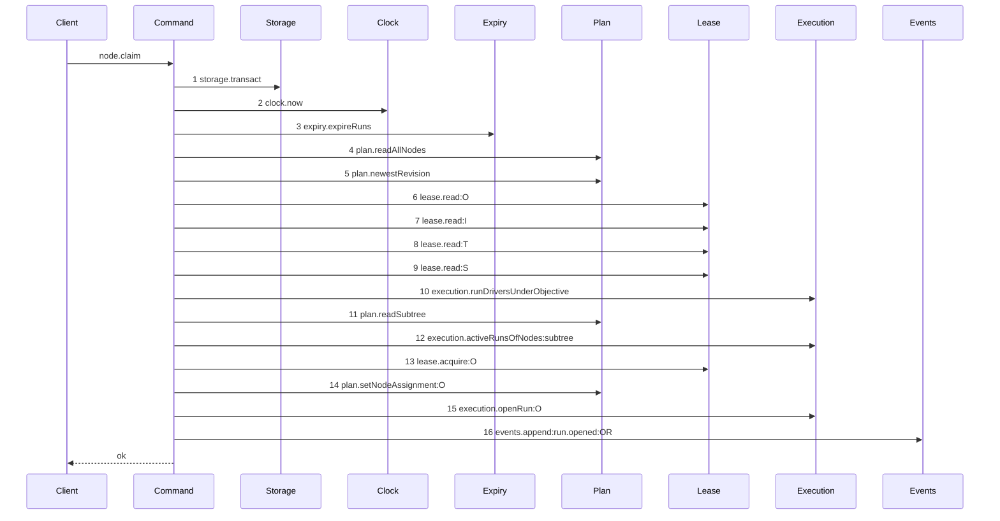

# Story 2 — The explicit recovery

Epic: `.agents/plan/epics/050.2.1-the-promised-expiry-and-the-explicit-recovery.md`
Depends on: Story 1 (`01-the-lost-objective-run-is-announced`), for the refusal that sends a client here; EPIC 050.1 Story 3 (`03-the-claim-of-a-task`), for the claim path this widens.
Kind: story-implement

Diagrams: claim-recovers-objective-authority

Baselines: claim-recovers-objective-authority <- baseline-claim-objective-running

Seams: claim-recovers-objective-authority: +lease.acquire:O, +plan.setNodeAssignment:O, +execution.openRun:O, +events.append:run.opened:OR

Story 1 (`01-the-lost-objective-run-is-announced`) tells a client that its objective authority is
gone. This story is what the client does about it, and the client is what does it.

## The shipped path

### `baseline-claim-objective-running`

Superseded by: EPIC 050.2.1 claim-recovers-objective-authority

Fixture: `O` is a `running` objective carrying `deliverable: expansion`, whose structural run reached
its `max_lifetime_at` and was ended by the expiry pass. `I` is `running`. `T` and `S` are its tasks,
neither holding a live run. No run under `O` is live.



Step 1 is `src/commands/node/claim-node.ts:146` — `transact`. Step 2 is `:147` — `now`. Step 3 is
`:148` — `expireRuns`. Step 4 is `:150` — `readAllNodes`. Step 5 is `:217` — `newestRevision`.
Steps 6 to 9 are the live-lease loop at `:747` — `read`, over the target and its hierarchy. Step 10
is `:266` — `runDriversUnderObjective`. Step 11 is `:318` — `readSubtree`. Step 12 is
`:322` — `activeRunsOfNodes`. The refusal is `:368` — `node.state !== "ready"`, which answers
`illegal-transition` with details `{ state: "running", admitted: ["ready", "running"] }`.

**The refusal's own details name a state the code refuses.** `admitted` lists `running`, and the
guard admits only `ready`. That inconsistency shipped, and this story resolves it in favour of the
message rather than the guard.

**No sibling read appears.** `execution.activeRunsOfNodes:siblings` and the `objective-busy` decision
at `:292-299` are reached only when `node.kind === "task"`, so an objective claim skips them. That is
what makes this a different path from `claim-success-task`.

## The path this story ships

### `claim-recovers-objective-authority`

Supersedes: EPIC 050.2.1 baseline-claim-objective-running

Fixture: the fixture of `baseline-claim-objective-running`.



Steps 1 to 12 are the baseline's reads, unmoved. Four steps are new, and they are the four the
refusal used to stand in front of.

**Step 12 is the guard, not step 13.** `subtreeExclusion` at
`src/commands/node/claim-node.ts:343` consumes step 12 and refuses `subtree-busy` while any live run
sits under `O`, and it runs **before** the state check at `:368`. The admission therefore needs no
check of its own: a recovery cannot take authority from live work, because the exclusion rule already
refused that case two steps earlier. Adding a second liveness check here would be a second rule about
the same question.

**No `plan.setNodeState` appears, and that absence is the assertion.** `O` is already `running`. A
transition from `ready` would be illegal, and a transition from `running` to `running` would write a
node event for a state that did not change. The claim skips the target's own transition and its own
`node.running` event when the node is already running. The ancestor cascade is untouched: it already
skips a running ancestor.

**Step 15 opens a run; it adopts none.** The old structural run ended by expiry and its fence rose,
which is what invalidated the client's stale pair. The new run starts at fence 1 and is a different
run id, so the client's old `objectiveRunId` and `objectiveRunFence` are dead and cannot be replayed.
Step 16 is its `run.opened`.

Add `test/sequence/scenarios/claim-recovers-objective-authority.ts`.

## Change

### 1 — the state gate admits a running objective

`src/commands/node/claim-node.ts:368` refuses every state that is not `ready`. Compute
`const alreadyRunning = node.kind === "objective" && node.state === "running";` once, above the
routing line at `:205`, and admit it at the state gate. Every other state keeps its refusal, and a
running **task** keeps its refusal too: a task whose run expired returns to `ready` on its own when
its lease expires, at `src/commands/startup/recover-expired-leases.ts:129-133`, so it never needs
this door. Nothing returns an objective to `ready`, which is why the objective gets one.

### 2 — a recovery does not route

`src/commands/node/claim-node.ts:205-207` routes a worker by the claimed node's own deliverable. A
phase-2 objective carries `expansion`, and no registered worker can produce it — EPIC 046 records
that `expansion` is claimable by an internal worker only, and none is registered until phase 2. A
recovery claim would therefore refuse `unroutable` for exactly the objectives that can strand, while
`nodePairLegality("objective", "expansion")` at `src/domain/node-pair.ts:48` says the pair is legal.

`routedWorker` becomes `node.assignment ?? (alreadyRunning ? caller.worker : routeClaimWorker(…))`.
Routing picks a worker to start work. A recovery re-establishes an envelope over work that already
happened, and the structural run a task claim mints already carries the **task's** routed worker
rather than one routed for the objective, so the caller's own worker is the value that was always
used here. `node.assignment` still wins when set, and the `assignment-held` guard at `:193` has
already proved any non-null assignment equals the caller's worker.

### 3 — the target's own transition is skipped when it is already running

Skip the `plan.setNodeState` at `:445` and the `node.running` append at `:517` when `alreadyRunning`.

## Constraints

- Rely on `subtreeExclusion` for the liveness guard. Do not add a second check of live runs under the
  objective; it runs before the state gate and it already refuses `subtree-busy`.
- Widen the state gate for an objective only. A running task keeps its refusal.
- Do not relax routing for a `ready` objective. The widening is scoped to the recovery admission.
- Adopt no run. The recovery opens a fresh structural run at fence 1, and the old run stays ended.
- Write no state transition for a node already in the state it would move to.

## Verify

```
node --test src/commands/node/claim-node.test.ts test/sequence/conformance.test.ts scripts/verify-epic-sequence.test.ts
```

Add, each as a separate `it` in `src/commands/node/claim-node.test.ts`:

1. `"a claim recovering a running objective takes the caller worker and does not route"` — a
   `running` objective carrying `expansion` with no live run under it, claimed by a caller whose
   worker is `claude@1`. Assert the claim is admitted, that `objectiveRunId` equals `runId`, that
   both fences are 1, and that the run row is `structural` on the objective at fence 1 with
   `worker: "claude@1"`. Without the routing change this case refuses `unroutable`.

2. `"a claim on a ready objective carrying expansion still refuses unroutable with failedSet
capable"` — the control that proves the widening is scoped to the recovery admission.

3. `"a claim on a running objective writes no node state change"` — assert no `plan.setNodeState`
   for the target and no `node.running` event for it, with the opened run and its `run.opened` event
   asserted beside them so the case cannot pass by doing nothing.

4. `"a claim on a running objective is refused subtree-busy while a task run under it is live"` — the
   control that a recovery never takes authority from live work.

5. `"a claim on an objective that is neither ready nor running is refused illegal-transition"` — the
   control that the admission widened the gate by exactly one state.

6. `"a claim recovers objective authority after the structural run reached its lifetime"` — the
   end-to-end case: claim a task, let the objective run reach its lifetime and be expired by the
   pass, report the task under its own intact authority, assert an attest bound to the old objective
   run refuses `run-ended`, claim the objective, and assert the attest succeeds under the new pair.
   This is the case that proves the defect is closed, and it is the one a reviewer reads first.

Add `test/sequence/scenarios/claim-recovers-objective-authority.ts`, and register it in
`epic0502ScenarioCases` of `test/sequence/conformance.test.ts` beside this story's path.

Append `"050.2.1"` to `shippedEpics` in `scripts/epic-sequence-range.ts`, which is what makes both
diagrams of this epic due a scenario.

`pnpm run verify` exits 0.

Proof: PASS line delivered — `src/commands/node/claim-node.test.ts` in `PASS EPIC-050.2.1`.
