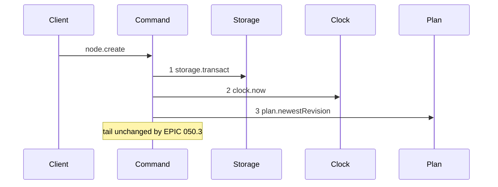
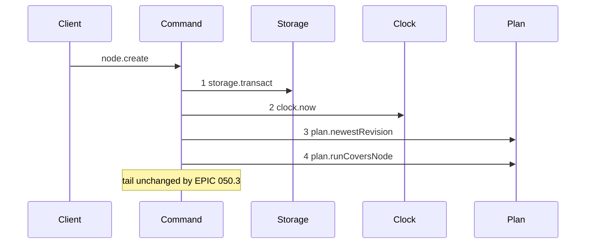

# Story 2 — The create-node guard

Epic: `.agents/plan/epics/050.3-the-plan-write-guard.md`
Depends on: Story 1 (`plan.runCoversNode`), Story 8 (`subtree-busy` on `node.create`).
Kind: story-implement

Diagrams: create-node-guard

Baselines: create-node-guard <- baseline-create-node

Seams: create-node-guard: +plan.runCoversNode

## The shipped path

### `baseline-create-node`

Superseded by: EPIC 050.3 create-node-guard

Shipped path: `src/commands/node/create-node.ts:84-135`. Fixture: project `P` holds initiative `I`,
which holds objective `O`. The write creates a task under `O`, `fromRevision` names the newest
revision, and no run is active.



Citations: `:84`, `:85`, `:97`. The project existence check at `:86` reads through the transaction
object, which is not a dependency key, so it is no message.

The tail this note pins is `ids.mint` at `:113` and `:114`, `blobs.put` at `:116` and `:122`,
`plan.readGraph` at `:128`, `plan.readValidationContext` at `:183`, `revision.render` at `:229`,
`revision.record` at `:232`, `plan.mutateGraph` at `:260` and `events.append` at `:275`. None of them
moves: this story inserts one read ahead of all of them and changes nothing after.

### `create-node-guard`

Supersedes: EPIC 050.3 baseline-create-node

Fixture: the fixture of `baseline-create-node`.



Step 4 sits after the `stale-revision` check and before `ids.mint` at `:113`, which is the first call
of the tail. Every write of this command is inside the pinned tail, so the drawn ordinal is what
proves the refusal writes nothing.

Add `test/sequence/scenarios/create-node-guard.ts`.

## Change

**`src/commands/node/create-node.ts` — insert one guard.** After the `stale-revision` throw at
`:100-110` and before `const id = dependencies.ids.mint(...)` at `:113`:

```ts
const covering = dependencies.plan.runCoversNode(
  transaction,
  input.node.kind === "initiative" ? [] : [input.node.parentId],
  at,
);
if (covering !== null) {
  throw new NodeWriteError("subtree-busy", "an active run covers the parent", {
    relation: covering.relation,
    nodeId: covering.nodeId,
    runId: covering.runId,
    expiresAt: covering.expiresAt,
  });
}
```

**The seed is the parent id, and an initiative seeds nothing.** The new node has no id yet, so a run
over it cannot exist; the parent is what the write changes. An initiative is a root and has no
parent, so its seed is empty and `runCoversNode` returns `null` without a query, per Story 1.

Add `"subtree-busy"` to the refusal union of `NodeWriteError` for this command.

**This is a refusal `create-node` never had.** `grep -n "lease" src/commands/node/create-node.ts`
returns nothing: the command holds no lease guard today, and appending a child under a claimed
objective is admitted. No test regresses, because none existed. The story adds new cases and names
them as an addition.

## Constraints

- The guard sits inside the transaction opened at `:84`. Open no second transaction.
- Pass the `at` value read at `:85`. Do not read the clock a second time.
- The guard follows `project-not-found` and `stale-revision`, which cost one read each and name a cause the caller can act on first.
- The guard precedes `ids.mint` at `:113`. Every write of this command is after that point, so a refusal writes nothing.
- Seed the parent, never the new node.
- Change no other refusal, no blocker list and no response shape.

## Verify

```
node --test src/commands/node/create-node.test.ts test/sequence/conformance.test.ts
```

Extend `src/commands/node/create-node.test.ts`, keeping its fixture conventions and its
`databaseBytes` before-and-after snapshot.

Add, each as a separate `it`:

1. `"a create under a parent covered by an active run refuses subtree-busy"` — run on `O`, create under `O`. Assert `error.refusal === "subtree-busy"` and `assert.deepEqual(error.details, { relation: "self", nodeId: O, runId, expiresAt })`.

2. `"a create under a parent whose ancestor holds an active run refuses, naming the ancestor"` — run on `I`, create under `O`. Assert `relation === "ancestor"` and `nodeId === I`.

3. `"a create under a parent whose sibling holds an active run succeeds"` — run on a second objective under `I`, create under `O`. The sibling is neither above nor below the parent.

3b. `"a create under a parent whose existing child holds an active run refuses, naming the descendant"` — run on task `T` under `O`, create a second task under `O`. Assert `relation === "descendant"`. This is a refusal `create-node` never had and the closure is symmetric on purpose: adding a sibling changes the child set of the objective the worker is executing under.

4. `"a create under a parent covered by an expired run succeeds"` — `expires_at: NOW - 1`.

5. `"a create under a parent covered by an ended run succeeds"`.

6. `"an initiative create is never refused by the guard"` — an active run on every other node, and a root create succeeds. The seed is empty.

7. `"a subtree-busy refusal leaves the database byte-identical"` — assert `databaseBytes` deep-equals the snapshot. This is the case that fails if the guard is placed after `blobs.put` at `:116`.

8. `"a stale revision beats a covering run"` — a covering run **and** a stale `fromRevision`. Assert `error.refusal === "stale-revision"`, proving the guard's position in the refusal order.

Add `test/sequence/scenarios/create-node-guard.ts`.

`pnpm run verify` exits 0.

Proof: PASS line delivered — `src/commands/node/create-node.test.ts` in `PASS EPIC-050.3`.
