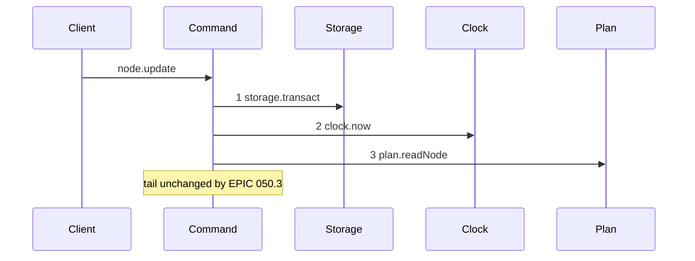
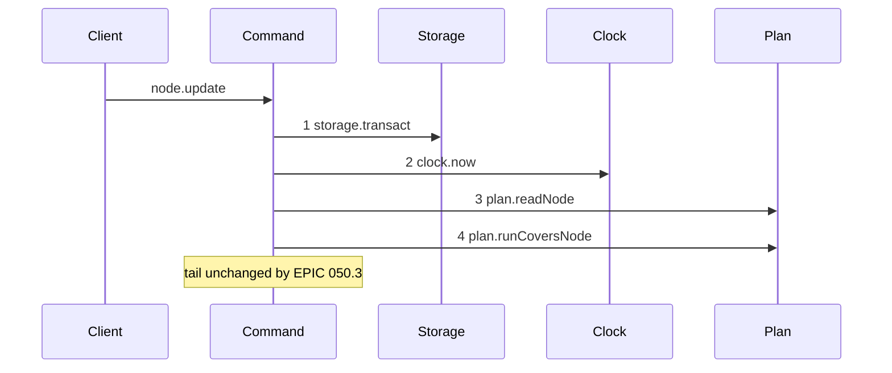

# Story 3 — The update-node guard

Epic: `.agents/plan/epics/050.3-the-plan-write-guard.md`
Depends on: Story 1 (`plan.runCoversNode`), Story 8 (`subtree-busy` on `node.update`).
Kind: story-implement

Diagrams: update-node-guard

Baselines: update-node-guard <- baseline-update-node

Seams: update-node-guard: +plan.runCoversNode

## The shipped path

### `baseline-update-node`

Superseded by: EPIC 050.3 update-node-guard

Shipped path: `src/commands/node/update-node.ts:92-200`. Fixture: task `T` under objective `O` under
initiative `I`. The write changes the instruction only, `fromRevision` names the newest revision, and
no run is active.



Citations: `:92`, `:93`, `:95`.

The tail this note pins is `blobs.hash` at `:124` and `:129`, `plan.newestRevision` at `:160`,
`plan.readContainmentFacts` at `:171`, `ids.mint` at `:204`, `plan.newestRevision` at `:205`,
`blobs.put` at `:210` and `:216`, `plan.readGraph` at `:222`, `plan.readValidationContext` at `:254`,
`revision.render` at `:302`, `revision.record` at `:305`, `plan.mutateGraph` at `:371` and
`events.append` at `:386`. Two calls of `blobs.hash` and two of `plan.newestRevision` sit inside it,
so the tail could not be drawn without a projection this story does not need. Only the prefix moves.

### `update-node-guard`

Supersedes: EPIC 050.3 baseline-update-node

Fixture: the fixture of `baseline-update-node`.



Step 4 sits after the node read and its `node-not-found` and kind refusals, and before
`blobs.hash` at `:124`. Every write of this command is inside the pinned tail.

Add `test/sequence/scenarios/update-node-guard.ts`.

## Change

**`src/commands/node/update-node.ts` — insert one guard and delete one blocker.**

**1 — the guard.** After the kind refusals at `:100-110` and before the first `blobs.hash` at `:124`:

```ts
const covering = dependencies.plan.runCoversNode(transaction, [input.id], at);
if (covering !== null) {
  throw new NodeWriteError("subtree-busy", "an active run covers the node", {
    relation: covering.relation,
    nodeId: covering.nodeId,
    runId: covering.runId,
    expiresAt: covering.expiresAt,
  });
}
```

The seed is the node id. The closure adds its ancestors, so a run on `O` or on `I` refuses a write to
`T`, and it adds its descendants, so a run on a child of an objective refuses a write to that
objective.

**2 — the blocker.** Delete `if (facts.lease) blockers.push({ nodeId: input.id, blocker: "lease" });`
at `:187`. `binding-in-use` keeps its code, its message and its shape, and its list keeps
`workspace`, `attempt-commit` and `retained-commit`.

`ContainmentFacts.lease` is still produced by `readContainmentFacts`. Nothing reads it once this
story and Story 7 land, and EPIC 050.4 deletes the producer with `leaseHeld`. Do not delete the field
here: that change belongs with the store method that computes it, and splitting one mechanism removal
across two epics is what this ordering avoids.

Add `"subtree-busy"` to the refusal union of `NodeWriteError` for this command.

**This story relaxes one shipped behaviour on purpose.** A node holding a live node lease and no run
was refused a containment move and is now admitted. The lease is written only by a claim, and a claim
writes a run in the same transaction from EPIC 050.1 onward, so the two disagree only for a row left
behind by a crash — which EPIC 050.4 deletes outright. The relaxation is asserted by a case, so it is
a decision and not a regression.

## Constraints

- The guard sits inside the transaction opened at `:92`. Open no second transaction.
- Pass the `at` value read at `:93`.
- The guard follows `node-not-found` and the kind refusals, and precedes every write.
- Seed the node id alone. Do not seed the parent, and do not seed the subtree: the closure supplies both.
- Delete exactly one member of the blocker list. Do not touch `workspace`, `attempt-commit` or `retained-commit`.
- Do not delete `ContainmentFacts.lease`. EPIC 050.4 owns the field.

## Verify

```
node --test src/commands/node/update-node.test.ts test/sequence/conformance.test.ts
```

Add, each as a separate `it`:

1. `"an update on a node covered by an active run refuses subtree-busy"` — assert `assert.deepEqual(error.details, { relation: "self", nodeId: T, runId, expiresAt })`.

2. `"an update on a node whose ancestor holds an active run refuses, naming the ancestor"` — run on `O`, update `T`.

3. `"an update on an objective whose child holds an active run refuses, naming the descendant"` — run on `T`, update `O`. Assert `relation === "descendant"`.

4. `"an update on a node whose sibling holds an active run succeeds"`.

5. `"an update on a node covered by an expired run succeeds"`.

6. `"a subtree-busy refusal leaves the database byte-identical"`.

7. `"a stale revision beats a covering run"` — assert `error.refusal === "stale-revision"`.

8. `"the blocker list no longer holds a lease member"` — seed a live node lease on `T` and no run, and assert a containment move succeeds. This is the relaxation the Change names.

9. `"the blocker list still refuses on a workspace row"` — seed a workspace row and assert `binding-in-use` with `blockers` deep-equal to `[{ nodeId: T, blocker: "workspace" }]`. With case 8 the deletion is exactly one member.

Add `test/sequence/scenarios/update-node-guard.ts`.

`pnpm run verify` exits 0.

Proof: PASS line delivered — `src/commands/node/update-node.test.ts` in `PASS EPIC-050.3`.
