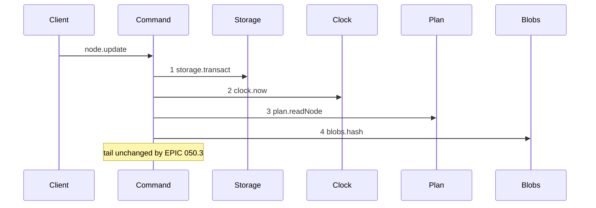
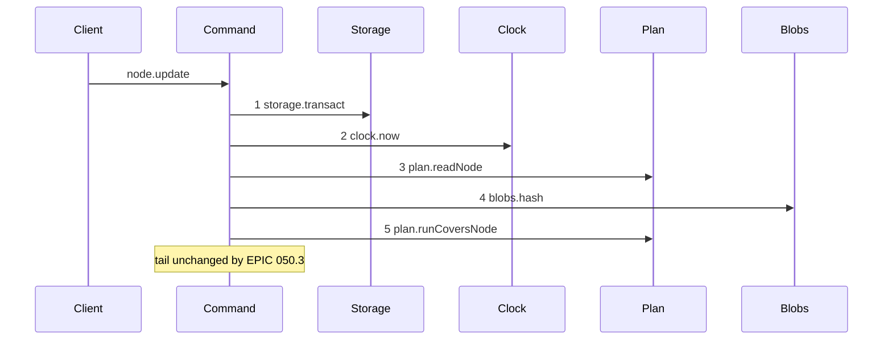

# Story 3 — The update-node guard

Epic: `.agents/plan/epics/050.3-the-plan-write-guard.md`
Depends on: Story 1 (01-the-run-covers-node-rule), for `plan.runCoversNode`; Story 8 (08-subtree-busy-joins-the-plan-operations), for `subtree-busy` on `node.update`; EPIC 050.1 Story 6 (06-the-conformance-harness) and EPIC 050.1 Story 7 (07-the-conformance-runner), which this story's scenario file runs on.
Kind: story-implement

Diagrams: update-node-guard

Baselines: update-node-guard <- baseline-update-node

Seams: update-node-guard: +plan.runCoversNode

## The shipped path

### `baseline-update-node`

Superseded by: EPIC 050.3 update-node-guard

Shipped path: `src/commands/node/update-node.ts:92-200`. Fixture: objective `O` under initiative
`I`, holding task `T`. The write changes `O`'s instruction only and repeats every other stored field,
so `differingFields` at `:149` returns `instruction` alone, `revisionGuardFor` at `:154` returns
`node`, and `plan.newestRevision` at `:162` is not called. `fromRevision` names `O`'s own revision,
and no run is active.



Citations, one per step: `src/commands/node/update-node.ts:92 — `storage.transact``,
`src/commands/node/update-node.ts:93 — `clock.now``,
`src/commands/node/update-node.ts:95 — `readNode``,
`src/commands/node/update-node.ts:124 — `blobs.hash``.

Callee anchors, one per step: `src/services/storage/index.ts:33 — `transact``,
`src/services/clock/index.ts:2 — `now``, `src/services/plan/index.ts:73 — `readNode``,
`src/services/blob/index.ts:24 — `hash``. Step 4 is reachable because the fixture submits an
instruction, which `:124` hashes unconditionally; step 3 returns a stored objective, so `readNode`
does not refuse `node-not-found`.

**The drawn path is an objective update.** `blobs.hash` is called a second time at `:129` only when
`input.node.kind` is `task`, so a task update carries a different call set and is a different path
under `.agents/plan/authoring.md`. The objective update draws one `blobs.hash` token; the task update
repeats that token, which the parser refuses. The insertion point is one source line for both kinds,
and the numbered cases below drive both kinds.

The tail this note pins holds every seam call after step 4: `plan.readContainmentFacts` at `:173`
or `plan.readSubtreeContainmentFacts` at `:174`, which are the two branches of one ternary, then
`ids.mint` at `:206`, `plan.newestRevision` at `:207`, `blobs.put` at `:212` and `:218`,
`plan.readGraph` at `:224`, `plan.readValidationContext` at `:256`, `graph.cycles` at `:295`,
`revision.render` at `:306`, `revision.record` at `:309`, `ids.mint` at `:356`, `plan.mutateGraph` at
`:375`, `graph.cycles` at `:386` and `events.append` at `:390`. Two more calls sit after step 4 that
the drawn fixture does not reach: `blobs.hash` at `:129`, which only a task update makes, and
`plan.newestRevision` at `:162`, which only the project revision guard makes. `graph.cycles` sits
inside the tail twice, because `validateCandidateStructural` and `validateCandidateCompleteness` both
reach `src/domain/plan-candidate.ts:292 — `findCycles``, and `blobs.put`, `ids.mint` and
`plan.newestRevision` repeat too, so the tail could not be drawn without projections this story does
not need. Only the prefix moves.

### `update-node-guard`

Supersedes: EPIC 050.3 baseline-update-node

Fixture: the fixture of `baseline-update-node`.



Step 5 sits after the `stale-revision` throw at `:154-169` and before the containment read at
`:171-174`. It cannot precede step 4: `differingFields` at `:149` needs the hash at `:124`, and it
decides the revision guard class at `:154`. `BlobStore.hash` takes no transaction, so nothing above
the guard writes, and every write of this command is inside the pinned tail.

Add `test/sequence/scenarios/update-node-guard.ts`.

## Change

**`src/commands/node/update-node.ts` — insert one guard and delete one blocker.**

**1 — the guard.** After the `stale-revision` throw at `:154-169` and before `const facts =` at
`:171`. The guard follows the revision check in all five commands, and `:170` is the first line of
`update-node` at which that holds.

```ts
const covering = dependencies.plan.runCoversNode(transaction, [input.id], at);
if (covering !== null) {
  throw new NodeWriteError("subtree-busy", "an active run covers the node", {
    relation: covering.relation,
    nodeId: covering.nodeId,
    runId: covering.runId,
    expiresAt: covering.expiresAt,
  });
}
```

The seed is the node id. The closure adds its ancestors, so a run on `O` or on `I` refuses a write to
`T`, and it adds its descendants, so a run on a child of an objective refuses a write to that
objective.

**2 — the blocker.** Delete `if (facts.lease) blockers.push({ nodeId: input.id, blocker: "lease" });`
at `:189`. `binding-in-use` keeps its code, its message and its shape, and its list keeps
`workspace`, `attempt-commit` and `retained-commit`.

`ContainmentFacts.lease` is still produced by `readContainmentFacts`. Nothing reads it once this
story and Story 7 land, and EPIC 050.5 Story 5 deletes the producer with `leaseHeld`. Do not delete
the field here: that change belongs with the store method that computes it, and splitting one
mechanism removal across two epics is what this ordering avoids.

Add `"subtree-busy"` to the refusal union of `NodeWriteError` for this command.

**This story relaxes one shipped behaviour on purpose.** A node holding a live node lease and no run
was refused a containment move and is now admitted. The lease is written only by a claim, and a claim
writes a run in the same transaction from EPIC 050.1 onward, so the two disagree only for a row left
behind by a crash — which no command writes after EPIC 050.4. The relaxation is asserted by a case,
so it is a decision and not a regression.

## Constraints

- The guard sits inside the transaction opened at `:92`. Open no second transaction.
- Pass the `at` value read at `:93`.
- The guard follows `node-not-found`, `kind-mismatch` and `stale-revision`, and precedes every write. The first write is `blobs.put` at `:212`.
- Seed the node id alone. Do not seed the parent, and do not seed the subtree: the closure supplies both.
- Delete exactly one member of the blocker list. Do not touch `workspace`, `attempt-commit` or `retained-commit`.
- Do not delete `ContainmentFacts.lease`. EPIC 050.5 Story 5 owns the field.

## Verify

```
node --test src/commands/node/update-node.test.ts test/sequence/conformance.test.ts
```

Add, each as a separate `it`:

1. `"an update on a node covered by an active run refuses subtree-busy"` — assert `assert.deepEqual(error.details, { relation: "self", nodeId: T, runId, expiresAt })`.

2. `"an update on a node whose ancestor holds an active run refuses, naming the ancestor"` — run on `O`, update `T`.

3. `"an update on an objective whose child holds an active run refuses, naming the descendant"` — run on `T`, update `O`. Assert `relation === "descendant"`.

4. `"an update on a node whose sibling holds an active run succeeds"` — run on `S`, seeded by `test/helpers/rows.ts:184 — `seedSiblingTask``, update `T`.

5. `"an update on a node covered by an expired run succeeds"`.

6. `"a subtree-busy refusal leaves the database byte-identical"`.

7. `"the refusal precedence of node.update"` — one decision table over every pair of `node-not-found`, `kind-mismatch`, `stale-revision`, `subtree-busy`, `illegal-transition`, `binding-in-use` and `plan-invalid` that can trigger at once, with the winner named per pair and every unreachable pair marked unreachable with its reason. The `stale-revision` against `subtree-busy` row asserts `stale-revision` wins, because the revision guard is decided at `:154-169` and the guard sits at `:170`.

8. `"the blocker list no longer holds a lease member"` — seed a live node lease on `T` with `test/helpers/rows.ts:668 — `seedLeaseOnNode`` and no run, and assert a containment move succeeds. This is the relaxation the Change names.

9. `"the blocker list still refuses on a workspace row"` — seed a workspace row with `test/helpers/rows.ts:646 — `seedWorkspaceOnNode`` and assert `binding-in-use` with `blockers` deep-equal to `[{ nodeId: T, blocker: "workspace" }]`. With case 8 the deletion is exactly one member.

10. `"an update on a node covered by an ended run succeeds"` — `state: 'ended'` on `T`. With case 5 both liveness boundaries of this command are pinned, and the epic's gate requires both.

Add `test/sequence/scenarios/update-node-guard.ts`.

`pnpm run verify` exits 0.

Proof: PASS line delivered — `src/commands/node/update-node.test.ts` in `PASS EPIC-050.3`.
