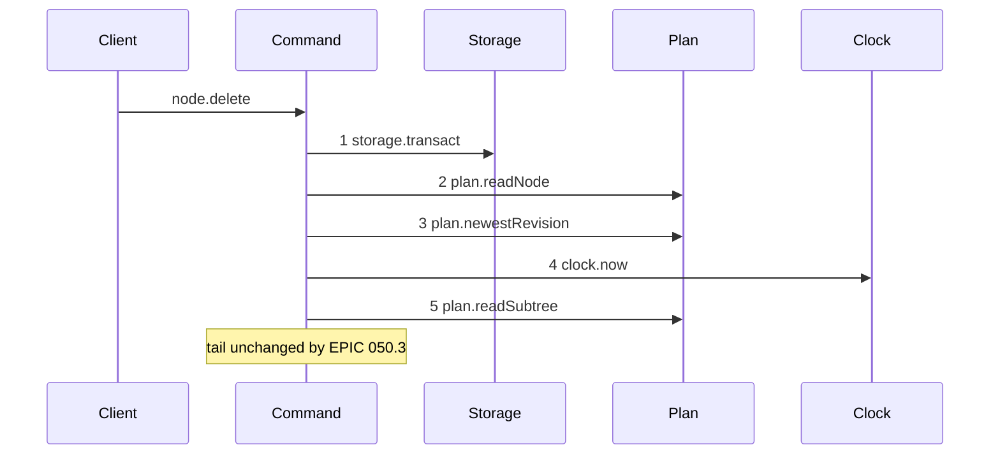
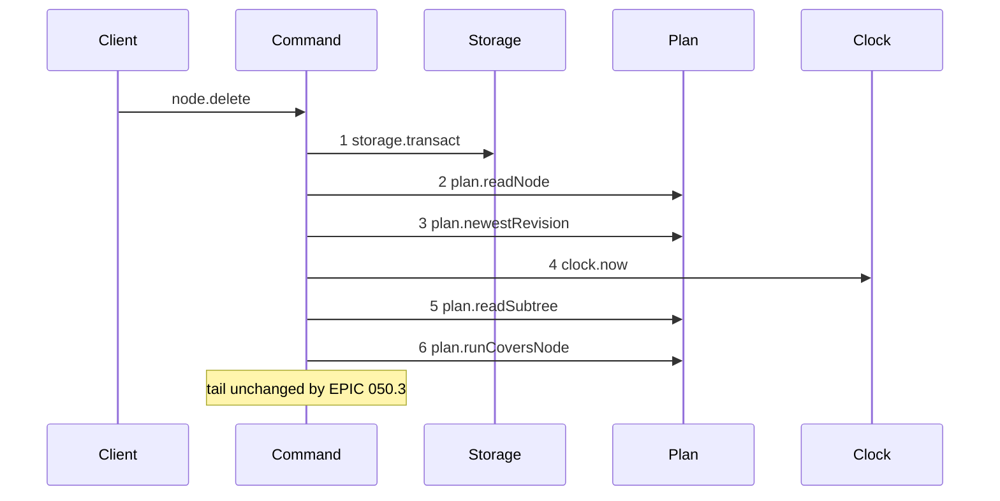

# Story 4 — The delete-node guard

Epic: `.agents/plan/epics/050.3-the-plan-write-guard.md`
Depends on: Story 1 (01-the-run-covers-node-rule), for `plan.runCoversNode`; Story 8 (08-subtree-busy-joins-the-plan-operations), for `subtree-busy` on `node.delete`; EPIC 050.1 Story 6 (06-the-conformance-harness) and EPIC 050.1 Story 7 (07-the-conformance-runner), which this story's scenario file runs on.
Kind: story-implement

Diagrams: delete-node-guard

Baselines: delete-node-guard <- baseline-delete-node

Seams: delete-node-guard: +plan.runCoversNode

## The shipped path

### `baseline-delete-node`

Superseded by: EPIC 050.3 delete-node-guard

Shipped path: `src/commands/node/delete-node.ts:53-110`. Fixture: objective `O` under initiative `I`,
holding task `T`. The write deletes `O`, `fromRevision` names the newest revision, and no run and no
execution row exist.



Citations, one per step: `src/commands/node/delete-node.ts:53 — `storage.transact``,
`src/commands/node/delete-node.ts:54 — `readNode``,
`src/commands/node/delete-node.ts:59 — `newestRevision``,
`src/commands/node/delete-node.ts:75 — `clock.now``,
`src/commands/node/delete-node.ts:77 — `readSubtree``. This command reads the clock at `:75`, after
two plan reads — the only one of the five that does not read it first.

Callee anchors, one per step: `src/services/storage/index.ts:33 — `transact``,
`src/services/plan/index.ts:73 — `readNode``, `src/services/plan/index.ts:75 — `newestRevision``,
`src/services/clock/index.ts:2 — `now``, `src/services/plan/index.ts:101 — `readSubtree``. Steps 4 and
5 are reachable because the fixture's `fromRevision` equals the newest revision, so the
`stale-revision` throw between `:59` and `:75` does not fire.

The tail this note pins holds every seam call after step 5: `plan.readGraph` at `:80`,
`plan.readSubtreeExecutionFacts` at `:105`, `ids.mint` at `:141`, `revision.render` at `:176`,
`revision.record` at `:179`, `plan.mutateGraph` at `:193`, `plan.readValidationContext` at `:203`,
`graph.cycles` at `:225` and `events.append` at `:236`. None of them moves.

### `delete-node-guard`

Supersedes: EPIC 050.3 baseline-delete-node

Fixture: the fixture of `baseline-delete-node`.



Step 6 sits after the subtree read and before `plan.readGraph` at `:80`. It could sit immediately
after step 4, because the closure supplies the subtree itself; it is drawn after step 5 so the
subtree read keeps its shipped position.

**The guard therefore precedes two shipped refusals**, `illegal-transition` at `:96-103`, which
refuses a subtree holding a node outside `deletableStates`, and `binding-in-use` at `:109-115`. Both
are decided from `plan.readGraph` at `:80` and `plan.readSubtreeExecutionFacts` at `:105`, which the
drawn guard precedes, so a covering run now wins against both. Case 8 asserts that pair.

Add `test/sequence/scenarios/delete-node-guard.ts`.

## Change

**`src/commands/node/delete-node.ts` — insert one guard.** After `plan.readSubtree` at `:77` and
before `plan.readGraph` at `:80`:

```ts
const covering = dependencies.plan.runCoversNode(transaction, [input.id], at);
if (covering !== null) {
  throw new NodeWriteError("subtree-busy", "an active run covers the subtree", {
    relation: covering.relation,
    nodeId: covering.nodeId,
    runId: covering.runId,
    expiresAt: covering.expiresAt,
  });
}
```

The seed is the node id, and the closure supplies the whole subtree the delete removes and every
ancestor above it. Passing the delete set from `plan.readSubtree` would name the same rows twice and
would make the guard depend on a read whose position the epic does not pin.

Add `"subtree-busy"` to the refusal union of `NodeWriteError` for this command.

**Every member of `readSubtreeExecutionFacts` stays, and two of them matter here.**
`src/services/plan/sqlite.ts:352 — `blocker: "lease"`` puts a `lease` member in the closed
`executionBlockers` list and `src/services/plan/sqlite.ts:362 — `blocker: "run"`` puts a `run` member
in it, and `delete-node.ts:105` refuses `binding-in-use` on any member. EPIC 050.5 Story 5 owns that list. Do not remove either here.

Two consequences, and this story asserts both rather than letting an implementing agent find them:

- **`delete-node` refuses on a stale lease row as well as on an active run** — a superset of the guard, never a gap.
- **The `run` member carries no state filter.** `SELECT node_id FROM run WHERE node_id IN (...)` at `src/services/plan/sqlite.ts:363 — `FROM run`` matches an `ended` and an expired run as well as an active one, so `delete-node` refuses `binding-in-use` where the other four commands admit the write. `delete-node` cannot show the expired-run and ended-run boundaries the epic's gate states for the other four, and case 5 asserts `binding-in-use` there instead. Narrowing that member belongs with its producer, in EPIC 050.5.

## Constraints

- The guard sits inside the transaction opened at `:53`. Open no second transaction.
- Pass the `at` value read at `:75`.
- The guard follows the node read, the revision check and the subtree read, and precedes every write. The first write of this command is `ids.mint` at `:141`.
- Seed the node id alone. The closure carries the subtree.
- Do not touch `readSubtreeExecutionFacts`, `executionBlockers` or the `binding-in-use` refusal.

## Verify

```
node --test src/commands/node/delete-node.test.ts test/sequence/conformance.test.ts
```

Add, each as a separate `it`:

1. `"a delete of a node covered by an active run refuses subtree-busy"` — assert the details deep-equal `{ relation: "self", nodeId: O, runId, expiresAt }`.

2. `"a delete of a node whose descendant holds an active run refuses, naming the descendant"` — run on `T`, delete `O`. Assert `relation === "descendant"`. This is the case a seed-only guard would miss.

3. `"a delete of a node whose ancestor holds an active run refuses, naming the ancestor"` — run on `I`, delete `O`.

4. `"a delete of a node whose sibling holds an active run succeeds"` — run on the objective `test/helpers/rows.ts:206 — `seedSiblingObjective`` adds, delete `O`.

5. `"an expired run in the subtree refuses binding-in-use, not subtree-busy"` — `expires_at: NOW - 1` on `T`, delete `O`. Assert `error.refusal === "binding-in-use"` and that `blockers` names the `run` member. This is the one command where an expired run does not admit the write, because the `run` member of `executionBlockers` matches any run row; the Change names the reason and EPIC 050.5 narrows the member. Repeat the case with `state: 'ended'` and assert the same, so both boundaries are pinned.

6. `"a subtree-busy refusal leaves the database byte-identical"`.

7. `"the refusal precedence of node.delete"` — one decision table over every pair of `node-not-found`, `stale-revision`, `subtree-busy`, `illegal-transition`, `binding-in-use` and `plan-invalid` that can trigger at once, with the winner named per pair and every unreachable pair marked unreachable with its reason. `stale-revision` beats `subtree-busy`, and `subtree-busy` beats both `illegal-transition` and `binding-in-use`, are three of its rows.

8. `"the lease blocker of binding-in-use still fires"` — seed a node lease row on `T` with `test/helpers/rows.ts:668 — `seedLeaseOnNode``, no run, delete `O`. Assert `error.refusal === "binding-in-use"` and that `blockers` names the `lease` member. The superset guard is deliberate, and EPIC 050.5 inherits a known state.

9. `"a covering run beats binding-in-use and illegal-transition"` — seed an active run and a workspace row on `T`, delete `O`, and assert `subtree-busy`; then seed an active run on `T` with `T` in a non-deletable state and assert `subtree-busy` again. The guard sits ahead of `plan.readGraph` at `:80` and of `readSubtreeExecutionFacts` at `:105`, so it wins against both.

Add `test/sequence/scenarios/delete-node-guard.ts`.

`pnpm run verify` exits 0.

Proof: PASS line delivered — `src/commands/node/delete-node.test.ts` in `PASS EPIC-050.3`.
