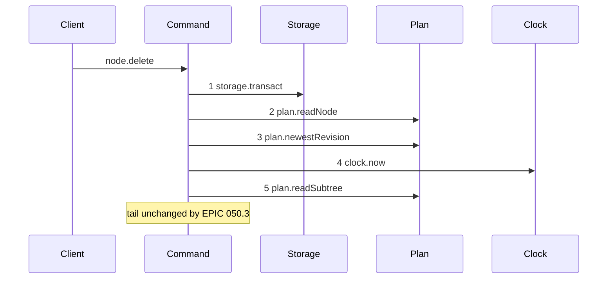
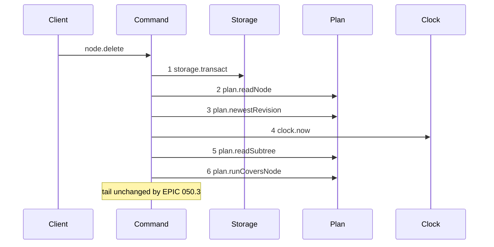

# Story 4 — The delete-node guard

Epic: `.agents/plan/epics/050.3-the-plan-write-guard.md`
Depends on: Story 1 (`plan.runCoversNode`), Story 8 (`subtree-busy` on `node.delete`).
Kind: story-implement

Diagrams: delete-node-guard

Baselines: delete-node-guard <- baseline-delete-node

Seams: delete-node-guard: +plan.runCoversNode

## The shipped path

### `baseline-delete-node`

Superseded by: EPIC 050.3 delete-node-guard

Shipped path: `src/commands/node/delete-node.ts:53-110`. Fixture: objective `O` under initiative `I`,
holding task `T`. The write deletes `O`, `fromRevision` names the newest revision, and no run and no
execution row exist.



Citations: `:53`, `:54`, `:59`, `:75`, `:77`. This command reads the clock at `:75`, after two plan
reads — the only one of the five that does not read it first.

The tail this note pins is `plan.readGraph` at `:80`, `plan.readSubtreeExecutionFacts` at `:105`,
`ids.mint` at `:141`, `revision.render` at `:176`, `revision.record` at `:179`, `plan.mutateGraph` at
`:193`, `plan.readValidationContext` at `:203` and `events.append` at `:236`.

### `delete-node-guard`

Supersedes: EPIC 050.3 baseline-delete-node

Fixture: the fixture of `baseline-delete-node`.



Step 6 sits after the subtree read and before `plan.readGraph` at `:80`. It could sit immediately
after step 4, because the closure supplies the subtree itself; it is drawn after step 5 so the
`delete-set-empty` and containment refusals that read the subtree keep their shipped order.

Add `test/sequence/scenarios/delete-node-guard.ts`.

## Change

**`src/commands/node/delete-node.ts` — insert one guard.** After `plan.readSubtree` at `:77` and
before `plan.readGraph` at `:80`:

```ts
const covering = dependencies.plan.runCoversNode(transaction, [input.id], at);
if (covering !== null) {
  throw new NodeWriteError("subtree-busy", "an active run covers the subtree", {
    relation: covering.relation,
    nodeId: covering.nodeId,
    runId: covering.runId,
    expiresAt: covering.expiresAt,
  });
}
```

The seed is the node id, and the closure supplies the whole subtree the delete removes and every
ancestor above it. Passing the delete set from `plan.readSubtree` would name the same rows twice and
would make the guard depend on a read whose position the epic does not pin.

Add `"subtree-busy"` to the refusal union of `NodeWriteError` for this command.

**The `lease` blocker of `readSubtreeExecutionFacts` stays.** `src/services/plan/sqlite.ts:349-353`
puts a `lease` member in the closed `executionBlockers` list, and `delete-node.ts:105` refuses
`binding-in-use` on any member. EPIC 050.4 swaps it for the run blocker with the rest of the
mechanism. Until then `delete-node` refuses on a stale lease row as well as on an active run — a
superset of the guard, never a gap. Do not remove it here.

## Constraints

- The guard sits inside the transaction opened at `:53`. Open no second transaction.
- Pass the `at` value read at `:75`.
- The guard follows the node read, the revision check and the subtree read, and precedes every write. The first write of this command is `ids.mint` at `:141`.
- Seed the node id alone. The closure carries the subtree.
- Do not touch `readSubtreeExecutionFacts`, `executionBlockers` or the `binding-in-use` refusal.

## Verify

```
node --test src/commands/node/delete-node.test.ts test/sequence/conformance.test.ts
```

Add, each as a separate `it`:

1. `"a delete of a node covered by an active run refuses subtree-busy"` — assert the details deep-equal `{ relation: "self", nodeId: O, runId, expiresAt }`.

2. `"a delete of a node whose descendant holds an active run refuses, naming the descendant"` — run on `T`, delete `O`. Assert `relation === "descendant"`. This is the case a seed-only guard would miss.

3. `"a delete of a node whose ancestor holds an active run refuses, naming the ancestor"` — run on `I`, delete `O`.

4. `"a delete of a node whose sibling holds an active run succeeds"`.

5. `"a delete of a node covered by an expired run succeeds"` — and assert no `binding-in-use` fires either, because the fixture holds no execution row.

6. `"a subtree-busy refusal leaves the database byte-identical"`.

7. `"a stale revision beats a covering run"`.

8. `"the lease blocker of binding-in-use still fires"` — seed a node lease row on `T`, no run, delete `O`. Assert `error.refusal === "binding-in-use"` and that `blockers` names the `lease` member. The superset guard is deliberate, and EPIC 050.4 inherits a known state.

9. `"a covering run beats binding-in-use"` — seed both an active run and a workspace row on `T`, delete `O`. Assert `subtree-busy`, proving the guard sits ahead of `readSubtreeExecutionFacts` at `:105`.

Add `test/sequence/scenarios/delete-node-guard.ts`.

`pnpm run verify` exits 0.

Proof: PASS line delivered — `src/commands/node/delete-node.test.ts` in `PASS EPIC-050.3`.
