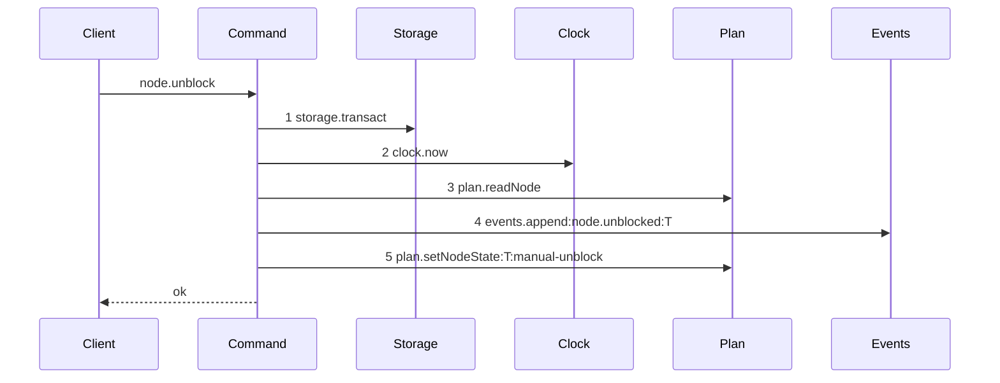
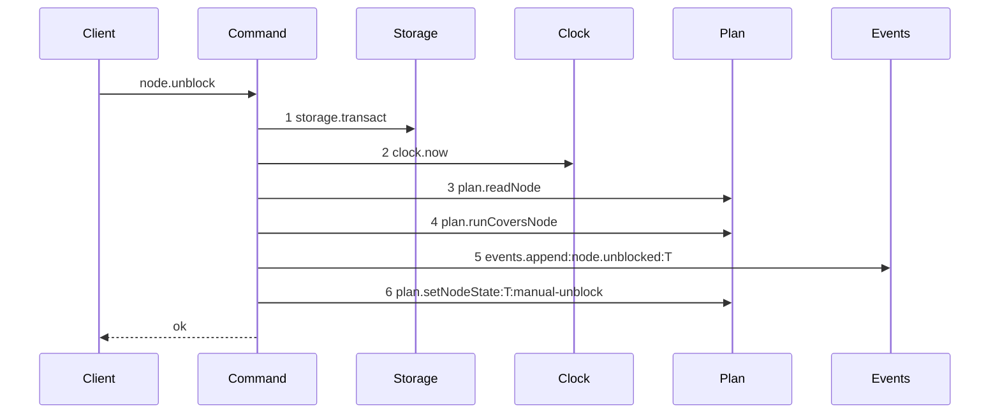

# Story 5 — The unblock-node guard

Epic: `.agents/plan/epics/050.3-the-plan-write-guard.md`
Depends on: Story 1 (01-the-run-covers-node-rule), for `plan.runCoversNode`; Story 8 (08-subtree-busy-joins-the-plan-operations), for `subtree-busy` on `node.unblock`; EPIC 050.1 Story 6 (06-the-conformance-harness) and EPIC 050.1 Story 7 (07-the-conformance-runner), which this story's scenario file runs on.
Kind: story-implement

Diagrams: unblock-node-guard

Baselines: unblock-node-guard <- baseline-unblock-node

Seams: unblock-node-guard: +plan.runCoversNode

## The shipped path

### `baseline-unblock-node`

Superseded by: EPIC 050.3 unblock-node-guard

Shipped path: `src/commands/node/unblock-node.ts:54-110`. Fixture: task `T` under objective `O`,
`state: blocked` with `blockReason: attempt-limit`, a human actor, and no run active.



Citations, one per step: `src/commands/node/unblock-node.ts:54 — `storage.transact``,
`src/commands/node/unblock-node.ts:55 — `clock.now``,
`src/commands/node/unblock-node.ts:64 — `readNode``,
`src/commands/node/unblock-node.ts:89 — `events.append``,
`src/commands/node/unblock-node.ts:102 — `setNodeState``. This trace is complete: the command holds no
other seam call, so it needs no pinned tail.

Callee anchors, one per step: `src/services/storage/index.ts:33 — `transact``,
`src/services/clock/index.ts:2 — `now``, `src/services/plan/index.ts:73 — `readNode``,
`src/services/event/index.ts:50 — `append``, `src/services/plan/index.ts:114 — `setNodeState``. Steps 4
and 5 are reachable because the fixture's node is a task in `blocked` with
`blockReason: attempt-limit` and the actor is human, so all four refusals between `:64` and `:87`
pass.

**Two steps carry a label because the harness declares a projection for their method.** EPIC 050.1
Story 6 (06-the-conformance-harness) projects `events.append` by `input.type` then `input.subjectId`,
and `plan.setNodeState` by `input.id` then `input.trigger`. The command passes `subjectId: node.id` at
`:91` and `type: "node.unblocked"` at `:92`, and `id: node.id` at `:103` and
`trigger: "manual-unblock"` at `:106`, so the two tokens are fixed by the source and not chosen here.

The order is the defect this story does not fix and must not disturb: the event at step 4 is appended
**before** the state transition at step 5. Both sit in one transaction, so the pair is atomic, and
reordering them is outside this epic.

### `unblock-node-guard`

Supersedes: EPIC 050.3 baseline-unblock-node

Fixture: the fixture of `baseline-unblock-node`.



Step 4 sits after the four shipped refusals and before the event append, which is this command's
first write. The whole trace is drawn, so the refusal position is proven by the diagram and not only
by the byte comparison.

Add `test/sequence/scenarios/unblock-node-guard.ts`.

## Change

**`src/commands/node/unblock-node.ts` — insert one guard.** After the `block-reason-not-clearable`
throw at `:81-87` and before `dependencies.events.append` at `:89`:

```ts
const covering = dependencies.plan.runCoversNode(transaction, [node.id], now);
if (covering !== null) {
  throw new UnblockNodeError("subtree-busy", "an active run covers the node", {
    relation: covering.relation,
    nodeId: covering.nodeId,
    runId: covering.runId,
    expiresAt: covering.expiresAt,
  });
}
```

Add `"subtree-busy"` to `UnblockRefusal`.

**This is a refusal `unblock-node` never had.** `grep -n "lease" src/commands/node/unblock-node.ts`
returns nothing. A blocked task under an objective a worker holds could be unblocked mid-run, and the
worker would then see its node change state underneath it. No test regresses, because none existed.

The guard is the last refusal, after `actor-forbidden`, `not-found`, `node-kind-invalid`,
`not-blocked` and `block-reason-not-clearable`. Each of those names a cause the caller can act on
alone, and each is decided from the node row already read.

## Constraints

- The guard sits inside the transaction opened at `:54`. Open no second transaction.
- Pass the `now` value read at `:55`.
- The guard precedes `events.append` at `:89`, which is this command's first write.
- Seed the node id alone.
- Do not reorder the shipped event append and state transition.
- Change no other refusal and no response shape.

## Verify

```
node --test src/commands/node/unblock-node.test.ts test/sequence/conformance.test.ts
```

Add, each as a separate `it`:

1. `"an unblock on a node covered by an active run refuses subtree-busy"` — assert the details deep-equal `{ relation: "self", nodeId: T, runId, expiresAt }`.

2. `"an unblock on a node whose ancestor holds an active run refuses, naming the ancestor"` — run on `O`, unblock `T`.

3. `"an unblock on a node whose sibling holds an active run succeeds"` — run on `S`, seeded by `test/helpers/rows.ts:184 — `seedSiblingTask``, unblock `T`.

4. `"an unblock on a node whose descendant holds an active run"` — **there is no such case, and this entry records why rather than leaving the closure half-asserted.** `unblock-node` refuses `node-kind-invalid` at `:68` for an initiative and an objective, so the only node it reaches is a task, and a task holds no child. Assert instead that an unblock of an objective under a covering run refuses `node-kind-invalid`, so the unreachability is a fact of the command and not an untested assumption. Story 1 carries the descendant direction of the closure.

5. `"an unblock on a node covered by an expired run succeeds"`.

6. `"an unblock on a node covered by an ended run succeeds"`.

7. `"a subtree-busy refusal appends no event and leaves the database byte-identical"` — both halves, because the event append is the first write and the whole trace is drawn.

8. `"the refusal precedence of node.unblock"` — one decision table over every pair of `actor-forbidden`, `not-found`, `node-kind-invalid`, `not-blocked`, `block-reason-not-clearable`, `subtree-busy` and `illegal-transition` that can trigger at once, with the winner named per pair and every unreachable pair marked unreachable with its reason. `subtree-busy` loses every pair, because the guard is last.

9. `"not-blocked beats a covering run"` — a `ready` node under a covering run. Assert `error.refusal === "not-blocked"`, proving the guard is last in the order.

10. `"a harness actor beats a covering run"` — assert `error.refusal === "actor-forbidden"`.

Add `test/sequence/scenarios/unblock-node-guard.ts`.

`pnpm run verify` exits 0.

Proof: PASS line delivered — `src/commands/node/unblock-node.test.ts` in `PASS EPIC-050.3`.
