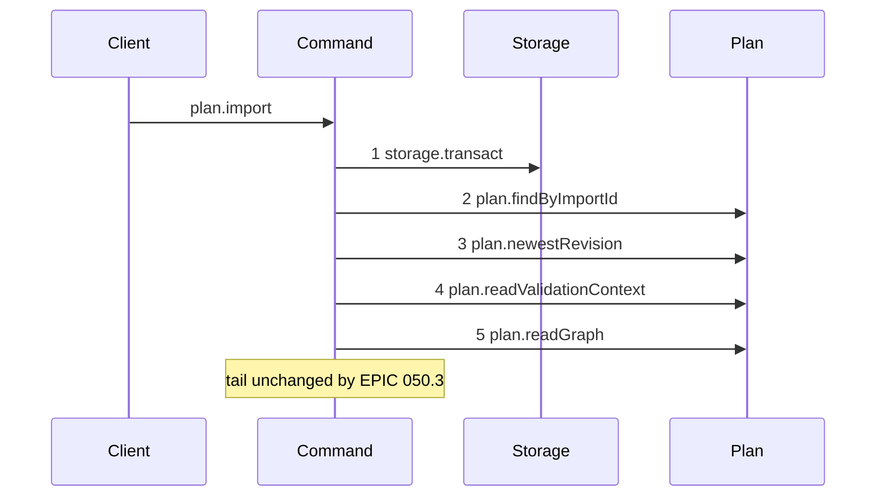
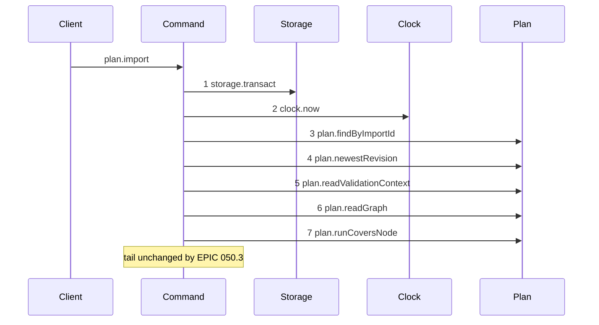

# Story 6 — The import-plan guard

Epic: `.agents/plan/epics/050.3-the-plan-write-guard.md`
Depends on: Story 1 (`plan.runCoversNode`), Story 8 (`subtree-busy` on `plan.import`).
Kind: story-implement

Diagrams: import-plan-guard

Baselines: import-plan-guard <- baseline-import-plan

Seams: import-plan-guard: +plan.runCoversNode, ~clock.now @src/commands/plan/import-plan.ts:390

## The shipped path

### `baseline-import-plan`

Superseded by: EPIC 050.3 import-plan-guard

Shipped path: `src/commands/plan/import-plan.ts:144-200`. Fixture: project `P` holding initiative
`I`, objective `O` and task `T`. The import submits one changed document for `T`, deletes nothing,
carries a fresh `importId`, and `fromRevision` and `validatedRevision` both name the newest revision.



Citations: `:144`, `:155`, `:164`, `:186`, `:190`. The project existence check at `:148` reads through the
transaction object, which is not a dependency key, so it is no message.

The prefix reaches `plan.readGraph` because that is where the guard must sit: the ids the import
deletes are the project's nodes no submitted document names, and that set needs the graph.

The tail this note pins runs from the closures the command hands to its domain functions at
`:212-214` — `reader.read`, `graph.cycles` and `ids.mint`, each a seam call whose count depends on the
submitted document set — through `blobs.put` at `:408` to `events.append` at `:529`. That is why this
diagram pins its tail rather than unrolling it: the tail is a function of the fixture's document
count. One seam call leaves that tail, the clock read at `:390`, and the `~` token with its citation
is the declaration of exactly that.

### `import-plan-guard`

Supersedes: EPIC 050.3 baseline-import-plan

Fixture: the fixture of `baseline-import-plan`.



Step 2 is the moved clock read. Step 7 sits after the graph read that supplies the deleted set, and
before the first write, `blobs.put` at `:408`. The idempotency replay at `:155-160` returns its
shipped answer at step 3 without ever reaching the guard, which is correct: a replay writes nothing.

Add `test/sequence/scenarios/import-plan-guard.ts`.

## Change

**`src/commands/plan/import-plan.ts` — insert one guard.** After `plan.readGraph` at `:190`, where
`storedNodes` first exists, and before the choice loop at `:212`:

```ts
const covering = dependencies.plan.runCoversNode(
  transaction,
  seedIds,
  updatedAt,
);
if (covering !== null) {
  throw new ImportPlanError("subtree-busy", "an active run covers the import", {
    relation: covering.relation,
    nodeId: covering.nodeId,
    runId: covering.runId,
    expiresAt: covering.expiresAt,
  });
}
```

**The seed is every submitted id and every id the import deletes.** An import is a graph rewrite, and
both halves are affected: a submitted document changes a node, and a deletion removes it with its
subtree.

Both halves come from `storedNodes`, the graph read at `:190`. The submitted ids are the identities
the request's documents carry; the deleted ids are `storedNodes` minus those identities. **This is
why the guard sits after the graph read and not at the top of the transaction.** Seeding only the
submitted set would drop the half of an import that removes a subtree a worker may hold, and the
deleted set cannot be computed before `:190`. A story that placed the guard earlier would leave the
implementing agent to invent one of four unstated designs, which the determinism rule of `AGENTS.md`
forbids.

The guard still precedes every write: the first is `blobs.put` at `:408`.

**`updatedAt` moves, and that is the one seam call leaving the pinned tail.** The command reads the
clock at `:390`, deep inside the tail. The guard needs a `now`, and a second clock read would give
the command two instants. Move `const updatedAt = dependencies.clock.now();` to the first statement
of the transaction and pass it to the guard; the value is used unchanged at `:390`.

The ship diagram therefore draws `clock.now` at step 2 where the baseline's prefix holds none. The
sign is `~` with a citation, not `+`: the call exists today, inside the tail this diagram does not
compare, and a `+` would claim the command gained a clock read it always had. No other seam call
leaves the tail, which is what the note asserts.

Add `"subtree-busy"` to `ImportPlanRefusal`.

## Constraints

- The guard sits inside the transaction opened at `:144`. Open no second transaction.
- Read the clock once. The moved `clock.now` is the command's only clock read.
- The guard follows the idempotency replay, both revision checks and the graph read, and precedes every write. The first write of this command is `blobs.put` at `:408`.
- Build the deleted set from `storedNodes` at `:190`. Do not add a store method, do not re-read the graph, and do not weaken the seed to the submitted ids alone.
- Seed the submitted ids and the deleted ids. Do not seed their ancestors or descendants: the closure supplies both.
- An import that submits every node of the project and deletes none seeds every node, and a run anywhere in the project therefore refuses it. That is correct and is asserted.
- Change no other refusal, no choice verdict and no response shape.

## Verify

```
node --test src/commands/plan/import-plan.test.ts test/sequence/conformance.test.ts
```

Add, each as a separate `it`:

1. `"an import submitting a node covered by an active run refuses subtree-busy"` — assert the details deep-equal `{ relation: "self", nodeId: T, runId, expiresAt }`.

2. `"an import submitting a node whose ancestor holds an active run refuses, naming the ancestor"` — run on `O`, submit `T`.

3. `"an import deleting a node whose descendant holds an active run refuses, naming the descendant"` — run on `T`, submit a set that omits `O`. Assert `relation === "descendant"`.

4. `"an import touching only unrelated nodes succeeds"` — run on a second initiative's task, submit `T`.

5. `"an import over an expired run succeeds"`.

6. `"a subtree-busy refusal leaves the database byte-identical"`.

7. `"an idempotent replay is never refused by the guard"` — an active run on `T` and an `importId` already recorded. Assert the shipped replay response, proving the replay returns before the guard is reached.

7b. `"the deleted set is seeded from the graph read"` — an import that omits `O` from its submitted set while a run covers a task under `O`. Assert `subtree-busy` with `relation === "descendant"`. A guard seeded only from the submitted ids would admit this write.

8. `"a stale fromRevision beats a covering run"`.

9. `"the command reads the clock once"` — count the `clock.now` calls of the recorder and assert `1`.

Add `test/sequence/scenarios/import-plan-guard.ts`.

`pnpm run verify` exits 0.

Proof: PASS line delivered — `src/commands/plan/import-plan.test.ts` in `PASS EPIC-050.3`.
