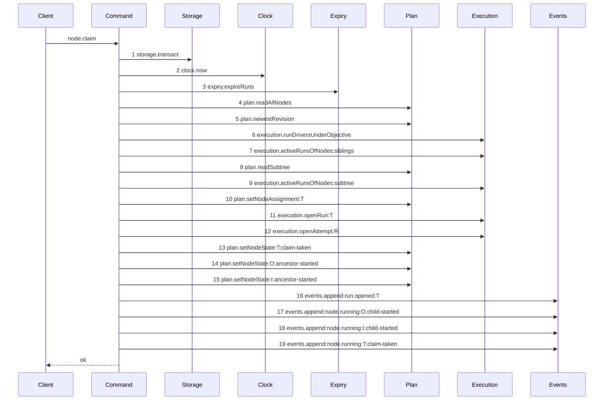

# Story 1 — The claim of a task drops the lease

Epic: `.agents/plan/epics/050.4-the-node-lease-removal.md`
Depends on: EPIC 050.1 Story 3 (`03-the-claim-of-a-task`) and EPIC 050.1 Story 1 (`01-the-claim-contract`).
Kind: story-implement

Diagrams: claim-lease-free-task

Supersedes: EPIC 050.1 claim-success-task

Seams: claim-lease-free-task: -lease.read:T, -lease.read:O, -lease.read:S, -lease.acquire:O, -lease.acquire:T

This story owns the deletion. Story 2 owns the initiative path and Story 3 owns the `objective-busy`
refusal; both draw paths through the command this story leaves.

It carries its own half of the contract. The `node.claim` request and response fields die in the same
story as the code that populates them, so no schema in this epic outlives its reader. A story that
removed a required request field ahead of its command would leave the handler unable to compile.

EPIC 050.1 Story 3 rewrites `claim-node.ts` whole, so the line numbers below name the **shipped** file
and locate the code by the symbol that survives the rewrite. The ordinal contract of this story is the
superseded diagram, not a line number.

## The ship path

### `claim-lease-free-task`

Supersedes: EPIC 050.1 claim-success-task

Fixture: the fixture of `claim-success-task`. Initiative `I` holds objective `O`, which holds tasks
`T` and `S`. Every node is `ready`, no node is assigned, no run is active, and `T` declares
`deliverable: implementation`, so the run kind is `execution` and the cascade covers `O` and `I`.



Five steps leave the superseded diagram and nothing is added. `Lease` leaves the participant list, so
a claim that touched the lease at any point fails the comparison rather than only at the drawn
ordinals. Steps 2 to 9 are reads and step 10 is the first mutation, so every refusal is still
evaluated before any write. The cascade at steps 14 and 15 is unrolled and unchanged.

Add `test/sequence/scenarios/claim-lease-free-task.ts`.

## Change

**`src/commands/node/claim-node.ts` — delete the lease.** Four blocks and three helpers.

**1 — the hierarchy refusal.** Delete the `liveLeaseRefusal({...})` call at `:139-163` and the
`ClaimNodeError("lease-held", ...)` it raises at `:165-175`. Delete the `liveLeasesOf` helper at
`:596-629` and the `relativesOf` call that feeds it. `subtreeExclusion` of EPIC 050 is the rule that
replaced it, and it is already in the command at steps 7 and 9.

**2 — the replay read is already gone.** EPIC 050.1 Story 3 states it: _"Delete the own-lease replay
path at `src/commands/node/claim-node.ts:179-199` and `replayResult`."_ Do not delete it again, and
report a surviving `replayResult` as an EPIC 050.1 defect rather than removing it here. Idempotent
replay is `idempotency: "memory"` on the operation, which is unchanged.

**3 — the two acquires.** Delete `acquireWithHierarchyRefusal` at `:419-440` and both call sites:
the objective acquire at `:218-230` and the task acquire at `:243-254`. The objective acquire is the
last write a task claim makes to its objective row, and `subtreeExclusion` is what refuses a
competing claim on `O`.

**4 — the response, in the command and in the contract.** Delete `ClaimedLease` at `:37-43`,
`toClaimedLease` at `:631-649`, and the `lease` and `objectiveLease` members of `ClaimNodeResult`.
Delete the same two fields from `nodeClaimResponse` at `src/http/contract/execution.ts:41-49`, and
replace the `lease-held` literal of `nodeClaimExamples` at `:132-146` with a `subtree-busy` error, using
the details EPIC 050.1 Story 1 registered. Delete `"lease-held"` from `node.claim`'s `errors` record at
`:302` and from its `operationAdditions` entry in `src/http/contract/coverage.test.ts`.

`claimedLease`, the shared schema at `execution.ts:23-29`, is **not** deleted here: `nodeRenewResponse`
still uses it. Story 4 deletes it as the second and last consumer.

**4b — `objectiveRunId` goes with them.** `nodeClaimResponse.objectiveRunId` at `:45` is required, and
EPIC 050's `claim-success-task` opens one run where the baseline opened two, so this command can no
longer populate it. **This story deletes it, unconditionally.** EPIC 050.1 Story 1
(`01-the-claim-contract`) lists what the response keeps, gains and loses and never names the field, so
that epic leaves it in place; verified against that story on 2026-09-02. Delete `objectiveRunId` from
the schema, from `ClaimNodeResult` and from the examples, and record it in the compatibility row Story
8 writes. Report a field already absent as an EPIC 050.1 change, and do not treat its absence as a
reason to skip the compatibility row: the field left the wire either way.

**4c — the CLI and the derived fixture.** `src/cli/node/claim.ts:51` prints `body.lease.fence` and
`:54` prints `body.objectiveRunId` and `body.objectiveLease.fence`. Delete all three from the two
output lines, leaving `runId`, `fence`, `expiresAt`, `attemptNo` and `renewAfterMs`, and carry the
change into `src/cli/node/claim.test.ts`. Then regenerate
`src/http/contract/field-decisions.fixture.ts`, which pins one line per registry field and holds the
`node.claim.response` lines this item deletes; `src/http/contract/coverage.test.ts` deep-equals it.

**5 — the dependencies.** Delete `lease: Lease` and `leaseTtlMs: number` from
`ClaimNodeDependencies` at `:53` and `:63`, and every `services/lease/index.ts` and
`domain/lease-hierarchy.ts` import at `:3-5` and `:18-23`. Stop passing both in `src/main.ts:548` and
`:555`. `sweepExpiredExternalLeases` stays on the dependencies record: EPIC 050.1 Story 3 removed the
**call**, and EPIC 050.5 removes the key with the function.

**6 — the refusal union.** Delete `"lease-held"` from `ClaimRefusal` at `:33`, and its branch in
`src/http/server/node/refusals.ts`.

**`heartbeatIntervalMs` is already gone.** EPIC 050.1 Story 1 removed it from the response and EPIC
050.2 Story 7 removed its last producer, so this story does not touch `Math.floor(leaseTtlMs / 3)` —
it deletes `leaseTtlMs` because nothing reads it.

## Constraints

- Delete the lease. Do not replace the hierarchy refusal with a run-shaped equivalent: EPIC 050's `subtreeExclusion` is that equivalent and it is already in the command.
- Do not touch `execution.runDriversUnderObjective`, `objectiveDrivePin` or the `drive-mode-pinned` refusal. They read a run driver, not a lease.
- Do not touch the completeness check, `plan.newestRevision`, `plan.setNodeAssignment` or the cascade.
- Do not remove `sweepExpiredExternalLeases` from the dependencies record. EPIC 050.5 owns it.
- Do not change the refusal order of what remains. The drawn ordinals are the contract.
- Do not delete `claimedLease`. Story 4 is its last consumer.
- Do not touch `errorStatuses`, `exitCodes` or `leaseHeldDetails`. Story 8 retires the code once no operation declares it.
- Regenerate `field-decisions.fixture.ts` in this story. Deferring it to Story 8 leaves `coverage.test.ts` red for six stories.

## Verify

```
node --test src/commands/node/claim-node.test.ts src/http/server/node/claim-node.test.ts src/cli/node/claim.test.ts src/http/contract/coverage.test.ts src/main.claim.test.ts test/sequence/conformance.test.ts
```

Add, each as a separate `it`:

1. `"a successful task claim writes no lease row"` — seed an empty `lease` table, claim `T`, and assert `SELECT COUNT(*) FROM lease` is zero against real SQLite. The table still exists in this epic, so the count is a real assertion and not a missing-table error.

2. `"a claim of a task held by another owner's live lease succeeds"` — seed a live node lease on `T` owned by a second actor and no run, and claim `T`. This is the refusal the story deletes, asserted as an admission.

3. `"a claim under an objective holding another owner's live lease succeeds"` — the ancestor half of the same deletion, seeded on `O`.

4. `"a claim is still refused by an active run on the subtree"` — assert `refusal === "subtree-busy"`. With cases 2 and 3 this proves the exclusion moved rather than vanished.

5. `"a claim is still refused by an active run on a sibling"` — assert `refusal === "objective-busy"`. Story 5 draws that path; this case is the guard that Story 3's deletion did not reach it.

6. `"node.claim declares no lease-held error"` — assert the operation's `errors` record by key set. `ClaimRefusal` is an erased TypeScript type with no runtime list, so the contract record is what carries this assertion at run time; the type-level removal is carried by `pnpm run typecheck`.

7. `"the claim result and nodeClaimResponse hold no lease, objectiveLease or objectiveRunId"` — assert `Object.keys(result).sort()` and `Object.keys(nodeClaimResponse.shape).sort()` deep-equal the same pinned list, in one case. Two key sets, one literal, so the command and the schema cannot drift apart.

8. `"a second claim by the same actor on a running node is refused, not replayed"` — the replay branch is deleted, so assert the refusal rather than a repeated success. Name the code the surviving guard raises.

9. `"a claim leaves a seeded lease row byte-identical"` — seed one owned, unexpired `subject_kind = 'node'` row, claim, and assert **all eight columns** — `subject_kind`, `subject_id`, `owner`, `owner_kind`, `fence`, `acquired_at`, `renewed_at`, `expires_at` — deep-equal the seeded values. The claim must stop writing the table, not start cleaning it, and a selected-column assertion would miss a partial write.

10. `"kanthord node claim prints no lease and no objective run"` — assert the two stdout lines by value against a stubbed client, so the CLI cannot keep reading a field the response no longer carries.

11. `"the derived field decisions hold no node.claim lease line"` — the shipped `coverage.test.ts` harness over the regenerated fixture. Assert the fixture holds no line matching `node.claim.response#/properties/objectiveLease`, `.../lease` or `.../objectiveRunId`.

Add `test/sequence/scenarios/claim-lease-free-task.ts`.

`pnpm run verify` exits 0.

Proof: PASS line delivered — `src/commands/node/claim-node.test.ts` in `PASS EPIC-050.4`.
