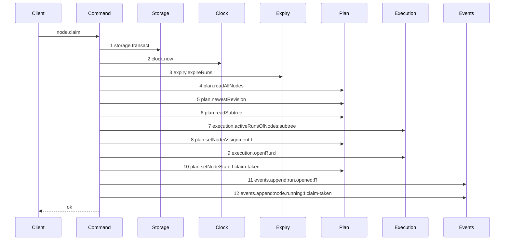

# Story 2 — The claim of an initiative drops the lease

Epic: `.agents/plan/epics/050.4-the-node-lease-removal.md`
Depends on: Story 1 (the deletion), EPIC 050.1 Story 4 (the initiative path).
Kind: story-implement

Diagrams: claim-lease-free-initiative

Supersedes: EPIC 050.1 claim-success-initiative

Seams: claim-lease-free-initiative: -lease.read, -lease.acquire

Story 1 deletes the code. This story draws the second path through it, and its verification is what
proves the deletion reached the initiative branch as well as the task one.

## The ship path

### `claim-lease-free-initiative`

Supersedes: EPIC 050.1 claim-success-initiative

Fixture: the fixture of `claim-success-initiative`. Initiative `I` is `ready`, unassigned, the root,
and it declares `deliverable: expansion`, so the run kind is `structural`, no cascade exists, and the
run holds no `run_base` row and no attempt.



Two steps leave the superseded diagram. No `execution.openAttempt` step exists, so a structural run
that opened an attempt still fails the comparison — that assertion is EPIC 050's and this story
carries it forward unchanged. Neither `execution.runDriversUnderObjective` nor
`execution.activeRunsOfNodes:siblings` appears: both are scoped to an objective, and an initiative is
above that scope.

Add `test/sequence/scenarios/claim-lease-free-initiative.ts`.

## Change

**No production change beyond Story 1.** Story 1 deletes the hierarchy refusal, the replay read and
both acquires, and all three sat on the path both kinds share. `liveLeaseRefusal` returned `null` for
an initiative at `src/domain/lease-hierarchy.ts:63` and the acquires were unconditional, so the
initiative branch loses one read and one acquire and gains nothing.

The one thing this story adds is the scenario file and the cases below. That is deliberate: the
initiative claim is a second path through one command, and a story that draws a path owns its
scenario.

## Constraints

- Add no production code. If a change to `claim-node.ts` is needed here, it belongs in Story 1 and this story reports it rather than making it.
- Do not merge this scenario into `claim-lease-free-task`. One diagram, one path, one scenario file.
- Do not add an attempt to the structural run.

## Verify

```
node --test src/commands/node/claim-node.test.ts test/sequence/conformance.test.ts
```

Add, each as a separate `it`:

1. `"a successful initiative claim writes no lease row"` — seed an empty `lease` table, claim `I`, assert `SELECT COUNT(*) FROM lease` is zero.

2. `"an initiative claim opens one run and no attempt"` — assert the run count is 1 and the attempt count is 0, in one case. Two assertions, so the code cannot drift toward opening an attempt on a structural run.

3. `"an initiative claim over a subtree holding a live node lease succeeds"` — seed a live lease on a descendant task with no run. This is the deletion, asserted on the initiative branch.

4. `"an initiative claim is still refused by an active run on its subtree"` — assert `refusal === "subtree-busy"`. With case 3 this proves the exclusion moved rather than vanished.

5. `"an initiative claim result holds no lease and no objectiveLease"` — key-set assertion.

Add `test/sequence/scenarios/claim-lease-free-initiative.ts`.

`pnpm run verify` exits 0.

Proof: PASS line delivered — `src/commands/node/claim-node.test.ts` in `PASS EPIC-050.4`.
