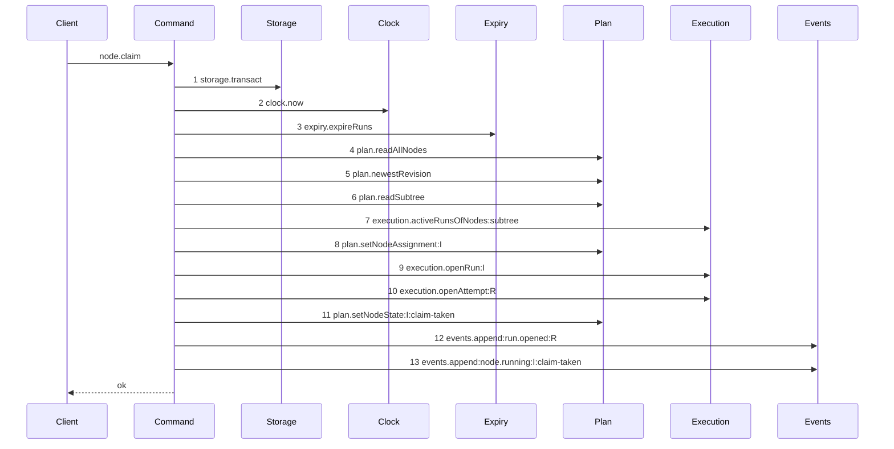

# Story 2 — The claim of an initiative drops the lease

Epic: `.agents/plan/epics/050.4-the-node-lease-removal.md`
Depends on: EPIC 050.4 Story 1 (`01-the-claim-of-a-task-drops-the-lease`) for the deletion, and EPIC 050.1 Story 4 (`04-the-claim-of-an-initiative`) for the initiative path.
Kind: story-implement

Diagrams: claim-lease-free-initiative

Supersedes: EPIC 050.1 claim-success-initiative

Seams: claim-lease-free-initiative: -lease.read:I, -lease.acquire:I, +execution.openAttempt:R

Story 1 deletes the code. This story draws the second path through it, and its verification is what
proves the deletion reached the initiative branch as well as the task one.

**It also carries this epic's one attempt change.** The epic's Decision states it: every admitted run
opens exactly one attempt, whatever its kind. The initiative claim is the one trace that change moves,
and this story already redraws that trace, so the change and its diagram land together.

## The ship path

### `claim-lease-free-initiative`

Supersedes: EPIC 050.1 claim-success-initiative
Superseded by: EPIC 051.5 claim-initiative-reap

Fixture: the fixture of `claim-success-initiative`. Initiative `I` is `ready`, unassigned, the root,
and it declares `deliverable: expansion`, so the run kind is `structural`, no cascade exists, and the
run holds no `run_base` row and exactly one attempt.



Two steps leave the superseded diagram and one joins it. `execution.openAttempt:R` at step 10 is the
attempt widening, and it sits where the task path already draws it — immediately after
`execution.openRun`. A structural run that opened **no** attempt now fails the comparison, which
reverses `.agents/plan/epics/050.1-the-claim.md:235` — `openAttempt` deliberately. Neither
`execution.runDriversUnderObjective` nor
`execution.activeRunsOfNodes:siblings` appears: both are scoped to an objective, and an initiative is
above that scope.

Add `test/sequence/scenarios/claim-lease-free-initiative.ts`.

## Change

**The lease deletion is Story 1's, and this story repeats no line of it.** Story 1 deletes the
hierarchy refusal, the replay read and both acquires, and all three sat on the path both kinds share.
`liveLeaseRefusal` returned `null` for an initiative at `src/domain/lease-hierarchy.ts:63` and the
acquires were unconditional, so the initiative branch loses one read and one acquire from that story
alone.

### 1 — every admitted run opens an attempt

**Edit `src/commands/node/claim-node.ts`.** The conditional at
`src/commands/node/claim-node.ts:401` — `attempt` opens an attempt for one run kind:

```ts
const attempt =
  runKind === "execution"
    ? dependencies.execution.openAttempt(transaction, { runId: run.id })
    : null;
```

It becomes unconditional:

```ts
const attempt = dependencies.execution.openAttempt(transaction, {
  runId: run.id,
});
```

`src/commands/node/claim-node.ts:476` — `attemptId` and `:477` — `attemptNo` then read the record
directly, without `?.` and without `?? null`.

**Both result fields stay nullable, and no schema moves.** `ClaimNodeResult.attemptId` at
`src/commands/node/claim-node.ts:117` — `attemptId` and `attemptNo` at `:118` keep `| null`, and
`nodeClaimResponse.attemptNo` at `src/http/contract/execution.ts:58` — `attemptNo` keeps
`.nullable()`. A non-null value satisfies a nullable field, EPIC 057 owns non-null enforcement, and a
tightened response field would be a second wire change in an epic that already takes one.

**Delete the shipped case that asserts the opposite.**
`src/commands/node/claim-node.test.ts:1898` — `a structural run opens no attempt` is EPIC 050.1 Story
4 (`04-the-claim-of-an-initiative`) case 3, and it fails the moment the open becomes unconditional.
Case 2 below replaces it, and `.agents/plan/epics/050.1-the-claim.md:235` — `openAttempt` stays the
record of what EPIC 050.1 proved at its own boundary.

**One shipped refusal becomes unreachable for an initiative, and no case of this epic asserts it.**
`src/commands/node/release-node.ts:109` — `no-open-attempt` refuses a release of a run holding no open
attempt, so a release of a claimed initiative refuses it today. After this change that run holds the
attempt the release closes. The shipped case closes an attempt by hand — `.agents/plan/stories/050.2-the-run-renew-release-and-report/05-the-release.md:385` —
`no-open-attempt` — so it still refuses and no case moves. Story 5 (`05-the-release-drops-the-lease`)
owns the release path.

### 2 — the scenario and the cases

The rest of this story is the scenario file and the cases below. That is deliberate: the initiative
claim is a second path through one command, and a story that draws a path owns its scenario.

## Constraints

- Add no production code beyond step 1. Any further change to `claim-node.ts` belongs in Story 1, and this story reports it rather than making it.
- Do not merge this scenario into `claim-lease-free-task`. One diagram, one path, one scenario file.
- Do not branch the attempt on the run kind, the node kind or the deliverable. The widening is unconditional, and a branch would leave one claim kind unable to write a checkpoint.
- Do not tighten `attemptNo` or `attemptId`, on the result or on the wire. EPIC 057 owns non-null enforcement.
- Do not touch `src/commands/node/release-node.ts`. Story 5 owns the release.

## Verify

```
node --test src/commands/node/claim-node.test.ts test/sequence/conformance.test.ts
```

Add, each as a separate `it`:

1. `"a successful initiative claim writes no lease row"` — seed an empty `lease` table, claim `I`, assert `SELECT COUNT(*) FROM lease` is zero.

2. `"an initiative claim opens one run and exactly one attempt"` — assert `SELECT COUNT(*) FROM run` is 1, `SELECT COUNT(*) FROM attempt` is 1, and that attempt row's `run_id` equals the opened run, in one case. Three assertions, so a claim that opens no attempt and a claim that opens an attempt of another run both fail.

2a. `"a task claim opens exactly one attempt"` — the same three assertions over the fixture of `claim-lease-free-task`. This is the control that the count reads the claim's own row, and it proves the widening left the execution kind unchanged.

2b. `"an initiative claim result carries attemptId and attemptNo"` — assert `attemptNo` equals `1` and `attemptId` equals the written row's `id`. The claim answered `null` for both before this story, and `nodeClaimResponse.attemptNo` is nullable, so only a value assertion proves the change reached the response.

3. `"an initiative claim over a subtree holding a live node lease succeeds"` — seed a live lease on a descendant task with no run. This is the deletion, asserted on the initiative branch.

4. `"an initiative claim is still refused by an active run on its subtree"` — assert `refusal === "subtree-busy"`. With case 3 this proves the exclusion moved rather than vanished.

5. `"an initiative claim result holds no lease and no objectiveLease"` — key-set assertion.

Add `test/sequence/scenarios/claim-lease-free-initiative.ts`. **Delete `test/sequence/scenarios/claim-success-initiative.ts` in the same commit**, because this replacement makes EPIC 050.1's `claim-success-initiative` superseded the moment it exists, and a scenario naming a superseded diagram is refused at `test/sequence/conformance.test.ts:115` — `names a superseded live diagram`. EPIC 050.3 Story 10 (`10-the-conformance-harness-admits-an-incremental-supersession`) lands that rule one epic earlier, and this epic repeats none of it.

`pnpm run verify` exits 0.

Proof: PASS line delivered — `src/commands/node/claim-node.test.ts` in `PASS EPIC-050.4`.
