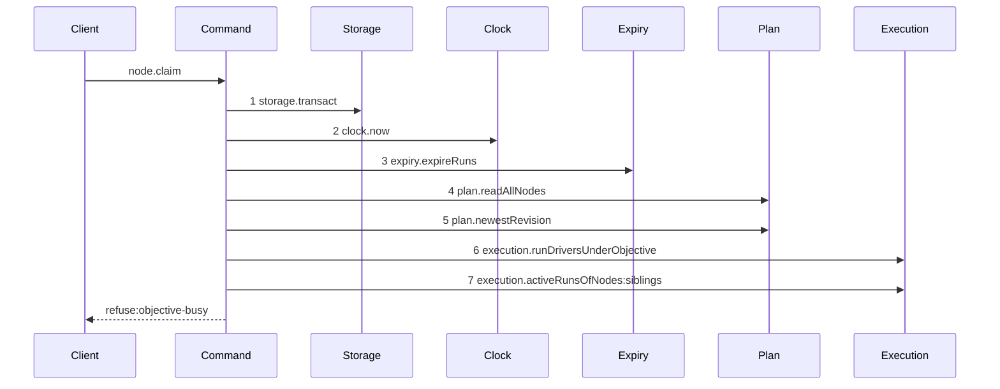

# Story 3 — The objective-busy refusal drops the lease

Epic: `.agents/plan/epics/050.4-the-node-lease-removal.md`
Depends on: Story 1 (the deletion), EPIC 050.1 Story 5 (the refusal).
Kind: story-implement

Diagrams: claim-lease-free-objective-busy

Supersedes: EPIC 050.1 claim-refusal-objective-busy

Seams: claim-lease-free-objective-busy: -lease.read

The prior set of this path is `claim-refusal-objective-busy`, the live refusal diagram EPIC 050 Story
12 drew. Its signs are measured only over the tokens it holds: `lease.acquire` is a token the refusal
never reached, so its deletion is Story 1's and not this story's.

## The ship path

### `claim-lease-free-objective-busy`

Supersedes: EPIC 050.1 claim-refusal-objective-busy

Fixture: the fixture of `claim-lease-free-task`, plus an active run on the sibling task `S`.



Three steps leave the superseded diagram, all of them `lease.read`. `plan.readSubtree` and
`execution.activeRunsOfNodes:subtree` are still not reached, because the earlier refusal wins and the
subtree read serves only the later one. No `Plan` write step, no `Execution` write step and no
`Events` step appears.

What the operation committed is a separate assertion: the expiry pass mutates inside the same
transaction and is hidden behind one step by design, so the byte-identical database comparison is
required beside this diagram and neither replaces the other.

Add `test/sequence/scenarios/claim-lease-free-objective-busy.ts`.

## Change

**No production change beyond Story 1.** The three deleted reads are the relative lease reads of
`liveLeaseRefusal`, which sat before the `objective-busy` refusal on every claim path. Story 1 deletes
them once.

The `objective-busy` refusal keeps its position, its code and its details
`{ objectiveId, siblingNodeId, siblingRunId, expiresAt }`, all registered by EPIC 050.1 Story 1.

## Constraints

- Add no production code. A change needed here belongs in Story 1.
- Do not move the `objective-busy` refusal. Its position between `drive-mode-pinned` and `subtree-busy` is EPIC 050's contract, and the drawn ordinal is what proves it.
- Do not draw the subtree read. A read no refusal needs is not taken.

## Verify

```
node --test src/commands/node/claim-node.test.ts test/sequence/conformance.test.ts
```

Add, each as a separate `it`:

1. `"an objective-busy refusal leaves the database byte-identical"` — snapshot `databaseBytes`, claim, assert the refusal and assert the snapshot deep-equals. The expiry pass runs inside the same transaction and rolls back with the refusal.

2. `"an objective-busy refusal carries its four details"` — `assert.deepEqual(error.details, { objectiveId, siblingNodeId, siblingRunId, expiresAt })`.

3. `"a live sibling lease with no sibling run does not refuse"` — seed a live node lease on `S` and no run on `S`, and assert the claim of `T` succeeds. This is the deletion, asserted on the refusal path.

4. `"objective-busy still beats subtree-busy"` — seed both an active sibling run and an active subtree run, and assert the refusal is `objective-busy`. Precedence is decided by pure predicates the diagram cannot see, so it needs its own case.

Add `test/sequence/scenarios/claim-lease-free-objective-busy.ts`.

`pnpm run verify` exits 0.

Proof: PASS line delivered — `src/commands/node/claim-node.test.ts` in `PASS EPIC-050.4`.
