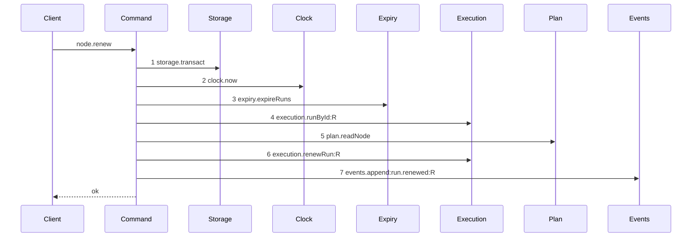

# Story 4 — The renew drops the lease

Epic: `.agents/plan/epics/050.4-the-node-lease-removal.md`
Depends on: EPIC 050.2 Story 3 (`03-the-renew`) and EPIC 050.2 Story 7 (`07-the-worker-contract`). EPIC 050.4 Story 1 (`01-the-claim-of-a-task-drops-the-lease`) must land first, because this story deletes `claimedLease` and `node.claim` is its other consumer.
Kind: story-implement

Diagrams: renew-lease-free

Supersedes: EPIC 050.2 renew-success

Seams: renew-lease-free: -lease.renew:T, -lease.read:O, -lease.renew:O

EPIC 050.2 Story 3 renamed `heartbeat-node.ts` to `src/commands/run/renew-run.ts`, so the line numbers
below name the shipped `heartbeat-node.ts` and locate the code by the symbol that survives the rename.

## The ship path

### `renew-lease-free`

Supersedes: EPIC 050.2 renew-success

Fixture: the fixture of `renew-success`. Task `T` under objective `O`, running, with an active
`execution` run `R` over `T`.



Three steps leave the superseded diagram: the target renew, the objective read and the objective
renew. `Lease` leaves the participant list. No fence write appears, and that absence is still the
assertion EPIC 050.2 made: the fence rises when a run ends and nowhere else.

**`plan.readNode` at step 5 is a context token, and it stays.** It is the only node read of this
command, and it is not the lease's. EPIC 050.2 Story 3 (`03-the-renew`) states what it supplies:
`node.kind` for the objective branch, `node.parentId` for `objectiveScopeOf`, and the
`node-not-found` and `initiative-not-claimable` refusals — and the run row carries none of them.
Item 5 below keeps both refusals in `RenewRefusal`, so deleting the read
would leave a path that cannot raise them. What the objective-lease deletion removes is the two
**consumers** `node.kind` and `node.parentId` fed, not the read.

`renew-refusal-lifetime-exceeded`, the second live diagram of this command, holds no lease token and
does not change. EPIC 050.2 Story 4 owns it and keeps it.

Add `test/sequence/scenarios/renew-lease-free.ts`.

## Change

**`src/commands/run/renew-run.ts` — delete the lease renewal.**

**1 — the target renew.** Delete `renewLease` at `heartbeat-node.ts:117-143` and its call site at
`:81`, including the `LeaseError`-to-`lease-held` translation at `:135-141`.

**2 — the objective renewal.** Delete `renewObjectiveLease` at `:145-191` and its call site at
`:81-95`. That helper holds three of the four `lease-held` raises in the file.

**3 — the response, in the command and in the contract.** Delete the command's local `ClaimedLease`
at `:14-22`, `toClaimedLease` at `:193-202`, and the `lease` and `objectiveLease` members of
`RenewRunResult`. Delete the same two fields from `nodeRenewResponse` at
`src/http/contract/execution.ts:52-56`; `heartbeatIntervalMs` left in EPIC 050.2 Story 7, so the
schema and the result are both `{ expiresAt, renewAfterMs }`.

**3b — `claimedLease` is deleted here.** The shared contract schema at `execution.ts:23-29` had two
consumers. Story 1 removed the first; this story removes the second and deletes the schema. Rewrite
`nodeRenewExamples.success` at `:152-168`, which still holds `lease` and `objectiveLease`, and replace
its `lease-held` error literal at `:169-179` with `fence-stale` carrying `{ runId }`.

**4 — the dependencies and the input, in the command and in the contract.** Delete `lease: Lease` and
`leaseTtlMs: number` from `RenewRunDependencies` at `:25` and `:28`, and the
`services/lease/index.ts` import at `:4-7`. Delete `fence` from `RenewRunInput` and from
`nodeRenewRequest` at `src/http/contract/execution.ts:33-35`, in this story, so the schema and the
handler change together; `runId` and `runFence` are what the command reads. Stop passing `lease` and
`leaseTtlMs` in `src/main.ts:576` and `:579`.

**4b — the handler, the CLI and the derived fixture.** `src/http/server/node/renew-node.ts` — the
shipped `heartbeat-node.ts` EPIC 050.2 Story 3 moves — reads `parsed.data.fence` twice, at `:31` into
the command input and at `:37` into the `presented` argument of `toHttpError`. Delete both; the second
leaves `toHttpError(error)`. In `src/cli/node/renew.ts` — the shipped `heartbeat.ts` — delete the
`.requiredOption("--fence <n>", "lease fence")` at `:29`, the parse and guard at `:37-44`, the `fence`
member of the request body at `:48` and `body.lease.fence` from the output line at `:60`, and carry
the change into its test. Then regenerate `src/http/contract/field-decisions.fixture.ts`, which pins
the `node.heartbeat.request` and `node.heartbeat.response` lines this story deletes.

**5 — the refusal.** Delete `"lease-held"` from `RenewRefusal` at `:12`, leaving the six authority
codes plus `lifetime-exceeded`, `node-not-found` and `initiative-not-claimable`. Delete its branch in
`src/http/server/node/refusals.ts`, its key from `node.renew`'s `errors` record at
`src/http/contract/execution.ts:322`, and its `operationAdditions` entry in
`src/http/contract/coverage.test.ts`.

**6 — the budget that loses its last reader.** `settings.leaseTtlMs` is read at `src/main.ts:555`,
which Story 1 deletes, and at `:579`, which item 4 deletes. This story is its last reader, so it takes
the setting: delete `leaseTtlMs` from `src/services/config/index.ts:35` and its schema entry at
`src/services/config/convict.ts:242-245` with the `KANTHORD_LEASE_TTL_MS` environment binding, its
row at `:372` and its read at `:538`. `runTtlMs` and `runMaxLifetimeMs` of EPIC 050 are the budgets
that survive.

**The hazard that justified keeping the objective lease is gone with it.** EPIC 050.2 Story 3 kept
`lease.read:O` and `lease.renew:O` on this reasoning: _"a run on `runTtlMs` that outlived an objective
lease on `leaseTtlMs` would free a node that another claim then takes, under a run that still holds
authority."_ With no lease of any subject, nothing frees a node on `leaseTtlMs`, and `subtreeExclusion`
of EPIC 050 is what keeps a second claim off the objective while a run covers it. That is why the
three calls go together rather than the objective pair surviving the target one.

## Constraints

- Delete all three lease calls in one story. Keeping the objective pair would leave a renew that renews a row nothing reads.
- Do not touch `execution.renewRun`, the `max_lifetime_at` clamp or the `lifetime-exceeded` refusal. EPIC 050.2 Story 4 owns the second.
- The fence rises only when a run ends. No renew path writes `fence`.
- Delete `input.fence` and the schema field together. Splitting them across two stories leaves one story red.
- Do not touch `errorStatuses`, `exitCodes` or `leaseHeldDetails`. Story 8 retires the code once no operation declares it.
- Take `leaseTtlMs` here. This story removes its last reader, and a budget nothing reads is a setting the daemon still validates.
- Regenerate `field-decisions.fixture.ts` in this story.

## Verify

```
node --test src/commands/run/renew-run.test.ts src/http/server/node/renew-node.test.ts src/cli/node/renew.test.ts src/http/contract/coverage.test.ts src/services/config/convict.test.ts src/main.test.ts test/sequence/conformance.test.ts
```

Add, each as a separate `it`:

1. `"a renew leaves two seeded lease rows byte-identical"` — seed one owned, unexpired node lease on `T` and one on `O`, renew, and assert **all eight columns** of both rows deep-equal the seeded values. Two rows, one case, so the objective renewal cannot survive silently, and every column so a partial write cannot hide.

2. `"a renew still moves the run expires_at forward and leaves the fence unchanged"` — the shipped EPIC 050.2 case, carried across. Both assertions in one case.

3. `"a renew succeeds with an absent objective lease"` — delete every lease row and renew. The shipped command raised `lease-held` when the objective lease was absent or free (`heartbeat-node.ts:157-163`); this asserts that refusal is gone.

4. `"a renew succeeds with an expired objective lease"` — the second of the three deleted objective raises, at `:169-173`.

5. `"a renew succeeds with an objective lease held by another owner"` — the third, at `:163-168`. Cases 3 to 5 together prove `renewObjectiveLease` is deleted whole and not narrowed.

6. `"node.renew declares no lease-held error"` — assert the operation's `errors` record by key set. `RenewRefusal` is an erased type with no runtime list; `pnpm run typecheck` carries the type-level removal.

7. `"the renew result, nodeRenewResponse and nodeRenewRequest hold no lease field"` — three key-set assertions against pinned literals, in one case, so the command and the two schemas cannot drift apart.

8. `"claimedLease is not exported"` — assert the module's export names do not hold it. Story 1 removed its first consumer and this story removes its second.

9. `"a renew still refuses lifetime-exceeded"` — the EPIC 050.2 Story 4 case, carried across unchanged, so this story cannot have moved that refusal while deleting around it.

10. `"every shipped renew case still passes"` — carry the file's cases across with `fence` removed from their inputs.

11. `"kanthord node renew takes no --fence and prints no lease"` — assert the command refuses an unknown `--fence` option and that its stdout line holds `expiresAt` and no fence.

12. `"leaseTtlMs is absent from the settings"` — assert the config key set holds no `leaseTtlMs` and that `KANTHORD_LEASE_TTL_MS` sets nothing.

13. `"the derived field decisions hold no node.heartbeat lease line and no node.renew fence line"` — the shipped `coverage.test.ts` harness over the regenerated fixture.

Add `test/sequence/scenarios/renew-lease-free.ts`.

`pnpm run verify` exits 0.

Proof: PASS line delivered — `src/commands/run/renew-run.test.ts` in `PASS EPIC-050.4`.
