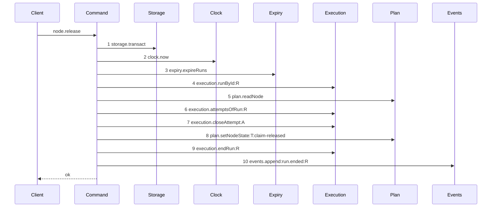

# Story 5 — The release drops the lease

Epic: `.agents/plan/epics/050.4-the-node-lease-removal.md`
Depends on: EPIC 050.2 Story 5 (`05-the-release`) and EPIC 050.2 Story 7 (`07-the-worker-contract`).
Kind: story-implement

Diagrams: release-lease-free

Supersedes: EPIC 050.2 release-success

Seams: release-lease-free: -lease.release:T, -lease.read @src/commands/node/release-node.ts:215

`lease.release:T` is the token the superseded diagram holds, so that `-` needs no citation.
`lease.read` is not in the superseded diagram, so its `-` carries one, as a removal from an undrawn
path must. The other two `lease.release` call sites — the exhausted task branch at `:143` and the
objective branch at `:279` — sit on branches this epic draws no diagram for, so they belong to no
`Seams:` line; the Change names both with their lines and a Constraint requires all three.

**EPIC 050.2's baseline mis-cites that read, and this story does not inherit the confusion.**
`baseline-release-task` cites `:215` for its step 4 `lease.read:T`, and its Change says
`assertRunAuthority` _"replaces `assertHeld` at `:77` and its `lease.read` at `:215`"_. But `:215` is
inside `releaseObjective`'s child-lease loop, on the objective branch, which a task-release fixture
never reaches; `assertHeld` at `:302-326` calls `lease.assertHeld`, and the read it makes is inside the
service. **That citation is a defect in EPIC 050.2 Story 5, and a reviewer resolves it before this
story is dispatched.** This story deletes the child-lease loop with its own citation either way: if
EPIC 050.2 already removed it, the implementing agent reports the token as absent rather than deleting
it twice.

## The ship path

### `release-lease-free`

Supersedes: EPIC 050.2 release-success

Fixture: the fixture of `release-success`. Task `T` running under run `R`, one open attempt `A`, the
attempt limit not reached.



**`plan.readNode` at step 5 is a context token, and it stays.** EPIC 050.2 Story 5 (`05-the-release`)
states what it supplies: `node.kind` for the branch, `node.revision` for `cause`, and the
`node-not-found` and `initiative-not-claimable` refusals — and the run row carries none of them.
That story's own case asserts both refusals still fire. This story deletes
the lease and no consumer of the node row, so the read is unchanged and no `Seams:` token governs it.

One step leaves the superseded diagram, and `Lease` leaves the participant list. Step 9 is still the
last write and step 10 the only event, so a release appends exactly one terminal event.

Add `test/sequence/scenarios/release-lease-free.ts`.

## Change

**`src/commands/node/release-node.ts` — delete five lease sites.**

**1 — `assertHeld`, if it survives.** EPIC 050.2 Story 5 replaces its proof with
`assertRunAuthority` and its Change reads as deleting both the call at `:77` and the helper at
`:302-326`. Verify before editing: if the helper is gone, this item is a no-op and the implementing
agent says so. If it survives, delete it here.

**2 — the three releases.** Delete `dependencies.lease.release` at `:143-150` (the exhausted task
branch), `:180-187` (the released task branch) and `:279-286` (the objective branch). Each sits
between a run write and an `events.append`, and the surrounding calls do not move.

**3 — the descendant lease loop.** Delete `:214-239` in `releaseObjective`: the walk over the
objective's children, the `lease.read` at `:215`, and the `ReleaseNodeError("lease-held", ...)` at
`:226-238`. The `children` list computed at `:210-213` is still used by the child-run loop at `:247`,
so keep the list and delete only the loop that reads leases.

**This story relaxes one shipped behaviour on purpose.** An objective holding a child task with a
live node lease and no active run was refused a release and is now released. A lease is written only
by a claim, and from EPIC 050.1 a claim writes a run in the same transaction, so the two disagree only
for a row left behind by a crash. The child-run loop at `:247-273` still ends every active child run,
which is the exclusion that matters. The relaxation is asserted by a case, so it is a decision and not
a regression.

**4 — the dependencies and the input, in the command and in the contract.** Delete `lease: Lease` from
`ReleaseNodeDependencies` at `:27` and the `services/lease/index.ts` import at `:7`. Delete `fence`
from `ReleaseNodeInput` at `:33-38` and from `nodeReleaseRequest` at
`src/http/contract/execution.ts:37-39`, in this story, so the schema and the handler change together.
Stop passing `lease` in `src/main.ts:587`.

**4b — the handler, the CLI and the derived fixture.** `src/http/server/node/release-node.ts` reads
`parsed.data.fence` twice, at `:31` into the command input and at `:37` into the `presented` argument
of `toHttpError`. Delete both; the second leaves `toHttpError(error)`. In `src/cli/node/release.ts`
delete the `.requiredOption("--fence <n>", "lease fence")` at `:28`, the parse and guard at `:36-43`,
the `fence` member of the request body at `:44` and the word `lease` from the `.description` at
`:26`, and carry the change into its test. Then
regenerate `src/http/contract/field-decisions.fixture.ts`, which pins the `node.release.request`
`fence` line this story deletes.

**5 — the refusal.** Delete `"lease-held"` from `ReleaseRefusal` at `:14`, its branch in
`src/http/server/node/refusals.ts`, its key from `node.release`'s `errors` record at
`src/http/contract/execution.ts:341`, and its `operationAdditions` entry. Replace the `lease-held`
literal of `nodeReleaseExamples` with `fence-stale` carrying `{ runId }`.

**`objectiveScopeOf` stays.** It is read by the `run.ended` payload's `objectiveId`, not by the lease.

## Constraints

- Delete every surviving site. Three are `lease.release`, one is the objective's child-lease loop, and one is `assertHeld` if EPIC 050.2 left it. A story that deletes only the drawn one leaves the objective branch writing a table nothing reads.
- Keep the `children` list at `:210-213`. Delete the loop that reads leases, not the read of the children.
- Do not touch the child-run loop at `:247-273`, the `execution.endRun` calls, or the exhausted branch's `blocked` outcome with `attempt-limit`.
- Do not touch `execution.attemptsOfRun`. EPIC 050.2 Story 5 already collapsed the two reads into one.
- Delete `input.fence` and the schema field together. Splitting them across two stories leaves one story red.
- Do not touch `errorStatuses`, `exitCodes` or `leaseHeldDetails`. Story 8 retires the code.
- Regenerate `field-decisions.fixture.ts` in this story.

## Verify

```
node --test src/commands/node/release-node.test.ts src/http/server/node/release-node.test.ts src/cli/node/release.test.ts src/http/contract/coverage.test.ts test/sequence/conformance.test.ts
```

Add, each as a separate `it`:

1. `"a release leaves a seeded lease row byte-identical"` — seed one owned, unexpired lease on `T`, release, and assert **all eight columns** deep-equal the seeded values. The release must stop writing the table, not start clearing it.

2. `"a release of an objective whose child holds a live lease and no run succeeds"` — the relaxation the Change names, asserted on the objective branch.

3. `"a release of an objective still ends every active child run"` — seed two child runs and assert both are `ended` with outcome `released`. With case 2 this proves the exclusion moved rather than vanished.

4. `"a task release appends exactly one run.ended event"`.

5. `"an objective release appends exactly one run.ended event for the objective run"` — a separate case, so neither branch kept a second event.

6. `"the exhausted branch still blocks with attempt-limit and ends the run"` — the shipped case, carried across.

7. `"node.release declares no lease-held error and its request holds no fence"` — assert the operation's `errors` record and `nodeReleaseRequest` by key set. `ReleaseRefusal` is an erased type; `pnpm run typecheck` carries the type-level removal.

8. `"a release refuses a stale run fence and writes nothing"` — assert `refusal === "fence-stale"` and `databaseBytes` deep-equals the snapshot. The authority check is the only proof of the caller now, so it needs a case in this story and not only in EPIC 050.2's.

9. `"every shipped release case still passes"` — carry the file's cases across with `fence` removed from their inputs.

10. `"kanthord node release takes no --fence"` — assert the command refuses an unknown `--fence` option and succeeds without one.

11. `"the derived field decisions hold no node.release fence line"` — the shipped `coverage.test.ts` harness over the regenerated fixture.

Add `test/sequence/scenarios/release-lease-free.ts`.

`pnpm run verify` exits 0.

Proof: PASS line delivered — `src/commands/node/release-node.test.ts` in `PASS EPIC-050.4`.
