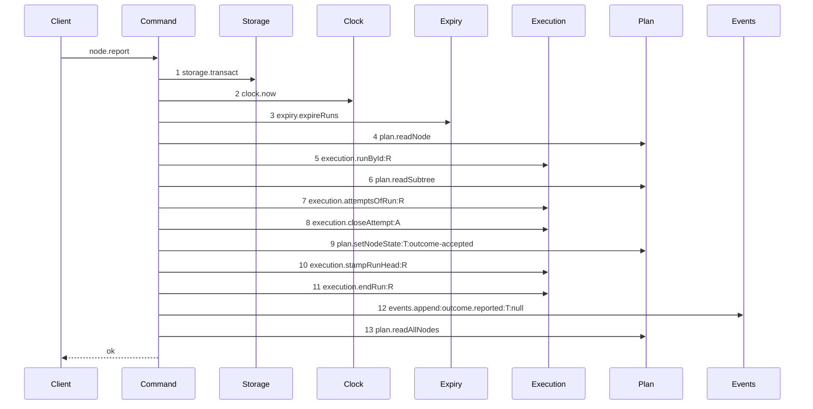

# Story 6 — The report drops the lease

Epic: `.agents/plan/epics/050.4-the-node-lease-removal.md`
Depends on: EPIC 050.2 Story 6 (`06-the-report-prelude`) and EPIC 050.2 Story 7 (`07-the-worker-contract`).
Kind: story-implement

Diagrams: report-lease-free

Supersedes: EPIC 050.2 report-authority-prelude

Seams: report-lease-free: +execution.attemptsOfRun:R, +execution.closeAttempt:A, +plan.setNodeState:T:outcome-accepted, +execution.stampRunHead:R, +execution.endRun:R, +events.append:outcome.reported:T:null, +plan.readAllNodes, -lease.release @src/commands/outcome/report-outcome.ts:282

The superseded diagram pinned its tail, so the seven `+` tokens are tail calls entering a drawn prefix
for the first time, not new calls. `lease.release` is a call the superseded diagram never drew, so its
removal carries a citation.

**The sign on `lease.release` is a `-` with a citation, not a `~`.** `.agents/plan/authoring.md`
requires a cited `~` for a seam call that leaves a tail pinned by
`note over Command: tail unchanged by EPIC <nnn>` — the note for a tail **nobody else owns**. The
superseded diagram carries the other note, `tail pinned by EPIC <nnn> <diagram-id>`, whose tail is
owned by a named later diagram and is never compared, so `lease.release` is a removal from an undrawn
path and the citation rule is the one that applies.

## Why this story draws the whole path

EPIC 050.2 Story 6 pinned the tail of `node.report` and left it to EPIC 051. This story cannot pin it
in the same place: the call it deletes, `lease.release` at `:282`, sits behind two calls of
`execution.attemptsOfRun`, at `:213` and `:240`. No two steps of one live diagram carry one token, so
a prefix that reaches `:282` is undrawable until those two reads collapse into one.

**The collapse is forced by the grammar, and it has a shipped precedent.** EPIC 050.2 Story 5 made the
identical collapse in `release-node.ts` for the identical reason, and `release-node.ts:113-122` is the
pattern: read the attempts once, and project the closing outcome onto the open attempt for the
accounting rather than re-reading after the write.

With the tail drawn, no note remains. EPIC 051 supersedes this diagram rather than the one EPIC 050.2
drew, and EPIC 050.2 Story 6's note is re-pointed to `EPIC 050.4 report-lease-free` as part of this
story's edit to the earlier tree.

## The ship path

### `report-lease-free`

Supersedes: EPIC 050.2 report-authority-prelude

Fixture: task `T` running under run `R` with one open attempt `A`, the attempt limit not reached, and
the report is `accepted` with an `objectId`. The accepted member is chosen because it reaches both
`stampRunHead` and `endRun`, and a diagram holds no branch.



**Step 12 carries the label `null`, and the recorder is what puts it there.**
`test/helpers/sequence-conformance.ts:81` — `reason` appends `String(payload.reason)` whenever the
payload holds a `reason` key, and `src/commands/outcome/report-outcome.ts:302` — `reason` is one of
the nine keys the shipped payload writes. An accepted report carries it as `null`, so the token is
`events.append:outcome.reported:T:null`.

**Steps 1 to 6 are the pinned prefix, reproduced token for token and in its order.**
EPIC 050.2 Story 6 (`06-the-report-prelude`) ends `report-authority-prelude` with
`note over Command: tail pinned by EPIC 050.4 report-lease-free`, so this diagram is what that note
names and its first six steps must be that prefix exactly: `storage.transact`, `clock.now`,
`expiry.expireRuns`, `plan.readNode`, `execution.runById:R`, `plan.readSubtree`.

**`plan.readNode` is step 4, ahead of the authority check, and that position is the prefix's.** That
story states why: _"this command already read the node first, so `node-not-found` and
`initiative-not-reportable` keep their shipped precedence with no reordering."_ It is a context token
— the tail reads `node.kind` and `node.state` from it, `plan.readSubtree` is added **beside** it and
replaces neither — so this story deletes the lease and no consumer of the node row, and no `Seams:`
token governs the read. Drawing it after the authority check would move a shipped refusal's
precedence, which no story of this epic decides.

Step 7 is one read where the shipped path read twice. `lease.release` sat between step 11 and step 12
and is gone, so a report that released a lease fails the comparison. Step 13 is the sibling read that
builds the objective projection of the response; it is a read after every write and it does not move.

Add `test/sequence/scenarios/report-lease-free.ts`.

## Change

**`src/commands/outcome/report-outcome.ts` — delete the release and collapse the reads.**

**1 — the release.** Delete `dependencies.lease.release` at `:282-289`. It sits between the
`execution.endRun` block at `:265-277` and the `events.append` at `:291-306`, and neither moves.

**2 — the collapse.** `:213-215` reads the attempts to find the open one, and `:239-244` reads them
again to build the accounting after `closeAttempt` at `:232`. Read once at `:213`, keep the list, and
build the accounting from it with the closing outcome projected onto `open.id`:

```ts
const accounting = accountAttempts({
  attempts: attempts.map((row) =>
    row.id === open.id
      ? { attemptNo: row.attemptNo, outcome: body.report }
      : { attemptNo: row.attemptNo, outcome: row.outcome },
  ),
  limit: run.attemptLimit,
});
```

This is `release-node.ts:113-122` with `body.report` where the release hard-codes `"cancelled"`.
`attempt` — the return of `closeAttempt` at `:232` — is still what the event and the result read for
`attemptId` and `attemptNo`, so the write is not removed, only the second read of it.

**3 — the dependencies and the input, in the command and in the contract.** Delete `lease: Lease`
from `ReportOutcomeDependencies` at `:55` and the `services/lease/index.ts` import at `:13`. Delete
`fence` from the five members of `ReportOutcomeInput`'s body union that carry it, and from the same
five members of `nodeReportRequest` at `src/http/contract/outcome.ts:23-53`, in this story, so the
schema and the handler change together. The `closed` member at `:49-52` never carried it. `runId` and
`runFence` are on all six after EPIC 050.2 Story 7. Stop passing `lease` in `src/main.ts:306`.

**3b — the handler, the two CLI commands and the derived fixture.**
`src/http/server/node/report-node.ts:41-45` throws
`toHttpError(error, body.report === "closed" ? undefined : { subject: id, fence: body.fence })`.
Delete the whole second argument, leaving `toHttpError(error)`. In `src/cli/node/report.ts` delete
the `--fence` option at `:47`, its parse and guard at `:65-72` and the `fence` member of both request
bodies at `:114` and `:117`; in `src/cli/node/attest.ts` delete the `--fence` option at `:32`, its
parse and guard at `:40-49` and the `fence` member at `:53`. `attest` sends the `attested` member of
`nodeReportRequest`, which this story owns, so both CLI commands move here and not with Story 7.
Carry the change into both tests. Then regenerate `src/http/contract/field-decisions.fixture.ts`,
which pins one `fence` line per member of `node.report.request`.

**4 — the refusal.** Delete `"lease-held"` from `ReportOutcomeRefusal` at `:85`, its branch in
`src/http/server/node/refusals.ts`, its key from `node.report`'s `errors` record at
`src/http/contract/outcome.ts:152`, and its `operationAdditions` entry. Replace the `lease-held`
literal of `nodeReportExamples` at `:75` with `run-ended` carrying `{ runId }`.

**The nested call's `fence` argument goes here, not in Story 7.** `src/commands/outcome/report-outcome.ts:129` passes
`fence: body.fence` into `reportObjective`. `body.fence` stops existing in this story, so the argument
cannot outlive it: delete `fence` from the call at `:125-131` and from `ReportObjectiveInput` in
`src/commands/outcome/report-objective.ts`. Story 7 then deletes the lease block that read it. Leaving
either half to Story 7 leaves this story red, and every story here promises `pnpm run verify` exits 0.

**`lease.read` at `:173` is already gone.** EPIC 050.2 Story 6 replaced it with `assertRunAuthority`.
This story removes what that story left: one write call and the input field that fed it.

**5 — the earlier tree, already corrected.** Both edits are applied:
`.agents/plan/stories/050.2-the-run-renew-release-and-report/06-the-report-prelude.md:50` reads
`Superseded by: EPIC 050.4 report-lease-free` and `:67` reads
`note over Command: tail pinned by EPIC 050.4 report-lease-free`. Verify both before editing, and
report a divergence rather than re-applying.

## Constraints

- Read the attempts once. Two reads of one run are two steps of one token, and the parser refuses that.
- The accounting must see the closing outcome. Projecting `body.report` onto the open attempt is what makes the single read equivalent; dropping the projection would under-count and break the attempt limit.
- Do not move `execution.endRun`, `execution.stampRunHead` or `events.append`. Deleting the call between them changes no order.
- `execution.stampRunHead` needs a projection entry, or step 10 draws a token the recorder cannot emit. `test/helpers/sequence-conformance.ts:50` — `projections` holds no entry for it, so the recorder pushes a bare `execution.stampRunHead` and this diagram's `execution.stampRunHead:R` never matches. Add `"execution.stampRunHead": (input, context) => [field(input, "runId", context)]` beside the other run-scoped entries; its input is an object, so no other change is needed. EPIC 050.2 Story 2 (`02-the-authority-seams`) makes the separate repair that a **primitive** argument needs.
- Touch the objective branch's dispatch at `:125-138` only to drop the `fence` argument. Story 7 owns everything else in `report-objective.ts`.
- Delete `input.fence` and the five schema members together. Splitting them across two stories leaves one story red.
- Do not touch `errorStatuses`, `exitCodes` or `leaseHeldDetails`. Story 8 retires the code.
- Regenerate `field-decisions.fixture.ts` in this story.

## Verify

```
node --test src/commands/outcome/report-outcome.test.ts src/http/server/node/report-node.test.ts src/cli/node/report.test.ts src/cli/node/attest.test.ts src/http/contract/coverage.test.ts test/sequence/conformance.test.ts
```

Add, each as a separate `it`:

1. `"a report leaves a seeded lease row byte-identical"` — seed one owned, unexpired lease on `T`, report `accepted`, and assert **all eight columns** deep-equal the seeded values.

2. `"a report reads the attempts once"` — count the recorder's `attemptsOfRun` calls and assert `1`.

3. `"the accounting sees the closing attempt"` — a run at `attemptLimit: 2` with one closed `failed` attempt and one open. Report `failed`, and assert the effect is the exhausted one. Without the projection the single read counts one failure and the node does not block; this case is what proves the collapse is equivalent.

4. `"the accounting is unchanged below the limit"` — the same fixture at `attemptLimit: 3`, asserting `attemptsRemaining` by value. With case 3 the projection is proven in both directions.

5. `"a report appends exactly one outcome.reported event"`.

6. `"node.report declares no lease-held error and no member of its request holds a fence"` — assert the operation's `errors` record by key set, and iterate all six members of `nodeReportRequest`. Iterating is what proves it is five removals and not four. `ReportOutcomeRefusal` is an erased type; `pnpm run typecheck` carries the type-level removal.

7. `"a report refuses a stale run fence and writes nothing"` — assert `refusal === "fence-stale"` and `databaseBytes` deep-equals the snapshot.

8. `"every shipped report case still passes"` — carry the file's cases across with `fence` removed from their inputs, including the four task outcomes and the two objective members.

9. `"kanthord node report and kanthord node attest take no --fence"` — both commands in one case, so neither keeps the option while the other loses it.

10. `"the derived field decisions hold no node.report fence line"` — the shipped `coverage.test.ts` harness over the regenerated fixture. Assert the count of removed lines is five, matching the five members that carried `fence`.

Add `test/sequence/scenarios/report-lease-free.ts`.

`pnpm run verify` exits 0.

Proof: PASS line delivered — `src/commands/outcome/report-outcome.test.ts` in `PASS EPIC-050.4`.
