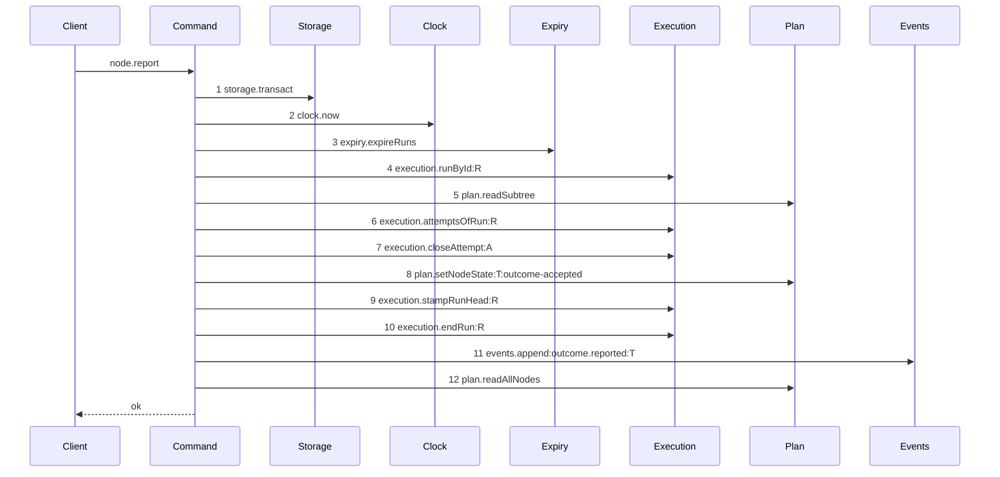

# Story 6 — The report drops the lease

Epic: `.agents/plan/epics/050.4-the-node-lease-removal.md`
Depends on: EPIC 050.2 Story 6 (the authority prelude) and Story 7 (the worker contract).
Kind: story-implement

Diagrams: report-lease-free

Supersedes: EPIC 050.2 report-authority-prelude

Seams: report-lease-free: +execution.attemptsOfRun, +execution.closeAttempt, +plan.setNodeState, +execution.stampRunHead, +execution.endRun, +events.append:outcome.reported, +plan.readAllNodes, -lease.release @src/commands/outcome/report-outcome.ts:282

The superseded diagram pinned its tail, so the seven `+` tokens are tail calls entering a drawn prefix
for the first time, not new calls. `lease.release` is a call the superseded diagram never drew, so its
removal carries a citation.

**The sign on `lease.release` is a `-` with a citation, not a `~`.** `.agents/plan/authoring.md`
requires a cited `~` for a seam call that leaves a tail pinned by
`note over Command: tail unchanged by EPIC <nnn>` — the note for a tail **nobody else owns**, where
the story asserts the rest of the trace is byte-identical. The superseded diagram carries the other
note, `tail pinned by EPIC <nnn> <diagram-id>`, whose tail is owned by a named later diagram and is
never compared. This story does not amend a pinned tail and leave it pinned; it draws the tail whole,
so every token in it is measured over token sets against a prior set that holds none of them. That
makes `lease.release` a removal from an undrawn path, and the citation rule is the one that applies.
**A reviewer resolves this reading before dispatch**: if the `~` form is required, the line becomes
`~lease.release @src/commands/outcome/report-outcome.ts:282` and nothing else in the story moves.

## Why this story draws the whole path

EPIC 050.2 Story 6 pinned the tail of `node.report` and left it to EPIC 051. This story cannot pin it
in the same place: the call it deletes, `lease.release` at `:282`, sits behind two calls of
`execution.attemptsOfRun`, at `:213` and `:240`. No two steps of one live diagram carry one token, so
a prefix that reaches `:282` is undrawable until those two reads collapse into one.

**The collapse is forced by the grammar, and it has a shipped precedent.** EPIC 050.2 Story 5 made the
identical collapse in `release-node.ts` for the identical reason, and `release-node.ts:113-122` is the
pattern: read the attempts once, and project the closing outcome onto the open attempt for the
accounting rather than re-reading after the write.

With the tail drawn, no note remains. EPIC 051 supersedes this diagram rather than the one EPIC 050.2
drew, and EPIC 050.2 Story 6's note is re-pointed to `EPIC 050.4 report-lease-free` as part of this
story's edit to the earlier tree.

## The ship path

### `report-lease-free`

Supersedes: EPIC 050.2 report-authority-prelude

Fixture: task `T` running under run `R` with one open attempt `A`, the attempt limit not reached, and
the report is `accepted` with an `objectId`. The accepted member is chosen because it reaches both
`stampRunHead` and `endRun`, and a diagram holds no branch.



Steps 1 to 5 are the prelude EPIC 050.2 drew, unchanged. Step 6 is one read where the shipped path
read twice. `lease.release` sat between step 10 and step 11 and is gone, so a report that released a
lease fails the comparison. Step 12 is the sibling read that builds the objective projection of the
response; it is a read after every write and it does not move.

Add `test/sequence/scenarios/report-lease-free.ts`.

## Change

**`src/commands/outcome/report-outcome.ts` — delete the release and collapse the reads.**

**1 — the release.** Delete `dependencies.lease.release` at `:282-289`. It sits between the
`execution.endRun` block at `:265-277` and the `events.append` at `:291-306`, and neither moves.

**2 — the collapse.** `:213-215` reads the attempts to find the open one, and `:239-244` reads them
again to build the accounting after `closeAttempt` at `:232`. Read once at `:213`, keep the list, and
build the accounting from it with the closing outcome projected onto `open.id`:

```ts
const accounting = accountAttempts({
  attempts: attempts.map((row) =>
    row.id === open.id
      ? { attemptNo: row.attemptNo, outcome: body.report }
      : { attemptNo: row.attemptNo, outcome: row.outcome },
  ),
  limit: run.attemptLimit,
});
```

This is `release-node.ts:113-122` with `body.report` where the release hard-codes `"cancelled"`.
`attempt` — the return of `closeAttempt` at `:232` — is still what the event and the result read for
`attemptId` and `attemptNo`, so the write is not removed, only the second read of it.

**3 — the dependencies and the input, in the command and in the contract.** Delete `lease: Lease`
from `ReportOutcomeDependencies` at `:55` and the `services/lease/index.ts` import at `:13`. Delete
`fence` from the five members of `ReportOutcomeInput`'s body union that carry it, and from the same
five members of `nodeReportRequest` at `src/http/contract/outcome.ts:23-53`, in this story, so the
schema and the handler change together. The `closed` member at `:49-52` never carried it. `runId` and
`runFence` are on all six after EPIC 050.2 Story 7. Stop passing `lease` in `src/main.ts:306`.

**4 — the refusal.** Delete `"lease-held"` from `ReportOutcomeRefusal` at `:85`, its branch in
`src/http/server/node/refusals.ts`, its key from `node.report`'s `errors` record at
`src/http/contract/outcome.ts:151`, and its `operationAdditions` entry. Replace the `lease-held`
literal of `nodeReportExamples` at `:75` with `run-ended` carrying `{ runId }`.

Story 7 deletes the same field from `ReportObjectiveInput`, which reads it from this command's body.
The two stories land together or `node.report`'s objective branch does not compile; Story 7 depends on
this one.

**`lease.read` at `:173` is already gone.** EPIC 050.2 Story 6 replaced it with `assertRunAuthority`.
This story removes what that story left: one write call and the input field that fed it.

**5 — the earlier tree.** In
`.agents/plan/stories/050.2-the-run-renew-release-and-report/06-the-report-prelude.md`, add
`Superseded by: EPIC 050.4 report-lease-free` under the ship diagram's `Supersedes:` line, and change
its note from `tail pinned by EPIC 051 report-execution-checkpoint` to
`tail pinned by EPIC 050.4 report-lease-free`. This epic owns that tail now.

## Constraints

- Read the attempts once. Two reads of one run are two steps of one token, and the parser refuses that.
- The accounting must see the closing outcome. Projecting `body.report` onto the open attempt is what makes the single read equivalent; dropping the projection would under-count and break the attempt limit.
- Do not move `execution.endRun`, `execution.stampRunHead` or `events.append`. Deleting the call between them changes no order.
- Do not touch the objective branch's dispatch at `:125-138`. Story 7 owns `report-objective.ts`.
- Delete `input.fence` and the five schema members together. Splitting them across two stories leaves one story red.
- Do not touch `errorStatuses`, `exitCodes` or `leaseHeldDetails`. Story 8 retires the code.

## Verify

```
node --test src/commands/outcome/report-outcome.test.ts src/http/server/node/report-node.test.ts test/sequence/conformance.test.ts
```

Add, each as a separate `it`:

1. `"a report leaves a seeded lease row byte-identical"` — seed one owned, unexpired lease on `T`, report `accepted`, and assert **all eight columns** deep-equal the seeded values.

2. `"a report reads the attempts once"` — count the recorder's `attemptsOfRun` calls and assert `1`.

3. `"the accounting sees the closing attempt"` — a run at `attemptLimit: 2` with one closed `failed` attempt and one open. Report `failed`, and assert the effect is the exhausted one. Without the projection the single read counts one failure and the node does not block; this case is what proves the collapse is equivalent.

4. `"the accounting is unchanged below the limit"` — the same fixture at `attemptLimit: 3`, asserting `attemptsRemaining` by value. With case 3 the projection is proven in both directions.

5. `"a report appends exactly one outcome.reported event"`.

6. `"node.report declares no lease-held error and no member of its request holds a fence"` — assert the operation's `errors` record by key set, and iterate all six members of `nodeReportRequest`. Iterating is what proves it is five removals and not four. `ReportOutcomeRefusal` is an erased type; `pnpm run typecheck` carries the type-level removal.

7. `"a report refuses a stale run fence and writes nothing"` — assert `refusal === "fence-stale"` and `databaseBytes` deep-equals the snapshot.

8. `"every shipped report case still passes"` — carry the file's cases across with `fence` removed from their inputs, including the four task outcomes and the two objective members.

Add `test/sequence/scenarios/report-lease-free.ts`.

`pnpm run verify` exits 0.

Proof: PASS line delivered — `src/commands/outcome/report-outcome.test.ts` in `PASS EPIC-050.4`.
