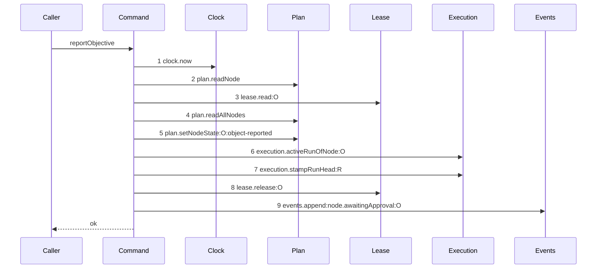
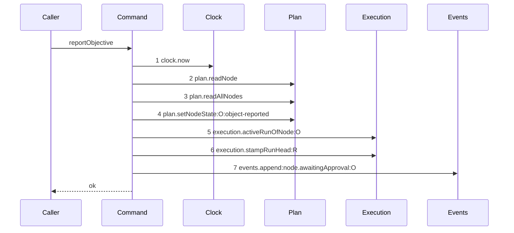

# Story 7 — The objective attestation drops the lease

Epic: `.agents/plan/epics/050.4-the-node-lease-removal.md`
Depends on: Story 6 (the parent command, which deletes `fence` from the `attested` member of `nodeReportRequest`, from `ReportObjectiveInput` and from the nested call).
Kind: story-implement

Diagrams: attest-lease-free

Baselines: attest-lease-free <- baseline-report-objective

Seams: attest-lease-free: -lease.read:O, -lease.release:O

`report-objective.ts` is a nested command. `report-outcome.ts:125` binds it to unrecorded dependencies
and it counts as one step there, so it carries its own pair and its own scenario. No epic has drawn
it, so this story draws the baseline.

## The shipped path

### `baseline-report-objective`

Superseded by: EPIC 050.4 attest-lease-free

Shipped path: `src/commands/outcome/report-objective.ts:51-201`. Fixture: objective `O` running under
run `R`, holding tasks `T` and `S`, both terminal and both `done`. The caller is a harness actor
holding the live lease of `O` at the presented fence, and the report is `attested` with an `objectId`.



Citations, one per step: `:56`, `:65`, `:80`, `:113`, `:142`, `:152`, `:160`, `:165`, `:174`. No
`Storage` participant appears: the command receives the transaction its caller opened and never opens
one. Step 5 writes the node state **before** step 6 reads the run, so an objective with no active run
is refused after its state has already been set — that ordering defect is drawn rather than described,
and this story does not fix it. EPIC 051 owns the objective checkpoint.

### `attest-lease-free`

Supersedes: EPIC 050.4 baseline-report-objective

Fixture: the fixture of `baseline-report-objective`, minus the lease. The caller's authority is the
run, asserted by `report-outcome.ts` before it delegates.



Two steps leave the baseline and `Lease` leaves the participant list. Nothing else moves, and the
`setNodeState`-before-`activeRunOfNode` order is carried across unchanged, so this story's diagram
proves the deletion and nothing more.

Add `test/sequence/scenarios/attest-lease-free.ts`.

## Change

**`src/commands/outcome/report-objective.ts` — delete the lease proof and the release.**

**1 — the proof.** Delete `dependencies.lease.read` at `:80-84`, the `staleLease` message at `:85`,
the held-by-other raise at `:86-102` and the stale-fence raise at `:103-111`. The block is a
contiguous 32 lines and it leaves as one.

**No replacement guard.** `report-outcome.ts` asserts run authority before it dispatches, and EPIC
050.2 Story 6 states the prelude runs for **all six** members of the report union, the objective ones
included. `reportObjective` runs inside that same transaction, so a second coverage check would refuse
the very run that is reporting.

**2 — the release.** Delete `dependencies.lease.release` at `:165-172`. It sits between
`execution.stampRunHead` at `:160-163` and `events.append` at `:174-188`, and neither moves.

**3 — the dependencies.** Delete `lease: Lease` from `ReportObjectiveDependencies` at `:15` and the
`services/lease/index.ts` import at `:9`. Stop passing `lease` in `src/main.ts:295`. `fence` is
**already gone** from `ReportObjectiveInput` and from the call at `report-outcome.ts:125-131`: Story 6
takes both, because `body.fence` — the value that argument carried — stops existing there. Report a
surviving `fence` as a Story 6 defect rather than deleting it here.

**4 — the refusal.** Delete `"lease-held"` from `ReportObjectiveRefusal` at `:33`, leaving
`"actor-forbidden" | "illegal-transition"`. Delete its branch in `reportObjectiveRefusal` at
`src/http/server/node/refusals.ts:88`. `node.report`'s contract `errors` record is Story 6's, because
one operation carries both commands.

**An attestation ends no run.** It stamps the run head at `:160-163` and appends
`node.awaitingApproval`; the run stays `active` until EPIC 051's objective checkpoint. This story
therefore owns no assertion about a terminal event on an ended run.

**`aggregate-initiative.ts` and `close-objective.ts` are not in this story, because they hold no
lease.** `aggregate-initiative.ts` imports `aggregate`, `initiativeOutcome`, `terminalStates`,
`EventLog`, `PlanStore` and `Transaction`; `close-objective.ts` imports `Clock`, `EventLog`,
`Execution` and `PlanStore`. Neither names `Lease` and neither reads a lease row. The draft epic named
all three and only one is real.

## Constraints

- Delete the lease block whole. Do not narrow it to the stale-fence half.
- Add no run guard. The parent asserts authority for all six report members.
- Do not reorder `setNodeState` and `activeRunOfNode`. The order is drawn, it is a shipped defect, and EPIC 051 owns it.
- Do not touch `aggregate-initiative.ts` or `close-objective.ts`.
- `actor-forbidden` at `:58-63` stays. It refuses a human, which the run authority does not.

## Verify

```
node --test src/commands/outcome/report-objective.test.ts src/commands/outcome/report-outcome.test.ts test/sequence/conformance.test.ts
```

Add, each as a separate `it`:

1. `"an attestation leaves a seeded lease row byte-identical"` — seed one owned, unexpired lease on `O`, attest, and assert **all eight columns** deep-equal the seeded values.

2. `"an attestation with no lease row succeeds"` — the deletion, asserted directly.

3. `"an attestation with a lease held by another owner succeeds"` — the held-by-other raise at `:86-102`, asserted as an admission.

4. `"an attestation with a stale fence succeeds"` — the stale-fence raise at `:103-111`. With case 3 the block is proven deleted whole and not narrowed.

5. `"an attestation with no run authority still refuses, through report-outcome"` — call `reportOutcome` with an ended run and an `attested` body. Assert the refusal is `run-ended` and not `lease-held`, and assert `databaseBytes` deep-equals the snapshot. This is the case that proves the parent's guard covers the objective member.

6. `"a human actor still cannot attest"` — assert `refusal === "actor-forbidden"`.

7. `"an attestation raises no lease-held refusal by any route"` — drive the three deleted raises through `reportOutcome` and assert each succeeds. `ReportObjectiveRefusal` is an erased type with no runtime list, so the behavioural cases carry it and `pnpm run typecheck` carries the type-level removal.

8. `"an attestation appends exactly one node.awaitingApproval event and leaves the run active"` — both in one case. The run is EPIC 051's to end, and asserting it here is what stops a drift toward ending it now.

9. `"every shipped attestation case still passes"` — carry the file's cases across with `fence` removed from their inputs, including the `children-not-terminal` and `projection-discarded` guards.

Add `test/sequence/scenarios/attest-lease-free.ts`.

`pnpm run verify` exits 0.

Proof: PASS line delivered — `src/commands/outcome/report-objective.test.ts` in `PASS EPIC-050.4`.
