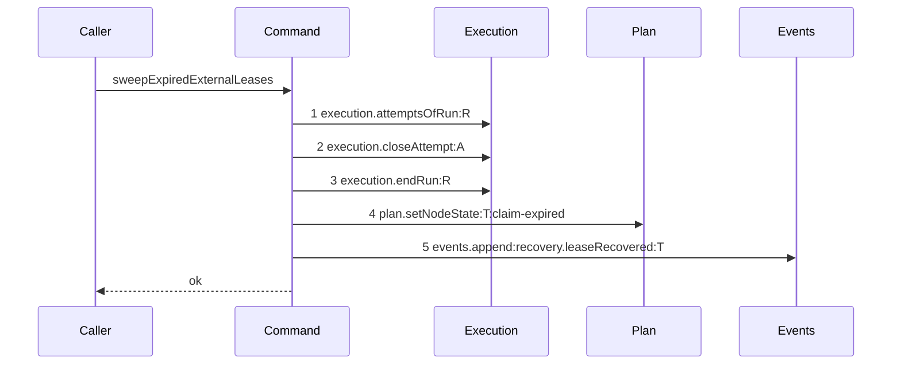
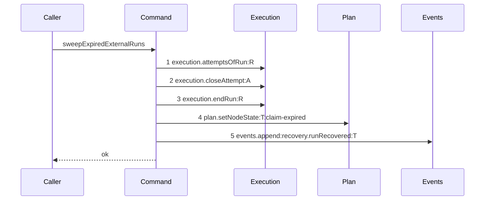

# Story 1 — The external sweep scans runs

Epic: `.agents/plan/epics/050.5-the-lease-table-removal.md`
Depends on: EPIC 050.4, implemented. EPIC 050 Story 2 (`run.expires_at`, `run.driver`, `run_base`).
Kind: story-implement

Diagrams: sweep-external-runs

Baselines: sweep-external-runs <- baseline-sweep-external-leases

Seams: sweep-external-runs: -events.append:recovery.leaseRecovered, +events.append:recovery.runRecovered

This story owns the shared candidate query and the two recovery event types. Story 2 consumes both.

## The shipped path

### `baseline-sweep-external-leases`

Superseded by: EPIC 050.5 sweep-external-runs

Shipped path: `src/commands/startup/recover-expired-leases.ts:79-160`. Fixture: task `T` under
objective `O`, `T` is `running` with an expired node lease, an active `external` run `R` over `T`, and
one open attempt `A`. The caller passes its own transaction, so the sweep opens none.



Citations, one per step: `:105`, `:112`, `:118`, `:129`, `:142`.

No `Storage` participant appears: the command receives the transaction its caller opened. No `Lease`
participant appears either — the `lease` key at `:64` is declared and never called, and both reaches
into the table are raw SQL, `CANDIDATE_SQL` at `:84` and the `UPDATE lease` at `:124`. Raw SQL runs on
the transaction object, not on an injected capability, so it is invisible at this seam.

### `sweep-external-runs`

Supersedes: EPIC 050.5 baseline-sweep-external-leases

Fixture: the fixture of `baseline-sweep-external-leases`, minus the lease row. `R` carries
`expires_at <= now`, which is what makes `T` a candidate now that the lease is gone.



One label changes and nothing moves. **That is the assertion**: the candidate set is now selected by
the run's expiry rather than the lease's, and the order in which the sweep closes the attempt, ends
the run and returns the node is unchanged. A rewrite that reordered those three, or that returned the
node before ending the run, fails the comparison.

**The pair is small because most of this change is invisible at the seam.** The candidate query and
the lease update are raw SQL. What proves them is the Verify section, and the diagram's job is to
prove that rewriting them moved nothing else.

Add `test/sequence/scenarios/sweep-external-runs.ts`.

## Change

### 1 — the file and the export

`git mv src/commands/startup/recover-expired-leases.ts src/commands/startup/recover-expired-runs.ts`
and its test beside it. Rename `sweepExpiredExternalLeases` to `sweepExpiredExternalRuns`, with
`SweepExpiredExternalLeasesDependencies`, `…Input` and `…Result` renamed to match. Story 2 renames the
file's other export.

Update the three call sites in `src/main.ts` — the closure at `:377-386` and its three injections at
`:515` (`node.list`), `:553` (`node.claim`) and `:634` (`project.nodes`) — and the dependency key on
`src/queries/node/list-node.ts:9,19,35` and `src/queries/node/list-project-node.ts:23,43`. **EPIC 050
Story 10 removed the call from `claim-node.ts` and left the key on its dependencies record**; delete
the key there too, because after this story no claim path reads it.

### 2 — the candidate query

Replace `CANDIDATE_SQL` at `:44-60`. It is shared with `recoverExpiredRuns`, so this story writes the
form both readers need:

```sql
SELECT r.node_id AS node_id, r.fence, r.id AS run_id, r.driver, n.kind,
       rb.oid AS base_oid, w.path, w.repository_id, n.revision AS revision
FROM run r
JOIN node n ON n.id = r.node_id
LEFT JOIN run_base rb ON rb.run_id = r.id
LEFT JOIN workspace w ON w.id = r.workspace_id
WHERE r.state = 'active'
  AND r.expires_at <= ?
  AND n.state = 'running'
ORDER BY r.node_id
```

`CandidateRow` at `:32-42` keeps its shape with `subject_id` renamed to `node_id` and `fence` now the
run's. Three shipped columns change source and none changes meaning:

| column     | was                               | is                                           |
| ---------- | --------------------------------- | -------------------------------------------- |
| `node_id`  | `l.subject_id`, the lease subject | `r.node_id`, the run's node                  |
| `fence`    | `l.fence`, the lease generation   | `r.fence`, the run generation                |
| `base_oid` | `ra.base_oid` on the active run   | `rb.oid` on `run_base`                       |
| `run_id`   | the active run of that node       | the candidate run itself                     |
| `driver`   | `COALESCE(ra.driver, rl.driver)`  | `r.driver`, with no fallback to the last run |

**The two `LEFT JOIN run` clauses are gone.** The shipped query joined the active run and, failing
that, the newest run by id — a fallback that existed because the _lease_ was the candidate and its run
might already be over. The run is the candidate now, so it is always present and `run_id` is never
null. Delete the `row.run_id !== null` guard at `:104`.

**`run.expires_at` is `NOT NULL` after migration `12`**, so the shipped `IS NOT NULL` guard goes.

### 3 — the lease write

Delete the `UPDATE lease` at `:124-127`. Nothing replaces it: `execution.endRun` at `:118` already
raises the fence and ends the run, which is what the lease clear was standing in for.

Delete `lease: Lease` from the dependencies record at `:64` and the
`services/lease/index.ts` import at `:8`. It was never called.

### 4 — the two event types

`src/domain/event-type.ts` — rename `"recovery.leaseBlocked"` to `"recovery.runBlocked"` and
`"recovery.leaseRecovered"` to `"recovery.runRecovered"`, each in its bytewise position. The list is
sorted, so both move: `recovery.runBlocked` and `recovery.runRecovered` sort after
`recovery.remnantRemoved`. `retiredEventTypes` stays empty — there are no deployments and no stored
event to keep readable.

`src/domain/recovery.ts` — rename `leaseSweepTargets` at `:27` to `runSweepTargets` and
`leaseVerdictTargets` at `:29` to `runVerdictTargets`. Neither value changes.

`src/http/contract/event-payload.ts` — rename the two keys at `:234-235` and the two enum imports at
`:14-15`. `eventPayloads` is typed `Readonly<Record<EventType, ZodType>>`, so the type list and the
payload map must move in one edit or neither compiles.

**Rename both emit sites in this file.** The sweep appends at `:142` and `writeVerdict` appends at
`:343-349`. `writeVerdict` is Story 2's to change in substance; this story changes only the two string
literals in it, because the type it names is gone otherwise.

## Constraints

- Do not call `expireRuns`. This sweep ends the run it handles, exactly as the shipped code does at `:118`, and a pass that ended every due run first would leave `recoverExpiredRuns` no candidates at `:231`.
- Do not change the order of `closeAttempt`, `endRun`, `setNodeState` and `events.append`. The drawn ordinals are the contract.
- Do not change `endActiveTaskRunsUnderObjective` at `:162-207`. It walks children through `plan.readAllNodes` and `execution.activeRunOfNode`, neither of which reads a lease.
- Do not narrow the candidate query to external runs. The shipped query selects every expired candidate and the loop filters on `row.driver !== "external"` at `:93`; keep that split, because Story 2's internal half consumes the same rows.
- Delete the `lease` dependency key from this command and from `claim-node.ts`. Do not leave a key nothing reads.
- Do not touch `writeVerdict`'s logic. Two string literals only.
- Do not rename `RECOVERY_STEP_ORDER`'s `leases` step or `RecoverHomeDependencies.leases`. Story 2 states why that rename is deferred.
- Do not touch the `lease` table. It survives this epic, empty, until EPIC 057's migration `17`.

## Verify

```
node --test src/commands/startup/recover-expired-runs.test.ts src/queries/node/list-node.test.ts src/queries/node/list-project-node.test.ts src/domain/recovery.test.ts src/http/contract/event-payload.test.ts src/main.test.ts test/sequence/conformance.test.ts
```

Add, each as a separate `it`:

1. `"an expired external run returns its task to ready, closes its attempt, ends the run and raises the fence"` — seed `R` active on `T` with `fence: 3`, `expires_at: NOW - 1`, `driver: "external"`, one open attempt `A`. Assert the node is `ready`, the attempt's `outcome` is `cancelled`, the run's `state` is `ended` and its `fence` is `4`. Four assertions, one case, so the sweep cannot drift toward doing three of the four.

2. `"the sweep appends exactly one recovery.runRecovered event and no recovery.leaseRecovered"`.

3. `"the sweep writes no lease row"` — seed one owned, unexpired lease row on `T`, run the sweep, and assert **all eight columns** deep-equal the seeded values. The table still exists after this epic, so the comparison is real and it stays green through EPIC 057.

4. `"a run one millisecond from expiry is untouched"` — `expires_at: NOW + 1`. Assert the node stays `running` and the run stays `active`. With case 1 the boundary is pinned from both sides.

5. `"an internal expired run is not swept"` — `driver: "internal"`. Assert the node stays `running`. The internal half is Story 2's, and this case is the guard that this story did not take it.

6. `"an expired external objective run ends its active task runs"` — the `endActiveTaskRunsUnderObjective` path, carried across from the shipped cases with the lease fixture replaced by a run fixture.

7. `"a node whose state is not running is not a candidate"` — seed `T` as `ready` under an expired active run. Assert nothing is written. The `n.state = 'running'` predicate is shipped behaviour and it survives the rewrite.

8. `"node.list sweeps a stale external claim on read"` — call `listNodes` and assert the node comes back `ready`.

9. `"project.nodes sweeps a stale external claim on read"` — the same through `listProjectNodes`. Two cases, because `main.ts` binds the sweep separately for each operation and one binding can be missed.

10. `"claim-node holds no sweep dependency"` — assert `ClaimNodeDependencies`' key set by value.

11. `"eventTypes names the two run recovery types and neither lease one"` — assert both members present, both lease members absent, `retiredEventTypes` empty, and the list equal to its own `Buffer.compare` sort. Four assertions, one case.

12. `"eventPayloads has a member for every event type"` — the shipped harness, run unchanged. It is what catches a type renamed without its payload.

Add `test/sequence/scenarios/sweep-external-runs.ts`.

`pnpm run verify` exits 0.

Proof: PASS line delivered — `src/commands/startup/recover-expired-runs.test.ts` in `PASS EPIC-050.5`.
