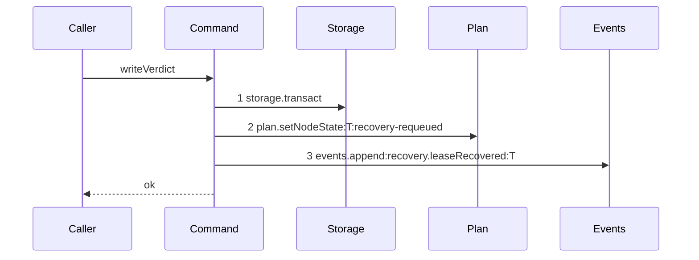
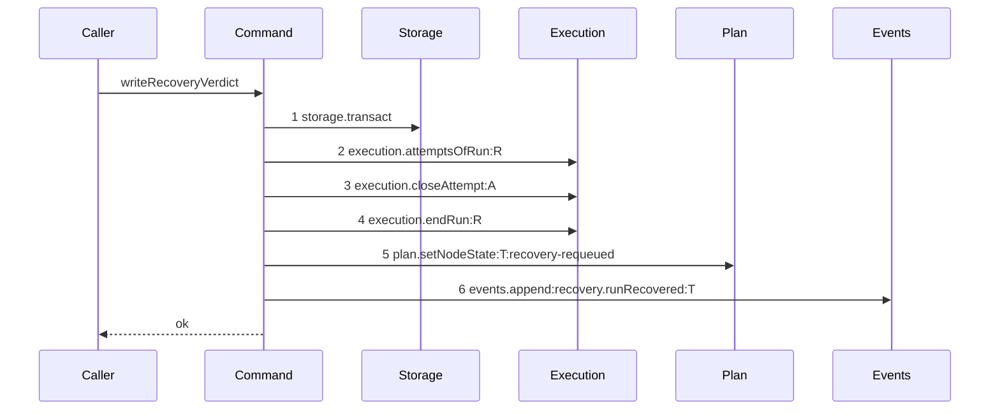

# Story 2 — Startup recovery scans runs

Epic: `.agents/plan/epics/050.5-the-lease-table-removal.md`
Depends on: Story 1 (the candidate query, the renamed file and the two event types).
Kind: story-implement

Diagrams: recovery-verdict-run

Baselines: recovery-verdict-run <- baseline-recovery-verdict

Seams: recovery-verdict-run: +execution.attemptsOfRun:R, +execution.closeAttempt:A, +execution.endRun:R, -events.append:recovery.leaseRecovered:T, +events.append:recovery.runRecovered:T

## The path this story draws, and the one it cannot

`recoverExpiredLeases` calls `storage.transact` three times — `:218` for the candidate read, `:231`
for the external sweep and `:328` for each per-node verdict. `storage.transact` has no projection in
the harness of EPIC 050.1 Story 6 (`06-the-conformance-harness`), and a method with no projection admits one call per diagram, so the
outer pass's trace needs `:#2` and `:#3` — tokens the parser refuses outside a `baseline-` id.

**The cause cannot be removed.** The git worktree reads at `:277-281` must sit outside a transaction,
which `AGENTS.md` requires, so the pass is three transactions by design.

This story therefore promotes the per-node verdict to a **nested command injected on the outer pass's
dependencies record**, and draws its pair. Injection is what makes it one step: the recorder wraps the
dependency object a command receives, so a helper called **directly** has its `execution`, `plan` and
`events` calls recorded as the outer command's own, and only a nested command bound to unrecorded
dependencies collapses to one token. `close-objective.ts:20-23` already takes `aggregateInitiative`
that way, and `claim-node.ts:58-61` takes `sweepExpiredExternalLeases` that way; this is the shipped
pattern and not a new one.

The outer pass's own seam changes are then two injected function calls — the renamed sweep, whose pair
is Story 1's, and this new one. Everything else the outer pass changes — its candidate query and its
`externalRows`/`internalRows` split — is raw SQL and pure filtering, and the Verify section carries it.

**The outer pass opens one transaction for the candidate read, at most one for the external sweep, and
one per internal candidate.** It is not "three transactions" in every run; three is the number of call
sites, and the run-time count is `1 + (externalRows ? 1 : 0) + internalRows.length`. Either way it is
more than one, which is what makes it undrawable.

**A human rules on whether the harness gains a `storage.transact` projection.** This story is not
blocked by the answer.

## The shipped path

### `baseline-recovery-verdict`

Superseded by: EPIC 050.5 recovery-verdict-run

Shipped path: `src/commands/startup/recover-expired-leases.ts:317-361`, the private `writeVerdict`.
Fixture: task `T` `running` with an expired node lease and an active `internal` run `R`, one open
attempt `A`, a workspace whose worktree is clean at the recorded base, so the verdict is `ready`.

The baseline records `writeVerdict` **as shipped**, before Story 1's edit, so it draws
`recovery.leaseRecovered` and this pair signs the rename. **Story 1 makes the edit and this story
signs it**, because a sign is relative to the path and Story 1's declaration governs
`sweep-external-runs` alone. Story 1 owns the edit for both emit sites because `eventPayloads` is
typed `Readonly<Record<EventType, ZodType>>`: a type removed without its emit site does not compile,
so the two literals cannot be split across stories. Neither baseline runs a scenario, so nothing
compares the deleted literal.



Citations, one per step:
`src/commands/startup/recover-expired-leases.ts:328 — `storage.transact``,
`src/commands/startup/recover-expired-leases.ts:329 — `plan.setNodeState``,
`src/commands/startup/recover-expired-leases.ts:343 — `events.append``.

The `UPDATE lease` at `:339-342` sits between steps 2 and 3 and is raw SQL, so it is invisible at this
seam. **The shipped verdict never ends the run**: the lease expiry was what freed the node, and no
`execution` call appears in this path at all.

### `recovery-verdict-run`

Supersedes: EPIC 050.5 baseline-recovery-verdict

Fixture: the fixture of `baseline-recovery-verdict`, minus the lease row. `R` carries
`expires_at <= now`, and `run_base` holds the recorded base the worktree is clean at.



Steps 2 to 4 are new, and they are the three calls the lease clear was standing in for. Their order
matches `sweepExpiredExternalRuns` exactly — close the attempt, end the run, then move the node — so
the two recovery paths write in one order and a reader does not have to hold two.

Every write is inside the one `storage.transact` of step 1, so a failure at step 6 leaves the run
`active`, the fence unchanged and the node `running`.

Add `test/sequence/scenarios/recovery-verdict-run.ts`.

## Change

### 1 — the export

Rename `recoverExpiredLeases` to `recoverExpiredRuns`, with `RecoverExpiredLeasesDependencies`,
`…Input` and `…Result` renamed to match. Story 1 already moved the file to
`src/commands/startup/recover-expired-runs.ts`. Update `src/main.ts:123` and the `leases:` step
binding at `:340-344`.

Extract `writeVerdict` at `:317-361` as an exported nested command `writeRecoveryVerdict`.

Its dependencies are `storage`, `execution`, `plan` and `events`, and **it keeps the
`storage.transact` at `:328`**, which is why step 1 of both diagrams is that call. One transaction per
candidate is what lets one unreadable workspace block one node without failing the pass, and moving it
to the outer pass would make the whole walk one transaction with the git reads inside it.

Its signature takes no caller transaction, because it opens its own:

```ts
export function writeRecoveryVerdict(
  dependencies: WriteRecoveryVerdictDependencies,
  input: WriteRecoveryVerdictInput,
): void;
```

**Bind it on `RecoverExpiredRunsDependencies` and call it through that key**, the way
`close-objective.ts:20-23` takes `aggregateInitiative`. Called directly it is not a nested command and
its three seam calls land in the outer pass's trace.

### 2 — the verdict body

Delete the `UPDATE lease` at `:339-342`. In its place, before the node transition:

1. `execution.attemptsOfRun(transaction, input.runId)`, filtered to `outcome === null`.
2. `execution.closeAttempt` for each, with `outcome: "cancelled"` and `at: input.now`.
3. `execution.endRun(transaction, { runId: input.runId, outcome: "expired", at: input.now })`.

Then the shipped `plan.setNodeState` at `:329` and the shipped `events.append` at `:343`, both
unchanged apart from the event type Story 1 renamed.

**The verdict must end the run, and this is the reason.** The lease clear at `:339` was what returned
the node to work: a `ready` node under a still-active run would be claimed by the next worker and
refused `subtree-busy` by EPIC 050's exclusion, forever. Ending the run is the equivalent write, and
it raises the fence, which is what a stale worker's next call is refused against.

**Close the attempt before ending the run.** `report-outcome.ts` throws on a run holding more than one
open attempt, and `release-node.ts` refuses `no-open-attempt`; leaving an open attempt on an ended run
is a state neither command can read.

### 3 — the internal half

`recoverExpiredRuns` keeps its shape at `:213-315`: read candidates, split on `row.driver`, delegate
`externalRows` to `sweepExpiredExternalRuns`, and walk `internalRows` with the git verdict.

- `:227-228` still splits on `row.driver === "external"`, now reading `r.driver` with no `COALESCE` fallback.
- `:248-256` still refuses a non-task candidate with the `lease-expired-on-non-task` finding. Rename its code to `run-expired-on-non-task`; `RecoveryFinding.code` is a free `string` at `src/domain/recovery.ts:33`, and the finding reaches only `process.stderr`.
- `:258-272` still blocks on `row.path === null || row.base_oid === null` with `recovery-inputs-missing`. **`base_oid` now comes from `run_base`, which nothing writes until EPIC 051**, so before that epic every internal candidate takes this branch. That is the correct verdict for a run whose base is unknown, and it is why this epic can land before EPIC 051.
- `:274-306` still reads the worktree and decides `ready` against `blocked` by `clean && head === row.base_oid`. Unchanged. **The base it compares is the run base of `workspace.repository_id`**, which is what Story 1's join predicate selects; a run holding a base row for a second repository contributes no second candidate row and no second verdict.

### 4 — the recovery step vocabulary is **not** renamed, and the reason is a seam

`RECOVERY_STEP_ORDER`'s `"leases"` step, `RecoveryFinding.step`, `LeasesStep`, `LeasesResultLike` and
`RecoverHomeDependencies.leases` all keep their names in this epic.

**Renaming the dependency key changes a path this epic cannot draw.**
`recover-home.ts:22` calls `dependencies.leases()`, a function-valued dependency, so its token is
`leases.call`. Renaming the key to `runs` makes it `runs.call` — a seam change on `recoverHome`, whose
trace is four `.call` tokens and which therefore has no live diagram and can have none. A seam change
no diagram measures is exactly what `Seams:` exists to prevent, and `Seams:` can only bind a live
diagram this story owns. The rename is deferred until either the harness gains a projection for a
function-valued dependency or `recoverHome` is restructured; neither belongs in a lease-removal epic.

The **values** this epic does rename are not seams: the two event types and the two target enums are
data, and Story 1 owns them.

`RecoveryReport`'s fields — `returnedToReady`, `objectivesFreed`, `blocked` — describe outcomes rather
than the mechanism, and they do not change either.

## Constraints

- Do not call `expireRuns`. The candidate set is **active** runs past expiry; a pass that ended them first would leave `sweepExpiredExternalRuns` nothing to find at `:231`.
- Keep the three transaction call sites. Do not fold the candidate read, the sweep and the per-candidate verdicts into one: the git reads must sit outside a transaction, and one blocked node must not fail the pass.
- Inject `writeRecoveryVerdict`. A direct call is not a nested command and its three seam calls land in the outer trace.
- Close the attempt before ending the run, and end the run before moving the node. The drawn ordinals are the contract and they match Story 1's.
- Do not rename `RECOVERY_STEP_ORDER`'s `leases` step, `LeasesStep`, `LeasesResultLike` or `RecoverHomeDependencies.leases`. Each rename is a seam change on a path with no diagram.
- Do not change `RecoveryReport`'s field names.
- Do not change the git verdict. `clean && head === base` decides `ready` against `blocked`, and this story changes only where the base comes from.
- Do not touch the `lease` table. It survives this epic, empty, until EPIC 057's migration `18`.

## Verify

```
node --test src/commands/startup/recover-expired-runs.test.ts src/commands/startup/recover-home.test.ts src/domain/recovery.test.ts src/main.test.ts test/sequence/conformance.test.ts
```

Add, each as a separate `it`:

1. `"a clean worktree at the recorded base returns the node to ready"` — seed an internal expired run with a `run_base` row and a clean worktree whose head equals that oid. Assert the node is `ready`.

2. `"a dirty worktree blocks the node with dirty-recovery"` — same fixture, worktree dirty. Assert `state === "blocked"` and `block_reason === "dirty-recovery"`.

3. `"an internal run with no run_base row blocks the node and records recovery-inputs-missing"` — no `run_base` row. Assert the node is `blocked` and the finding's `code` is `recovery-inputs-missing`. **This is the state of every run before EPIC 051**, and it is the assertion that this epic can land first.

4. `"the verdict ends the run, closes its open attempt and raises the fence by exactly one"` — seed `fence: 3` and one open attempt. Assert the run is `ended` with `outcome: "expired"`, `fence` is `4`, and the attempt's `outcome` is `cancelled`. Four assertions, one case.

5. `"a failure injected at the event append leaves the run active, the fence unchanged and the node running"` — an `EventLog` whose `append` throws. Wrap in `assert.throws`, then read the rows in a fresh transaction and assert all three. Also assert `databaseBytes(storage)` deep-equals the snapshot. This proves the run write, the node write and the event are one transaction.

6. `"one blocked node does not fail the pass"` — two internal candidates, the first with an unreadable workspace and the second clean. Assert the first is `blocked`, the second is `ready`, and the pass returns both in its counts. This is what the per-candidate transaction buys.

7. `"the verdict writes no lease row"` — seed one owned, unexpired lease row on `T` by raw SQL, `('node', T, 'daemon_test', 'daemon', 1, NOW, NOW, NOW + 300000)`, and assert **all eight columns** deep-equal the seeded values after the pass. `test/helpers/rows.ts:668 seedLeaseOnNode` writes `expires_at: 2` and cannot serve this case.

7b. `"a run holding a base row for a second repository yields one verdict"` — seed the internal candidate of case 1 with a second `run_base` row naming another repository. Assert exactly one finding and one node write. This is the `repository_id` predicate of Story 1's join, asserted on the internal half.

8. `"an external candidate is delegated to the sweep and not to the verdict"` — assert the node comes back `ready` with no git call. `git.worktreeClean` on a mock that throws proves the internal path was not taken.

9. `"a non-task candidate records run-expired-on-non-task"` — assert the finding's `code` by value.

10. `"RECOVERY_STEP_ORDER is unchanged"` — assert `["reap", "sweep", "reconcile", "leases"]` by value, and assert `RecoveryReport` still holds `returnedToReady`, `objectivesFreed` and `blocked` by key set. Two assertions, one case. The step vocabulary is deliberately not renamed, and this is the assertion that makes the decision visible rather than an omission.

11. `"recoverHome calls the four steps in order"` — the shipped `recover-home.test.ts:128` case, carried across unchanged. Its dependency keys do not move.

12. `"writeRecoveryVerdict is injected, not called directly"` — assert `RecoverExpiredRunsDependencies` holds the key, and assert the outer pass calls the injected function by substituting a recording double. Without this the extraction could be a rename that leaves the call direct, and the diagram would then describe a trace the outer command actually owns.

Add `test/sequence/scenarios/recovery-verdict-run.ts`.

`pnpm run verify` exits 0.

Proof: PASS line delivered — `src/commands/startup/recover-expired-runs.test.ts` in `PASS EPIC-050.5`.
