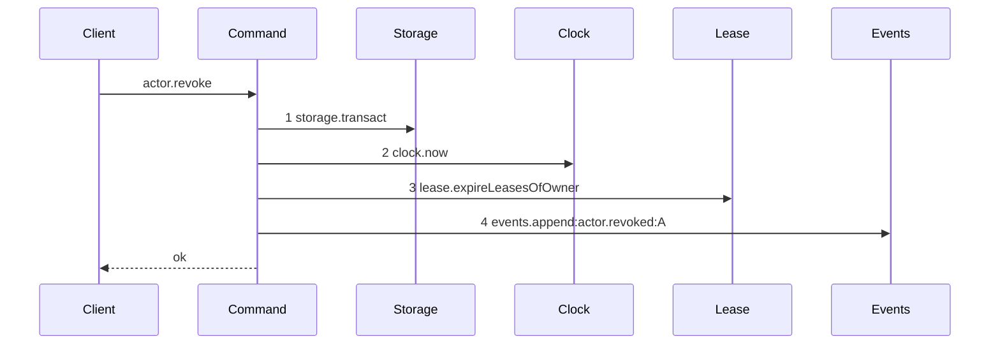
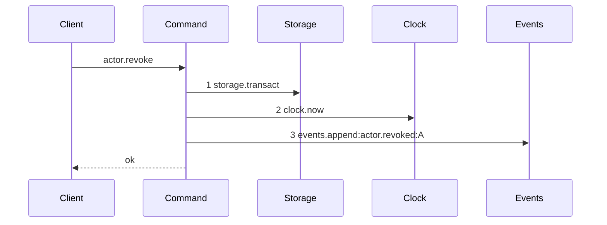

# Story 3 — `revoke-actor` drops its lease pass

Epic: `.agents/plan/epics/050.5-the-lease-table-removal.md`
Depends on: nothing in this epic.
Kind: story-implement

Diagrams: revoke-actor-lease-free

Baselines: revoke-actor-lease-free <- baseline-revoke-actor

Seams: revoke-actor-lease-free: -lease.expireLeasesOfOwner

## The shipped path

### `baseline-revoke-actor`

Superseded by: EPIC 050.5 revoke-actor-lease-free

Shipped path: `src/commands/actor/revoke-actor.ts:76-119`. Fixture: a registered `harness` actor `A`,
not the bootstrap actor, not already revoked, holding one live node lease.



Citations, one per step:
`src/commands/actor/revoke-actor.ts:81 — `storage.transact``,
`src/commands/actor/revoke-actor.ts:95 — `clock.now``,
`src/commands/actor/revoke-actor.ts:100 — `lease.expireLeasesOfOwner``,
`src/commands/actor/revoke-actor.ts:104 — `events.append``.

`loadActor` at `:40-59` and the `UPDATE actor` at `:96-99` are raw SQL on the transaction object, so
neither is a message. The clock is read at `:95`, **after** the three refusals at `:82-94`, which is
the shipped order and this story does not change it.

### `revoke-actor-lease-free`

Supersedes: EPIC 050.5 baseline-revoke-actor

Fixture: the fixture of `baseline-revoke-actor`. The lease row is seeded and survives unread.



One step leaves the baseline and `Lease` leaves the participant list. The `UPDATE actor` still sits
between steps 2 and 3, invisible at the seam, so the revocation itself is unchanged.

Add `test/sequence/scenarios/revoke-actor-lease-free.ts`.

## Change

**`src/commands/actor/revoke-actor.ts` — delete the lease pass.**

Delete `dependencies.lease.expireLeasesOfOwner` at `:100-103` and the `fenced` binding it produces.
Delete `leasesFenced: fenced.length` from the `actor.revoked` payload at `:116`. Delete
`lease: Lease` from `RevokeActorDependencies` at `:18` and the `services/lease/index.ts` import at
`:4`. Stop passing `lease` in `src/main.ts:681`.

**`src/cli/actor/revoke.ts:20`** describes the command as `"revoke an actor and fence its leases"`.
Change it to `"revoke an actor"`. A command description that names a removed mechanism is a user-visible
claim about behaviour this story deletes.

**`actor.revoked` has a strict payload, and this story edits it.**
`src/http/contract/event-payload.ts:78-85` declares it as `z.strictObject` with `leasesFenced:
z.number().int()` **required**. Delete that field. `eventView.payload` is `z.unknown()` at
`src/http/contract/event.ts:31`, so the emitted OpenAPI response shape does not change; the strict
payload is an internal validation contract, and a field the command no longer produces would refuse
every append.

**Nothing replaces the call, and the reason is that there is nothing to replace it with.** The pass
fenced every lease the actor owned, which stopped that actor's in-flight writes at once. The
equivalent would be "end every run this actor drives", and no such relation exists: EPIC 050's
Decisions state that the claiming worker comes from a server-owned caller record, _"never from
`actorId` and never from the request body"_, so `run.worker` is a worker id and no column relates a
run to the actor that claimed it.

**This is a stated regression, and it is bounded.** Authentication refuses the revoked actor's next
request, so it opens no new run and renews no existing one. The run it held reaches its `expires_at`
and is ended by the next `expireRuns` pass, which every run operation calls first. The window between
revocation and expiry is at most `runTtlMs`, where the shipped behaviour was immediate. An immediate
equivalent needs a run-to-grant relation, and EPIC 055 is where a grant lands. This story asserts the
window rather than leaving it to be discovered.

## Constraints

- Delete the call. Do not replace it with a run pass: there is no actor-to-run column to key one on.
- Do not change the three refusals, the `UPDATE actor`, or the position of the clock read.
- Delete exactly one field from `eventPayloads["actor.revoked"]`. `actorId`, `kind`, `name`, `revokedBy` and `revokedAt` stay.
- Do not change any other field of the `actor.revoked` payload.
- Do not touch the `lease` table. It survives this epic, empty, until EPIC 057's migration `18`.

## Verify

```
node --test src/commands/actor/revoke-actor.test.ts src/http/server/actor/revoke-actor.test.ts src/cli/actor/revoke.test.ts test/sequence/conformance.test.ts
```

Add, each as a separate `it`:

1. `"a revocation writes no lease row"` — seed one unexpired lease row owned by `A` through raw SQL, `('node', T, A, 'actor', 1, NOW, NOW, NOW + 300000)`, revoke, and assert **all eight columns** deep-equal the seeded values. `test/helpers/rows.ts:668 seedLeaseOnNode` writes `owner_kind: 'daemon'`, owner `daemon_test` and `expires_at: 2`, so it cannot express an actor-owned live lease and cannot serve this case. The table still exists after this epic, so the comparison is real and it stays green through EPIC 057.

1b. `"the CLI revoke description names no lease"` — assert the registered command's description by value.

2. `"the actor.revoked payload schema holds no leasesFenced key"` — assert `Object.keys(eventPayloads["actor.revoked"].shape).sort()` by value, and assert one appended event parses against it. Two assertions, one case: the schema and the producer cannot drift apart.

3. `"a run held by a revoked actor stays active"` — seed an active run and revoke the actor. Assert the run is still `active` with its fence unchanged. **This is the stated regression**, asserted rather than left to be discovered.

4. `"an expired run of a revoked actor is ended by the next expiry pass"` — after case 3, advance `now` past `expires_at` and call `expireRuns`. Assert the run is `ended`. The window is bounded and this is the assertion that bounds it.

5. `"the bootstrap actor is still refused"` — the shipped case, carried across.

6. `"an already revoked actor still returns its shipped view"` — the shipped idempotent branch at `:90-92`, carried across.

7. `"every shipped revocation case still passes"` — carry the file's cases across with the `lease` dependency removed from their fixtures.

Add `test/sequence/scenarios/revoke-actor-lease-free.ts`.

`pnpm run verify` exits 0.

Proof: PASS line delivered — `src/commands/actor/revoke-actor.test.ts` in `PASS EPIC-050.5`.
