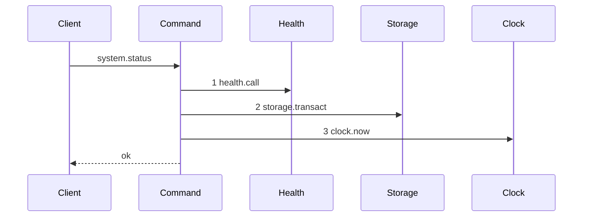
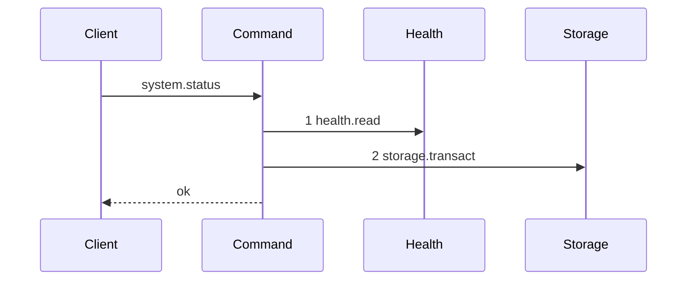

# Story 4 — `system.status` drops the lease projection

Epic: `.agents/plan/epics/050.5-the-lease-table-removal.md`
Depends on: nothing in this epic.
Kind: story-implement

Diagrams: read-status-lease-free

Baselines: read-status-lease-free <- baseline-read-status

Seams: read-status-lease-free: +health.read, -health.call, -clock.now

## The shipped path

### `baseline-read-status`

Superseded by: EPIC 050.5 read-status-lease-free

Shipped path: `src/queries/system/read-status.ts:47-93`. Fixture: one project holding one node, one
repository in `needs-reconcile`, and one expired lease row.



Citations, one per step: `:50`, `:54`, `:79`.

The three projections are raw `transaction.all` calls at `:55`, `:63` and `:73`, so none of them is a
message. **Step 1 is a function-valued dependency**, `health: () => HealthResult` at `:8`, and it is
drawn as `health.call` — which a baseline may hold and a live diagram may not. **Step 3 is inside the
lease query**, at `:79`, and it is this query's only clock read.

### `read-status-lease-free`

Supersedes: EPIC 050.5 baseline-read-status

Fixture: the fixture of `baseline-read-status`. The lease row is seeded and survives unread.



Two tokens change. `health.call` becomes `health.read`, because a live diagram may hold no `.call`
token and the story that draws one **removes the cause** rather than working around it. `clock.now`
leaves with the query that made it, and the `clock` dependency leaves with it.

The seeded lease row surviving unread is what proves the query stopped, rather than the table
emptying. The table still exists in this story; Story 8 drops it.

Add `test/sequence/scenarios/read-status-lease-free.ts`.

## Change

### 1 — the query

**`src/queries/system/read-status.ts`.** Delete `ExpiredLeaseLine` at `:28-34`, the `leases` member of
`ReadStatusResult` at `:44`, the `leases` accumulator at `:53`, the third `transaction.all` block at
`:73-82` and the `leases` member of the returned object at `:92`.

Delete `clock: Clock` from `ReadStatusDependencies` at `:6` and its import at `:1`. `:79` was its only
reader, so the key goes with the query.

**The scan is deleted, not narrowed.** `:73-82` selects both subject kinds today, so a "narrowing" to
repository rows would leave a query over a table Story 8 drops.

**Nothing replaces it with an expired-run projection.** Adding a field is a wire change this epic did
not rule on, and `event.list` already reports `run.expired`.

### 2 — the health dependency

`health: () => HealthResult` at `:8` becomes an object with one method:

```ts
// src/services/health/index.ts
export interface Health {
  read(): HealthResult;
}
```

`ReadStatusDependencies.health` takes that type, and `:50` becomes `dependencies.health.read()`.
`src/main.ts` binds `{ read: () => health() }` over the closure it already holds — the shape EPIC 050
used for the `expiry` key, so this introduces no new pattern.

**This is not incidental cleanup.** `.agents/plan/authoring.md` states that a live diagram needing a
`<key>.call` token is a defect and that the story removes the cause. This story is the first to draw
`system.status`, so it is the story that owes the removal.

Change no other consumer. The `system.health` operation has its own handler and its own binding, and
this story does not touch either.

### 3 — the contract, the CLI and every fixture that names `leases`

**`src/http/contract/system.ts`** — remove the `leases` array from `systemStatusResponse` at `:69-77`,
the `leaseSubjectKinds` import at `:5`, and the `leases` literal of `systemStatusExamples` at
`:125-133`.

**`src/cli/status.ts:88-95`** — remove the `no expired lease` line and the per-row line. The node and
repository sections are untouched.

**`docs/proposal/api/system.md`** — remove the `leases` row from the `system.status` response table.

**Every fixture and test that names `leases` on a status value.** The field is required today, so a
literal that keeps it fails the schema and a literal that drops it fails the shipped assertions. Run
`grep -rn "leases" src/ docs/proposal` and change every hit. As of authoring these are the ones beyond
the four production files above:

| site                                           | what it holds                                    |
| ---------------------------------------------- | ------------------------------------------------ |
| `src/queries/system/read-status.test.ts`       | the shipped lease-projection cases               |
| `src/http/server/system/status.test.ts`        | the handler's response fixture                   |
| `src/cli/status.test.ts`                       | the rendered-output fixture at `:40`             |
| `src/http/contract/system.test.ts`             | the response key list                            |
| `src/http/contract/field-decisions.fixture.ts` | one line per `system.status` response field      |
| `src/http/contract/example.test.ts`            | parses `systemStatusExamples` against the schema |

**The list is what the grep returns, not what this table remembers.** An unlisted hit fails
`pnpm run verify`, which is the point of running the grep rather than trusting the table.

## Constraints

- Change the four production files, the proposal, and every fixture the grep returns. Do not touch the node projection, the repository projection or `HealthResult`.
- Delete the `clock` dependency. A dependency nothing reads is a key a later story has to explain.
- Do not add an expired-run projection. Adding a response field is a wire change this epic did not rule on.
- Do not change the `system.health` operation, its handler or its binding.
- Do not touch the `lease` table. It survives this epic, empty, until EPIC 057's migration `17`.

## Verify

```
node --test src/queries/system/read-status.test.ts src/http/contract/system.test.ts src/http/contract/example.test.ts src/cli/status.test.ts src/main.test.ts test/sequence/conformance.test.ts
```

Add, each as a separate `it`:

1. `"readStatus returns no leases member"` — seed one owned, unexpired lease row and one expired one, call `readStatus`, and assert `Object.keys(result).sort()` deep-equals the pinned list. Seeding rows that survive unread is what proves the query stopped rather than the table emptying, and the table survives this epic so the seed stays valid through EPIC 057.

2. `"systemStatusResponse holds no leases key"` — assert by key set on the schema.

3. `"the node and repository projections are unchanged"` — carry the shipped cases across and assert both arrays by value against one fixture. Without this the deletion could have taken a second projection with it.

4. `"the production status binding passes no clock and an object-shaped health"` — assert against the value `main.ts` builds, not against a hand-written fixture. A key-set assertion over a fixture proves only that the fixture omitted `clock`, because a TypeScript dependency type is erased at run time and cannot refuse a key.

4b. `"a ReadStatusDependencies carrying a clock does not typecheck"` — a fixture file asserted not to compile, through the existing lint or typecheck harness. That is what proves the key left the type, and it is the same mechanism EPIC 050.4's gate uses for the `Lease` interface.

5. `"the status example parses"` — the shipped `example.test.ts` harness, run unchanged.

6. `"the CLI status output holds no lease heading and no lease row"` — `src/cli/status.test.ts:40` seeds a `subjectKind: "repository"` line today; assert the rendered output holds neither the heading nor a row, and assert the node and repository lines still render.

7. `"the production dependency map binds health as an object"` — in `src/main.test.ts`, assert the `system.status` binding's `health` value has a `read` method.

Add `test/sequence/scenarios/read-status-lease-free.ts`.

`pnpm run verify` exits 0.

Proof: PASS line delivered — `src/queries/system/read-status.test.ts` in `PASS EPIC-050.5`.
