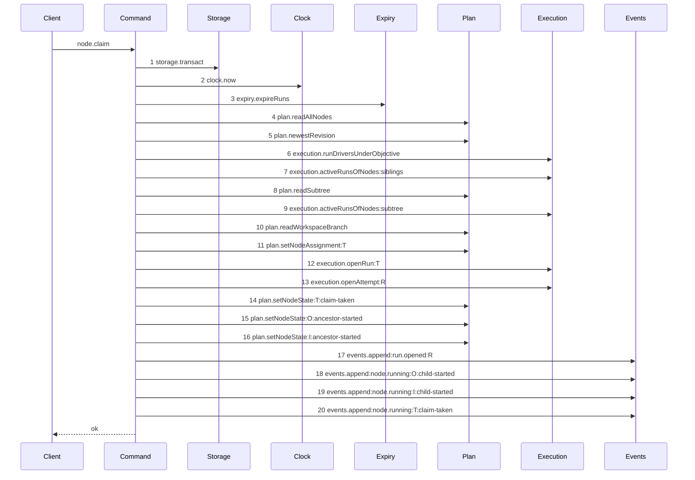

# Story 3 — The claim reads the workspace head

Epic: `.agents/plan/epics/051-the-workspace-branch.md`
Depends on: Story 2 (`02-the-workspace-branch-record`) for `plan.readWorkspaceBranch`; EPIC 050.4 Story 1 (`01-the-claim-of-a-task-drops-the-lease`), whose diagram this one supersedes; EPIC 050 Story 2 (`02-the-run-row`) for the `run_base` cardinality refine; EPIC 050.1 Story 6 (`06-the-conformance-harness`), which is the harness this scenario runs on.
Kind: story-implement

Diagrams: claim-branch-base-task

Supersedes: EPIC 050.4 claim-lease-free-task

Seams: claim-branch-base-task: +plan.readWorkspaceBranch

This story leaves the branch cut, the journal row and the second transaction to Story 4
(`04-the-claims-begin`), Story 5 (`05-the-claims-settle`) and Story 6
(`06-the-first-execution-claim`). It changes only the claim that **finds** a record.

**The drawn set is every branch of `node.claim` that finds a branch record and ends `ok` on a task.**
The initiative path and the `objective-busy` refusal are EPIC 050.4 Story 2 and Story 3's diagrams;
neither reads the branch record, so neither moves. The record-absent branch is Story 6's diagram.

## The ship path

### `claim-branch-base-task`

Supersedes: EPIC 050.4 claim-lease-free-task
Superseded by: EPIC 051.5 claim-branch-base-reap

Fixture: the fixture of `claim-lease-free-task`. Initiative `I` holds objective `O`, which holds
tasks `T` and `S`. Every node is `ready`, no node is assigned, no run is active, and `T` declares
`deliverable: implementation`, so the run kind is `execution` and the cascade covers `O` and `I`.
One `workspace_branch` row exists on `O` with `origin_oid` and `head_oid` both at the loopback
fixture's `commit1`, so the record read returns a row and the claim stays one transaction.



One step enters the superseded diagram and none leaves. Step 10 is the **last read and the step
immediately before the first mutation**, which is the assertion the shape makes: every refusal is
still evaluated before the record is read, so a refused claim reads no branch record, and the record
is read before the run is opened, so the run can carry its base. Steps 11 to 20 are renumbered and
unmoved; a renumbered call is not a moved call.

`plan.readWorkspaceBranch` is drawn **bare**, with no label. Its last argument is the node id, a
primitive, and `test/helpers/sequence-conformance.ts:121` — `input` calls a projection only when that
argument is an object. One call per diagram, so the token is unique without one.

**`run_base` is written by `execution.openRun` and reaches no seam of its own.** The epic requires
the base row to be inserted atomically with the run, and one method inserting both rows is what makes
it atomic. No token is added and no token is changed, so the ordinal contract is unaffected.

Add `test/sequence/scenarios/claim-branch-base-task.ts`.

## Change

**`src/commands/node/claim-node.ts` — read the branch record and give the run its base.** Three
edits, plus the run-base writer. Steps 4 and 5 are already applied and are verified, not written.

### 1 — the branch read

`src/commands/node/claim-node.ts:316` — `readSubtree` and
`src/commands/node/claim-node.ts:320` — `activeRunsOfNodes` are the last two reads, and
`src/commands/node/claim-node.ts:358` — `cascadeVerdicts` opens the write phase. Between them, after
every refusal, add:

```ts
const branch =
  runKind === "execution"
    ? dependencies.plan.readWorkspaceBranch(transaction, objectiveId)
    : null;
```

`objectiveId` is already bound at `src/commands/node/claim-node.ts:261` — `objectiveScopeId`, which
returns the parent for a task and the node itself for an objective. The read is conditional on the
run kind, because `src/domain/run-kind.ts:13` — `runKindFor` gives a structural or a review claim no
base row and `src/domain/run.ts:34` — `refine` refuses one.

**A `null` result on an `execution` claim is the cut branch, and this story does not take it.** Until
Story 4 (`04-the-claims-begin`) lands, throw so no path silently opens a baseless run:

```ts
if (runKind === "execution" && branch === null) {
  throw new Error(`objective ${objectiveId} holds no workspace branch`);
}
```

Story 6 (`06-the-first-execution-claim`) replaces that throw with the journaled path.

### 2 — the run carries its base

`src/services/execution/index.ts` — `OpenRunInput` gains one field:

```ts
base: Readonly<{ repositoryId: string; oid: string }> | null;
```

`src/services/execution/sqlite.ts:99` — `openRun` inserts the `run_base` row after its `run` insert,
in the same transaction, when `input.base !== null`:

```sql
INSERT INTO run_base (run_id, repository_id, oid) VALUES (?, ?, ?)
```

`src/services/storage/migration-0012-run-model.ts:40` — `PRIMARY KEY` is `(run_id, repository_id)`,
so one row per run per repository and the insert needs no conflict clause.

`src/commands/node/claim-node.ts:387` — `openRun` passes
`base: branch === null ? null : { repositoryId: objectiveRepositoryId, oid: branch.headOid }`.

**`objectiveRepositoryId` is bound from the objective node, and the binding is stated here because
nothing in the shipped file provides it.** `src/commands/node/claim-node.ts:261` — `objectiveScopeId`
returns an **id**, not a row. Bind
`const objectiveRepositoryId = nodeById(nodes, objectiveId).repositoryId;` from the node set
`src/commands/node/claim-node.ts:149` — `readAllNodes` already loaded, beside the existing
`src/commands/node/claim-node.ts:563` — `objectiveAncestor` helper. It is never `null`:
`src/services/storage/migration-0011-deliverable.ts:28` — `CHECK` makes an objective the only kind
carrying a repository, so a `null` is an invariant violation and throws. Do not read
`node.repositoryId` of the claimed node — a task carries none.

Every other `openRun` call site passes `base: null`. `src/services/execution/index.ts` is the only
declaration, so the compiler enumerates them.

### 3 — the two shipped cases that pin the absence of a base row

- `src/commands/node/claim-node.test.ts:908` — `it` asserts a claim writes no `run_base` row. It is
  the case this story inverts. Replace it with case 1 below; do not leave both.
- `src/commands/node/claim-node.test.ts:1915` — `it` asserts a **structural** run writes none. It
  stays, and case 4 below is its unchanged sibling.

### 4 — the authored range, already applied

`scripts/epic-sequence-range.ts:1` — `authoredEpics` carries `"051"` between `"050.5"` and
`"051.2"`, and `test/sequence/conformance.test.ts:255` — `assert` pins the matching literal. Both
edits landed with the supersession line of step 5, on 2026-09-03, because neither half is green
alone: `scripts/verify-epic-sequence.ts:505` — `supersession` refuses a
`Superseded by: EPIC 051 ...` line naming an epic outside the authored set, and
`test/sequence/conformance.test.ts:41` — `authoredEpics` throws for an id with no story directory.

**Verify both are present and report a divergence rather than re-applying either.** Case 11 asserts
the state, and it opens green: it is a regression guard, not a red case.

Do **not** touch `scripts/epic-sequence-range.ts:9` — `shippedEpics` here. Story 8
(`08-startup-reconciles-an-open-cut-row`) appends to it, because a diagram is due a scenario only
once the whole epic ships.

### 5 — the supersession, already applied

The `` ### `claim-lease-free-task` `` section of EPIC 050.4 Story 1
(`01-the-claim-of-a-task-drops-the-lease`) carries
`Superseded by: EPIC 051 claim-branch-base-task`. `scripts/lane-check.sh:36` — `deny` refuses
`.agents/plan/*` to every role including `groundwork-engineer`, so no role may write it and a human
applied it with step 4.

**Verify it is present and report a divergence rather than re-applying it.**

`test/sequence/scenarios/claim-lease-free-task.ts` does not exist and is not created: EPIC 050.4 is
not in `shippedEpics`, so its diagram was never due.

## Constraints

- The branch read sits after every refusal and before the first mutation. Moving it earlier makes a
  refused claim read a record it never uses; moving it later leaves `openRun` no base.
- The read takes the **objective** id. `src/commands/node/claim-node.ts:553` — `objectiveScopeId` is
  the only source, and passing the task id would read a record no objective owns.
- A structural or a review claim makes no branch read and passes `base: null`. `review-head-unavailable`
  at `src/commands/node/claim-node.ts:208` still refuses every review claim before the read is
  reached, and this epic does not lift it.
- `openRun` inserts the `run_base` row inside its own transaction and never opens one.
- `claimNode` stays synchronous here. Story 6 (`06-the-first-execution-claim`) makes it `async`, and
  splitting that change across two stories would leave one of them uncompilable.
- Do not change any ordinal of `claim-lease-free-task` other than by the insertion. The comparison is
  by equality.

## Verify

```
node --test src/commands/node/claim-node.test.ts src/services/execution/sqlite.test.ts src/domain/run.test.ts test/sequence/conformance.test.ts
```

Extend `src/commands/node/claim-node.test.ts`, whose fixture factory is
`src/commands/node/claim-node.test.ts:100` — `createClaimFixture` over real SQLite, whose seeder is
`src/commands/node/claim-node.test.ts:125` — `seedReadyFixture` and whose call helpers are
`src/commands/node/claim-node.test.ts:228` — `claim` and
`src/commands/node/claim-node.test.ts:280` — `refused`. Read rows with
`src/commands/node/claim-node.test.ts:570` — `runRows` and
`test/helpers/database.ts:87` — `tableRows`.

Add, each as a separate `it`:

1. `"a claim on an objective that holds a branch record writes one run_base row at the record's head"`
   — seed a `workspace_branch` row on `fixtureIds.objective` with `head_oid` at `OID_B` and
   `origin_oid` at `OID_A`, claim `fixtureIds.task`, and `deepEqual` the stored `run_base` row
   against `{ run_id: <the opened run id>, repository_id: fixtureIds.repository, oid: OID_B }`.
   This replaces `src/commands/node/claim-node.test.ts:908` — `it`.

2. `"the base oid is the record's head and not its origin"` — the same fixture with
   `origin_oid !== head_oid`; assert `run_base.oid === OID_B` and `!== OID_A`. Without this case,
   a store reading the wrong column passes case 1.

2b. `"the run_base row names the objective's repository, not the task's"` — assert
`run_base.repository_id === fixtureIds.repository` for a **task** claim, and assert
`plan.readNode(task_a).repositoryId` is `null` in the same case. The second half is what proves
the value came from the objective.

3. `"the branch read takes the objective id for a task claim"` — seed a branch record on the
   objective and a second one on a **sibling objective** with a different `head_oid`, claim the task,
   and assert `run_base.oid` equals the parent objective's head. Seed the sibling with
   `test/helpers/rows.ts:241` — `seedSiblingObjective`.

4. `"a structural claim makes no branch read and writes no run_base row"` — inject a `plan` double
   whose `readWorkspaceBranch` increments a counter, claim an initiative whose deliverable is
   `expansion`, and assert the counter is `0` and `SELECT count(*) FROM run_base` reads `0`. The
   control is case 1 over the same double, whose counter is `1`.
   `src/commands/node/claim-node.test.ts:1915` — `it` is the shipped sibling and stays.

5. `"a review claim still refuses review-head-unavailable and makes no branch read"` — assert
   `error.refusal === "review-head-unavailable"` and that the double's counter is `0`.

6. `"a refused claim makes no branch read and leaves the database byte-identical"` — drive the
   `objective-busy` refusal with
   `src/commands/node/claim-node.test.ts:397` — `seedObjectiveBusySibling`, assert the counter is
   `0`, and compare `test/helpers/database.ts:117` — `databaseBytes` before and after.

7. `"a claim on an objective that holds a branch record opens exactly one transaction and writes no journal row"`
   — wrap the storage in a double recording `transact` spans; assert the span list has length `1` and
   `SELECT count(*) FROM git_operation` reads `0`.

8. `"openRun writes the run row and the run_base row in one transaction"` — in
   `src/services/execution/sqlite.test.ts`, inject a transaction double that throws on the second
   `run_base` statement; assert neither row exists afterwards. The control is the same call without
   the double, which writes both.

9. `"openRun with a null base writes no run_base row"` — assert the count is `0` and the run row
   exists.

10. `"an execution run holding one run_base row passes the cardinality refine"` — in
    `src/domain/run.test.ts`, parse a `kind: "execution"` row with `baseCount: 1` and assert
    `success === true`. `src/domain/run.ts:34` — `refine` bounds it at `<= 1` and EPIC 051.1 tightens
    the lower bound, so this story asserts the upper bound only.

11. `"authoredEpics holds 051 in sequence order and shippedEpics does not"` — assert `authoredEpics`
    holds `"051"` exactly once, that its index is one greater than the index of `"050.5"`, that every
    entry is in ascending sequence order, and that `shippedEpics` does not hold `"051"`. Assert by
    position rather than by a whole-array literal, because sibling epics append to the same list.
    The entry is already present, so this case opens green.

12. `"the range gate accepts the supersession of claim-lease-free-task"` — call
    `scripts/verify-epic-sequence.ts:743` — `verifyEpicSequence` over the repository root and assert
    it does not throw. It resolves the whole triple: the
    `Superseded by: EPIC 051 claim-branch-base-task` line of step 5, the
    `Supersedes: EPIC 050.4 claim-lease-free-task` line of this story, and the absence of
    `test/sequence/scenarios/claim-lease-free-task.ts`. The control is the same call with `"051"`
    removed from `authoredEpics`, which throws
    `supersession names an epic outside the authored set: EPIC 051`.

Add `test/sequence/scenarios/claim-branch-base-task.ts`, building the fixture the diagram names over
real SQLite behind `test/helpers/sequence-conformance.ts:99` — `recordSeams`, seeding the
`workspace_branch` row before the claim, binding `expiry` to unrecorded dependencies exactly as
`test/sequence/scenarios/claim-success-task.ts:81` — `expiry` does, and returning the recorder and
the result.

`pnpm run verify` exits 0.

Proof: PASS line delivered — `src/commands/node/claim-node.test.ts` and
`test/sequence/conformance.test.ts` in `PASS EPIC-051`.
