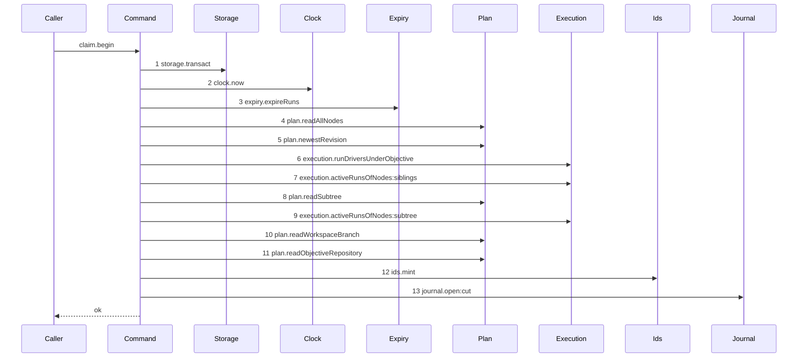

# Story 4 — The claim's begin

Epic: `.agents/plan/epics/051-the-workspace-branch.md`
Depends on: Story 1 (`01-migration-13`), which widens the `git_operation.intent` CHECK with `cut`; Story 2 (`02-the-workspace-branch-record`) for `plan.readWorkspaceBranch`; Story 3 (`03-the-claim-reads-the-workspace-head`), which inserts the branch read this story branches on and puts `"051"` in the authored range.
Kind: story-implement

Diagrams: claim-cut-begin

Seams: claim-cut-begin: +storage.transact, +clock.now, +expiry.expireRuns, +plan.readAllNodes, +plan.newestRevision, +execution.runDriversUnderObjective, +execution.activeRunsOfNodes:siblings, +plan.readSubtree, +execution.activeRunsOfNodes:subtree, +plan.readWorkspaceBranch, +plan.readObjectiveRepository, +ids.mint, +journal.open:cut

This story leaves the git write, the second transaction and the composition to Story 5
(`05-the-claims-settle`) and Story 6 (`06-the-first-execution-claim`).

**The prior set of this diagram is empty, so every token carries `+`.** The path did not exist before
this epic: no shipped code reads `workspace_branch`, and
`scripts/verify-epic-sequence.ts:650` — `changed` demands exactly one sign owner for every token of a
live diagram that its prior diagram does not hold. `claim-branch-base-task` is a **different path**
of the same function, not this diagram's prior, so its context tokens do not carry over.

**The drawn set is every branch of `claim.begin` that finds no branch record and ends `ok`.** The
record-found branch is Story 3's `claim-branch-base-task`, and every refusal of `claim.begin` is a
refusal `node.claim` already draws under EPIC 050.1 and EPIC 050.4, evaluated at an ordinal this
insertion does not move.

## The ship path

### `claim-cut-begin`

Fixture: the fixture of `claim-branch-base-task` with the `workspace_branch` row **removed**.
Initiative `I` holds objective `O`, which holds tasks `T` and `S`; every node is `ready`, no node is
assigned, no run is active, and `T` declares `deliverable: implementation`. `O` names repository
`repo_a`, whose `home_path` is the loopback bare repository of
`test/helpers/remote/seed.ts:124` — `seedRepositories` and whose `branch` is `main`. The record read
returns `null`, which is what selects this branch.



The shape asserts four things. **One transaction, opened as step 1**, so no read precedes it and no
git call sits inside it — no `Git` participant appears, and that absence is the assertion.
**Step 11 is reached only after step 10 returns `null`**, so a claim that finds a record never reads
the repository. **The id is minted immediately before the insert**, inside the transaction, so a
crash between the mint and the insert leaves no orphan id and no row. And **nothing is written except
the journal row**: no assignment, no run, no attempt, no transition and no event, all of which belong
to Story 5 (`05-the-claims-settle`).

`plan.readWorkspaceBranch` and `plan.readObjectiveRepository` are drawn bare, for the reason Story 3
gives: each takes a primitive last argument, and
`test/helpers/sequence-conformance.ts:121` — `input` calls a projection only for an object.

Add `test/sequence/scenarios/claim-cut-begin.ts`.

## Change

**`src/commands/node/claim-node.ts` — extract `claimBegin` and give it the cut branch.**

### 1 — the objective's git facts

`src/services/plan/index.ts` gains one record type and one member, beside the read Story 2 added:

```ts
export type ObjectiveRepositoryRecord = Readonly<{
  repositoryId: string;
  homePath: string;
  branchRef: string;
}>;

  readObjectiveRepository(
    transaction: Transaction,
    objectiveId: string,
  ): ObjectiveRepositoryRecord | null;
```

`src/services/plan/sqlite.ts` implements it beside
`src/services/plan/sqlite.ts:264` — `readRepositoryName`:

```sql
SELECT r.id, r.home_path, r.branch FROM node n JOIN repository r ON r.id = n.repository_id WHERE n.id = ?
```

`branchRef` is `headRefOf(row.branch)`, using `src/domain/repository.ts:57` — `headRefOf`.
`src/services/storage/migration-0009-one-branch.ts:19` — `RENAME` is what left `repository` with one
`branch` column, so one join answers both fields.

**The epic's Decisions name this method.** It exists because
`src/commands/node/claim-node.ts:105` — `ClaimNodeInput` carries only `nodeId`, `actorId`,
`actorKind` and `available`, so the command cannot know a `gitDir` or a branch name before it reads
the database, and `src/services/plan/index.ts:94` — `readRepositoryName` returns the name alone. The
begin transaction reads those facts and returns them, and the tip is resolved after the transaction
commits.

### 2 — the unit

```ts
export type ClaimBeginDependencies = Readonly<{
  storage: Storage;
  plan: PlanStore;
  execution: Execution;
  events: EventLog;
  clock: Clock;
  ids: IdGenerator;
  expiry: Expiry;
  journal: GitJournal;
  callerRecord: ClaimCallerRecord;
  registry: readonly WorkerEntry[];
  attemptLimit: number;
  runTtlMs: number;
  runMaxLifetimeMs: number;
  instanceId: string;
  runDirectory: string;
}>;

export type ClaimBegunClaimed = Readonly<{
  kind: "claimed";
  result: ClaimNodeResult;
}>;

export type ClaimBegunCut = Readonly<{
  kind: "cut";
  journalRowId: string;
  pidFile: string;
  now: number;
  nodeId: string;
  objectiveId: string;
  repositoryId: string;
  gitDir: string;
  branchRef: string;
  objectiveRef: string;
  graphRevision: string;
  routedWorker: string;
  cascade: readonly CascadeEntry[];
}>;

export function claimBegin(
  dependencies: ClaimBeginDependencies,
  input: ClaimNodeInput,
): ClaimBegunClaimed | ClaimBegunCut;
```

`claimBegin` is the whole body of the shipped
`src/commands/node/claim-node.ts:145` — `transact` callback. Move it verbatim, then change two
places:

- after the branch read of Story 3 (`03-the-claim-reads-the-workspace-head`), replace that story's
  interim `throw` with the cut branch of step 3;
- on the record-found branch, return `{ kind: "claimed", result }` where the shipped code returned
  the result.

`runDirectory` is a bound value and not a seam: `src/main.ts:232` — `runDirectory` already builds the
git run directory and the same value is bound here.

### 3 — the cut branch

Inside the same transaction, when `runKind === "execution"` and the record read returned `null`:

1. `const repository = dependencies.plan.readObjectiveRepository(transaction, objectiveId);` — throw
   when it is `null`, because `src/services/storage/migration-0002-graph-and-plan.ts:33` — `CHECK`
   makes an objective without a repository unreachable, so a `null` here is an invariant violation
   and never a refusal.
2. `const journalRowId = dependencies.ids.mint("gitOperation");`
3. `const pidFile = join(dependencies.runDirectory, \`cut-${journalRowId}.pid\`);` — a pure path
   join, invisible at the seam.
4. `dependencies.journal.open(transaction, { ... })` with
   `src/services/git/index.ts:199` — `OpenJournalRowInput` filled as:

   | field               | value                         |
   | ------------------- | ----------------------------- |
   | `id`                | `journalRowId`                |
   | `repositoryId`      | `repository.repositoryId`     |
   | `intent`            | `"cut"`                       |
   | `nodeId`            | `objectiveId`                 |
   | `runId`             | `null`                        |
   | `candidateId`       | `null`                        |
   | `leaseFence`        | `0`                           |
   | `ref`               | `objectiveRefOf(objectiveId)` |
   | `baseOid`           | `ZERO_OID`                    |
   | `proposedHeadOid`   | `ZERO_OID`                    |
   | `expectedRemoteOid` | `null`                        |
   | `childToken`        | `pidFile`                     |

   `nodeId` is the **objective**, because the ref the row journals is the objective branch and
   `src/commands/startup/reap-orphans.ts:156` — `repository_id` resolves a row by its own columns.
   `runId` is `null` because no run exists yet; Story 5 (`05-the-claims-settle`) opens it.
   `leaseFence` is `0`, the external-drive precondition mode, matching
   `src/commands/startup/reconcile-journal.test.ts:110` — `openRow`.

   **Both oids are `ZERO_OID`.** `src/domain/recovery.ts:1` — `ZERO_OID` is the shipped sentinel for
   "the ref must not exist", it is exactly what `expectedOid: null` means at
   `src/services/git/index.ts:50` — `expectedOid`, and the tip is not yet known because the git read
   happens after this transaction commits. Story 8 (`08-startup-reconciles-an-open-cut-row`)
   reconciles a `cut` row by the ref's **existence** for that reason, and its cases carry the proof.

5. Return the `ClaimBegunCut` record. The transaction commits when the callback returns, and control
   reaches the caller with the row committed as `open`.

### 4 — the projection

`test/helpers/sequence-conformance.ts:50` — `projections` gains one entry:

```ts
  "journal.open": (input, context) => [field(input, "intent", context)],
```

`intent` is a value the call actually receives, so the projection names no call site.
`.agents/plan/stories/051.3-the-checkpoint-and-the-land/03-the-land-opens-its-journal-row.md`
declares the identical row for the `merge` land; **it lands here first, and that story's step 3
becomes a no-op it must restate**. `journal.listOpen` gains no projection: its last argument is the
transaction.

## Constraints

- One transaction, opened as the first seam call, committed before `claimBegin` returns. No git call
  and no second transaction.
- `intent` is `"cut"`. Story 1 (`01-migration-13`) widened the CHECK for it; do not reuse `merge`.
- `baseOid` and `proposedHeadOid` are both `ZERO_OID`. Do not invent a tip, and do not make either
  column nullable.
- Mint the id inside the transaction, immediately before the insert. The diagram pins that order.
- `claimBegin` takes no `Git`. The absence is a type fact, and case 5 asserts the key set.
- `claimBegin` stays synchronous. It opens one transaction and calls no promise.
- `readObjectiveRepository` is reached only on the cut branch. Calling it unconditionally adds a seam
  the record-found diagram of Story 3 does not draw, and that diagram compares by equality.
- Write nothing but the journal row on this branch. No assignment, no run, no attempt, no transition
  and no event.

## Verify

```
node --test src/commands/node/claim-node.test.ts src/services/plan/sqlite.test.ts test/sequence/conformance.test.ts
```

Extend `src/commands/node/claim-node.test.ts`, over
`src/commands/node/claim-node.test.ts:100` — `createClaimFixture` and
`src/commands/node/claim-node.test.ts:125` — `seedReadyFixture`, with a real
`src/services/git/journal.ts:10` — `createGitJournal` and a mock id generator returning a pinned
ULID. Read rows with `test/helpers/database.ts:87` — `tableRows` and snapshot with
`test/helpers/database.ts:117` — `databaseBytes`.

Add, each as a separate `it`:

1. `"claim.begin over an objective with no branch record writes one open cut journal row"` — call
   `claimBegin` and `deepEqual` the stored `git_operation` row against the full expected object:
   `intent: "cut"`, `state: "open"`, `node_id: "objective_a"`, `run_id: null`,
   `repository_id: "repo_a"`, `ref: "refs/heads/objective_a"`, `base_oid: ZERO_OID`,
   `proposed_head_oid: ZERO_OID`, `lease_fence: 0`, `candidate_id: null`,
   `expected_remote_oid: null`, `result_head_oid: null`, `outcome: null`, `detail_blob: null`,
   `completed_at: null`, and `child_token` equal to the returned `pidFile`.

2. `"claim.begin writes nothing else on the cut branch"` — assert the counts of `run`, `run_base`,
   `attempt` and `event` are all `0`, and that `node.assignment` and `node.state` of `task_a`,
   `objective_a` and `initiative_a` are unchanged from the seeded fixture, by value.

3. `"the cut journal row is open before any ref exists"` — assert `state === "open"` by reading the
   row after `claimBegin` returns, and assert the loopback repository holds no
   `refs/heads/objective_a`. The control is the same assertion after Story 6
   (`06-the-first-execution-claim`) runs the composed path, where the ref does exist.

4. `"claim.begin opens exactly one transaction and it commits before control returns"` — wrap the
   storage in a double recording `transact` entry and exit; assert the span list has length `1`, and
   read the journal row from a **new** transaction opened after `claimBegin` returned.

5. `"claim.begin takes no Git and is synchronous"` — assert `Object.keys(dependencies)` of a
   constructed `ClaimBeginDependencies` holds no `"git"` key, and that the value `claimBegin` returns
   is not a thenable.

6. `"claim.begin mints the journal id inside the transaction"` — an id generator whose `mint` throws
   leaves no `git_operation` row, asserted by count `0`, and `databaseBytes` deep-equals the snapshot
   taken before the call.

7. `"claim.begin reads the objective repository only when no record exists"` — a `plan` double
   counting `readObjectiveRepository`. Assert the counter is `1` over the record-absent fixture and
   `0` over the record-present fixture of Story 3 (`03-the-claim-reads-the-workspace-head`). Two
   assertions in one case, the second being the control.

8. `"claim.begin returns kind claimed and the full result when a record exists"` — over the
   record-present fixture, assert `begun.kind === "claimed"` and `deepEqual` `begun.result` against
   the value the shipped claim returned, field by field.

9. `"claim.begin returns the git facts the composer needs"` — assert `begun.kind === "cut"` and
   `deepEqual` `{ gitDir, branchRef, objectiveRef, repositoryId }` against
   `{ <the loopback home path>, "refs/heads/main", "refs/heads/objective_a", "repo_a" }`, by value.

10. `"claim.begin refuses before it reads the branch record"` — drive `objective-busy` with
    `src/commands/node/claim-node.test.ts:397` — `seedObjectiveBusySibling`; assert the refusal, that
    `git_operation` is empty, and that `databaseBytes` is unchanged.

11. `"readObjectiveRepository joins the repository through the objective node"` — in
    `src/services/plan/sqlite.test.ts`, `deepEqual` the record against
    `{ repositoryId: fixtureIds.repository, homePath: <the seeded path>, branchRef: "refs/heads/main" }`,
    and assert it returns `null` for a node id that does not exist.

12. `"the journal.open projection reads the intent"` — assert the recorder emits the token
    `journal.open:cut` for the row of case 1, and `journal.open:merge` for a row whose intent is
    `merge`. The second half is the control that the projection reads the value and not the call
    site.

Add `test/sequence/scenarios/claim-cut-begin.ts`, building the fixture the diagram names over real
SQLite and the real loopback bare repository behind
`test/helpers/sequence-conformance.ts:99` — `recordSeams`, running the real `claimBegin`, binding
`expiry` to unrecorded dependencies exactly as
`test/sequence/scenarios/claim-success-task.ts:81` — `expiry` does, and returning the recorder and
the result.

`pnpm run verify` exits 0.

Proof: PASS line delivered — `src/commands/node/claim-node.test.ts` and
`test/sequence/conformance.test.ts` in `PASS EPIC-051`.
