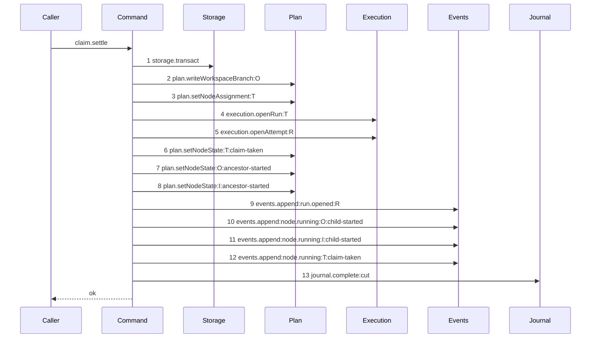

# Story 5 — The claim's settle

Epic: `.agents/plan/epics/051-the-workspace-branch.md`
Depends on: Story 2 (`02-the-workspace-branch-record`) for `plan.writeWorkspaceBranch`; Story 3 (`03-the-claim-reads-the-workspace-head`) for the `base` field of `execution.openRun`; Story 4 (`04-the-claims-begin`), whose `ClaimBegunCut` record is this unit's input.
Kind: story-implement

Diagrams: claim-cut-settle

Seams: claim-cut-settle: +storage.transact, +plan.writeWorkspaceBranch:O, +plan.setNodeAssignment:T, +execution.openRun:T, +execution.openAttempt:R, +plan.setNodeState:T:claim-taken, +plan.setNodeState:O:ancestor-started, +plan.setNodeState:I:ancestor-started, +events.append:run.opened:R, +events.append:node.running:O:child-started, +events.append:node.running:I:child-started, +events.append:node.running:T:claim-taken, +journal.complete:cut

This story leaves the contended arm to Story 7 (`07-the-loser-of-two-first-claims-refuses`) and the
composition to Story 6 (`06-the-first-execution-claim`).

**The prior set of this diagram is empty, so every token carries `+`**, for the reason Story 4
(`04-the-claims-begin`) gives.

**The drawn set is every branch of `claim.settle` that reaches the assignment.** The unit evaluates
one predicate: `plan.writeWorkspaceBranch` returned a record, which is this diagram, or it returned
`null`, which is Story 7's `claim-cut-settle-contested`. No third branch exists, because every other
value the unit writes arrives on its input.

## The ship path

### `claim-cut-settle`

Fixture: the fixture of `claim-cut-begin` (Story 4), advanced past its begin. The `cut` journal row
of objective `O` (`objective_a`) is `open`, `refs/heads/objective_a` stands in the loopback bare
repository at the fixture's `commit1`, and no `workspace_branch` row exists. The input names
`observedOid` as `commit1` — **the oid the objective ref actually holds**, read back by Story 6
(`06-the-first-execution-claim`) after the cut — so the insert wins.



The shape asserts three things. **The branch record is written first**, at step 2, so the primary-key
refusal of Story 7 fires before any other row is touched and the contended arm has nothing to undo.
**Steps 3 to 12 hold the write phase of the shipped claim in its shipped order**, so the first
execution claim and every later claim produce the same rows and the same events in the same order;
comparing this diagram's steps 3 to 12 with steps 11 to 20 of `claim-branch-base-task` is what a
reviewer checks. **The journal row completes last**, inside the same transaction, so no committed
state exists in which the claim is applied and the row is still `open`.

**No `Clock` participant appears, and that absence is the assertion.** The settle reuses the `now`
its begin read and carries on `ClaimBegunCut`. `src/commands/node/claim-node.test.ts:2526` — `it`
asserts one claim reads the clock once, and a second `clock.now` here would break it for the
journaled path while the later-claim path still read it once.

Add `test/sequence/scenarios/claim-cut-settle.ts`.

## Change

**`src/commands/node/claim-node.ts` — add the `claimSettle` unit.**

### 1 — the signature

```ts
export type ClaimSettleDependencies = Readonly<{
  storage: Storage;
  plan: PlanStore;
  execution: Execution;
  events: EventLog;
  journal: GitJournal;
  attemptLimit: number;
  runTtlMs: number;
  runMaxLifetimeMs: number;
  instanceId: string;
}>;

export type ClaimSettleInput = Readonly<{
  begun: ClaimBegunCut;
  observedOid: string;
  actorId: string;
  actorKind: "human" | "harness";
}>;

export type ClaimSettleResult =
  | Readonly<{
      disposition: "claimed";
      result: ClaimNodeResult;
      clearedToken: string | null;
    }>
  | Readonly<{ disposition: "contended"; clearedToken: string | null }>;

export function claimSettle(
  dependencies: ClaimSettleDependencies,
  input: ClaimSettleInput,
): ClaimSettleResult;
```

The unit takes no `Clock` and no `Ids`: the timestamp and the journal row id both arrive on
`input.begun`.

### 2 — the body

Inside one `dependencies.storage.transact` callback, and nothing outside it:

1. `const record = dependencies.plan.writeWorkspaceBranch(transaction, { nodeId: begun.objectiveId, originOid: input.observedOid });`
   — the store writes `input.observedOid` to **both** columns, per Story 2
   (`02-the-workspace-branch-record`): the branch is cut at that oid and nothing has landed on it, so
   `origin_oid` and `head_oid` are equal at creation and
   `plan.setWorkspaceBranchHead` is the only thing that ever separates them.
   A `null` return is contention, and Story 7 (`07-the-loser-of-two-first-claims-refuses`) writes
   that arm.

   **`observedOid` is the oid `refs/heads/<objectiveId>` holds, not the oid the source branch held.**
   Story 6 reads it back after the cut. Recording the source tip instead would let a claim whose
   create-only swap lost store an oid the objective ref never held: the source branch can advance
   between two concurrent first claims, and
   `src/services/git/ref-update.ts:28` — `parseObservedOid` returns `null` for a create-only
   failure, because git's "already exists" message carries no oid.

2. `dependencies.plan.setNodeAssignment(transaction, { id: begun.nodeId, assignment: begun.routedWorker });`
3. `dependencies.execution.openRun(transaction, { ... })` with the field set of
   `src/commands/node/claim-node.ts:387` — `openRun`, plus
   `base: { repositoryId: begun.repositoryId, oid: input.observedOid }` from Story 3
   (`03-the-claim-reads-the-workspace-head`). `expiresAt` is `begun.now + dependencies.runTtlMs` and
   `maxLifetimeAt` is `begun.now + dependencies.runMaxLifetimeMs`, both from the begin's clock read.
4. `dependencies.execution.openAttempt(transaction, { runId: run.id });` — the run kind is
   `execution` on every path that reaches this unit, so the attempt is unconditional here where
   `src/commands/node/claim-node.ts:401` — `attempt` is conditional.
5. The three `plan.setNodeState` calls and the four `events.append` calls, copied from
   `src/commands/node/claim-node.ts:405` — `setNodeState` through
   `src/commands/node/claim-node.ts:456` — `append`, in their shipped order, with `at: begun.now` and
   the cascade taken from `begun.cascade`.
6. `const clearedToken = dependencies.journal.complete(transaction, { id: begun.journalRowId, resultHeadOid: input.observedOid, outcome: "cut", completedAt: begun.now });`
   `resultHeadOid` is the oid the ref now holds, which is what
   `src/services/git/journal.ts:39` — `result_head_oid` records. `outcome` is `"cut"`, and it is what
   the projection reads.
7. Return `{ disposition: "claimed", result, clearedToken }`. `src/services/git/journal.ts:37` —
   `readOpenChildToken` returns the pid file the begin recorded, and Story 6
   (`06-the-first-execution-claim`) removes it outside the transaction.

### 3 — the projection

`test/helpers/sequence-conformance.ts:50` — `projections` gains one entry:

```ts
  "journal.complete": (input, context) => [field(input, "outcome", context)],
```

`outcome` is a value the call receives. `src/commands/startup/reconcile-journal.ts:191` — `outcome`
already writes `"recovered-complete"` on the shipped reconcile path, so the projection separates a
settle from a recovery without a new field.

## Constraints

- One transaction, opened as the first seam call. `claimSettle` calls no git method and opens no
  second transaction.
- `plan.writeWorkspaceBranch` is the first write. The order is the enforcement point of Story 7
  (`07-the-loser-of-two-first-claims-refuses`), and reordering it silently opens the exclusion window
  the epic's Decisions close.
- `origin_oid`, `head_oid`, `run_base.oid` and `result_head_oid` are all `input.observedOid`, one
  value in four places. A settle that wrote the source tip in any of them stores an oid the objective
  ref may never have held.
- No `clock.now`. Every timestamp comes from `input.begun.now`.
- `journal.complete` is the last call, inside the transaction. Completing it outside leaves a window
  in which the claim is committed and the row is `open`.
- Do not remove the pid file here. It is git I/O and it belongs to the composer, exactly as
  `src/commands/startup/reconcile-journal.ts:233` — `removeClearedToken` places it today.
- The three transitions and the four events keep the shipped order. A reordering changes
  `claim-branch-base-task` too, and that diagram compares by equality.

## Verify

```
node --test src/commands/node/claim-node.test.ts test/sequence/conformance.test.ts
```

Extend `src/commands/node/claim-node.test.ts`, driving `claimBegin` of Story 4
(`04-the-claims-begin`) to build the input, with a real
`src/services/git/journal.ts:10` — `createGitJournal` and the real loopback bare repository of
`test/helpers/remote/seed.ts:124` — `seedRepositories`.

Add, each as a separate `it`:

1. `"an accepted settle writes the branch record at the observed objective-ref oid"` — `deepEqual`
   the stored `workspace_branch` row against
   `{ node_id: "objective_a", origin_oid: commit1, head_oid: commit1 }`.

1b. `"the settle records the observed oid and never the source tip"` — call the settle with
`observedOid: commit1` while the fixture's `refs/heads/main` has advanced to `commit2`. Assert
all four of `origin_oid`, `head_oid`, `run_base.oid` and `result_head_oid` read `commit1`. This
is the case that detects the advancing-source race; a settle taking the source tip passes case 1
and fails here.

2. `"the run's base oid equals origin_oid and head_oid"` — assert `run_base.oid === commit1` and
   that it equals both columns of case 1, by value. This is the epic's row 16 in one case.

3. `"the cut journal row is complete after the settle"` — assert `state === "complete"`,
   `result_head_oid === commit1`, `outcome === "cut"`, `completed_at === NOW` and
   `child_token === null`, all by value.

4. `"an accepted settle opens exactly one transaction"` — a storage double recording spans; assert
   the list has length `1`.

5. `"an accepted settle writes the assignment, the run, the attempt, three transitions and four events"`
   — assert `node.assignment` of `task_a` equals the routed worker; assert the `run` and `attempt`
   counts are `1`; assert the three node states are `running`; and `deepEqual` the four event types
   and subjects in order against
   `[["run.opened", <run id>], ["node.running", "objective_a"], ["node.running", "initiative_a"], ["node.running", "task_a"]]`.

6. `"the settle reads no clock"` — assert `Object.keys(dependencies)` of a constructed
   `ClaimSettleDependencies` holds no `"clock"` key, and that `run.expires_at` equals
   `begun.now + TTL` by value. The control is
   `src/commands/node/claim-node.test.ts:2526` — `it`, which still reads the clock once over the
   composed path of Story 6 (`06-the-first-execution-claim`).

7. `"for an internal run, workspace_branch.origin_oid equals workspace.clone_base_oid"` — seed a
   `workspace` row on `objective_a` with `test/helpers/rows.ts:717` — `seedWorkspaceOnNode` whose
   `clone_base_oid` is `commit1`, run the settle, and assert the two columns are equal by value.
   SQLite cannot constrain this across tables, so this assertion is the whole enforcement.

8. `"the settle returns the pid file the begin recorded"` — assert `clearedToken` equals
   `begun.pidFile`, and that `git_operation.child_token` reads `null` afterwards. Two assertions, so
   the hand-off is proven and not merely attempted.

9. `"a settle whose journal complete throws leaves the whole transaction unwritten"` — inject a
   `journal` double whose `complete` throws; assert the call throws, then assert the counts of
   `workspace_branch`, `run`, `run_base`, `attempt` and `event` are all `0` and the three node states
   are still `ready`. This is what proves the thirteen steps are one transaction.

10. `"the branch record is written before the assignment"` — a `plan` double recording call order;
    assert `writeWorkspaceBranch` precedes `setNodeAssignment` in the recorded list. The control is
    the recorded list itself, which holds both.

11. `"the settle takes one oid and gives the store one oid"` — assert
    `Object.keys(input)` of a constructed `ClaimSettleInput` holds `observedOid` and no `originOid`
    and no `headOid`, and that the recorded `WriteWorkspaceBranchInput` deep-equals
    `{ nodeId: "objective_a", originOid: commit1 }`. The store, not the command, writes the second
    column.

Add `test/sequence/scenarios/claim-cut-settle.ts`, building the fixture the diagram names, running
the real `claimSettle` over real SQLite behind
`test/helpers/sequence-conformance.ts:99` — `recordSeams`, and returning the recorder and the result.

`pnpm run verify` exits 0.

Proof: PASS line delivered — `src/commands/node/claim-node.test.ts` and
`test/sequence/conformance.test.ts` in `PASS EPIC-051`.
