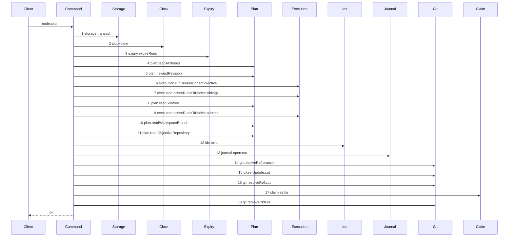

# Story 6 — The first execution claim

Epic: `.agents/plan/epics/051-the-workspace-branch.md`
Depends on: Story 4 (`04-the-claims-begin`) and Story 5 (`05-the-claims-settle`), whose units it sequences; EPIC 006 for `git.resolveRef` and `git.refUpdate`; EPIC 050.1 Story 6 (`06-the-conformance-harness`).
Kind: story-implement

Diagrams: claim-first-execution

Seams: claim-first-execution: +storage.transact, +clock.now, +expiry.expireRuns, +plan.readAllNodes, +plan.newestRevision, +execution.runDriversUnderObjective, +execution.activeRunsOfNodes:siblings, +plan.readSubtree, +execution.activeRunsOfNodes:subtree, +plan.readWorkspaceBranch, +plan.readObjectiveRepository, +ids.mint, +journal.open:cut, +git.resolveRef:branch, +git.refUpdate:cut, +git.resolveRef:cut, +claim.settle, +git.removePidFile

This story leaves the contended arm of the settle to Story 7
(`07-the-loser-of-two-first-claims-refuses`) and the crash recovery to Story 8
(`08-startup-reconciles-an-open-cut-row`).

**The prior set of this diagram is empty, so every token carries `+`.** `claim-branch-base-task` is
the other branch of `node.claim`, not this diagram's prior, and
`scripts/verify-epic-sequence.ts:650` — `changed` demands one sign owner per token per diagram.

**The drawn set is every branch of `node.claim` that finds no branch record and ends `ok`.** Once the
begin returns `kind: "cut"` the composed path has exactly two outcomes: the settle returns a record,
which is this diagram, or it returns `null` and the command refuses. The refusing arm reaches the
**same eighteen steps in the same order** — only the settle's own interior and the terminal differ —
so under `.agents/plan/authoring.md` it is not a second diagram, and Story 7
(`07-the-loser-of-two-first-claims-refuses`) draws the settle's interior instead. Case 14 asserts the
refusing arm reaches step 18.

## The ship path

### `claim-first-execution`

Fixture: the fixture of `claim-cut-begin` (Story 4). Initiative `I` holds objective `O`, which holds
tasks `T` and `S`; every node is `ready`; no `workspace_branch` row exists; repository `repo_a` is
the loopback bare repository whose `refs/heads/main` stands at `commit1` and which holds no
`refs/heads/objective_a`, so the create-only swap wins.



**The shape is the journaled write of `AGENTS.md`, and it holds exactly two transactions.** Step 1
opens the first and steps 2 to 13 run inside it; step 17 is a nested command that opens the second,
so its interior is invisible here and is proven by `claim-cut-settle`. **Exactly one
`storage.transact` token appears at this level**, and that is what forced the asymmetry: `claimBegin`
is called directly, so its calls are the command's own, while `claim.settle` is injected, because a
second bare `storage.transact` token in one diagram is a duplicate the parser refuses.

**Steps 14 to 16 sit between the two transactions and inside neither.** No transaction may hold the
SQLite write lock across git I/O, and a crash inside the git write must leave a record of it — which
is the `open` row step 13 committed. Step 18 is git I/O too, and it sits after the second
transaction commits.

**Step 14 is the source tip read, step 15 is the cut, and step 16 reads back what the objective ref
actually holds.** `git.resolveRef` over `refs/heads/main` returns the oid the branch starts from,
`git.refUpdate` creates `refs/heads/objective_a` at that oid with `expectedOid: null` —
`src/services/git/index.ts:50` — `expectedOid` defines that as the create-only compare and swap — and
step 16 resolves `refs/heads/objective_a`.

**Step 16 is unconditional, and it is the fix for the advancing-source race.** Without it a claim
whose create-only swap lost would record the tip **it** resolved, while the ref holds the tip the
winner resolved: claim A cuts at `commit1`, `refs/heads/main` advances to `commit2`, claim B resolves
`commit2`, B's swap loses, and B's settle wins the branch-record insert — leaving `workspace_branch`,
`run_base` and the journal row all naming `commit2` while the ref stands at `commit1`. The swap's
own verdict cannot repair it: `src/services/git/ref-update.ts:28` — `parseObservedOid` matches
`is at <oid> but expected`, which git's create-only "already exists" failure never emits, so
`observedOid` is `null` on exactly the branch that needs it. Reading the ref back is unconditional
rather than conditional on `updated`, because a branch would give this path two traces. Case 13
carries the race.

**The three git calls are the asynchronous seams of this path, and each carries one record.**
`.agents/plan/authoring.md` asks a story that introduces one to say so. This one is said: the command
awaits each before it uses the value, so no continuation can interleave. Case 8 asserts the awaits
rather than leaving them to the trace.

Add `test/sequence/scenarios/claim-first-execution.ts`.

## Change

**`src/commands/node/claim-node.ts` — `claimNode` becomes the composer, and it becomes `async`.**

### 1 — the signature

```ts
export type ClaimNodeDependencies = ClaimBeginDependencies &
  Readonly<{
    git: Git;
    claim: Readonly<{ settle: (input: ClaimSettleInput) => ClaimSettleResult }>;
  }>;

export async function claimNode(
  dependencies: ClaimNodeDependencies,
  input: ClaimNodeInput,
): Promise<ClaimNodeResult>;
```

`claim` is one dependency key holding one callable, so the diagram token is `claim.settle`.
`src/main.ts` binds it to `claimSettle` with its own dependency object, exactly as it binds every
other nested callable. `claimBegin` is **not** injected: `claimNode` calls it directly, so its calls
are recorded as the command's own and `claim-branch-base-task` keeps the trace EPIC 050.4 drew.

### 2 — the body

```ts
const begun = claimBegin(dependencies, input);
if (begun.kind === "claimed") {
  return begun.result;
}
const sourceOid = await dependencies.git.resolveRef({
  gitDir: begun.gitDir,
  ref: begun.branchRef,
});
if (sourceOid === null) {
  throw new ClaimNodeError(
    "objective-busy",
    `the branch ${begun.branchRef} of repository ${begun.repositoryId} is absent`,
    contendedObjectiveDetails(begun.objectiveId),
  );
}
await dependencies.git.refUpdate({
  gitDir: begun.gitDir,
  ref: begun.objectiveRef,
  expectedOid: null,
  nextOid: sourceOid,
  pidFile: begun.pidFile,
});
const observedOid = await dependencies.git.resolveRef({
  gitDir: begun.gitDir,
  ref: begun.objectiveRef,
});
if (observedOid === null) {
  throw new Error(
    `the objective ref ${begun.objectiveRef} is absent after the cut`,
  );
}
const settled = dependencies.claim.settle({
  begun,
  observedOid,
  actorId: input.actorId,
  actorKind: input.actorKind,
});
if (settled.clearedToken !== null) {
  await dependencies.git.removePidFile({ pidFile: settled.clearedToken });
}
```

- **A `null` tip refuses rather than throwing an unclassified error.** A registered repository whose
  branch does not resolve cannot be claimed, and `objective-busy` is the shipped code the caller
  already retries on. The journal row is left `open` and Story 8
  (`08-startup-reconciles-an-open-cut-row`) discards it, which is why this arm needs no second
  transaction. `contendedObjectiveDetails` is the helper Story 7
  (`07-the-loser-of-two-first-claims-refuses`) adds, and the widened
  `src/http/contract/error-details.ts:168` — `objectiveBusyDetails` is that story's contract change;
  this arm is its second caller.
- **The swap's verdict is not read, and the ref is read back instead.**
  `src/services/git/index.ts:55` — `RefUpdateResult` reports `updated: false` when the ref already
  exists, which is the concurrent-first-claim case. Branching on it would give this path two traces
  and would still supply no oid, because
  `src/services/git/ref-update.ts:28` — `parseObservedOid` returns `null` for a create-only failure.
  Step 16 therefore reads the ref unconditionally, and `observedOid` — never `sourceOid` — is what
  reaches the settle. The `workspace_branch` primary key stays the only exclusion enforcement point.
  Cases 9 and 13 assert both halves.
- **An absent ref after the cut is an invariant violation, not a refusal.** The command just created
  it and no path deletes it, so a `null` at step 16 throws. The journal row is left `open` and
  Story 8 (`08-startup-reconciles-an-open-cut-row`) discards it.
- On `settled.disposition === "contended"`, Story 7
  (`07-the-loser-of-two-first-claims-refuses`) writes the refusal. Until it lands, throw so no path
  silently returns.
- The pid-file removal is **step 18 of the diagram**, on both arms, before the command returns or
  throws. It is git I/O outside the transaction, exactly as
  `src/commands/startup/reconcile-journal.ts:233` — `removeClearedToken` places it. It runs on the
  same recorded `git` dependency, so the recorder emits it and the diagram must hold it; cases 10 and
  14 assert both arms.

### 3 — every call site of `claimNode` becomes awaited

`src/main.ts:553` — `node.claim` binds the handler synchronously today. The binding becomes
asynchronous, and the handler awaits the command.
`src/commands/node/claim-node.test.ts:228` — `claim` and
`src/commands/node/claim-node.test.ts:280` — `refused` are the two call helpers of the suite; both
become `async`, and the seventy-three cases that use them await. The compiler enumerates the rest.

**This is the largest edit of the epic and it is unavoidable.** `claimNode` is the first command in
the repository to sequence a git write with a database effect, and
`src/services/git/index.ts:179` — `resolveRef` and `src/services/git/index.ts:182` — `refUpdate` both
return promises. Every shipped journal-touching command is already `async`:
`src/commands/startup/reconcile-journal.ts:36` — `reconcileJournal`,
`src/commands/startup/reap-orphans.ts:34` — `reapOrphans` and
`src/commands/repository/register-repository.ts:162` — `registerRepository`.

### 4 — the two git projections

`test/helpers/sequence-conformance.ts:50` — `projections` gains two entries:

```ts
  "git.resolveRef": (input, context) => [field(input, "ref", context)],
  "git.refUpdate": (input, context) => [field(input, "ref", context)],
  "git.removePidFile": () => [],
```

**Both project the ref value, not its namespace.** This path resolves two different refs, so a
namespace projection would emit `git.resolveRef:branch` twice and
`test/helpers/sequence-conformance.ts:283` — `duplicate` refuses a repeated token. The scenario's
alias map turns `refs/heads/main` into `branch` and `refs/heads/objective_a` into `cut`.

`.agents/plan/stories/051.1-the-candidate-and-the-git-primitives/04-the-candidate-ref-is-deleted.md:125`
declares a `refNamespace` projection for `git.resolveRef`, and
`.agents/plan/stories/051.3-the-checkpoint-and-the-land/05-the-composed-successful-land.md` declares
the `git.refUpdate` row. **Both land here first**, because EPIC 051 runs before EPIC 051.1 and
EPIC 051.3. EPIC 051.3's row is identical. **EPIC 051.1's is not**, and that story must alias its
candidate refs by value instead of introducing `refNamespace`; the amendment is recorded in
`index.md`.

## Constraints

- Two transactions and no more. `claimNode` itself never calls `storage.transact`; the first belongs
  to `claimBegin` and the second to `claim.settle`.
- `git.resolveRef` and `git.refUpdate` sit between them, in no transaction.
- `expectedOid` is `null`. The ref must not exist, and a non-null value would move an existing branch.
- `nextOid` is `sourceOid`, the oid the **source** branch resolved to. `observedOid`, the oid the
  **objective** ref resolves to afterwards, is the only value that reaches the settle.
- Read the objective ref back unconditionally. Do not branch on `refUpdate`'s verdict: the primary
  key of `workspace_branch` is the enforcement point, a branch gives the path two traces, and
  `observedOid` from the result is `null` on the losing arm.
- `await` each git call before reading its value. The recorder records invocation order and cannot
  see an unawaited promise, so the await is asserted by a test and not by the diagram.
- Remove the pid file the settle returns, outside the transaction, on every arm.
- `claimBegin` stays a direct call. Injecting it collapses `claim-branch-base-task` to one token and
  breaks every `node.claim` diagram EPIC 050.1 and EPIC 050.4 own.

## Verify

```
node --test src/commands/node/claim-node.test.ts src/main.test.ts test/sequence/conformance.test.ts
```

Extend `src/commands/node/claim-node.test.ts`. The git service is the real
`src/services/git/binary.ts:24` — `createBinaryGit` over the loopback bare repository of
`test/helpers/remote/seed.ts:124` — `seedRepositories`, so both git calls are real.

Add, each as a separate `it`:

1. `"a first execution claim creates refs/heads/<objectiveId> at the resolved branch oid"` — read the
   ref out of the real bare home after the claim and assert it equals `commit1`, the oid
   `refs/heads/main` holds.

2. `"the cut names the objective ref, the create-only sentinel and the resolved tip"` — a `Git`
   double recording its input; `deepEqual` the recorded `RefUpdateInput` against
   `{ gitDir, ref: "refs/heads/objective_a", expectedOid: null, nextOid: commit1, pidFile }` with
   `pidFile` equal to the value the begin recorded. All four fields in one case.

3. `"a first execution claim resolves the branch before it cuts"` — assert the recorded ordinal of
   `resolveRef` precedes that of `refUpdate`, and that `resolveRef`'s `ref` is `refs/heads/main`
   while `refUpdate`'s is `refs/heads/objective_a`.

4. `"both git calls sit in no transaction"` — a storage double recording transaction spans and a git
   double recording call ordinals. Assert both git ordinals fall **between** the two recorded spans
   and inside neither. The control is the ordinal of `journal.open`, which falls inside the first
   span.

5. `"a first execution claim opens exactly two transactions and a later claim opens one"` — assert
   the span list has length `2` over the record-absent fixture and length `1` over the
   record-present fixture. Two assertions in one case, the second being the control the epic's
   row 12 names.

6. `"a first execution claim writes exactly one journal row and a later claim writes none"` — assert
   `SELECT count(*) FROM git_operation` reads `1` and `0` over the two fixtures.

7. `"a first execution claim returns the same result shape as a later claim"` — `deepEqual` the
   `ClaimNodeResult` field set against the value the record-present path returns, with the run id and
   the attempt id substituted. A path that returned a different shape would break the handler.

8. `"node.claim awaits the tip before it cuts and awaits the cut before it settles"` — a `Git` double
   whose `resolveRef` and `refUpdate` each resolve on a deferred promise. Assert `refUpdate` has not
   been called while the first promise is pending, and that `claim.settle` has not been called while
   the second is. The recorder cannot see an unawaited promise, so this is the assertion the diagram
   cannot make.

9. `"a lost create-only swap still settles, with the oid the ref holds"` — a `Git` double whose
   `refUpdate` returns `{ updated: false, observedOid: null }`, which is what
   `src/services/git/ref-update.ts:28` — `parseObservedOid` yields for a create-only failure, over a
   bare home whose `refs/heads/objective_a` already stands at `commit1`. Assert `claim.settle` is
   still called and that its `observedOid` is `commit1`. This is the branch the diagram does not
   hold, and it is what makes the primary key the only enforcement point.

10. `"a successful claim removes the pid file the begin recorded"` — assert the file at the returned
    `pidFile` path does not exist after `claimNode` returns, and that it existed after `claimBegin`.
    Two assertions, so the removal is proven and not merely attempted.

11. `"a claim whose branch does not resolve refuses objective-busy and leaves the journal row open"` —
    a repository whose `branch` names a ref the bare home does not hold. Assert
    `error.refusal === "objective-busy"`, that `git_operation.state` reads `open`, and that the
    counts of `workspace_branch`, `run` and `event` are all `0`.

12. `"claimNode is asynchronous and the node.claim handler awaits it"` — assert
    `claimNode(...)` returns a thenable, and in `src/main.test.ts` assert the `node.claim` route
    still answers `200` over a first claim, which is what proves the binding was awaited.

13. `"a claim whose source branch advanced records the oid the objective ref holds"` — the
    advancing-source race, sequentially. Run claim A to completion so
    `refs/heads/objective_a` stands at `commit1`; advance `refs/heads/main` to `commit2`; run a first
    claim B on a sibling task through `claimBegin` over a fixture whose `workspace_branch` row was
    deleted, so B resolves `commit2`, loses the create-only swap and settles. Assert B's
    `observedOid` is `commit1`, not `commit2`. The control is B's `sourceOid`, asserted to be
    `commit2`, which is what proves the two values genuinely diverged.

14. `"a contended claim also removes its pid file"` — over the fixture of Story 7
    (`07-the-loser-of-two-first-claims-refuses`), assert the file does not exist after `claimNode`
    throws `objective-busy`, and that it existed after `claimBegin`.

Add `test/sequence/scenarios/claim-first-execution.ts`, building the fixture the diagram names,
running the real `claimNode` over real SQLite and the real loopback bare repository behind
`test/helpers/sequence-conformance.ts:99` — `recordSeams`, binding `claim.settle` to an
**unrecorded** dependency object so its interior produces no token, aliasing
`refs/heads/objective_a` to `cut`, and returning the recorder and the result.

`pnpm run verify` exits 0.

Proof: PASS line delivered — `src/commands/node/claim-node.test.ts` and
`test/sequence/conformance.test.ts` in `PASS EPIC-051`.
