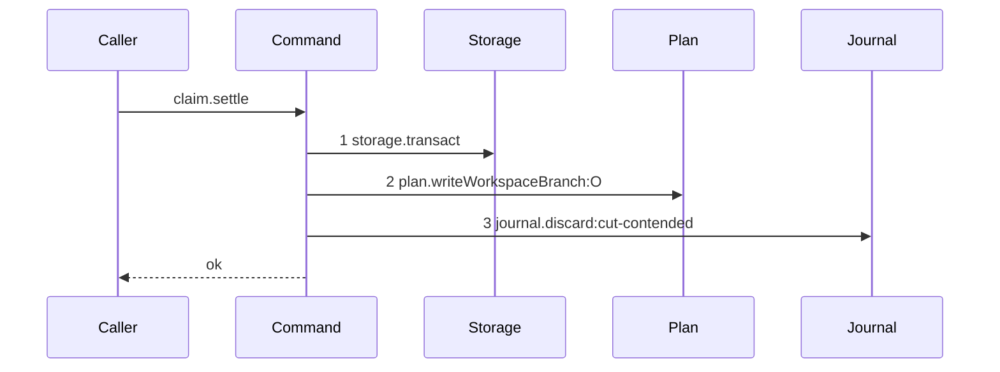

# Story 7 — The loser of two first claims refuses

Epic: `.agents/plan/epics/051-the-workspace-branch.md`
Depends on: Story 5 (`05-the-claims-settle`), whose unit this arm belongs to, and Story 6 (`06-the-first-execution-claim`), which composes it.
Kind: story-implement

Diagrams: claim-cut-settle-contested

Seams: claim-cut-settle-contested: +storage.transact, +plan.writeWorkspaceBranch:O, +journal.discard:cut-contended

**The prior set of this diagram is empty, so every token carries `+`**, for the reason Story 4
(`04-the-claims-begin`) gives. `claim-cut-settle` is the other branch of the same unit, not this
diagram's prior.

**The drawn set is every branch of `claim.settle` that finds the record already written.** The unit
evaluates exactly one predicate — whether `plan.writeWorkspaceBranch` returned a record — and the
accepted arm is Story 5's `claim-cut-settle`. No second such branch exists, because every other value
the unit writes arrives on its input.

## The ship path

### `claim-cut-settle-contested`

Fixture: the fixture of `claim-cut-settle` (Story 5) with one `workspace_branch` row **already
present** on objective `O` (`objective_a`), at `origin_oid` and `head_oid` both `commit1`. That row
is what a concurrent first claim's settle committed, and it is what makes this settle's insert
conflict on the primary key and return `null`.



The shape asserts three things. **The contention is decided at step 2**, the first write, so no
assignment, run, attempt, transition or event is reached — `Execution` and `Events` leave the
participant list entirely, and a settle that touched either fails the comparison rather than only at
the drawn ordinals. **The discard sits inside the same transaction as the conflicting insert**, so
the loser leaves no `open` row for startup to reconcile. And **one transaction is opened**, which is
what keeps the composed operation at exactly two.

**The terminal is `ok`, not a refusal, and that is deliberate.** `claimSettle` returns
`{ disposition: "contended" }`; it raises nothing.
`test/helpers/sequence-conformance.ts:303` — `resultTerminal` derives the terminal from the real
result, so a scenario that converted this return into a synthetic error would assert a terminal the
code does not produce. **The refusal belongs to the composed command**, which throws
`ClaimNodeError("objective-busy")` after the settle returns; cases 3 and 4 carry it, and Story 6
(`06-the-first-execution-claim`) case 14 carries the pid-file removal on this arm.

**The insert raises nothing, so no seam call throws.**
`plan.writeWorkspaceBranch` carries `ON CONFLICT (node_id) DO NOTHING RETURNING` per Story 2
(`02-the-workspace-branch-record`), and returns `null`. A settle that classified a SQLite `errcode`
would put a vendor code in a command, which the import matrix of `AGENTS.md` refuses, and
`errcode & 0xff === 19` would also match a foreign-key, CHECK or NOT NULL failure — three defects
this arm must not swallow.

**This diagram proves no write seam is reached after step 3. It does not prove the operation wrote
nothing.** Case 1 carries that, by comparing the database bytes.

Add `test/sequence/scenarios/claim-cut-settle-contested.ts`.

## Change

**`src/commands/node/claim-node.ts` — give `claimSettle` its contended arm, and give `claimNode` the
refusal.**

### 1 — the settle's arm

Branch on the `null` return of the `plan.writeWorkspaceBranch` call of Story 5
(`05-the-claims-settle`) step 1:

```ts
const record = dependencies.plan.writeWorkspaceBranch(transaction, {
  nodeId: begun.objectiveId,
  originOid: input.observedOid,
});
if (record === null) {
  const clearedToken = dependencies.journal.discard(transaction, {
    id: begun.journalRowId,
    outcome: "cut-contended",
    completedAt: begun.now,
  });
  return { disposition: "contended", clearedToken };
}
```

**No `try`, no `catch` and no error code.** The typed `null` of Story 2
(`02-the-workspace-branch-record`) is the whole classifier, and it is decided by the store where the
SQL lives. A command that read `errcode & 0xff === 19` would import a vendor semantic the import
matrix of `AGENTS.md` keeps out of `commands/`, and that mask matches every constraint class, not the
primary key alone.

### 2 — the composer's refusal

`claimNode` replaces the interim throw of Story 6 (`06-the-first-execution-claim`) step 2:

```ts
if (settled.disposition === "contended") {
  throw new ClaimNodeError(
    "objective-busy",
    `the objective ${begun.objectiveId} was claimed by a concurrent first claim`,
    contendedObjectiveDetails(begun.objectiveId),
  );
}
```

The pid file is removed before the throw, as step 18 of Story 6
(`06-the-first-execution-claim`)'s diagram, which runs on both arms.

### 2b — the details contract, which this story must widen

**`objective-busy` is the shipped code and no new code is registered.**
`src/domain/run-exclusion.ts:121` — `objective-busy` is its domain literal,
`src/commands/node/claim-node.ts:56` — `objective-busy` is its membership in `claimRefusalCodes`,
`src/http/contract/errors.ts:28` — `objective-busy` maps it to `409` and
`src/cli/exit-code.ts:38` — `objective-busy` maps it to `168`.

**Its details schema cannot carry this refusal today.**
`src/http/contract/error-details.ts:168` — `objectiveBusyDetails` is a `z.strictObject` requiring
`objectiveId`, `siblingNodeId`, `siblingRunId` and `expiresAt`, and a contended first claim has no
sibling run to name: the winner's run is opened in a transaction this one cannot see, and the loser's
own transaction wrote nothing. Make the three run-scoped members nullable:

```ts
export const objectiveBusyDetails = z.strictObject({
  objectiveId: nodeIdentity,
  siblingNodeId: nodeIdentity.nullable(),
  siblingRunId: identity("run").nullable(),
  expiresAt: epochMillis.nullable(),
});
```

and add the helper beside the raise:

```ts
const contendedObjectiveDetails = (objectiveId: string) => ({
  objectiveId,
  siblingNodeId: null,
  siblingRunId: null,
  expiresAt: null,
});
```

`src/commands/node/claim-node.ts:302` — `objective-busy`, the shipped raise, keeps filling all four
and is unchanged. Ulrich ruled on 2026-09-03 and the epic's `## Decisions` carries it: the
alternative — a new refusal code with its own status, exit code, handler arm and details schema —
touches six files and contradicts the Decision that the loser refuses with the shipped code. Gate
row 31 proves the widening, and gate row 31's control is the shipped four-field raise.

### 3 — the projection

`test/helpers/sequence-conformance.ts:50` — `projections` gains one entry, symmetric with the one
Story 5 (`05-the-claims-settle`) adds:

```ts
  "journal.discard": (input, context) => [field(input, "outcome", context)],
```

`src/commands/startup/reconcile-journal.ts:198` — `outcome` already writes
`"recovered-discarded"` on the shipped reconcile path, so the projection separates a contention from
a recovery without a new field.

## Constraints

- One transaction. The conflicting insert and the discard sit in it, and no second one is opened.
- No `try`/`catch` and no SQLite error code in the command. The store returns `null`.
- The discard is the only write on this arm. No assignment, no run, no attempt, no transition and no
  event.
- `journal.discard` and never `journal.complete`. A completed row claims a ref move this claim did
  not make.
- The refusal code is `objective-busy`. Do not register a new code, and do not reuse `subtree-busy`,
  which names a run.
- Do not recover and continue. The epic's Decisions state that the `workspace_branch` primary key is
  the only enforcement point for objective exclusion on a first claim; a loser that continued would
  open two runs on one objective branch.

## Verify

```
node --test src/commands/node/claim-node.test.ts test/sequence/conformance.test.ts
```

Extend `src/commands/node/claim-node.test.ts`, over the fixture of Story 5
(`05-the-claims-settle`) with the branch record pre-seeded.

Add, each as a separate `it`:

1. `"a contended settle writes nothing but the journal discard"` — assert the counts of `run`,
   `run_base`, `attempt` and `event` are `0`; assert `node.assignment` of `task_a` is `null` and the
   three node states are still `ready`; assert `SELECT count(*) FROM workspace_branch` reads `1` and
   `deepEqual` that row against the pre-seeded one, field by field.

2. `"the loser's journal row is discarded"` — assert `state === "discarded"`,
   `outcome === "cut-contended"`, `result_head_oid === null`, `completed_at === NOW` and
   `child_token === null`, all by value.

3. `"the loser refuses objective-busy"` — drive the composed `claimNode` over the same fixture and
   assert `error.refusal === "objective-busy"` and `error.details` deep-equals
   `{ objectiveId: "objective_a" }`.

4. `"a retry of the loser's claim succeeds on the one-transaction path"` — the control that the
   refusal is recoverable. Re-claim the same task, assert the claim returns, assert the storage
   double recorded exactly `1` transaction span for the retry, and assert `run_base.oid` equals the
   pre-seeded `head_oid`.

5. `"two concurrent first claims on one objective produce one branch record and one ref"` — run two
   `claimBegin` calls to completion before either settle, then both git writes, then both settles.
   Assert `SELECT count(*) FROM workspace_branch` reads `1`, that `refs/heads/objective_a` reads
   `commit1`, that `SELECT count(*) FROM run` reads `1`, and that the two `git_operation` rows read
   one `complete` and one `discarded`. The sequential case of case 4 does not stand in for this.

6. `"the contended settle reaches exactly three seam calls"` — assert the recorder's token list is
   exactly
   `["storage.transact", "plan.writeWorkspaceBranch:O", "journal.discard:cut-contended"]` and that
   the settle returns rather than throwing. The control is the accepted scenario of Story 5, whose
   list is thirteen tokens.

7. `"a store failure is not read as contention"` — inject a `plan` double whose
   `writeWorkspaceBranch` throws a plain `Error`. Assert `claimSettle` throws that error, that the
   journal row is still `open`, and that no `journal.discard` call was recorded. This is the control
   that `null` and not an exception is the classifier.

8. `"the composed contended claim opens exactly two transactions"` — a storage double recording
   spans over the whole `claimNode` call that ends in the refusal. Assert the span list has length
   `2`, one for the begin and one for the settle. The control is Story 6
   (`06-the-first-execution-claim`) case 5, which asserts `2` on the accepted arm.

9. `"the contended details satisfy the objective-busy schema"` — parse `error.details` against
   `src/http/contract/error-details.ts:168` — `objectiveBusyDetails` and assert the parse succeeds
   with the three run-scoped members `null`. The control is the shipped raise at
   `src/commands/node/claim-node.ts:302` — `objective-busy`, whose four-field details must still
   parse against the widened schema, asserted in the same case.

9b. `"the widened schema still refuses an unknown member"` — assert
`objectiveBusyDetails.safeParse({ ...valid, siblingWorker: "x" }).success === false`. The oracle
of case 9 is acceptance, so this is the nearby forbidden case that proves `strictObject`
survived the widening.

Add `test/sequence/scenarios/claim-cut-settle-contested.ts`, building the fixture the diagram names
over real SQLite behind `test/helpers/sequence-conformance.ts:99` — `recordSeams`, running the real
`claimSettle`, and returning the recorder and the `ClaimSettleResult` **unchanged**. The result's
disposition is `contended` and it is not an error, so
`test/helpers/sequence-conformance.ts:303` — `resultTerminal` derives `ok`, which is the terminal the
diagram states. Do not convert it into a `ClaimNodeError`: the terminal must come from the real
result.

`pnpm run verify` exits 0.

Proof: PASS line delivered — `src/commands/node/claim-node.test.ts` and
`test/sequence/conformance.test.ts` in `PASS EPIC-051`.
