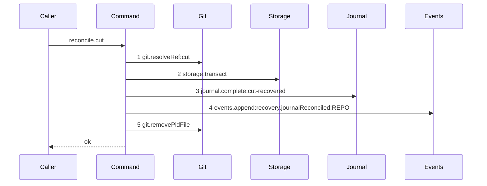

# Story 8 — Startup reconciles an open cut row

Epic: `.agents/plan/epics/051-the-workspace-branch.md`
Depends on: Story 1 (`01-migration-13`) for the `cut` intent, Story 4 (`04-the-claims-begin`) for the row this reconciles, and Story 6 (`06-the-first-execution-claim`) for the crash window it closes. It is placed last because it appends to `shippedEpics`, which makes every diagram of this epic due.
Kind: story-implement

Diagrams: reconcile-cut

Seams: reconcile-cut: +git.resolveRef:cut, +storage.transact, +journal.complete:cut-recovered, +events.append:recovery.journalReconciled:REPO, +git.removePidFile

**The prior set of this diagram is empty, so every token carries `+`.** A `cut` row cannot exist
before migration `13`, so this path is written from nothing and draws the ship diagram alone. The
`merge`, `sync`, `publish` and `revert` arms of `src/commands/startup/reconcile-journal.ts` are
untouched by this story and are drawn by
`.agents/plan/stories/051.3-the-checkpoint-and-the-land/06-startup-reconciles-an-open-merge-row.md`.

**The drawn set is every branch of `reconcile.cut` that ends `ok`.** The unit takes one decision —
whether the ref exists — and both arms reach the same three seam calls at the same ordinals, because
`src/services/git/index.ts:262` — `complete` and `src/services/git/index.ts:266` — `discard` are one
`Journal` participant at two labels. The absent-ref arm therefore differs only by the label of step
3 and by a value, and `.agents/plan/authoring.md` refuses a second diagram for a branch that changes
a value and not the call set. Case 2 carries it.

## The ship path

### `reconcile-cut`

Fixture: one `git_operation` row on repository `repo_a` with `intent: "cut"`, `state: "open"`,
`node_id: "objective_a"`, `run_id: null`, `ref: "refs/heads/objective_a"`, `base_oid: ZERO_OID`,
`proposed_head_oid: ZERO_OID` and a `child_token` naming a pid file that exists on disk. The loopback
bare repository of `test/helpers/remote/seed.ts:124` — `seedRepositories` holds
`refs/heads/objective_a` at `commit1`, so the ref exists and the row completes.



The shape asserts three things. **The ref is read before the transaction opens**, so no transaction
holds the SQLite write lock across git I/O. **The row is settled and the event appended in one
transaction**, so no committed state exists in which the row is closed and the recovery is
unrecorded. And **the pid file is removed after that transaction commits**, which is where
`src/commands/startup/reconcile-journal.ts:233` — `removeClearedToken` places it today.

`git.resolveRef` projects the ref value, per Story 6 (`06-the-first-execution-claim`), and the
scenario aliases `refs/heads/objective_a` to `cut`.

**A `cut` row is reconciled by the ref's existence, not by an oid comparison.** The shipped ladder at
`src/commands/startup/reconcile-journal.ts:94` — `proposedHeadOid` compares the observed oid against
the proposed head, and a `cut` row carries `ZERO_OID` there because the branch tip is resolved after
its begin commits. A ref that exists is a cut that happened, whatever oid it holds: the epic's
Decisions state that the `workspace_branch` primary key is what stops the second run, and Story 6
(`06-the-first-execution-claim`) makes the settle record the oid it reads back from the objective ref
rather than the source tip, so a completed row and a later retry both adopt the oid the ref actually
holds even when the source branch advanced between two first claims. Case 4 asserts the classifier
never reaches the `unexpected` arm for a `cut` row, and case 4b asserts the retry adopts the ref's
oid.

**One transaction appears at this level, and that is why the unit exists.** The outer
`reconcileJournal` opens one transaction for
`src/commands/startup/reconcile-journal.ts:41` — `listOpen` and one per settled row, so its trace
holds two bare `storage.transact` tokens and the parser refuses a duplicate. The `cut` arm is
therefore an exported nested unit, matching the module-private
`src/commands/startup/reconcile-journal.ts:176` — `settle` the shipped file already uses.

Add `test/sequence/scenarios/reconcile-cut.ts`.

## Change

**`src/commands/startup/reconcile-journal.ts` — add the `cut` arm and its unit.**

### 1 — the unit

```ts
export type ReconcileCutInput = Readonly<{
  row: OpenJournalRow;
  actor: string;
  now: number;
}>;

export type ReconcileCutResult = Readonly<{
  verdict: "complete" | "discarded";
  observed: string | null;
}>;

export async function reconcileCut(
  dependencies: ReconcileJournalDependencies,
  input: ReconcileCutInput,
): Promise<ReconcileCutResult>;
```

It takes the command's own dependency object, following
`src/commands/startup/reconcile-journal.ts:176` — `settle`, and it is exported so its scenario can
run it directly.

### 2 — the body

1. `const observed = await dependencies.git.resolveRef({ gitDir: row.repositoryHomePath, ref: row.ref });`
   wrapped in the same `try` that
   `src/commands/startup/reconcile-journal.ts:84` — `GitError` uses, raising
   `RecoveryError("ref-unreadable", ...)`.
2. One `dependencies.storage.transact` callback holding both writes:
   - `observed !== null` → `dependencies.journal.complete(transaction, { id: row.id, resultHeadOid: observed, outcome: "cut-recovered", completedAt: input.now })`;
   - `observed === null` → `dependencies.journal.discard(transaction, { id: row.id, outcome: "cut-absent", completedAt: input.now })`;
   - then `dependencies.events.append(transaction, { subjectKind: "repository", subjectId: row.repositoryId, type: "recovery.journalReconciled", actorKind: "daemon", actorId: input.actor, payload: { gitOperationId: row.id, intent: row.intent, ref: row.ref, observed, verdict } })`, the field set of
     `src/commands/startup/reconcile-journal.ts:215` — `append`.
3. `await removeClearedToken(dependencies, clearedToken);` — the shipped helper at
   `src/commands/startup/reconcile-journal.ts:233` — `removeClearedToken`, unchanged.
4. Return `{ verdict, observed }`.

**No node transition is applied on either arm.** The claim's effects all sit in its settle, so a
discarded `cut` row leaves the node `ready` and the caller reclaims. The epic's Decisions state it,
and case 3 asserts it.

### 3 — the ladder gains one branch

`src/commands/startup/reconcile-journal.ts:52` — `publish` is the shipped intent branch and the `cut`
branch sits beside it, before the generic
`src/commands/startup/reconcile-journal.ts:80` — `resolveRef`:

```ts
if (row.intent === "cut") {
  const settled = await reconcileCut(dependencies, {
    row,
    actor: input.actor,
    now,
  });
  if (settled.verdict === "complete") {
    completed++;
  } else {
    discarded++;
  }
  continue;
}
```

`refusesNewWork` gains nothing: a `cut` row is always classified, so it never leaves a repository
refusing new work. `findings` gains nothing either: the `ref-absent-with-base` finding at
`src/commands/startup/reconcile-journal.ts:132` — `baseOid` fires only when `baseOid !== ZERO_OID`,
and a `cut` row's base is `ZERO_OID` by construction.

### 4 — the epic ships

Append `"051"` to `scripts/epic-sequence-range.ts:9` — `shippedEpics`, and update the pinned literals
at `test/sequence/conformance.test.ts:255` — `assert`.
`test/sequence/conformance.test.ts:264` — `slice` asserts the list is a prefix of `authoredEpics`, so
this edit is legal only once EPIC 050.2 through EPIC 050.5 are also shipped. That is the sequence
order, and it is stated as a dispatch precondition in `index.md`.

That entry is what makes the six diagrams of this epic **due**:
`test/sequence/conformance.test.ts:82` — `liveDiagrams` filters on `shippedEpics`, and
`test/sequence/conformance.test.ts:267` — `conforms` replays each due diagram by equality. It is also
what retires EPIC 050.4's `claim-lease-free-task`, whose section now carries
`Superseded by: EPIC 051 claim-branch-base-task`:
`test/sequence/conformance.test.ts:113` — `superseded` then refuses a scenario file for it, and none
exists.

## Constraints

- `git.resolveRef` runs before the transaction. One transaction per row, and no git call inside it.
- The verdict is decided by the ref's existence. Do not compare `observed` against
  `proposed_head_oid` for a `cut` row; both oids are `ZERO_OID`.
- A `cut` row never reaches the `unexpected` arm and never adds a repository to `refusesNewWork`.
- Neither arm applies a node transition, opens a run, or writes a `workspace_branch` row.
- The `cut` branch sits before the generic `resolveRef` of the shipped ladder, and it changes no other
  arm. `src/commands/startup/reconcile-journal.test.ts` holds the shipped verdict ladder as a
  regression, and every one of its cases stays green.
- Append to `shippedEpics` only after every scenario file of this epic exists. A shipped epic with a
  missing scenario fails `test/sequence/conformance.test.ts:133` — `it`.

## Verify

```
node --test src/commands/startup/reconcile-journal.test.ts test/sequence/conformance.test.ts
```

Extend `src/commands/startup/reconcile-journal.test.ts`, whose open-row seeder is
`src/commands/startup/reconcile-journal.test.ts:110` — `openRow` and whose git stub is
`src/commands/startup/reconcile-journal.test.ts:78` — `refUpdate`. Use the real
`src/services/git/journal.ts:10` — `createGitJournal` and the loopback bare repository of
`test/helpers/remote/seed.ts:124` — `seedRepositories`.

Add, each as a separate `it`:

1. `"startup completes an open cut row whose ref exists"` — seed the fixture the diagram names,
   run `reconcileJournal`, and assert the `git_operation` row reads `state: "complete"`,
   `outcome: "cut-recovered"`, `result_head_oid: commit1`, `completed_at: NOW`,
   `child_token: null`, and that the result's `completed` is `1` and `discarded` is `0`.

2. `"startup discards an open cut row whose ref is absent"` — the same fixture with
   `refs/heads/objective_a` never created. Assert `state: "discarded"`, `outcome: "cut-absent"`,
   `result_head_oid: null`, and that `discarded` is `1` and `completed` is `0`.

3. `"neither arm applies a node transition, and each appends one fully specified event"` — capture
   the three node states before and after each of cases 1 and 2 and assert they are unchanged by
   value. Then `deepEqual` the appended event row against the full expected object:
   `subject_kind: "repository"`, `subject_id: "repo_a"`, `type: "recovery.journalReconciled"`,
   `actor_kind: "daemon"`, `actor_id: <the actor input>`, and a payload deep-equal to
   `{ gitOperationId: <row id>, intent: "cut", ref: "refs/heads/objective_a", observed: commit1, verdict: "complete" }`
   for case 1 and to the same object with `observed: null` and `verdict: "discarded"` for case 2.
   Assert the row count is `1` per run. Two runs in one case.

3b. `"the event is appended in the settling transaction"` — a storage double recording spans; assert
the `events.append` ordinal falls inside the settle span and that no event survives when the
`journal.complete` call throws, asserted by count `0`.

4. `"a cut row never reaches the unexpected arm and never refuses new work"` — seed the ref at
   `commit2`, an oid equal to neither `base_oid` nor `proposed_head_oid`. Assert the row still
   completes with `result_head_oid: commit2`, that `leftOpen` is `0` and that `refusesNewWork` is
   `[]`. Under the shipped ladder this fixture reaches
   `src/commands/startup/reconcile-journal.ts:144` — `unexpected`, so this case is the control that
   the `cut` branch is taken.

4b. `"a claim retried after a discarded cut row adopts the oid the objective ref holds"` — the
recovery half of the advancing-source race. Seed the ref at `commit1`, discard the row through
case 2's path with the ref **present** so the row completes, delete the `workspace_branch` row to
simulate a crash before the settle, advance `refs/heads/main` to `commit2`, then run a first
claim. Assert `workspace_branch.origin_oid` and `run_base.oid` both read `commit1`, the oid the
objective ref holds, and not `commit2`. Without Story 6
(`06-the-first-execution-claim`)'s read-back this case fails, so it is that fix's recovery
control.

5. `"the cut arm reads the ref before it opens its transaction"` — a storage double recording
   transaction spans and a git double recording call ordinals; assert the `resolveRef` ordinal
   precedes the entry of the settle span.

6. `"the cut arm opens exactly one transaction per row"` — seed two open `cut` rows on two
   objectives; assert the recorded span list has length `3`, one for
   `src/commands/startup/reconcile-journal.ts:40` — `transact` and one per row.

7. `"the cut arm removes the pid file it cleared"` — assert the file named by `child_token` exists
   before and does not exist after, on both the complete and the discard arm. Two assertions per arm,
   so the removal is proven and not merely attempted.

8. `"the shipped merge, sync, publish and revert arms are unchanged"` — the regression. Run the
   shipped cases of `src/commands/startup/reconcile-journal.test.ts` over a `merge` row at each of
   the four observed values — the proposed head, the base, absent, and a fourth oid — and
   `deepEqual` the full `ReconcileJournalResult` against the shipped expectations.

9. `"a cut row whose ref cannot be read raises ref-unreadable"` — a git double whose `resolveRef`
   throws `GitError`. Assert a `RecoveryError` with code `ref-unreadable`, and that the row is still
   `open`.

10. `"the range lists 051 as authored and shipped"` — assert `authoredEpics` and `shippedEpics` both
    end with `"051"`, and that `shippedEpics` equals
    `authoredEpics.slice(0, shippedEpics.length)`.

11. `"every due live diagram of EPIC 051 has exactly one scenario file"` — the shipped case at
    `test/sequence/conformance.test.ts:133` — `it` covers it once the range moves; assert here
    additionally that the six ids
    `claim-branch-base-task`, `claim-cut-begin`, `claim-cut-settle`, `claim-first-execution`,
    `claim-cut-settle-contested` and `reconcile-cut` each resolve to a file, and that
    `test/sequence/scenarios/claim-lease-free-task.ts` does not exist.

12. `"the conformance runner fails when a step is removed or reordered"` — the mutation half of the
    epic's row 24. Take the token list of `claim-first-execution`, delete step 15 and assert
    `assertConformance` throws; restore it, swap steps 14 and 15 and assert it throws again. Two
    mutations, so both the set and the order are proven to be compared.

Add `test/sequence/scenarios/reconcile-cut.ts`, building the fixture the diagram names over real
SQLite and the real loopback bare repository behind
`test/helpers/sequence-conformance.ts:99` — `recordSeams`, running the real `reconcileCut`, and
returning the recorder and the result.

`pnpm run verify` exits 0.

Proof: PASS line delivered — `src/commands/startup/reconcile-journal.test.ts` and
`test/sequence/conformance.test.ts` in `PASS EPIC-051`.
