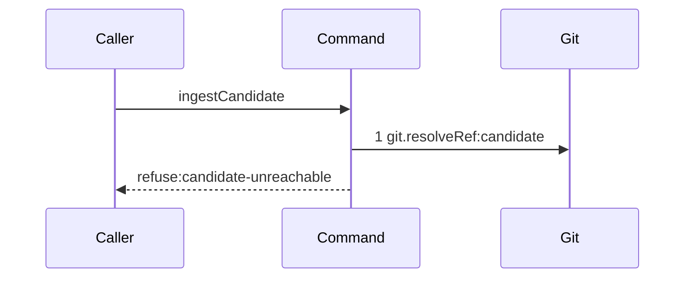

# Story 2 — The candidate ref is missing

Epic: `.agents/plan/epics/051.1-the-candidate-and-the-git-primitives.md`
Depends on: Story 1 (`git.resolveRef` is shipped, but this story needs Story 1's interface edit to type check against the widened `Git`), Story 4 (`04-the-candidate-ref-is-deleted`, which adds the `git.resolveRef` projection, the asynchronous scenario runner and the `"051.1"` range entry).
Kind: story-implement

Diagrams: ingest-candidate-missing-ref

Seams: ingest-candidate-missing-ref: +git.resolveRef:candidate

This story creates the command and its earliest refusal. Story 3 adds the reachability branch to the
same command, and EPIC 051.4 is the only caller either story leaves.

## The ship path

### `ingest-candidate-missing-ref`

Fixture: one bare home holding `refs/heads/main` at `fixtureObjectIds.commit2` and **no** ref under
`refs/kanthord/candidate/`. The command is called for `runId = "run_a"`, `attemptNo = 1` and
`reportedOid = fixtureObjectIds.commit2`. The path is written from nothing, so its prior set is empty
and it draws no baseline.



The diagram states the two absences the EPIC's gate names: no reachability call, and no deletion. A
diagram with one step asserts exactly the calls it draws, so an implementation that reached
`git.isAncestor` or `candidate.discard` here would fail the comparison.

Add `test/sequence/scenarios/ingest-candidate-missing-ref.ts`.

## Change

### 1 — the ref is a pure function of the run and the attempt

**Create `src/domain/candidate-ref.ts`.**

```ts
export const CANDIDATE_REF_PREFIX = "refs/kanthord/candidate/";

export function candidateRef(
  input: Readonly<{ runId: string; attemptNo: number }>,
): string;
```

It returns `` `${CANDIDATE_REF_PREFIX}${input.runId}/${input.attemptNo}` ``. It is pure and imports
nothing. Story 5 adds the reader that goes the other way.

The namespace is a convention and not a boundary. Nothing enforces that a worker writes only there:
a worker holds file system access to the bare home. The daemon's defence is that it reads no other
ref, and the assertion that proves it belongs to EPIC 051.4.

### 2 — the command

**Create `src/commands/checkpoint/ingest-candidate.ts`.**

```ts
export type IngestCandidateDependencies = Readonly<{ git: Git }>;

export type IngestCandidateInput = Readonly<{
  gitDir: string;
  runId: string;
  attemptNo: number;
  reportedOid: string;
}>;

export type IngestCandidateResult =
  | Readonly<{ ok: true; ref: string; tipOid: string }>
  | Readonly<{
      ok: false;
      refusal: "candidate-unreachable";
      ref: string;
      reportedOid: string;
    }>;

export async function ingestCandidate(
  dependencies: IngestCandidateDependencies,
  input: IngestCandidateInput,
): Promise<IngestCandidateResult>;
```

**Body, in this order:**

1. `const ref = candidateRef({ runId: input.runId, attemptNo: input.attemptNo });`
2. `const tipOid = await dependencies.git.resolveRef({ gitDir: input.gitDir, ref });`
3. When `tipOid === null`, return
   `{ ok: false, refusal: "candidate-unreachable", ref, reportedOid: input.reportedOid }` and make no
   further call.
4. Otherwise return `{ ok: true, ref, tipOid }`. Story 3 replaces this line with the reachability
   check; until then a resolved ref passes, and this story's case 2 asserts it.

**It refuses by returning, never by throwing.** EPIC 051.4 composes this unit into an ordered gate
where the first failure names itself, and a returned verdict composes where a throw does not.
`resultTerminal` at `test/helpers/sequence-conformance.ts:310 — `ok`` reads `ok === false` and then
`value.code ?? value.refusal`, so the returned shape renders `refuse:candidate-unreachable` without
any harness change.

The command opens no transaction and takes none. It reads git only.

## Constraints

- `ingestCandidate` reaches exactly one seam on this path: `git.resolveRef`.
- The refusal carries the ref it looked for. A refusal that names no ref cannot be diagnosed.
- Do not register `candidate-unreachable` in `src/http/contract/errors.ts`. EPIC 051.4 carries every
  contract edit of the family, and this epic makes no wire change.
- Do not read or write the shipped `candidate` table
  (`src/services/storage/migration-0003-execution-and-journal.ts:77 — `candidate``). It stays unused
  until EPIC 057 drops it.
- Do not add an event append.

## Verify

```
node --test src/domain/candidate-ref.test.ts src/commands/checkpoint/ingest-candidate.test.ts test/sequence/conformance.test.ts
```

Create `src/domain/candidate-ref.test.ts` and `src/commands/checkpoint/ingest-candidate.test.ts`,
suite names `"src/domain/candidate-ref.test"` and
`"src/commands/checkpoint/ingest-candidate.test"`. The command test builds its bare home the way
`04-the-candidate-ref-is-deleted.md` does: a private `cpSync` copy of `seedRepositories`
(`test/helpers/remote/seed.ts:124`), a `Git` from `createBinaryGit` (`src/services/git/binary.ts:24`)
over `createGitRunner` (`src/services/git/run.ts:49`).

Add, each as a separate `it`:

1. `"the candidate ref of a run and an attempt is built from both"` — assert
   `candidateRef({ runId: "run_a", attemptNo: 1 })` equals `"refs/kanthord/candidate/run_a/1"`, and
   `candidateRef({ runId: "run_a", attemptNo: 12 })` equals `"refs/kanthord/candidate/run_a/12"`.

2. `"a missing candidate ref refuses candidate-unreachable"` — over a bare home with no ref under the
   namespace, assert the result deep-equals
   `{ ok: false, refusal: "candidate-unreachable", ref: "refs/kanthord/candidate/run_a/1", reportedOid: fixtureObjectIds.commit2 }`.

3. `"a missing candidate ref makes no reachability call and no deletion"` — build a `Git` double whose
   `resolveRef` returns `null` and whose `isAncestor` and `deleteRef` increment counters. Call
   `ingestCandidate` and assert both counters are `0`, and assert the `resolveRef` counter is `1`. The
   third assertion is the control: without it the two zeroes pass for a command that makes no call at
   all.

4. `"a resolved candidate ref passes"` — create `refs/kanthord/candidate/run_a/1` at
   `fixtureObjectIds.commit2` and assert the result deep-equals
   `{ ok: true, ref: "refs/kanthord/candidate/run_a/1", tipOid: fixtureObjectIds.commit2 }`. Story 3
   replaces this behaviour with the reachability check and rewrites this case.

Add `test/sequence/scenarios/ingest-candidate-missing-ref.ts`. It is a default-exported `async`
function building the fixture above, wrapping `{ git }` with `recordSeams`
(`test/helpers/sequence-conformance.ts:99`), awaiting `ingestCandidate` over
`recorder.dependencies`, and returning `{ recorder, result }`. Dispose the fixture in a `finally`.

5. `"the conformance runner replays ingest-candidate-missing-ref"` — the shipped case
   `"every due scenario conforms"` at `test/sequence/conformance.test.ts:270 — `conforms`` carries it.
   Assert here that `test/sequence/scenarios/ingest-candidate-missing-ref.ts` exists and that its
   default export is a function, so a scenario deleted by a later edit fails this story's own file.

`pnpm run verify` exits 0.

Proof: PASS line delivered — `src/domain/candidate-ref.test.ts` and
`src/commands/checkpoint/ingest-candidate.test.ts` in `PASS EPIC-051.1`.
