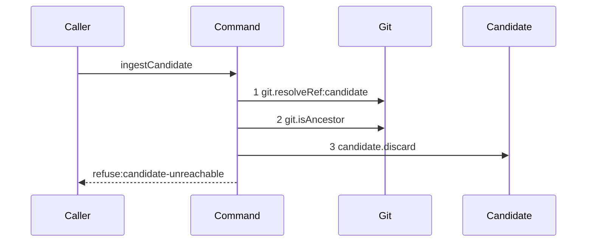

# Story 3 — The candidate ref does not reach the reported oid

Epic: `.agents/plan/epics/051.1-the-candidate-and-the-git-primitives.md`
Depends on: Story 2 (`02-the-candidate-ref-is-missing`, which creates the command and the ref helper), Story 4 (`04-the-candidate-ref-is-deleted`, which creates the nested unit this path calls and the harness this scenario runs on), Story 7 (`07-the-candidate-ref-reaches-the-reported-oid`, which adds the reachability check this branch turns on).
Kind: story-implement

Diagrams: ingest-candidate-unreachable

Seams: ingest-candidate-unreachable: +git.resolveRef:candidate, +git.isAncestor, +candidate.discard

This story completes the command. EPIC 051.4 is its only caller.

## The ship path

### `ingest-candidate-unreachable`

Fixture: one bare home holding `refs/kanthord/candidate/run_a/1` at `fixtureObjectIds.commit1`. The
command is called for `runId = "run_a"`, `attemptNo = 1` and `reportedOid = fixtureObjectIds.commit2`.
`commit2` is the child of `commit1` (`test/helpers/remote/seed.ts:170 — `commit-tree``), so the
reported oid is **not** an ancestor of the ref tip and the ref does not reach it. The path is written
from nothing, so its prior set is empty and it draws no baseline.



`git.isAncestor` carries no label. Its two call sites in the family sit in different diagrams — this
one, and the ancestry check of EPIC 051.4's `acceptExecution` — and `.agents/plan/authoring.md`
forbids a repeated token only inside one diagram. A `:candidate` label would also name the call site
rather than an argument, which a projection may not do.

**Both branches of the reachability check are drawn, and Story 7 owns the other one.** The reachable
branch reaches `git.resolveRef` and `git.isAncestor` and stops; this branch reaches
`candidate.discard` as well. Those are two **different seam sets**, not one seam set at two counts, so
`.agents/plan/authoring.md` draws both, and a `story-implement` draws one path each. Story 7
(`07-the-candidate-ref-reaches-the-reported-oid`) owns `ingest-candidate-reachable` and the check
itself; this story owns the deletion the failing branch performs. Together with
`ingest-candidate-missing-ref` of Story 2, the three diagrams are every branch of `ingestCandidate`.

Add `test/sequence/scenarios/ingest-candidate-unreachable.ts`.

## Change

### 1 — the command gains the nested unit

`src/commands/checkpoint/ingest-candidate.ts`, the dependency type Story 2 created:

```ts
export type CandidateDiscard = Readonly<{
  discard(input: Readonly<{ gitDir: string; ref: string }>): Promise<void>;
}>;

export type IngestCandidateDependencies = Readonly<{
  git: Git;
  candidate: CandidateDiscard;
}>;
```

`candidate` is an **object with a method**, never a function-valued key.
`test/helpers/sequence-conformance.ts:113 — `typeof`` returns a function dependency unwrapped, so a
function-valued `candidate` would record no token and the diagram's third step could never be
observed. `expiry` at `src/commands/node/claim-node.ts:75 — `Expiry`` is the shipped precedent for the
same shape.

Nothing binds `candidate` in `src/main.ts` yet. This epic ships no caller: EPIC 051.4 constructs
`acceptExecution` and binds `{ discard: (input) => discardCandidate({ git }, input) }` there.

### 2 — the deletion joins the failing branch

Story 7 leaves the `reachable === false` branch returning the refusal and deleting nothing. Insert one
statement **before** that return:

```ts
await dependencies.candidate.discard({ gitDir: input.gitDir, ref });
```

Nothing else in the branch changes: the returned value stays
`{ ok: false, refusal: "candidate-unreachable", ref, reportedOid: input.reportedOid }`, and the
`reachable === true` branch is untouched and still reaches no third seam.

The order is resolve, then judge, then discard. A discard before the judgement would delete a
reachable candidate, and `git.isAncestor`'s argument order — the **reported oid is the ancestor**, the
**ref tip is the descendant** — is Story 7's and does not move.

The missing-ref path of Story 2 is unchanged, and it still calls neither seam. Neither
`ingest-candidate-missing-ref` nor `ingest-candidate-reachable` is superseded: the three are branches
of one command, each with its own id.

## Constraints

- The order is resolve, then judge, then discard. A discard before the judgement would delete a
  reachable candidate.
- The refusal returns the same shape on both paths, so EPIC 051.4 reads one refusal.
- `git.isAncestor` is called exactly once, and only when the ref resolved.
- `candidate.discard` is called exactly once, and only when the judgement is `false`. A successful
  ingest leaves the ref in place; EPIC 051.4 deletes it on acceptance.
- Do not delete the ref on the missing-ref path. There is nothing to delete, and reaching
  `candidate.discard` there would break `ingest-candidate-missing-ref`.
- Do not throw. The command refuses by returning.

## Verify

```
node --test src/commands/checkpoint/ingest-candidate.test.ts test/sequence/conformance.test.ts
```

Extend `src/commands/checkpoint/ingest-candidate.test.ts`, which Story 2 created. Reuse its bare-home
fixture. Bind `candidate` as `{ discard: (input) => discardCandidate({ git }, input) }` over the real
command of Story 4, so a case asserts the real deletion and not a double of it.

Add, each as a separate `it`:

1. `"an existing ref that does not reach the reported oid refuses and deletes the ref"` — create
   `refs/kanthord/candidate/run_a/1` at `fixtureObjectIds.commit1`, report
   `fixtureObjectIds.commit2`. Assert the result deep-equals
   `{ ok: false, refusal: "candidate-unreachable", ref: "refs/kanthord/candidate/run_a/1", reportedOid: fixtureObjectIds.commit2 }`,
   and assert `git.listRefs({ gitDir, prefix: "refs/kanthord/candidate/" })` deep-equals `[]`
   afterwards. Reading the namespace after is the oracle the EPIC's gate names. **This case rewrites
   Story 7 case 3**, whose second half asserted the ref survived; that was Story 7's stated behaviour
   and this story replaces it.

2. `"the reachable path deletes nothing"` — create the ref at `fixtureObjectIds.commit2`, report
   `fixtureObjectIds.commit1`, and assert the namespace still deep-equals
   `["refs/kanthord/candidate/run_a/1"]` after the call. This is the control for case 1: without it the
   deletion assertion passes for a command that always deletes.

3. `"the unreachable path discards exactly once"` — build a `candidate` double whose `discard` records
   its input. Assert the recorded inputs deep-equal
   `[{ gitDir, ref: "refs/kanthord/candidate/run_a/1" }]`.

4. `"the reachable path discards nothing"` — the same double over the fixture of case 2. Assert the
   recorded inputs deep-equal `[]`.

5. `"the missing-ref path still discards nothing and judges nothing"` — re-run Story 2 case 3's double
   with `candidate` bound, and assert the `isAncestor` counter and the recorded discard inputs are both
   empty. This keeps Story 2's diagram true after this story widens the command.

Add `test/sequence/scenarios/ingest-candidate-unreachable.ts`. It is a default-exported `async`
function building the fixture of case 1, wrapping `{ git, candidate }` with `recordSeams`
(`test/helpers/sequence-conformance.ts:99`) where `candidate` is bound to the real `discardCandidate`
over the **unrecorded** `git`, awaiting `ingestCandidate` over `recorder.dependencies`, and returning
`{ recorder, result }`. Binding the nested unit to unrecorded dependencies is what makes it one step;
`test/helpers/sequence-conformance.test.ts:592 — `nested`` pins that shape.

`pnpm run verify` exits 0.

Proof: PASS line delivered — `src/commands/checkpoint/ingest-candidate.test.ts` and
`test/sequence/conformance.test.ts` in `PASS EPIC-051.1`.
