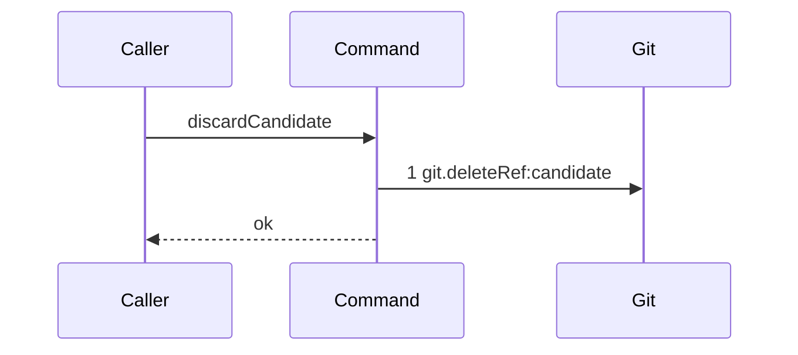

# Story 4 — The candidate ref is deleted

Epic: `.agents/plan/epics/051.1-the-candidate-and-the-git-primitives.md`
Depends on: Story 1 (`git.deleteRef`). It also needs EPIC 051 implemented, because `scripts/epic-sequence-range.ts` lists an epic only when its story directory exists, and `"051"` precedes `"051.1"` in that list.
Kind: story-implement

Diagrams: discard-candidate

Seams: discard-candidate: +git.deleteRef:candidate

This story is the first of the epic to add a scenario file, so it also carries the three harness
edits every later scenario needs. It leaves the callers of `candidate.discard` to Stories 3 and 5 and
to EPIC 051.4.

## The ship path

### `discard-candidate`

Fixture: one bare home holding `refs/kanthord/candidate/run_a/1` at `fixtureObjectIds.commit2`, and
no other ref under `refs/kanthord/`. The path is written from nothing, so its prior set is empty and
it draws no baseline.



The command has one branch. It deletes the ref it is given and returns; `git update-ref -d` on an
absent ref exits `0` (Story 1 case 11), so there is no missing-ref branch to draw. Drawing this call
as its own nested unit is what keeps `git.deleteRef:candidate` in exactly one diagram of the family:
Story 3 and Story 5 both reach it through `candidate.discard`, which is one step.

Add `test/sequence/scenarios/discard-candidate.ts`.

## Change

### 1 — the command

**Create `src/commands/checkpoint/discard-candidate.ts`** (greenfield). `src/commands/checkpoint/`
does not exist; create the directory. The file naming follows `src/commands/run/expire-runs.ts` —
kebab-case `verb-noun.ts` exporting one camelCase `verbNoun`.

```ts
export type DiscardCandidateDependencies = Readonly<{ git: Git }>;

export type DiscardCandidateInput = Readonly<{ gitDir: string; ref: string }>;

export async function discardCandidate(
  dependencies: DiscardCandidateDependencies,
  input: DiscardCandidateInput,
): Promise<void>;
```

The body is one statement: `await dependencies.git.deleteRef({ gitDir: input.gitDir, ref: input.ref })`.

It opens no transaction and takes none. A ref delete is git I/O, and `AGENTS.md` forbids git I/O
inside a storage transaction.

`Git` is imported as a type from `src/services/git/index.ts:157 — `Git``, which the import matrix
permits: a command may import any service interface.

### 2 — the harness runs an asynchronous scenario

`test/sequence/conformance.test.ts:282 — `scenario`` calls the scenario without awaiting it, and its
cast at `test/sequence/conformance.test.ts:278 — `scenario`` declares a synchronous return. Every
scenario of this epic drives an asynchronous command, so both change:

```ts
const scenario = scenarioModule.default as () =>
  | Readonly<{
      recorder: Readonly<{ tokens: readonly string[] }>;
      result: unknown;
    }>
  | Promise<
      Readonly<{
        recorder: Readonly<{ tokens: readonly string[] }>;
        result: unknown;
      }>
    >;
const { recorder, result } = await scenario();
```

The enclosing `it` is already `async` (`test/sequence/conformance.test.ts:270 — `async``), and
awaiting a non-promise is a no-op, so the four shipped synchronous scenarios are unaffected.

`recordSeams` needs no change. It pushes its token inside the wrapper at
`test/helpers/sequence-conformance.ts:132 — `tokens`` and returns
`Reflect.apply(...)` at `test/helpers/sequence-conformance.ts:136 — `Reflect``, so the token order is
invocation order. Every command of this epic awaits each seam call before it makes the next one, so
invocation order is still completion order.

### 3 — the ref-namespace projection

`git.deleteRef` receives `{ gitDir, ref }`, and the diagram label must be a projection of a value the
call actually receives. Add one helper and three entries to the projection table at
`test/helpers/sequence-conformance.ts:50 — `projections``, beside `field` at
`test/helpers/sequence-conformance.ts:14 — `field``:

```ts
const refNamespaces: readonly (readonly [string, string])[] = [
  ["refs/kanthord/candidate/", "candidate"],
  ["refs/heads/", "branch"],
];

function refNamespace(
  input: unknown,
  key: string,
  context: ProjectionContext,
): string {
  const ref = field(input, key, context);
  const match = refNamespaces.find(([prefix]) => ref.startsWith(prefix));
  if (match === undefined) {
    throw new Error(
      `${context.method} names no declared ref namespace: ${ref}`,
    );
  }
  return match[1] ?? "";
}
```

```ts
  "git.resolveRef": (input, context) => [refNamespace(input, "ref", context)],
  "git.deleteRef": (input, context) => [refNamespace(input, "ref", context)],
  "git.listRefs": (input, context) => [refNamespace(input, "prefix", context)],
```

All three entries land here, in this story, even though this story draws only `git.deleteRef`. Story
2 draws `git.resolveRef:candidate` and Story 5 draws `git.listRefs:candidate`, and a table split
across three stories is a table three stories can disagree about. The `refs/heads/ → branch` row is
seeded here for the same reason: EPIC 051 draws `git.resolveRef:branch` over `refs/heads/<objectiveId>`,
and one table that already answers both epics cannot be written two ways.

### 4 — the epic joins the authored range

**Amended: the whole authored range is already applied.** `scripts/epic-sequence-range.ts:1` — `authoredEpics` holds every id of the family, and `test/sequence/conformance.test.ts:255` — `assert.deepEqual` pins the matching literal. A human applied the range whole rather than one id per epic, and `scripts/verify-epic-sequence.test.ts:880` — `the real plan tree passes the range gate` is green over it. `"051.1"` already sits between `"051"` and `"051.2"`, in sequence order, so
**this story adds nothing to `authoredEpics`: verify the entry and report a divergence rather than
re-applying it.** `test/sequence/conformance.test.ts:41 — `authoredEpics`` throws for a listed epic
whose story directory is absent, and every listed id has one.

**These two files are edited by other epics in parallel, so treat the line numbers above as of the
day this story was written.** Re-read `scripts/epic-sequence-range.ts` and the pinned literal in
`test/sequence/conformance.test.ts` before editing either; the identifiers are stable and the
ordinals are not. `test/sequence/conformance.test.ts:41 — `authoredEpics`` iterates the list and throws for an
id with no epic file, and `test/sequence/conformance.test.ts:118 — `liveIds`` refuses a scenario file
whose diagram belongs to no listed epic, so the scenario file of this story is unreachable until the
entry exists.

Update the pinned literal at `test/sequence/conformance.test.ts:255 — `assert`` to match. Do **not**
touch `shippedEpics` here; Story 5 appends to it, because a diagram is due a scenario only once the
whole epic ships.

## Constraints

- `discardCandidate` opens no transaction and receives none.
- It calls `git.deleteRef` exactly once and reaches no other seam.
- It takes the ref as an input. It never builds `refs/kanthord/candidate/<runId>/<attemptNo>` itself;
  Story 2's `ingestCandidate` and Story 5's `sweepCandidates` each build the ref they own.
- Do not add an event append. Nothing in `src/domain/event-type.ts:1 — `eventTypes`` carries a
  candidate type, and this epic registers none.
- Do not add `"051.1"` to `shippedEpics`.

## Verify

```
node --test src/commands/checkpoint/discard-candidate.test.ts test/sequence/conformance.test.ts
```

Create `src/commands/checkpoint/discard-candidate.test.ts`, suite name
`"src/commands/checkpoint/discard-candidate.test"`. Build the bare home with `resolveTools`
(`test/helpers/remote/tools.ts:102`) and `seedRepositories` (`test/helpers/remote/seed.ts:124`) over a
private `cpSync` copy, exactly as `src/services/git/ref-update.test.ts:64 — `cpSync`` does, and build
the `Git` through `createBinaryGit` (`src/services/git/binary.ts:24`) over
`createGitRunner` (`src/services/git/run.ts:49`).

Add, each as a separate `it`:

1. `"the given candidate ref is deleted"` — create `refs/kanthord/candidate/run_a/1`, call
   `discardCandidate`, and assert `git.resolveRef({ gitDir, ref: "refs/kanthord/candidate/run_a/1" })`
   returns `null`.

2. `"no other ref of the namespace is deleted"` — create `refs/kanthord/candidate/run_a/1` and
   `refs/kanthord/candidate/run_b/1`, list the namespace before, call `discardCandidate` on `run_a`,
   list it after, and assert the after list deep-equals `["refs/kanthord/candidate/run_b/1"]` and the
   before list deep-equals both refs in bytewise order. Listing before and after is what makes the
   absence assertion detect an implementation that deletes the prefix.

3. `"no ref outside the namespace is deleted"` — the control for case 2. Assert
   `git.resolveRef({ gitDir, ref: "refs/heads/main" })` returns `fixtureObjectIds.commit2` after the
   discard.

4. `"discarding an absent ref resolves"` — call `discardCandidate` on a ref that was never created and
   assert the promise resolves. This is what makes Story 5's sweep safe against a concurrent delete.

Add `test/sequence/scenarios/discard-candidate.ts`. It is a default-exported `async` function
returning `Readonly<{ recorder; result }>`, building the bare home fixture above, wrapping
`{ git }` with `recordSeams` from `test/helpers/sequence-conformance.ts:99`, awaiting
`discardCandidate(recorder.dependencies, { gitDir, ref: "refs/kanthord/candidate/run_a/1" })`, and
returning `{ recorder, result }` where `result` is `undefined` — `resultTerminal` at
`test/helpers/sequence-conformance.ts:303` renders `undefined` as `ok`. Dispose the fixture in a
`finally`.

5. `"the conformance runner replays discard-candidate"` — the shipped case
   `"every due scenario conforms"` at `test/sequence/conformance.test.ts:275 — `conforms`` covers it
   once `"051.1"` is in both range lists. Assert here only that
   `authoredEpics` holds `"051.1"` and that `shippedEpics` does not, so this story cannot silently
   mark the epic shipped. The first assertion is a **regression guard**, because the `authoredEpics`
   entry is already applied; the second is this story's own constraint.

`pnpm run verify` exits 0.

Proof: PASS line delivered — `src/commands/checkpoint/discard-candidate.test.ts` and
`test/sequence/conformance.test.ts` in `PASS EPIC-051.1`.
