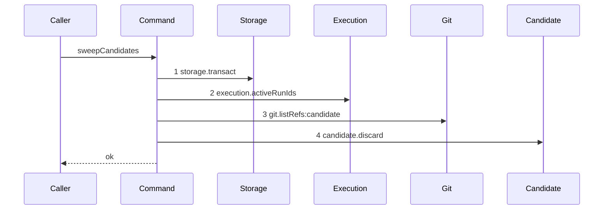

# Story 5 — The reaper deletes a stale ref

Epic: `.agents/plan/epics/051.1-the-candidate-and-the-git-primitives.md`
Depends on: Story 8 (`08-the-candidate-namespace-is-enumerated`, which writes the command this story wires and draws its quiet path), Story 4 (`04-the-candidate-ref-is-deleted`, for the harness and the `authoredEpics` entry), EPIC 050.1 Story 2 (`02-the-expiry-pass`, whose gap this story discharges). It is **last in dispatch order**, because it appends `"051.1"` to `shippedEpics`.
Kind: story-implement

Diagrams: sweep-candidates

Seams: sweep-candidates: +storage.transact, +execution.activeRunIds, +git.listRefs:candidate, +candidate.discard

This story owns the startup wiring, the recovery vocabulary and the reaping proofs. Story 8 owns the
command. It supersedes no EPIC 050.1 diagram: `expireRuns` gains no seam call, so `expiry-pass-one-due`
is unchanged.

## The ship path

### `sweep-candidates`

Fixture: one repository whose `home_path` is the bare home. One `run` row `run_active` in state
`active`, and one `run` row `run_ended` in state `ended`. The bare home holds exactly two refs under
the namespace, `refs/kanthord/candidate/run_active/1` and `refs/kanthord/candidate/run_ended/1`, both
at `fixtureObjectIds.commit2`. One repository gives one `git.listRefs` call, and one stale ref gives one
`candidate.discard` call, so no token repeats. The path is written from nothing, so its prior set is
empty and it draws no baseline.



**Both branches of the sweep are drawn.** `sweep-candidates-no-stale-ref` of Story 8 holds the first
three steps and stops; this one reaches `candidate.discard`. Those are different seam sets, so each
owns a diagram. A sweep over two stale refs reaches step 4 twice and a sweep over two repositories
reaches step 3 twice; both are counts over a drawn set, not new paths, and Story 8 cases 5 and this
story's case 6 carry them.

The shape shows one `storage.transact` and shows every git call after it. It does **not** prove the
transaction closed before the delete: `.agents/plan/authoring.md` states that a diagram proves no
transaction property, and `storage.transact` as step 1 proves only that one transaction is opened.
Case 4 is what proves the closure.

Add `test/sequence/scenarios/sweep-candidates.ts`.

## Change

### 1 — the recovery vocabulary

- `src/domain/recovery.ts:32 — `step`` is the closed union `"reap" | "sweep" | "reconcile" | "leases"`.
  Add `"candidates"`.
- `src/domain/recovery.ts:109 — `RECOVERY_STEP_ORDER`` gains a fifth entry `"candidates"`, last.
- Add `export type CandidatesStep = () => Promise<SweepCandidatesResultLike>;` beside
  `src/domain/recovery.ts:87 — `LeasesStep``, with
  `SweepCandidatesResultLike = Readonly<{ deleted: readonly string[]; findings: readonly RecoveryFinding[] }>`
  in the same file, matching the `...ResultLike` forms already there.
- `src/domain/recovery.ts:116 — `RecoveryReport`` gains `candidatesDeleted: number`.

**Two shipped tests pin what this changes, and both move with it.**
`src/domain/recovery.test.ts:14 — `RECOVERY_STEP_ORDER`` is titled "names the four steps in order" and
asserts the four by value; it becomes five.
`src/commands/startup/recover-home.test.ts:133 — `RECOVERY_STEP_ORDER`` asserts the recorded call order
equals the constant, so it follows automatically once the fifth step is dispatched.

**EPIC 050.5 gate row 10 pins the four-entry list and the three count fields.** That row is true when
EPIC 050.5 lands, and this story changes it afterwards; the row carries a forward note naming this
change and needs no rewrite.

### 2 — startup runs the sweep last

- `src/commands/startup/recover-home.ts:9 — `RecoverHomeDependencies`` gains `candidates: CandidatesStep`.
- After `src/commands/startup/recover-home.ts:22 — `leases``, add
`const candidates = await dependencies.candidates();`. The report gains
`candidatesDeleted: candidates.deleted.length`, and `...candidates.findings` is appended to the
`findings` array after `src/commands/startup/recover-home.ts:37 — `leases``.
- **It runs last, after `leases`.** The lease pass ends a run, and a run it ends leaves a ref this
  sweep must then see. Running it earlier would leave that ref for the next start.
- `src/main.ts:342 — `leases`` is followed by a fifth closure:

  ```ts
        candidates: () =>
          sweepCandidates({
            storage,
            execution,
            git,
            candidate: { discard: (input) => discardCandidate({ git }, input) },
          }),
  ```

  `main.ts` is the only place that names an implementation, and this is where `candidate.discard` is
  bound to the real command of Story 4.

**The startup call site is the only one this epic wires.** `ExpireRunsDependencies` at
`src/commands/run/expire-runs.ts:19 — `ExpireRunsDependencies`` names no `Git`, takes the caller's
transaction and is synchronous, so it cannot delete a ref. The only production expiry pass runs inside
`claimNode` at `src/commands/node/claim-node.ts:147 — `expireRuns``, whose handler binding at
`src/main.ts:553 — `node.claim`` is synchronous. EPIC 051.5 owns the targeted post-expiry cleanup, and
case 3 below proves the expiry-plus-sweep sequence at the command level meanwhile.

### 3 — the epic ships

Append `"051.1"` to `shippedEpics` at `scripts/epic-sequence-range.ts:12 — `shippedEpics``, and update
the pinned literals at `test/sequence/conformance.test.ts:255 — `assert``. That list is asserted to be
a prefix of `authoredEpics` at `test/sequence/conformance.test.ts:267 — `slice``, so this edit is legal
only once every epic before this one in `authoredEpics` has shipped. That is the sequence order, and
the EPIC's Status line states it as a dispatch prerequisite.

That entry is what makes the six diagrams of this epic **due**:
`test/sequence/conformance.test.ts:82 — `liveDiagrams`` filters on `shippedEpics`, and
`test/sequence/conformance.test.ts:270 — `conforms`` replays each due diagram by equality.

## Constraints

- Do not change `src/commands/checkpoint/sweep-candidates.ts`. Story 8 wrote it whole; this story
  wires it.
- Do not add a call to `expireRuns`, and do not give it a `Git`.
- The candidate step runs after the lease step, and `RECOVERY_STEP_ORDER` records that order.
- Do not rename an existing step of `RECOVERY_STEP_ORDER`. EPIC 050.5 gate row 10 forbids a rename;
  this story appends.
- Do not append `"051.1"` to `shippedEpics` before every earlier epic of `authoredEpics` has shipped.

## Verify

```
node --test src/commands/checkpoint/sweep-candidates.test.ts src/domain/recovery.test.ts src/commands/startup/recover-home.test.ts src/commands/run/expire-runs.test.ts test/sequence/conformance.test.ts
```

Extend `src/commands/checkpoint/sweep-candidates.test.ts`, which Story 8 created, and reuse its
fixture.

Add, each as a separate `it`:

1. `"the ref of an ended run is deleted and the ref of an active run is left"` — seed `run_ended`
   (`ended`) and `run_active` (`active`), create both refs, sweep. Assert `result.deleted` deep-equals
   `["refs/kanthord/candidate/run_ended/1"]` and the namespace afterwards deep-equals
   `["refs/kanthord/candidate/run_active/1"]`. The surviving ref is the control: without it the
   assertion passes for a sweep that deletes everything.

2. `"a ref whose run id matches no run row is deleted"` — create
   `refs/kanthord/candidate/run_orphan/1` with no `run` row at all. Assert it is deleted and named in
   `result.deleted`. This is the orphan from a worker that pushed and never reported, and it is the
   case the expiry path cannot see.

3. `"an expired run leaves no candidate ref behind once the sweep runs"` — seed one `active` run whose
   `expires_at` is `NOW`, create its candidate ref, run `expireRuns` inside one `storage.transact`,
   then run the sweep. Assert the namespace deep-equals `[]` afterwards. This is the startup half of
   the deletion EPIC 050.1 Story 2 (`02-the-expiry-pass`) delegates here.

4. `"the sweep opens no transaction across a delete"` — wrap `storage` in a double whose `transact`
   pushes `"transact:enter"` and `"transact:exit"` onto one shared log, and wrap `candidate.discard` so
   it pushes `"discard"`. Assert the log deep-equals
   `["transact:enter", "transact:exit", "discard"]` for the one-deletion fixture.

5. `"expireRuns calls no git method"` — build a `Git` double whose every member increments one shared
   counter, run an expiry pass over the fixture of case 3, and assert the counter is `0`. Then run the
   sweep over the same double and assert the counter is greater than `0`. The second half is the
   control: without it the zero passes for a double nothing ever calls.

6. `"two stale refs of one repository are deleted in listing order"` — create
   `refs/kanthord/candidate/run_b/1` and `refs/kanthord/candidate/run_a/1`, neither run active, and
   assert `result.deleted` deep-equals
   `["refs/kanthord/candidate/run_a/1", "refs/kanthord/candidate/run_b/1"]` — the order `listRefs`
   returns, which `--sort=refname` fixes.

In `src/domain/recovery.test.ts`:

7. `"RECOVERY_STEP_ORDER names the five steps in order"` — amend the shipped case at
   `src/domain/recovery.test.ts:14 — `RECOVERY_STEP_ORDER``. Assert
   `["reap", "sweep", "reconcile", "leases", "candidates"]` by value, and assert `"candidates"` is a
   member of the `RecoveryFinding` step union.

In `src/commands/startup/recover-home.test.ts`:

8. `"the candidate sweep runs after the lease pass"` — extend the step-order case at
   `src/commands/startup/recover-home.test.ts:133 — `RECOVERY_STEP_ORDER`` with a `candidates` closure
   that appends to the shared order log, and assert the log deep-equals the amended constant.

9. `"the report carries candidatesDeleted and the candidate findings last"` — assert the returned
   report's `candidatesDeleted` equals the closure's `deleted.length`, and that its findings appear
   after the lease findings in `report.findings`.

10. `"shippedEpics holds this epic and stays a prefix of authoredEpics"` — the shipped case at
    `test/sequence/conformance.test.ts:254 — `prefix`` carries it once the literals are updated. The
conformance replay of the six diagrams of this epic is then the shipped case
`"every due scenario conforms"` at `test/sequence/conformance.test.ts:270 — `conforms``, and it
    fails when any step of any of the six is removed or reordered.

Add `test/sequence/scenarios/sweep-candidates.ts`. It is a default-exported `async` function building
the two-ref, two-run fixture the diagram names, wrapping `{ storage, execution, git, candidate }` with
`recordSeams` (`test/helpers/sequence-conformance.ts:99`) where `candidate` is bound to the real
`discardCandidate` over the **unrecorded** `git`, awaiting `sweepCandidates(recorder.dependencies)`,
and returning `{ recorder, result }`. Dispose the fixture in a `finally`.

`pnpm run verify` exits 0.

Proof: PASS line delivered — `src/commands/checkpoint/sweep-candidates.test.ts`,
`src/domain/recovery.test.ts`, `src/commands/startup/recover-home.test.ts` and
`test/sequence/conformance.test.ts` in `PASS EPIC-051.1`.
