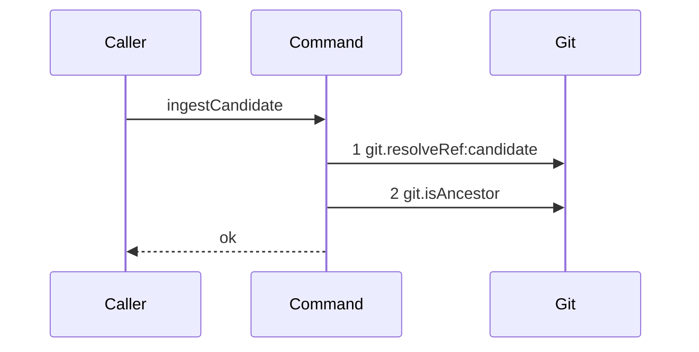

# Story 7 — The candidate ref reaches the reported oid

Epic: `.agents/plan/epics/051.1-the-candidate-and-the-git-primitives.md`
Depends on: Story 1 (`git.isAncestor`), Story 2 (`02-the-candidate-ref-is-missing`, which creates the command and the ref helper), Story 4 (`04-the-candidate-ref-is-deleted`, which adds the asynchronous scenario runner, the ref-namespace projection and the `"051.1"` range entry).
Kind: story-implement

Diagrams: ingest-candidate-reachable

Seams: ingest-candidate-reachable: +git.resolveRef:candidate, +git.isAncestor

This story adds the reachability check and the path that still succeeds. Story 3 adds the deletion
that the failing branch performs, and EPIC 051.4 is the only caller either story leaves.

## The ship path

### `ingest-candidate-reachable`

Fixture: one bare home holding `refs/kanthord/candidate/run_a/1` at `fixtureObjectIds.commit2`. The
command is called for `runId = "run_a"`, `attemptNo = 1` and `reportedOid = fixtureObjectIds.commit1`.
`commit1` is the parent of `commit2` (`test/helpers/remote/seed.ts:170 — `commit-tree``), so the
reported oid is an ancestor of the ref tip and the ref reaches it. The path is written from nothing,
so its prior set is empty and it draws no baseline.



**This is the path that still succeeds, and drawing it is why Story 3 draws only its refusal.**
`.agents/plan/authoring.md` says a story that inserts a refusal draws the path whose order changed,
and that the refusal itself is proven by its own test and by a database comparison. Story 3's refusal
reaches `candidate.discard` and this path does not, so the two hold different seam sets and each owns
a diagram.

`git.isAncestor` carries no label. Its two call sites in the family sit in different diagrams — this
one, and the ancestry check of EPIC 051.4's `acceptExecution` — and `.agents/plan/authoring.md` forbids
a repeated token only inside one diagram. A `:candidate` label would also name the call site rather
than an argument, which a projection may not do.

Add `test/sequence/scenarios/ingest-candidate-reachable.ts`.

## Change

**`src/commands/checkpoint/ingest-candidate.ts` — replace the unconditional success of Story 2.**
Story 2's body ends with `return { ok: true, ref, tipOid }` as soon as the ref resolves. That line
becomes the reachability check:

1. `const reachable = await dependencies.git.isAncestor({ gitDir: input.gitDir, ancestorOid: input.reportedOid, descendantOid: tipOid });`
2. When `reachable` is `true`, return `{ ok: true, ref, tipOid }` and make no further call.
3. When `reachable` is `false`, return
   `{ ok: false, refusal: "candidate-unreachable", ref, reportedOid: input.reportedOid }`.

**The argument order is load-bearing.** The **reported oid is the ancestor** and the **ref tip is the
descendant**. A worker pushes its candidate and then reports an oid that ref reaches, so the reported
oid sits at or below the tip. Equality is an ancestor, so a report that exactly matches the tip
passes; Story 1 case 1 pins that in the primitive and case 2 below pins it here.

**This story deletes nothing on the failing branch.** The ref survives a refusal until Story 3 adds
`candidate.discard`, and `IngestCandidateDependencies` stays `{ git }` until then. Adding the
`candidate` key here would put an unused dependency in the recorder and a participant in this
diagram that the path never reaches.

The missing-ref path of Story 2 is unchanged, and it still calls neither seam. Its diagram
`ingest-candidate-missing-ref` is not superseded: the three are branches of one command, each with its
own id.

## Constraints

- The order is resolve, then judge. `git.isAncestor` is called exactly once, and only when the ref
  resolved.
- The success result carries the ref and the resolved tip, so EPIC 051.4 can delete the ref on
  acceptance without resolving it a second time.
- Both outcomes return; neither throws. EPIC 051.4 composes this unit into an ordered gate where the
  first failure names itself.
- Do not add the `candidate` dependency key. Story 3 adds it with the call that uses it.
- Do not register `candidate-unreachable` in `src/http/contract/errors.ts`. EPIC 051.4 carries every
  contract edit of the family.

## Verify

```
node --test src/commands/checkpoint/ingest-candidate.test.ts test/sequence/conformance.test.ts
```

Extend `src/commands/checkpoint/ingest-candidate.test.ts`, which Story 2 created, and reuse its
bare-home fixture: a private `cpSync` copy of `seedRepositories` (`test/helpers/remote/seed.ts:124`),
a `Git` from `createBinaryGit` (`src/services/git/binary.ts:24`) over `createGitRunner`
(`src/services/git/run.ts:49`).

Add, each as a separate `it`:

1. `"a reachable oid passes"` — create `refs/kanthord/candidate/run_a/1` at `fixtureObjectIds.commit2`
   and report `fixtureObjectIds.commit1`. Assert the result deep-equals
   `{ ok: true, ref: "refs/kanthord/candidate/run_a/1", tipOid: fixtureObjectIds.commit2 }`.

2. `"an oid exactly equal to the ref tip passes"` — create the ref at `fixtureObjectIds.commit2` and
   report `fixtureObjectIds.commit2`. Assert `ok` is `true` and `tipOid` equals
   `fixtureObjectIds.commit2`. Equality is the case the reachability check depends on, and it is the
   control for case 1: without it, case 1 passes for an implementation that tests strict descent.

3. `"an unreachable oid refuses and leaves the ref in place"` — create the ref at
   `fixtureObjectIds.commit1` and report `fixtureObjectIds.commit2`. Assert the result deep-equals
   `{ ok: false, refusal: "candidate-unreachable", ref: "refs/kanthord/candidate/run_a/1", reportedOid: fixtureObjectIds.commit2 }`,
   and assert `git.listRefs({ gitDir, prefix: "refs/kanthord/candidate/" })` still deep-equals
   `["refs/kanthord/candidate/run_a/1"]`. Story 3 replaces the second half of this case with the
   deletion; until then the surviving ref is the stated behaviour, not an omission.

4. `"the reachability check runs once, and only after the ref resolves"` — build a `Git` double
   counting `resolveRef` and `isAncestor`. Over a resolving ref assert both counters are `1`. Over a
   missing ref assert `resolveRef` is `1` and `isAncestor` is `0`, which keeps Story 2's diagram true
   after this story widens the command.

Add `test/sequence/scenarios/ingest-candidate-reachable.ts`. It is a default-exported `async` function
building the fixture the diagram names, wrapping `{ git }` with `recordSeams`
(`test/helpers/sequence-conformance.ts:99`), awaiting `ingestCandidate` over `recorder.dependencies`,
and returning `{ recorder, result }`. Dispose the fixture in a `finally`.

`pnpm run verify` exits 0.

Proof: PASS line delivered — `src/commands/checkpoint/ingest-candidate.test.ts` and
`test/sequence/conformance.test.ts` in `PASS EPIC-051.1`.
