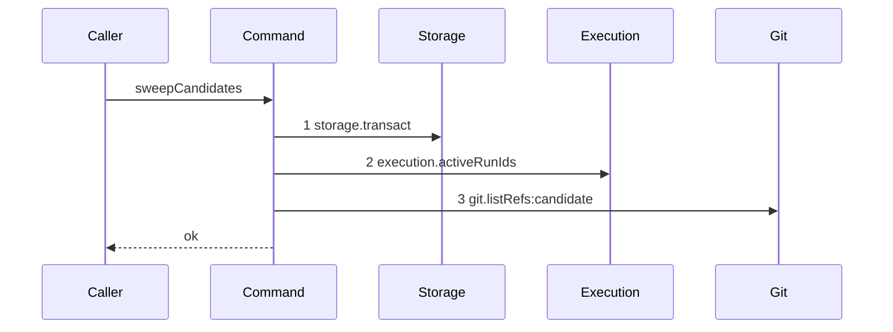

# Story 8 — The candidate namespace is enumerated

Epic: `.agents/plan/epics/051.1-the-candidate-and-the-git-primitives.md`
Depends on: Story 1 (`git.listRefs`), Story 2 (`02-the-candidate-ref-is-missing`, which creates `src/domain/candidate-ref.ts`), Story 4 (`04-the-candidate-ref-is-deleted`, which creates the nested unit this command calls and the harness this scenario runs on).
Kind: story-implement

Diagrams: sweep-candidates-no-stale-ref

Seams: sweep-candidates-no-stale-ref: +storage.transact, +execution.activeRunIds, +git.listRefs:candidate

This story writes the reaper command. Story 5 wires it into startup and proves the reaping. It
supersedes no EPIC 050.1 diagram: `expireRuns` gains no seam call.

## The ship path

### `sweep-candidates-no-stale-ref`

Fixture: one repository whose `home_path` is the bare home. One `run` row `run_active` in state
`active`. The bare home holds exactly one ref under the namespace,
`refs/kanthord/candidate/run_active/1`, at `fixtureObjectIds.commit2`. One repository gives one
`git.listRefs` call, and the only ref belongs to an active run, so the command reaches no deletion.
The path is written from nothing, so its prior set is empty and it draws no baseline.



**This diagram is the strongest statement the command can make about its quiet path.** It reaches
`candidate.discard` nowhere, so an implementation that deleted anything against this fixture fails the
comparison by an extra token. Story 5's `sweep-candidates` holds the same three steps plus that
fourth, which is a different seam set and therefore a different diagram.

The shape shows one `storage.transact` and shows the git call after it. It does **not** prove the
transaction closed first: `.agents/plan/authoring.md` states that a diagram proves no transaction
property. Story 5 case 4 is what proves the closure.

Add `test/sequence/scenarios/sweep-candidates-no-stale-ref.ts`.

## Change

### 1 — the ref reader

`src/domain/candidate-ref.ts`, beside `candidateRef` of Story 2:

```ts
export function candidateRefRunId(ref: string): string | null;
```

It returns the first path segment after `CANDIDATE_REF_PREFIX` when **all three** hold: `ref` starts
with that prefix, exactly two further segments follow, and the second of them matches `/^[0-9]+$/`.
It returns `null` otherwise. `refs/kanthord/candidate/run_a/1` returns `"run_a"`;
`refs/kanthord/candidate/run_a` returns `null` (no attempt segment),
`refs/kanthord/candidate/run_a/not-an-attempt` returns `null` (the attempt segment is not a number),
`refs/kanthord/candidate/run_a/1/extra` returns `null` (three segments), and so does `refs/heads/main`.

The attempt segment is checked even though the sweep never reads it: a ref the daemon did not write is
a ref the daemon does not delete, and `<runId>/<attemptNo>` is the whole shape it writes.

### 2 — the active-run seam

`src/services/execution/index.ts`, appended to `interface Execution` after
`src/services/execution/index.ts:119 — `runDriversUnderObjective``:

```ts
  activeRunIds(transaction: Transaction): readonly string[];
```

`src/services/execution/sqlite.ts` implements it as
`SELECT id FROM run WHERE state = 'active' ORDER BY id`, returning the `id` column in that order. The
existing reads are all by node — `activeRunOfNode` at
`src/services/execution/index.ts:101 — `activeRunOfNode`` and `activeRunsOfNodes` at
`src/services/execution/index.ts:102 — `activeRunsOfNodes`` — and the sweep knows a run id and no node,
so neither answers it.

Both hand-written fakes gain the member, or type checking fails:
`test/helpers/execution.ts:31 — `createExecutionFake`` (a strict mock: give it the `unexpected` form
unless a case needs it) and `test/helpers/execution.ts:220 — `createBackedExecutionFake`` (backed by
real rows: give it the real query).

### 3 — the command

**Create `src/commands/checkpoint/sweep-candidates.ts`.**

```ts
export type SweepCandidatesDependencies = Readonly<{
  storage: Storage;
  execution: Execution;
  git: Git;
  candidate: CandidateDiscard;
}>;

export type SweepCandidatesResult = Readonly<{
  deleted: readonly string[];
  findings: readonly RecoveryFinding[];
}>;

export async function sweepCandidates(
  dependencies: SweepCandidatesDependencies,
): Promise<SweepCandidatesResult>;
```

It takes no input. Everything it needs is in the database.

**Body, in this order:**

1. One `dependencies.storage.transact` reading two things and writing none:

   ```ts
   const homes = transaction.all(
     "SELECT id, home_path FROM repository ORDER BY id",
   ) as readonly Readonly<{ id: string; home_path: string }>[];
   const active = new Set(dependencies.execution.activeRunIds(transaction));
   ```

   The repository read is raw SQL inside the command, matching
   `src/commands/startup/sweep-remnants.ts:35 — `repository``. The run read is a seam, because the
   diagram must show that the sweep judges a **run** and not a ref by its name.

2. The transaction closes. Everything below is git I/O and holds no transaction.

3. For each repository in the returned order:
   `const refs = await dependencies.git.listRefs({ gitDir: home.home_path, prefix: CANDIDATE_REF_PREFIX });`

4. For each ref of that repository, in the order `listRefs` returned:
   - `const runId = candidateRefRunId(ref);`
   - `runId === null` → push
     `{ step: "candidates", code: "candidate-ref-unparsed", repositoryId: home.id, detail: ref }`
     onto `findings` and continue. Delete nothing.
   - `active.has(runId)` → continue. Delete nothing.
   - otherwise `await dependencies.candidate.discard({ gitDir: home.home_path, ref });` and push `ref`
     onto `deleted`.

5. Return `{ deleted, findings }`, `deleted` in the order the deletions happened.

A run id that matches no `run` row is not in `active`, so its ref is deleted. That is the orphan from
a worker that pushed and never reported, and Story 5 proves it.

**One transaction, and no git call inside it.** Two would make this a journaled write, and it has no
journal row. The deletion itself opens none: `AGENTS.md` `### Rules the import matrix cannot express`
exempts a best-effort git deletion on six conditions, and this command satisfies all six — eligibility
is a run already `ended` or absent, a failure leaves a ref, and startup retries the sweep.

**The active-run guarantee is snapshot-scoped, not absolute.** The command reads the active set first
and lists refs afterwards, so a run that becomes active between the two would have its ref deleted. At
the startup call site Story 5 ships, the daemon serves no request and opens no claim, so the window
does not exist. EPIC 051.5 owns the runtime call site and closes it.

`RecoveryFinding.step` at `src/domain/recovery.ts:32 — `step`` is a closed union that does not yet hold
`"candidates"`. **Story 5 adds it**, together with the rest of the recovery vocabulary; until then this
command's findings do not type check against that union, so implement the two stories in the dispatch
order the index states.

## Constraints

- One transaction, and it holds no git call.
- The transaction writes nothing. The sweep deletes refs and no rows.
- The sweep never reads an attempt number. It deletes by run id, which is why one mechanism discharges
  both the startup orphan and the expiry orphan.
- A ref whose run is `active` in the snapshot is left alone.
- A ref the reader cannot parse is left alone and reported.
- It calls `candidate.discard`, never `git.deleteRef`. `candidate.discard` is the only site that calls
  it, which keeps `git.deleteRef:candidate` in one diagram of the family.
- Do not append an event. `src/domain/event-type.ts:1 — `eventTypes`` carries no candidate type, and
  this epic registers none; the sweep reports through `RecoveryFinding`, as every startup step does.

## Verify

```
node --test src/domain/candidate-ref.test.ts src/commands/checkpoint/sweep-candidates.test.ts test/sequence/conformance.test.ts
```

Create `src/commands/checkpoint/sweep-candidates.test.ts`, suite name
`"src/commands/checkpoint/sweep-candidates.test"`. Build real SQLite with `createMigratedStorage`
(`test/helpers/database.ts:32`), seed with `seedRegistry` (`test/helpers/rows.ts:21`) and `seedGraph`
(`test/helpers/rows.ts:102`), set `repository.home_path` to the bare home of a private `cpSync` copy of
`seedRepositories` (`test/helpers/remote/seed.ts:124`), insert `run` rows with the column list at
`test/sequence/scenarios/expiry-pass-one-due.ts:25 — `INSERT``, and build the `Git` through
`createBinaryGit` (`src/services/git/binary.ts:24`). `t.after(() => fixture.dispose())`.

Add, each as a separate `it`:

1. `"a candidate ref parses to its run id"` — in `candidate-ref.test.ts`, assert
   `candidateRefRunId("refs/kanthord/candidate/run_a/1")` equals `"run_a"` and
   `candidateRefRunId("refs/kanthord/candidate/run_a/12")` equals `"run_a"`.

2. `"a ref outside the shape parses to null"` — assert `null` for
   `"refs/kanthord/candidate/run_a"`, `"refs/kanthord/candidate/run_a/not-an-attempt"`,
   `"refs/kanthord/candidate/run_a/1/extra"` and `"refs/heads/main"`. Four assertions, one case. The
   third and fourth are the controls: without them the reader passes for a naive prefix strip.

3. `"the ref of an active run is left and no deletion is reached"` — seed `run_active` in state
   `active` with its ref, wrap `candidate.discard` so it records its inputs, sweep, and assert the
   recorded inputs deep-equal `[]`, `result.deleted` deep-equals `[]`, and the namespace still
   deep-equals `["refs/kanthord/candidate/run_active/1"]`. Assert a `git.listRefs` counter of `1`: it
   is the control, because without it the two empties pass for a sweep that enumerates nothing.

4. `"a ref the reader cannot parse is left and reported"` — create `refs/kanthord/candidate/run_a` with
   no attempt segment. Assert it still resolves after the sweep, `result.deleted` deep-equals `[]`, and
   `result.findings` deep-equals
   `[{ step: "candidates", code: "candidate-ref-unparsed", repositoryId: "<the seeded repository id>", detail: "refs/kanthord/candidate/run_a" }]`.

5. `"two repositories are each listed once and swept independently"` — seed a second repository whose
   `home_path` is a second bare home, put one active-run ref in each, and assert a `git.listRefs`
   counter of `2` with the two `gitDir` values recorded in repository-id order. Production iterates
   every repository; the drawn fixture holds one, so this is the only proof of the outer iteration.

6. `"a namespace with no ref sweeps to an empty result"` — sweep the untouched fixture and assert
   `result.deleted` and `result.findings` both deep-equal `[]`.

7. `"the sweep writes no row"` — snapshot `databaseBytes(storage)` (`test/helpers/database.ts:117`)
   before and after a sweep over the fixture of case 3, and assert deep equality.

Add `test/sequence/scenarios/sweep-candidates-no-stale-ref.ts`. It is a default-exported `async`
function building the one-repository, one-active-ref fixture the diagram names, wrapping
`{ storage, execution, git, candidate }` with `recordSeams`
(`test/helpers/sequence-conformance.ts:99`) where `candidate` is bound to the real `discardCandidate`
over the **unrecorded** `git`, awaiting `sweepCandidates(recorder.dependencies)`, and returning
`{ recorder, result }`. Dispose the fixture in a `finally`.

`pnpm run verify` exits 0.

Proof: PASS line delivered — `src/domain/candidate-ref.test.ts` and
`src/commands/checkpoint/sweep-candidates.test.ts` in `PASS EPIC-051.1`.
